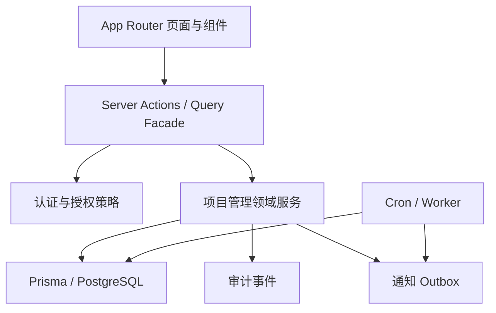

# 目标架构与模块边界

## 1. 架构选择

继续采用现有 Next.js 单体，不在本次重构中拆微服务。重构重点是建立清晰领域边界：



页面不直接表达状态机，Server Action 不直接拼接复杂多表写入。核心规则集中在领域服务，数据库负责最后一道结构约束。

## 2. 目标代码结构

```text
app/
  progress/
    page.tsx
    tasks/
      page.tsx
      new/page.tsx
      [id]/page.tsx
    resources/
      page.tsx
      conflicts/page.tsx
    approvals/page.tsx
    notifications/page.tsx
  actions/
    project-management/
      tags.ts
      tasks.ts
      plans.ts
      milestones.ts
      revisions.ts
      terminations.ts
      work-segments.ts
      conflicts.ts
      notifications.ts
lib/
  project-management/
    domain/
      task-state.ts
      node-state.ts
      plan-invariants.ts
      segment-rules.ts
      conflict-rules.ts
    application/
      task-service.ts
      plan-service.ts
      review-service.ts
      segment-service.ts
      conflict-service.ts
    authorization/
      actions.ts
      policy.ts
      readable-where.ts
    queries/
      task-queries.ts
      resource-queries.ts
      approval-queries.ts
    notifications/
      events.ts
      recipients.ts
      payloads.ts
    audit/
      events.ts
    validations/
      tag.ts
      task.ts
      plan.ts
      review.ts
      segment.ts
components/
  project-management/
    task-workspace/
    plan-timeline/
    revision-editor/
    plan-comparison/
    milestone-review/
    resource-timeline/
    conflict-panel/
    notification-center/
```

不创建 `v2` 长期目录名。切换后这就是唯一项目管理实现，旧 `app/actions/progress/*` 和旧组件中被替代的代码直接删除。

## 3. 模块职责

### 3.1 Tag

目标模型不保留 Project：

- Tag 只包含名称、颜色、描述、创建人和归档元数据。
- Task 可以关联任意数量 Tag。
- Tag 不控制 Task 状态、执行顺序、权限、验收、Revision 或 Work Segment。
- 删除 Tag 只删除 TaskTag 关系，不删除 Task。
- 旧 Project 名称在迁移时生成 Tag，用于标记对应的新 Task。

### 3.2 Task Planning

负责 Task、Plan Version、Node 链、Revision 和 Termination：

- 生成和激活初始计划。
- 验证计划是单链并包含有效 Termination。
- 构建 Revision 草稿和版本差异。
- 原子切换 Current Plan Version。
- 计算当前 Active Milestone。
- 只允许通过 Review 或 Termination 推进 Task。

### 3.3 Milestone Review

负责：

- 提交验收材料。
- 记录 Approved、Rejected、Revision Required。
- 撤销错误 Review。
- 计算最新未撤销 Review。
- Approved 后原子完成 Milestone 并激活下一节点。
- 进入 Termination 时创建待确认操作，不自动结束 Task。

### 3.4 Resource Planning

负责 Planned/Actual Segment、来源、批量操作和资源冲突：

- 不调用 Task 状态迁移。
- 不因 Node Revised 自动迁移 Segment。
- Actual Segment 永远保留发生时的关联。
- Planned Segment 引用 Revised Node 时只标记待确认。
- Conflict 服务只生成解释和建议，不直接写 Segment 调整。

### 3.5 Identity and Authorization

项目管理内部使用 `accountId/personId`，不以飞书 `openId` 作为业务外键。登录时把飞书身份解析为 Account，再关联 Person。采购可继续使用现有 User/openId，直到另行重构。

授权输入由以下四类组成：

1. 系统角色。
2. Task 成员角色。
3. 对象所有者，例如本人 Work Segment。
4. 当前对象状态。

Tag 不提供任何权限继承。

### 3.6 Audit and Notification

领域操作在同一数据库事务内写：

- 业务状态。
- 结构化审计事件。
- 站内通知记录。
- 飞书 outbox 事件。

Worker 只负责投递，不决定业务是否成功。Web 进程只入队，不主动 drain。

## 4. 写操作标准流程

每个写操作遵循固定顺序：

1. 读取登录 Account 和 Person。
2. 用 Zod 解析所有不可信输入。
3. 加载最小授权上下文。
4. 服务端执行 `authorize(action, resource, actor)`。
5. 校验当前状态和 `expectedVersion`。
6. 开启事务；必要时锁定 Task 或 Current Plan Version。
7. 再次校验事务内最新状态。
8. 写业务数据、审计、站内通知和 outbox。
9. 提交事务。
10. revalidate 受影响页面并返回稳定结果。

严禁在步骤 8 之前发送真实飞书消息。

## 5. 事务边界

以下操作必须是单事务：

- Task + 初始 Plan Version + 全部 Node + 成员。
- Revision 生效与旧版本 Historical、新版本 Current、旧 Milestone Revised、新 Milestone Active。
- Approved Review + Milestone Completed + 下一节点激活。
- Termination 确认 + Task 最终状态。
- Planned Segment 确认生成 Actual Segment + 来源关系 + 原 Segment 状态。
- Segment 拆分/合并 + 来源关系 + 审计。
- 权限变更 + 审计 + 被移除用户的站内提示。

通知真实投递不在业务事务内，但投递计划必须在事务内持久化。

## 6. 并发策略

- `Task.lockVersion` 每次结构性写入递增。
- Revision 草稿记录 `basePlanVersionId` 和 `baseTaskLockVersion`。
- Revision 生效使用条件更新；基线不一致即返回 `PLAN_VERSION_CONFLICT`。
- Review 记录使用客户端 `idempotencyKey`，并对 `(milestoneId, idempotencyKey)` 唯一。
- 激活新版本前锁定 Task 行，并检查唯一 Current 索引。
- Segment 拖拽使用 `expectedUpdatedAt`；批量操作携带每项版本。
- cron 扫描使用稳定 fingerprint，避免重复生成 Conflict 或通知。

## 7. 查询架构

不在页面中拼接大规模 Prisma include。建立查询 facade：

- `getTaskWorkspace(taskId, actor)`：Task 概览、当前计划摘要、当前节点、权限。
- `getPlanVersion(versionId, actor)`：单版本节点链。
- `comparePlanVersions(fromId, toId, actor)`：服务端生成字段级 diff。
- `listTaskReviews(milestoneId, cursor, actor)`：游标分页。
- `getResourceTimeline(range, filters, actor)`：按人员和时间范围分页。
- `listConflicts(range, status, cursor, actor)`。
- `listInAppNotifications(cursor, unreadOnly, actor)`。

默认查询只返回列表所需字段；历史、附件和完整审计按需加载。

## 8. 错误模型

Server Action 返回统一可序列化错误：

| code | 用户提示 | HTTP/Action 语义 |
|---|---|---|
| `UNAUTHENTICATED` | 请重新登录 | 无有效 Account |
| `FORBIDDEN` | 你没有执行此操作的权限 | 授权失败 |
| `VALIDATION_ERROR` | 展示字段级中文错误 | Zod 失败 |
| `STATE_CONFLICT` | 当前状态已变化，请刷新 | 状态前置条件失败 |
| `PLAN_VERSION_CONFLICT` | 计划已被他人修订，请比较后重新操作 | Revision 基线过期 |
| `NOT_FOUND` | 对象不存在或无权查看 | 防止资源枚举 |
| `DUPLICATE_OPERATION` | 此操作已处理 | 幂等命中 |
| `INTERNAL_ERROR` | 操作失败，请稍后重试 | 记录 requestId，不暴露内部错误 |

## 9. 观测性

新增事件至少包括：

- `pm.task.create`
- `pm.plan.activate`
- `pm.revision.create/submit/apply`
- `pm.milestone.review`
- `pm.termination.confirm`
- `pm.segment.create/update/split/merge/confirm/cancel`
- `pm.conflict.scan/resolve`
- `pm.authorization.denied`
- `pm.migration.batch`

每条结构化日志携带 `requestId`、`actorAccountId`、`personId`、`taskId`、`planVersionId`、`nodeId`、`durationMs` 和结果。不得记录附件正文、飞书 token 或大体量 before/after。

## 10. 性能原则

- 当前计划节点列表上限先按 200 个 Node 设计；超过时阻止保存并提示拆 Task。
- 版本列表、Review、审计、通知使用游标分页。
- 资源时间轴强制提供时间窗，默认 14 天，最大 90 天。
- Segment 查询按 `personId,startAt,endAt` 建组合索引。
- Conflict 扫描按人员和时间块增量执行，不全表两两比较。
- 版本 diff 在服务端按 Node 标识与业务字段计算，并缓存结果摘要。
- 前端时间轴使用虚拟化；是否增加依赖需先做现有栈原型和包体评估。

## 11. 删除旧实现

完成新流程验收后，单独 PR 删除：

- 旧 ProjectStage 创建、提交、审批、回退和 DDL 逻辑。
- 旧项目立项审批。
- 旧 Task 创建/删除申请和 DDL 审批。
- 旧 TaskSubmission/WeeklyReport/TaskRisk 入口与提醒。
- 旧进度通知类型和收件人计算。
- 旧项目管理页面、组件、validation、permissions、tests。
- 只服务于旧流程的 Prisma 模型、enum、migration 后置清理和 seed。

删除 PR 只做删除和正式文档更新，不同时加入新功能。
