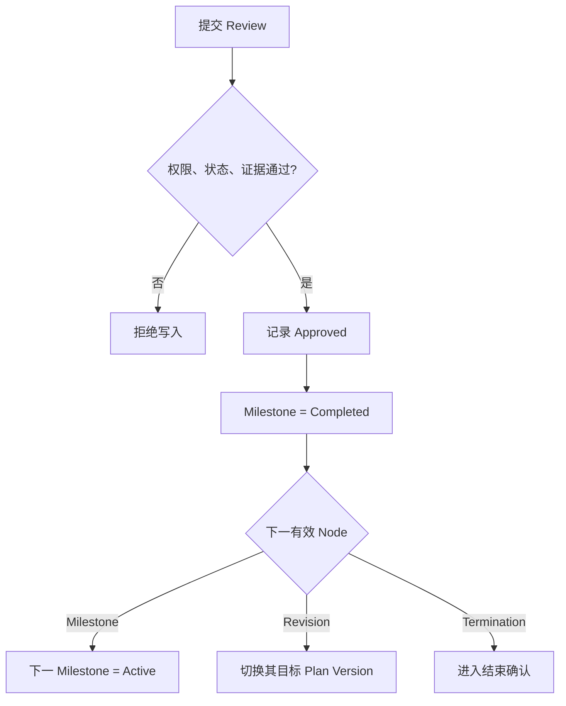

# 领域规则与状态机

## 1. Tag 规则

目标模型不保留 Project，分类统一使用 Tag。

- 一个 Tag 可关联任意数量 Task。
- 一个 Task 可关联任意数量 Tag，也可以没有 Tag。
- Tag 不包含成员、执行状态或时间，不改变 Task 权限或状态。
- 删除 Tag 只解除 TaskTag 关系。
- Tag 和 Task 均由新系统用户显式创建，不承载旧 Project 来源或迁移语义。

## 2. Task 状态机

| 状态 | 含义 | 可进入方式 | 可离开方式 |
|---|---|---|---|
| `DRAFT` | 初始计划尚未开始执行 | 创建 Task | 激活、取消 |
| `ACTIVE` | 按 Current Plan 执行 | 激活 Task | Termination 确认 |
| `COMPLETED` | Termination = Success | 结束确认 | 归档 |
| `FAILED` | Termination = Failed | 结束确认 | 归档 |
| `CANCELLED` | Termination = Cancelled | 结束确认或 Draft 取消 | 归档 |
| `TIMEOUT` | Termination = Timeout | 结束确认 | 归档 |
| `ARCHIVED` | 已归档只读 | 对结束 Task 归档 | 不恢复 |

补充解释：

- 创建 Task 时生成 Current 初始 Plan Version；Draft 阶段首个 Milestone 为 Pending。
- 激活 Task 后首个 Milestone 才变为 Active。这是对设计文档中 Draft 状态与“创建后首个 Milestone Active”之间的明确化。
- 到期时间只产生逾期标记和通知，绝不自动把 Task 设为 Timeout。
- 已结束 Task 不恢复；出现新需求时新建 Task，并用 `relatedTaskId` 引用。

## 3. Plan Version 状态

| 状态 | 说明 | 是否可编辑 |
|---|---|---|
| `DRAFT` | Revision 尚未生效的候选版本 | 可编辑 |
| `CURRENT` | Task 当前唯一执行计划 | 不直接编辑 |
| `HISTORICAL` | 曾经生效、已被替换的计划 | 只读 |
| `ABANDONED` | 未生效且被放弃的草稿 | 只读 |

不变量：

- 每个 Task 至少一个 Plan Version，且恰好一个 Current，包括 Draft 和结束 Task。
- `versionNo` 在 Task 内单调递增且唯一。
- Current/Historical 版本的 Node 内容不可原地修改。
- 每个版本至少一个 Milestone 和一个末尾 Termination。
- 版本中 Node 序号从 1 连续递增，不允许重复、缺口、分支或循环。

## 4. Node 状态

| 状态 | Milestone | Revision | Termination |
|---|---|---|---|
| `PENDING` | 未来计划 | 修订记录尚未走到 | 等待到达 |
| `ACTIVE` | 当前执行目标 | 当前版本切换点，仅瞬时处理 | 等待结束确认 |
| `COMPLETED` | Review Approved | Revision 已生效 | 结束确认完成 |
| `REVISED` | 被新计划替代 | 不适用 | 未来终止计划被替换 |
| `CANCELLED` | Task 取消或草稿放弃 | 草稿 Revision 放弃 | 草稿放弃 |

同一未结束 Task 最多一个 Active Milestone。Revision 生效操作中不允许出现对用户可见的长期 Active Revision；事务结束时新计划第一个有效 Milestone Active，或者新 Termination 等待确认。

## 5. Milestone 规则

核心计划字段：

- 目标描述。
- 完成条件。
- 预期完成时间。
- 验收要求。
- 计划负责人和参与人。

允许直接修改的附属字段：

- 备注。
- 标签。
- 附件展示顺序。
- 不改变目标、判定和时间的格式修正。

必须 Revision 的字段：

- 目标、完成条件、预期完成时间。
- 验收要求的实质内容。
- Node 顺序。
- 新增、删除、拆分、合并 Milestone。
- 替换 Termination 的条件或预计时间。

Milestone 到期但未完成时：

1. 计算 `isOverdue=true`，不改变 Node 状态。
2. 创建站内提醒并按偏好发送飞书。
3. 负责人选择继续原计划或发起 Revision。

## 6. Milestone Review

### 6.1 结果

| 结果 | 影响 |
|---|---|
| `PENDING` | 已提交，等待验收 |
| `APPROVED` | 当前 Milestone Completed，推进到下一节点 |
| `REJECTED` | Milestone 保持 Active，继续原计划 |
| `REVISION_REQUIRED` | Milestone 保持 Active，引导创建 Revision |

### 6.2 规则

- 同一 Milestone 可以多次提交和 Review。
- 最新且未撤销的 Review 是展示上的最终有效结果。
- Approved 只允许针对 Current Plan 的 Active Milestone。
- Review 人不得覆盖历史记录。
- 撤销 Review 必须记录撤销人、时间和原因。
- 已导致计划推进的 Approved Review 默认不可普通撤销；只能由 System Administrator 执行纠错流程，并生成补偿审计，具体上线前必须经安全审查。
- Rejected 和 Revision Required 必须填写说明。
- Review 权限来自 Task 成员角色和系统角色，不来自 Tag。

### 6.3 Approved 推进



## 7. Revision 规则

### 7.1 触发

以下变化必须创建 Revision：

- 修改当前或未来 Milestone 的目标、条件、时间或顺序。
- 新增、删除、拆分或合并 Milestone。
- 延期、提前或批量顺延。
- 替换当前 Milestone。
- 修改计划 Termination。
- Review Result = Revision Required。

### 7.2 生命周期

| 状态 | 行为 |
|---|---|
| `DRAFT` | 基于 Current Plan 复制“引用关系 + 新节点”，可编辑 |
| `PENDING_APPROVAL` | 若 Task 策略要求复核，等待 Reviewer |
| `EFFECTIVE` | 原子生成并切换新 Current Version |
| `REJECTED` | 记录意见，回到可修改草稿或结束 |
| `CANCELLED` | 发起人放弃，不影响 Current Plan |

Revision 审批策略建议配置在 Task：

- `DIRECT_BY_OWNER`：Task Owner 可直接生效。
- `REVIEW_REQUIRED`：由 Task Reviewer 或 Team Administrator 批准。

首发默认 `REVIEW_REQUIRED`，System Administrator 可配置默认值。

### 7.3 生效不变量

- Revision 必须基于仍然 Current 的 `basePlanVersionId`。
- 已 Completed 的 Milestone 及既成事实不得改变。
- 被替换的 Active Milestone 变为 Revised。
- 旧 Plan Version 变为 Historical。
- 新 Plan Version 变为唯一 Current。
- 新版本中第一个未完成 Milestone Active；若无 Milestone，则 Termination 进入确认。
- 旧 Node、旧顺序、旧 Review 和旧附件都不删除。
- 受影响 Planned Segment 标记 `RECONFIRM_REQUIRED`；Actual Segment 不变。

## 8. Termination 规则

Termination 位于每个 Current Plan 的最后。它包含计划结束条件和最终结果候选。

结束确认要求：

- 操作者有 `task.terminate` 权限。
- Termination 是 Current Plan 最后一节点。
- 前一 Milestone 已完成，除非结果为 Cancelled/Failed/Timeout 且填写绕过原因。
- 明确选择 Success、Failed、Cancelled 或 Timeout。
- 记录结束原因、总结、确认人和时间。
- 同一事务更新 Termination 和 Task 状态。

Success 不允许在存在未完成前置 Milestone 时确认。Failed/Cancelled/Timeout 可以提前结束，但必须保留未完成节点为 Cancelled，并写审计。

## 9. Work Segment 规则

### 9.1 通用规则

- 一个 Segment 只属于一个 Person。
- `endAt > startAt`。
- Allocation 范围 `(0, 100]`。
- 可关联 Task、Node 和 Tag，但都不是必填。
- 若同时关联 Task 和 Node，Node 必须属于该 Task。
- 若同时关联 Task 和 Node，Node 必须属于该 Task；Tag 只用于筛选。
- Segment 跨日允许，默认单条最大 31 天，可由系统配置。
- 所有修改写历史。

### 9.2 Planned Segment

状态：

```text
PLANNED -> IN_PROGRESS -> PENDING_CONFIRMATION -> CONFIRMED
PLANNED/IN_PROGRESS/PENDING_CONFIRMATION -> CANCELLED
```

- 时间到达可更新提示状态，但不自动生成 Actual。
- 允许批量创建、移动、确认。
- 拆分后的 Segment 保存 `splitFromId`。
- 合并只允许同一 Person、类型、工作内容、Role、Priority、关联对象一致且时间相邻/重叠。

### 9.3 Actual Segment

- 可以从一个或多个 Planned Segment 产生。
- 一个 Planned Segment 可以产生多个 Actual Segment。
- 来源用多对多表保存，不物理删除 Planned。
- 默认只要求实际时间、工作内容、关联对象、Allocation 和产出摘要。
- Completion 只表示此 Segment 内容，不聚合为 Milestone 状态。
- 删除采用逻辑删除并审计。

## 10. Resource Conflict

首发检测：

- 同一 Person Planned Allocation 在任一时间片超过 100%。
- 时间重叠且 Allocation 缺失。
- 多个 Critical/High Segment 高度重叠。
- 多个 Owner/Lead 角色跨 Task 高度重叠。
- Planned Segment 与人员不可用时间冲突。
- Revision 产生的新 Planned Segment 与原计划冲突。
- Actual Allocation 长期超过计划。

Conflict 具有 `OPEN/ACKNOWLEDGED/RESOLVED/IGNORED` 状态。解决动作只记录：

- 负责人确认无问题。
- 调整了哪些 Segment。
- 接受风险及原因。
- 忽略规则及有效期。

系统建议必须明确标记“建议”，且只有用户确认后才调用 Segment 更新操作。

## 11. 删除与归档

- Task、Node、Review、Segment、Audit 只允许逻辑删除或状态终止。
- Draft 且从未生效的对象可物理清理，但仍记录删除审计。
- Tag 删除只解除引用。
- Account 禁用不删除 Person 的业务历史。
- 旧项目管理功能代码在切换后删除；旧业务记录迁入新领域对象或新审计时间线，不保留旧流程。
