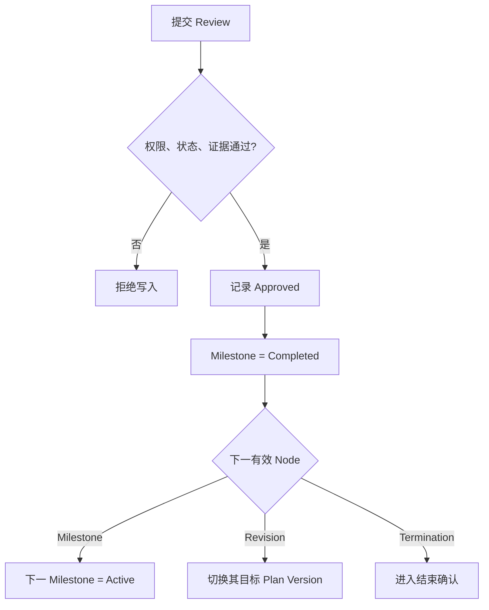

# 领域规则与状态机

> 状态（2026-08-03）：本文的 Task 可见性、成员、Revision 和 Milestone Review 规则已按 [Task 全员可见、双成员角色与全局管理员审批 ADR](../adr/2026-08-03-task-global-visibility-participants-admin-approval.md) 更新。其他历史计划文件如与该 ADR、schema 或当前代码冲突，以 ADR、schema 和当前实现为准。
>
> 状态（2026-08-01）：本文涉及资源冲突、冲突中心、投入比例、冲突通知或冲突扫描的设计已由“删除资源冲突与投入比例”决策取代，仅保留历史背景，不代表当前实现。

## 1. Tag 规则

目标模型不保留 Project，分类统一使用 Tag。

- 一个 Tag 可关联任意数量 Task。
- 一个 Task 可关联任意数量 Tag，也可以没有 Tag。
- Tag 不包含成员、执行状态或时间，不改变 Task 权限或状态。
- 删除 Tag 只解除 TaskTag 关系。
- Tag 和 Task 均由新系统用户显式创建，不承载旧 Project 来源或迁移语义。

## 2. Task 状态机

| 状态 | 含义 | 可进入方式 | 可离开方式 |
|---|---|---|---|
| `DRAFT` | 初始计划尚未开始执行 | 创建 Task | 激活、取消 |
| `ACTIVE` | 按 Current Plan 执行 | 激活 Task | Termination 确认 |
| `COMPLETED` | Termination = Success | 结束确认 | 归档 |
| `FAILED` | Termination = Failed | 结束确认 | 归档 |
| `CANCELLED` | Termination = Cancelled | 结束确认或 Draft 取消 | 归档 |
| `TIMEOUT` | Termination = Timeout | 结束确认 | 归档 |
| `ARCHIVED` | 已归档只读 | 对结束 Task 归档 | 不恢复 |

补充解释：

- 创建 Task 时生成 Current 初始 Plan Version；Draft 阶段首个 Milestone 为 Pending。
- 所有项目访问启用账号都可调用 `createTaskDraft`，车组和技术组仍必须使用固定合法值；创建者由服务端自动归一化为 OWNER。
- `createTaskDraft` 的 active members 必须至少一个 OWNER，允许多个 OWNER；同一 Person 只能有一条有效成员关系，0 OWNER、重复 Person 或 `OWNER/PARTICIPANT` 以外角色均拒绝。
- 激活 Task 后首个 Milestone 才变为 Active。这是对设计文档中 Draft 状态与“创建后首个 Milestone Active”之间的明确化。
- 到期时间只产生逾期标记和通知，绝不自动把 Task 设为 Timeout。
- 已结束 Task 不恢复；出现新需求时新建 Task，并用 `relatedTaskId` 引用。

### 2.1 可见性、成员与权限

- `projectAccessStatus=ACTIVE` 的账号可读取全部未逻辑删除 Task、计划版本、成员、Milestone Review、Revision、Task 审计和全员完整 Work Segment/变更历史。
- 禁用账号不能进入项目管理；逻辑删除对象仍不能通过搜索或显式 ID 枚举。
- Task 有效成员角色只允许 `OWNER`（负责人）和 `PARTICIPANT`（参与人）。历史 `LEAD/MEMBER/REVIEWER/VIEWER` 行保留但必须有 `removedAt`。
- 一个 Task 可有多名 OWNER，但始终至少一名；同一 Person 在同一 Task 中只能有一个有效角色。
- Work Segment 的 `WorkSegmentRole.REVIEWER` 只描述该段工作的职责，不是 Task Reviewer，也不授予审批或 Task 写权限。
- 项目全局管理员指 `SUPER_ADMINISTRATOR` 和 `PROJECT_ADMINISTRATOR`。`GROUP_LEADER` 已退役，只保留撤销历史；采购报销的独立组长角色不受影响。

| 操作 | 非成员 | PARTICIPANT | OWNER | 全局管理员 |
|---|---:|---:|---:|---:|
| 查看 Task/计划/验收/审计/投入 | ✓ | ✓ | ✓ | ✓ |
| 创建 Task | ✓ | ✓ | ✓ | ✓ |
| 修改元数据、Tag、Draft 计划 | — | ✓ | ✓ | ✓ |
| 创建/提交 Revision、提交验收证据 | — | ✓ | ✓ | ✓ |
| 管理成员、激活和结束 Task | — | — | ✓ | ✓ |
| 决定 Milestone/Revision | — | — | — | ✓ |
| 修改自己的 Task 关联 Segment | — | ✓ | ✓ | ✓ |
| 修改该 Task 其他人的 Segment | — | — | ✓ | ✓ |

权限扩大不改变 Task/Segment 状态机、终态只读、时间与关联合法性、乐观锁、审计和事务要求。

## 3. Plan Version 状态

| 状态 | 说明 | 是否可编辑 |
|---|---|---|
| `DRAFT` | Revision 尚未生效的候选版本 | 可编辑 |
| `CURRENT` | Task 当前唯一执行计划 | 原则上不直接编辑；仅初始 Draft 例外 |
| `HISTORICAL` | 曾经生效、已被替换的计划 | 只读 |
| `ABANDONED` | 未生效且被放弃的草稿 | 只读 |

不变量：

- 每个 Task 至少一个 Plan Version，且恰好一个 Current，包括 Draft 和结束 Task。
- `versionNo` 在 Task 内单调递增且唯一。
- 唯一计划内容例外：`Task.status=DRAFT` 且初始 `CURRENT` Plan Version 的 `activatedAt=null` 时，具备服务端权限的 actor 可通过 `replaceTaskDraftPlan` 编辑完整计划。
- Task 激活后，及其他所有 `CURRENT/HISTORICAL` Plan Version 的 Node 内容均不可原地修改；计划语义变化必须通过 Revision。
- 每个版本至少一个 Milestone 和一个末尾 Termination。
- 版本中 Node 序号从 1 连续递增，不允许重复、缺口、分支或循环。

### 3.1 Draft Task 直接更新边界

Draft 更新必须使用三个相互独立的 action，输入不得混用：

- `updateTaskDraftMetadata`：只更新允许的 Draft metadata（含 Draft tags），不接受成员或计划字段。
- `replaceTaskDraftMembers`：只整包替换成员与角色，保持至少一个 active OWNER，允许多 OWNER，拒绝重复 Person 和 `OWNER/PARTICIPANT` 以外角色，不接受 metadata 或计划字段。
- `replaceTaskDraftPlan`：只更新 `plannedStartAt` 和完整 Node 计划，不接受 metadata 或成员字段；保留合法已有 `nodeId`，用 `clientKey` 映射新节点，并拒绝删除被 Segment 引用的节点。

三者共同规则：

- 只允许 `Task.status=DRAFT`，并在服务端验证 actor 权限。
- 输入携带 `expectedLockVersion`，与持久化 `Task.lockVersion` 比较；stale 请求无任何写入。
- mutation、DomainAuditEvent 和 `Task.lockVersion + 1` 在同一事务内提交；成功返回新的 `lockVersion`。
- `replaceTaskDraftPlan` 的计划、节点、映射和审计整包成功或整包回滚；metadata/member action 不得代理或转发计划 replace。

Draft tags 归入 `updateTaskDraftMetadata`，不得调用 Active-only 的 `replaceTaskTags`。

### 3.2 Active Task 直接更新边界

Active 直接更新面只包含：

- `updateTaskMetadata`：只更新允许直接变化的非计划语义 metadata。
- `replaceTaskMembers`：整包差异更新 active members；移除使用 `removedAt` 保留历史，结果至少一个 active OWNER，允许多 OWNER，拒绝重复 Person 和旧成员角色。
- `replaceTaskTags`：只差异更新 TaskTag，不修改 Tag 本身。

三者共同规则：

- 只允许 `Task.status=ACTIVE`，服务端验证 actor 权限；终态和 `ARCHIVED` 一律拒绝。
- 输入携带 `expectedLockVersion`；事务先锁 Task，再原子提交 mutation、DomainAuditEvent 和 `Task.lockVersion + 1`，成功返回新 `lockVersion`。
- stale、无权、终态或 Archived 请求不写业务数据、审计、通知、outbox 或新锁版本。
- 三者都不得修改 Plan Version 或 Node；计划语义变化只走 Revision。

Draft 创建继续为 active members 写既有 `task_assigned` 事件且 `mandatory=true`。Active 成员差异中的新增、移除和角色变化必须在同一事务写完整 InAppNotification 与 `mandatory=true` 的 `project-management` outbox，内容包含操作者、Task、变更前后角色和结果，并复用现有 adapter。两者的 purpose/botKind 都是 `notification`，只使用通知机器人，不得调用 approval bot。Tag 差异只写 TaskTag 与审计，不广播。

## 4. Node 状态

| 状态 | Milestone | Revision | Termination |
|---|---|---|---|
| `PENDING` | 未来计划 | 修订记录尚未走到 | 等待到达 |
| `ACTIVE` | 当前执行目标 | 当前版本切换点，仅瞬时处理 | 等待结束确认 |
| `COMPLETED` | Review Approved | Revision 已生效 | 结束确认完成 |
| `REVISED` | 被新计划替代 | 不适用 | 未来终止计划被替换 |
| `CANCELLED` | Task 取消或草稿放弃 | 草稿 Revision 放弃 | 草稿放弃 |

同一未结束 Task 最多一个 Active Milestone。Revision 生效操作中不允许出现对用户可见的长期 Active Revision；事务结束时新计划第一个有效 Milestone Active，或者新 Termination 等待确认。

## 5. Milestone 规则

核心计划字段：

- 目标描述。
- 完成条件。
- 预期完成时间。
- 验收要求。
- 计划负责人和参与人。

允许直接修改的附属字段：

- 备注。
- 标签。
- 附件展示顺序。
- 不改变目标、判定和时间的格式修正。

必须 Revision 的字段：

- 目标、完成条件、预期完成时间。
- 验收要求的实质内容。
- Node 顺序。
- 新增、删除、拆分、合并 Milestone。
- 替换 Termination 的条件或预计时间。

Milestone 到期但未完成时：

1. 计算 `isOverdue=true`，不改变 Node 状态。
2. 创建站内提醒并按偏好发送飞书。
3. 负责人选择继续原计划或发起 Revision。

## 6. Milestone Review

### 6.1 结果

| 结果 | 影响 |
|---|---|
| `PENDING` | 已提交，等待验收 |
| `APPROVED` | 当前 Milestone Completed，推进到下一节点 |
| `REJECTED` | Milestone 保持 Active，继续原计划 |
| `REVISION_REQUIRED` | Milestone 保持 Active，引导创建 Revision |

### 6.2 规则

- 同一 Milestone 可以多次提交和 Review；OWNER、PARTICIPANT 和全局管理员可以提交 TEXT/LINK 证据。
- 最新且未撤销的 Review 是展示上的最终有效结果。
- Approved 只允许针对 Current Plan 的 Active Milestone。
- 审批人不得覆盖历史记录。
- 撤销 Review 必须记录撤销人、时间和原因。
- 已导致计划推进的 Approved Review 默认不可普通撤销；只能由全局管理员执行纠错流程，并生成补偿审计，具体上线前必须经安全审查。
- Rejected 和 Revision Required 必须填写说明。
- 只有 `SUPER_ADMINISTRATOR` 和 `PROJECT_ADMINISTRATOR` 可以通过、驳回或要求修订；全局管理员可处理自己提交的 Review。
- OWNER、PARTICIPANT、历史 Task Reviewer、退役 `GROUP_LEADER` 和 Tag 均不授予最终决定权。

### 6.3 Approved 推进



## 7. Revision 规则

### 7.1 触发

以下变化必须创建 Revision：

- 修改当前或未来 Milestone 的目标、条件、时间或顺序。
- 新增、删除、拆分或合并 Milestone。
- 延期、提前或批量顺延。
- 替换当前 Milestone。
- 修改计划 Termination。
- Review Result = Revision Required。

### 7.2 生命周期

| 状态 | 行为 |
|---|---|
| `DRAFT` | 基于 Current Plan 复制“引用关系 + 新节点”，可编辑 |
| `PENDING_APPROVAL` | 已提交，等待全局管理员审批 |
| `EFFECTIVE` | 原子生成并切换新 Current Version |
| `REJECTED` | 记录意见，回到可修改草稿或结束 |
| `CANCELLED` | 发起人放弃，不影响 Current Plan |

Revision 使用固定审批策略：

- OWNER、PARTICIPANT 和全局管理员可以创建 Revision；PARTICIPANT 可编辑、提交和取消自己创建的未生效 Revision，OWNER/全局管理员可管理该 Task 的任意未生效 Revision。
- 每次提交都进入 `PENDING_APPROVAL`。即使提交人是全局管理员，也不能在提交事务中直接生效。
- 只有全局管理员可批准或驳回，且允许自审；批准必须是单独的显式动作。
- `revision.apply` 只在全局管理员批准事务内部执行。Task 不再保存 `revisionApprovalMode` 或 `allowSelfReview`。

### 7.3 生效不变量

- Revision 必须基于仍然 Current 的 `basePlanVersionId`。
- 已 Completed 的 Milestone 及既成事实不得改变。
- 被替换的 Active Milestone 变为 Revised。
- 旧 Plan Version 变为 Historical。
- 新 Plan Version 变为唯一 Current。
- 新版本中第一个未完成 Milestone Active；若无 Milestone，则 Termination 进入确认。
- 旧 Node、旧顺序、旧 Review 和旧附件都不删除。
- 受影响 Planned Segment 标记 `associationNeedsReview=true`；Actual Segment 不变。

## 8. Termination 规则

Termination 位于每个 Current Plan 的最后。它包含计划结束条件和最终结果候选。

结束确认要求：

- 操作者有 `task.terminate` 权限。
- Termination 是 Current Plan 最后一节点。
- 前一 Milestone 已完成，除非结果为 Cancelled/Failed/Timeout 且填写绕过原因。
- 明确选择 Success、Failed、Cancelled 或 Timeout。
- 记录结束原因、总结、确认人和时间。
- 同一事务更新 Termination 和 Task 状态。

Success 不允许在存在未完成前置 Milestone 时确认。Failed/Cancelled/Timeout 可以提前结束，但必须保留未完成节点为 Cancelled，并写审计。

## 9. Work Segment 规则

### 9.1 通用规则

- 一个 Segment 只属于一个 Person。
- `endAt > startAt`。
- 可关联 Task、Node 和 Tag，但都不是必填。
- 若关联 Task，Segment Person 必须是该 Task 的有效 OWNER 或 PARTICIPANT；若同时关联 Node，Node 必须属于该 Task。Tag 只用于筛选。
- 新建、更新、拆分、合并、确认和重关联等会创建或改变 Task 关联的写路径都必须在服务端复核成员一致性。
- 所有启用项目账号可查看所有未删除 Segment 的完整内容和变更历史。
- PARTICIPANT 只能管理自己的 Task 关联 Segment；OWNER 可管理该 Task 所有人的 Segment；全局管理员可管理全部；非成员不能写入该 Task 的 Segment。
- 无 Task 关联的个人 Segment 仍由本人管理，全局管理员可管理全部。
- `WorkSegmentRole.REVIEWER` 只描述工作职责，既不要求 Task Reviewer 成员，也不授予审批权限。
- Segment 跨日允许，默认单条最大 31 天，可由系统配置。
- 所有修改写历史。

### 9.2 Planned Segment

状态：

```text
PLANNED -> IN_PROGRESS -> PENDING_CONFIRMATION -> CONFIRMED
PLANNED/IN_PROGRESS/PENDING_CONFIRMATION -> CANCELLED
```

- 时间到达可更新提示状态，但不自动生成 Actual。
- 允许批量创建、移动、确认。
- 拆分后的 Segment 保存 `splitFromId`。
- 合并只允许同一 Person、类型、工作内容、Role、Priority、关联对象一致且时间相邻/重叠。

### 9.3 Actual Segment

- 可以从一个或多个 Planned Segment 产生。
- 一个 Planned Segment 可以产生多个 Actual Segment。
- 来源用多对多表保存，不物理删除 Planned。
- 默认只要求实际时间、工作内容、关联对象和产出摘要。
- Completion 只表示此 Segment 内容，不聚合为 Milestone 状态。
- 删除采用逻辑删除并审计。

## 10. Resource Conflict

当前检测：

- 同一 Person Planned Allocation 在任一时间片超过 100%。
- 时间重叠且 Allocation 缺失。
- 多个 Critical/High Segment 高度重叠。
- 多个 Owner/Lead 角色跨 Task 高度重叠。
- Revision 产生的新 Planned Segment 与原计划冲突。
- Actual Allocation 长期超过计划。

`ResourceConflictKind.UNAVAILABLE_TIME` enum 仅为未来模型预留。Unavailable Time 的数据所有权、授权、审计和扫描规则尚未设计，属于本轮延期；当前 scanner 不得产生 `UNAVAILABLE_TIME`。

Conflict 具有 `OPEN/ACKNOWLEDGED/RESOLVED/IGNORED` 状态。解决动作只记录：

- 负责人确认无问题。
- 调整了哪些 Segment。
- 接受风险及原因。
- 忽略规则及有效期。

系统建议必须明确标记“建议”，且只有用户确认后才调用 Segment 更新操作。

## 11. 删除与归档

- Task、Node、Review、Segment、Audit 只允许逻辑删除或状态终止。
- Draft 且从未生效的对象可物理清理，但仍记录删除审计。
- Tag 删除只解除引用。
- Account 禁用不删除 Person 的业务历史。
- 旧项目管理功能代码和开发数据已在 v2.1 建设前清理；新系统不得导入、映射或回填旧 Project/Task/Stage/审批/周报/风险等记录。
