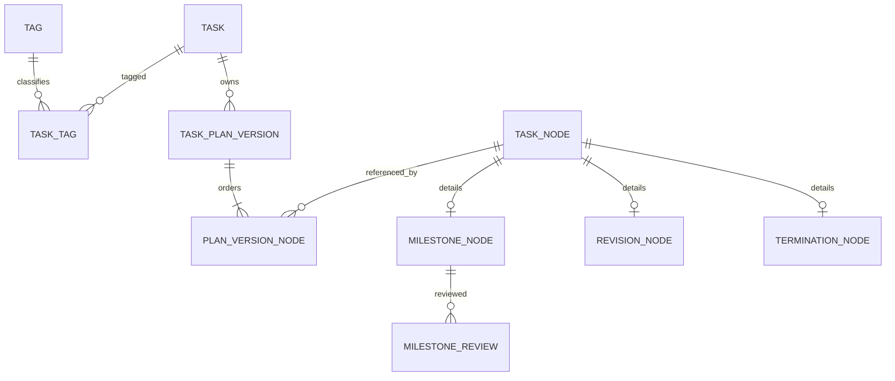
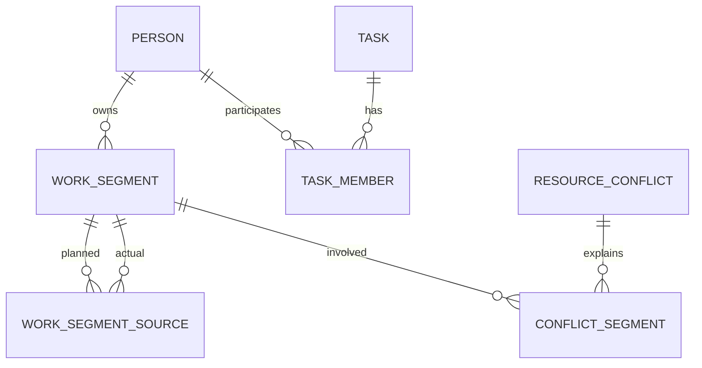

# 数据库设计与发布边界

## 1. 设计原则

- 新项目管理表使用 `personId/accountId`，不使用飞书 `openId` 作为业务外键。
- 目标 schema 不包含 Project；Task 与 Tag 通过多对多关系分类。
- 历史表避免 Cascade 删除；关联对象删除时优先 Restrict 或 SetNull。
- 业务快照使用结构化列为主，Json 只存可扩展快照、diff 和审计 payload。
- Prisma 无法表达的部分唯一索引、check 和必要触发器写入 migration SQL。
- 金额外的比例也不使用 Float；Allocation 使用 `Decimal(5,2)`。
- 所有时间使用 `timestamptz` 对应 Prisma `DateTime`，展示时按用户时区。

## 2. 核心关系

## 3. 身份模型

### 3.1 `Account`

| 字段 | 类型 | 规则 |
|---|---|---|
| `id` | UUID | 主键 |
| `status` | enum | ACTIVE/DISABLED |
| `createdAt/updatedAt` | DateTime | 必填 |
| `lastLoginAt` | DateTime? | 登录更新 |

### 3.2 `AccountIdentity`

| 字段 | 类型 | 规则 |
|---|---|---|
| `accountId` | UUID | FK Account |
| `provider` | enum | 首发仅 FEISHU |
| `providerSubject` | String | 飞书 unionId 优先，openId 为兼容属性 |
| `tenantId` | String | 多租户隔离，当前可为固定值 |
| `metadata` | Json | 受控字段，不存 token |

唯一键：`(provider, tenantId, providerSubject)`。

### 3.3 `Person`

| 字段 | 类型 | 规则 |
|---|---|---|
| `id` | UUID | 主键 |
| `accountId` | UUID? | 唯一，可空，允许未注册人员 |
| `displayName` | String | 必填 |
| `avatar` | String? | 受控 URL |
| `status` | enum | ACTIVE/INACTIVE |
| `createdAt/updatedAt` | DateTime | 必填 |

本期采购继续使用 `User`。登录解析层建立 `User -> Account -> Person` 映射，不要求立刻改采购外键。

## 4. Tag 与 Task

### 4.1 `Tag` / `TaskTag`

`Tag` 保存 `id/name/color/description/createdByAccountId/archivedAt`，名称在有效 Tag 中唯一。`TaskTag` 使用 `(taskId, tagId)` 唯一键。Tag 不存成员、状态或业务时间。

### 4.2 `Task`

关键字段：

| 字段 | 说明 |
|---|---|
| `title/description` | Task 元数据 |
| `team/techGroup` | Task 自身组织范围，不从 Tag 继承；复用现有采购组织值 |
| `tags` | 通过 TaskTag 多对多关联 |
| `status` | DRAFT/ACTIVE/COMPLETED/FAILED/CANCELLED/TIMEOUT/ARCHIVED |
| `priority` | CRITICAL/HIGH/MEDIUM/LOW |
| `currentPlanVersionId` | 当前计划指针，所有 Task 必填 |
| `activeMilestoneNodeId` | Active Milestone 缓存指针 |
| `revisionApprovalMode` | DIRECT_BY_OWNER/REVIEW_REQUIRED |
| `lockVersion` | 乐观锁整数 |
| `startedAt/endedAt/archivedAt/deletedAt` | 生命周期时间 |
| `createdByAccountId` | 创建身份 |

`TaskMember` 保存 Person 与 Task 的角色：OWNER/LEAD/MEMBER/REVIEWER/VIEWER。业务层要求每个 Task 恰好一个 `removedAt IS NULL` 的 OWNER；现有 active `(taskId, personId, role)` 唯一索引拒绝同一 Person 重复相同 role。同一 Person 可有多个不同 active role，权限取并集。S2 必须把当前“至少一个 OWNER”服务校验收紧为恰好一个，并通过事务锁避免并发破坏。

## 5. Plan 与 Node

### 5.1 `TaskPlanVersion`

| 字段 | 说明 |
|---|---|
| `taskId` | 所属 Task |
| `versionNo` | Task 内递增 |
| `status` | DRAFT/CURRENT/HISTORICAL/ABANDONED |
| `baseVersionId` | Revision 的来源版本 |
| `revisionNodeId` | 导致此版本的 Revision |
| `reason` | 初始创建或修订原因 |
| `createdByAccountId` | 创建人 |
| `activatedAt` | 生效时间 |
| `snapshotHash` | 节点序列与核心字段哈希 |

约束：

- `unique(taskId, versionNo)`
- PostgreSQL 部分唯一索引：每 Task 最多一个 `status='CURRENT'`

### 5.2 `TaskNode`

共同字段：`taskId`、`type`、`status`、`businessDescription`、`createdByAccountId`、`createdAt`、`deletedAt`。

Node 的版本顺序不直接放在 TaskNode，而在 `PlanVersionNode`：

| 字段 | 规则 |
|---|---|
| `planVersionId` | FK |
| `nodeId` | FK |
| `sequence` | 从 1 连续 |
| `isCarryForward` | 是否从旧版本复用 |

唯一键：`(planVersionId, sequence)`、`(planVersionId, nodeId)`。

### 5.3 子类型

`MilestoneNode`：

- `goal`
- `completionCriteria`
- `expectedCompletedAt`
- `reviewRequirements`
- `submittedForReviewAt`
- `completedAt`

`RevisionNode`：

- `reason`
- `revisedFromNodeId`
- `basePlanVersionId`
- `targetPlanVersionId`
- `status`
- `submittedAt/reviewedAt/effectiveAt`
- `reviewedByAccountId/reviewComment`
- `affectedSummary Json`

`TerminationNode`：

- `plannedOutcomeCriteria`
- `plannedAt`
- `outcome`（SUCCESS/FAILED/CANCELLED/TIMEOUT，可空至确认）
- `reason/summary`
- `confirmedByAccountId`
- `confirmedAt`

## 6. Review

### 6.1 `MilestoneReview`

字段：

- `milestoneNodeId`
- `result`
- `reviewerAccountId`
- `reviewedAt`
- `comment`
- `idempotencyKey`
- `revokedAt/revokedByAccountId/revokeReason`
- `createdAt`

唯一键：`(milestoneNodeId, idempotencyKey)`。

### 6.2 `ReviewEvidence`

保存附件、外部链接、说明和排序。使用现有 FileAsset 权限设施时必须增加项目管理对象类型和 owner policy。

## 7. Work Segment

### 7.1 `WorkSegment`

| 字段 | 规则 |
|---|---|
| `personId` | 必填 |
| `type` | PLANNED/ACTUAL |
| `status` | 按类型校验 |
| `startAt/endAt` | end > start |
| `content` | 必填 |
| `allocation` | Decimal(5,2)，0 < x <= 100 |
| `role` | OWNER/LEAD/DEVELOPER/DESIGNER/REVIEWER/SUPPORT/OBSERVER/CUSTOM |
| `customRole` | role=CUSTOM 时必填 |
| `priority` | CRITICAL/HIGH/MEDIUM/LOW |
| `expectedOutput/actualOutput` | 可空 |
| `completionPercent` | Actual 可用，0-100 |
| `taskId/nodeId` | 均可空；Node 非空时必须属于 Task |
| `tags` | 通过 SegmentTag 多对多筛选 |
| `associationNeedsReview` | Node Revised 后置 true |
| `createdBy/updatedBy` | Account FK |
| `sourceSplitFromId` | 拆分来源 |
| `deletedAt` | 逻辑删除 |

关键索引：

- `(personId, type, startAt, endAt)`
- `(taskId, startAt)`
- `(nodeId, type)`
- `(associationNeedsReview, personId)`

### 7.2 `WorkSegmentSource`

连接 Planned 与 Actual：

- `plannedSegmentId`
- `actualSegmentId`
- `coveredStartAt/coveredEndAt`
- `createdByAccountId`

唯一键：`(plannedSegmentId, actualSegmentId, coveredStartAt, coveredEndAt)`。

### 7.3 `WorkSegmentChange`

append-only：

- `segmentId`
- `action`
- `before Json`
- `after Json`
- `reason`
- `actorAccountId`
- `createdAt`

## 8. Resource Conflict

`ResourceConflict`：

- `personId`
- `kind`
- `startAt/endAt`
- `severity`
- `status`
- `fingerprint`
- `explanation Json`
- `detectedAt`
- `acknowledgedAt/resolvedAt/ignoredUntil`
- `resolvedByAccountId/resolutionNote`

`ConflictSegment` 保存冲突与 Segment 多对多。`fingerprint` 唯一，保证重复扫描不创建重复 OPEN 记录。

## 9. 权限、通知与审计表

- `SystemRoleAssignment`：Account 的系统角色和组织范围。
- `TaskMember`：Task 直接成员角色；不从 Tag 继承。
- `NotificationPreference`：事件类别、IN_APP/FEISHU 是否启用；强制安全/审批事件不可完全关闭。
- `InAppNotification`：接收人、类型、标题、摘要、对象引用、已读时间、创建时间。
- 复用 `NotificationOutbox/Recipient` 投递飞书。
- `DomainAuditEvent`：actor、action、entity、before/after、reason、requestId、schemaVersion、createdAt。

## 10. 数据库强制约束

除 Prisma schema 外，migration SQL 增加：

- 单 Task 单 Current Plan 的部分唯一索引。
- Allocation、Completion、时间范围 check。
- Node 子类型一致性检查通过服务层 + 数据一致性巡检；若使用触发器，必须有独立集成测试。
- `Task.activeMilestoneNodeId` 必须属于该 Task；跨表约束通过事务断言和巡检。
- Historical/Current Plan 的更新保护：应用数据库角色禁止更新核心快照列；管理脚本走受控连接。
- Tag 删除只级联 TaskTag/SegmentTag 关系，禁止触碰 Task/Segment。

## 11. 清理后数据基线

旧 Project、ProjectStage、旧 Task 及其 owner、participant、submission、approval、DDL、weekly、risk、comment、follow、reminder 数据和 schema 已在本计划实施前删除。新项目管理从空数据集开始：

- 不读取或恢复旧项目管理表。
- 不建立 Project/Task 到新 Task 的映射表。
- 不增加 `legacySourceType`、`legacySourceId`、`migrationNeedsReview` 或 `legacy-import` Tag。
- 不从旧周报、审批、风险或附件推导 Work Segment、Review 或 Audit。

仍在运行的 `User`、采购、反馈、`FileAsset`、`NotificationOutbox`、收件人和飞书 CardKit 跟踪数据是 schema 发布的兼容基线，不能因新项目管理表加入而改变含义或丢失。

## 12. 新 schema migration

- 每次 schema 变化只新增 migration，不编辑已应用历史。
- 新表、enum、外键和索引应从空项目管理数据集直接创建，不包含旧表 rename、回填或 drop 步骤。
- Account/Person 初始化若需要读取共享 `User`，必须作为独立、幂等、可对账的共享身份 backfill；它不是旧项目管理数据迁移，且不得改变采购的 `User.openId/unionId` 语义。
- migration 在空 PostgreSQL 和含采购、反馈、附件、outbox/CardKit 数据的隔离快照上验证。
- 发布前以显式模型、外键和行数清单确认共享数据未被删除或级联修改。
