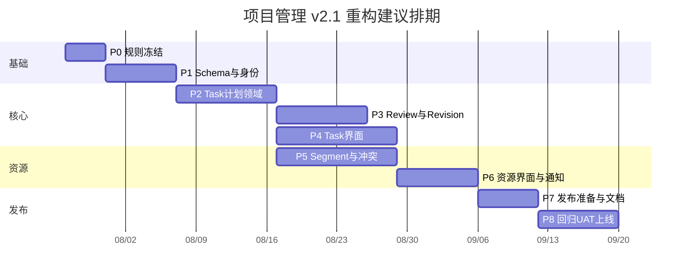

# 实施阶段与团队分工

## 1. 角色配置

计划使用角色槽位，不虚构实际姓名。项目启动时由负责人把真实人员填入：

| 代号 | 角色 | 主要责任 |
|---|---|---|
| BO | 业务负责人 | 规则、删除范围、UAT 签字 |
| PM | 项目经理 | 排期、依赖、风险、维护窗口 |
| TL | 技术负责人 | 架构、事务、schema 发布、最终技术决策 |
| BE-A | 后端 A | Task/Plan/Node/Revision/Review |
| BE-B | 后端 B | Person/权限/Segment/Conflict/通知 |
| FE-A | 前端 A | Task 工作台、时间线、Revision/Review |
| FE-B | 前端 B | 资源时间轴、冲突、站内通知、Tag |
| QA | 测试负责人 | 测试设计、自动化、UAT、回归报告 |
| DBA | DBA/运维 | migration、备份恢复、性能、发布 |
| SEC | 安全/独立审查 | 权限、数据泄露、代码和设计审查 |

最低可行团队：TL/BE-A/BE-B 可合并为 1 人，FE-A/FE-B 可合并为 1 人，PM/QA 可兼职，但不能省略独立审查和数据库恢复演练。

## 2. RACI

| 工作 | A 最终负责 | R 执行 | C 咨询 | I 知会 |
|---|---|---|---|---|
| 业务规则与删除范围 | BO | PM/TL | QA | 全员 |
| 目标 schema | TL | BE-A/BE-B | DBA/SEC | FE/QA |
| 状态机与领域服务 | TL | BE-A | QA/BE-B | FE |
| 权限与身份 | TL | BE-B | SEC/BE-A | QA/FE |
| Task UI | FE-A | FE-A | BO/QA/TL | 全员 |
| 资源 UI | FE-B | FE-B | BO/QA/BE-B | 全员 |
| Schema 发布/共享身份初始化 | TL | BE-A/DBA | BO/QA/BE-B | 全员 |
| 测试签字 | QA | QA + 开发 | BO/TL | 全员 |
| 正式上线 | PM | DBA/TL | BO/QA | 用户 |

## 3. 总体工期

完整团队建议 8-11 周，约 150-190 人日。阶段有并行关系，不是人日直接相加。

日期仅为示例，真实排期从人员确认日重新计算。

## 4. P0：规则冻结与基线（3-4 个工作日）

负责人：BO(A)、PM/TL(R)、QA/SEC(C)。

工作：

- 确认 Task/Tag 取代 Project。
- 确认 Revision 默认审批、自审规则、Task 可见性。
- 确认旧项目管理已清理，冻结共享数据保护清单。
- 建立 UAT 场景与性能数据规模。
- 输出 ADR、状态转换表、权限矩阵和共享身份字段表。

退出门禁：

- 本目录 P0 决策全部关闭。
- 没有“开发时再决定”的状态或权限空白。
- 采购、反馈和共享基础设施数据只读盘点完成。

## 5. P1：新 schema、身份与 Tag（5-7 个工作日）

负责人：TL(A)、BE-B/BE-A(R)、DBA/SEC(C)、QA(I)。

工作：

- Account/Identity/Person。
- Task/Tag/TaskTag/TaskMember。
- Plan/Node 子类型、Review、Segment、Conflict、InAppNotification、Audit。
- PostgreSQL 部分唯一索引与 check。
- 飞书登录到 Account/Person 的解析。
- 新授权策略骨架和 readableWhere。
- 共享身份 backfill dry-run/APPLY 骨架（若需要），不建立旧项目管理 map 表。

测试：

- Prisma validate/diff。
- 身份冲突。
- schema 约束。
- 采购登录和权限回归。

退出门禁：

- 新 schema 可从空库部署。
- 采购核心回归通过。
- 独立审查确认无 Cascade 误删。

## 6. P2：Task、Plan 与 Node（8-10 个工作日）

负责人：TL(A)、BE-A(R)、BE-B/QA(C)、FE-A(I)。

工作：

- Task Draft 创建和激活。
- Plan Version 构建、验证和版本 hash。
- 单链/唯一 Current/唯一 Active 规则。
- Task metadata、成员与 Tag。
- Termination 基础。
- Query facade。
- 领域与数据库集成测试。

退出门禁：

- 不通过 UI 也能在集成测试完成 Task 初始计划。
- 所有非法链和并发 Current 被拒绝。
- 审计与站内通知事务骨架可用。

## 7. P3：Revision、Review 与 Termination（8-9 个工作日）

负责人：TL(A)、BE-A(R)、BE-B/SEC/QA(C)、FE-A(I)。

工作：

- Revision 草稿、diff、审批、生效。
- 并发基线冲突。
- Milestone evidence 和多次 Review。
- Approved 推进、Rejected、Revision Required。
- Termination 四种结果。
- 受限纠错。
- 飞书审批/结果事件。

测试：

- 状态矩阵。
- 重复点击/幂等。
- 并发 Revision/Review。
- 自审拒绝。
- 事务故障注入。

退出门禁：

- 纯服务端完整走通两 Milestone + Revision + Success Termination。
- 无半完成版本。
- SEC 审查权限和自审。

## 8. P4：Task 与计划界面（10-12 个工作日，可与 P3 后半并行）

负责人：FE-A(A/R)、TL/BO/QA(C)、BE-A(I)。

工作：

- Task 列表、创建向导和工作台。
- 当前计划时间线。
- Revision 编辑与版本比较。
- Review 和 Termination UI。
- Tag 管理。
- 移动端垂直视图和键盘操作。

测试：

- Playwright 主流程。
- 长文本、200 Node、50 Version。
- Viewer 只读、冲突、重复保存。
- 桌面与 Pixel 5。

退出门禁：

- BO 完成核心流程预 UAT。
- 页面无旧 Project/Stage 概念。

## 9. P5：Work Segment 与 Resource Conflict（10-12 个工作日）

负责人：TL(A)、BE-B(R)、BE-A/QA(C)、FE-B(I)。

工作：

- Planned/Actual CRUD。
- 批量、拆分、合并、部分确认和来源关系。
- Segment change history。
- 冲突规则、fingerprint、增量扫描和解决。
- worker 与性能索引。

测试：

- 时间边界、Allocation、守恒。
- 100k Segment 性能数据。
- scanner 幂等。
- suggestion 只读与显式 apply。

退出门禁：

- 所有 Segment 操作不改变 Task/Milestone。
- 冲突扫描达到性能门槛。

## 10. P6：资源界面、站内通知和飞书（7-8 个工作日）

负责人：FE-B/BE-B(R)、TL(A)、BO/QA(C)、DBA(I)。

工作：

- 人员时间轴、Task 人员投入、计划实际比较。
- Conflict 中心。
- 站内通知和偏好。
- 飞书事件、收件人、worker claim。
- cron 管理、监控和失败面板。

退出门禁：

- 全部新事件在禁发模式测试。
- 采购 outbox 回归。
- 移动端资源列表可用。

## 11. P7：Schema 发布准备与文档（4-6 个工作日）

负责人：TL(A)、BE-A/BE-B/DBA(R)、QA/SEC(C)、BO(I)。

工作：

- 完成新 schema migration 和必要的共享身份幂等初始化。
- 在空库和含共享数据的快照上完成两次发布演练。
- 建立采购、反馈、用户、附件、outbox/CardKit 数据对账。
- 静态检查确认无 `legacySource*`、旧数据 map、旧项目管理接口或直连飞书发送。
- 更新 README/TECH/TESTING/NOTIFICATIONS。

退出门禁：

- 新项目管理数据集初始为空，仅显式创建操作产生 Task。
- 共享数据清单和 hash 不变。
- Account/Person backfill 冲突为零且可重复执行。
- 整库恢复演练通过。

## 12. P8：全回归、UAT 与上线（6-8 个工作日）

负责人：PM(A)、QA/DBA/TL(R)、BO/SEC(C)。

工作：

- 全静态、构建、领域、E2E、性能、安全。
- BO UAT。
- 发布 runbook 桌面演练。
- 维护窗口 schema 发布。
- 上线值守与 7 天完整性巡检。

退出门禁：

- 无 P0/P1 缺陷。
- BO、TL、QA、DBA 四方签字。
- 监控和回滚人员在线。

## 13. PR 与提交策略

- 每个 WBS 工作包一个或数个小 PR。
- schema、领域服务、UI 和发布脚本分开。
- 每个 PR 描述状态、权限、审计、通知、测试和 schema 影响。
- 每个阶段至少两轮独立审查；高风险 migration/权限由 SEC/DBA 参与。
- 破坏性 schema 变化（如后续确有需要）只能在所有功能合并、演练通过后单独提交；本基线不包含旧项目管理 contract migration。

## 14. 单人维护调整

若只有一名维护者：

- 阶段顺序不变，不并行 P3/P4/P5。
- 每个阶段完成后暂停一轮，由外部审查者检查。
- 预留至少 20% 时间处理 schema/共享身份异常和回归。
- 预计 18-25 周，不能通过跳过测试、恢复演练或权限拒绝路径压缩。
