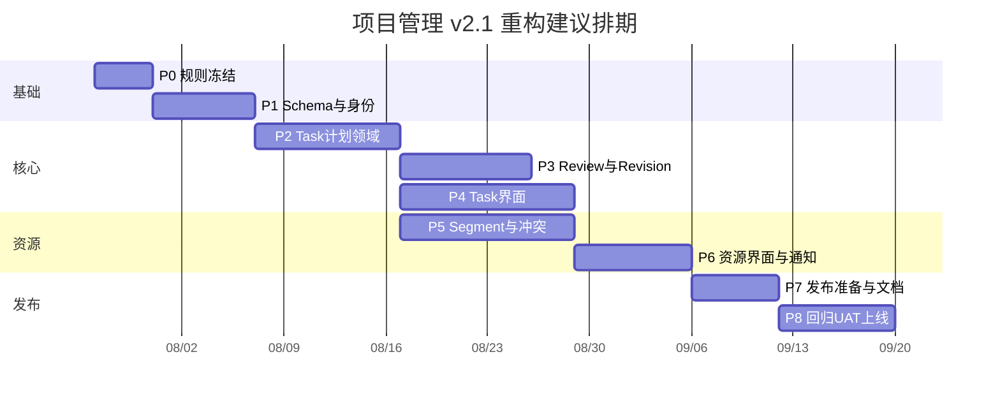

# 实施阶段与团队分工

> 状态说明：P0–P8 是最初的领域建设阶段；S0–S10 是 2026-07-30 起剩余 P4–P8 的实际执行/关单顺序。`345b5b0` 只构成首批 P4/P6 卡片/列表 UI 和项目管理通知 adapter 基线，不能据此把 P4/P6 或 TimeCanvas 标记为完成。

## 1. 角色配置

计划使用角色槽位，不虚构实际姓名。项目启动时由负责人把真实人员填入：

| 代号 | 角色 | 主要责任 |
|---|---|---|
| BO | 业务负责人 | 规则、删除范围、UAT 签字 |
| PM | 项目经理 | 排期、依赖、风险、维护窗口 |
| TL | 技术负责人 | 架构、事务、schema 发布、最终技术决策 |
| BE-A | 后端 A | Task/Plan/Node/Revision/Review |
| BE-B | 后端 B | Person/权限/Segment/Conflict/通知 |
| FE-A | 前端 A | Task 工作台、时间线、Revision/Review |
| FE-B | 前端 B | 资源时间轴、冲突、站内通知、Tag |
| QA | 测试负责人 | 测试设计、自动化、UAT、回归报告 |
| DBA | DBA/运维 | migration、备份恢复、性能、发布 |
| SEC | 安全/独立审查 | 权限、数据泄露、代码和设计审查 |

最低可行团队：TL/BE-A/BE-B 可合并为 1 人，FE-A/FE-B 可合并为 1 人，PM/QA 可兼职，但不能省略独立审查和数据库恢复演练。

## 2. RACI

| 工作 | A 最终负责 | R 执行 | C 咨询 | I 知会 |
|---|---|---|---|---|
| 业务规则与删除范围 | BO | PM/TL | QA | 全员 |
| 目标 schema | TL | BE-A/BE-B | DBA/SEC | FE/QA |
| 状态机与领域服务 | TL | BE-A | QA/BE-B | FE |
| 权限与身份 | TL | BE-B | SEC/BE-A | QA/FE |
| Task UI | FE-A | FE-A | BO/QA/TL | 全员 |
| 资源 UI | FE-B | FE-B | BO/QA/BE-B | 全员 |
| Schema 发布/共享身份初始化 | TL | BE-A/DBA | BO/QA/BE-B | 全员 |
| 测试签字 | QA | QA + 开发 | BO/TL | 全员 |
| 正式上线 | PM | DBA/TL | BO/QA | 用户 |

## 3. 总体工期

完整团队建议 8-11 周，约 150-190 人日。阶段有并行关系，不是人日直接相加。

日期仅为示例，真实排期从人员确认日重新计算。

### 3.1 当前实现快照

| 范围 | 状态 | 证据与下一步 |
|---|---|---|
| P0、P1、P2/P3 服务端主体 | 已实现 | 以当前代码、migration 和重新执行的测试为准 |
| P5 Segment/Conflict 主体 | 已实现（主体）；计划（重新关单） | `e0317cc` + `2499952` handoff 是历史基线；S1 补安全、并发、不变量和回归 |
| 项目管理 notification channel adapter | 已实现首批基线 | `345b5b0` 已落地；S8 做内容、偏好、cron 和边界回归，不重写传输层 |
| `/progress`、Task/资源/冲突/通知页面 | 已实现首批基线 | 当前是卡片/列表/纵向工作台；S3–S8 按前端 v1.0 升级 |
| TimeCanvas/TimeAgenda、Task Composer、个人时间线、待办、Tag | 计划 | 分别在 S3、S5、S7、S8 实现 |
| Unavailable Time、跨人员重新指派、保存视图、自动平衡、复杂依赖线、创建时初始 Segment | 延期 | 不进入 S0–S10 |

### 3.2 S0–S10 执行阶段

| 阶段 | 目标 | 主要关单门禁 | 映射原阶段 |
|---|---|---|---|
| S0 | 基线、ADR、计划和追踪矩阵校正 | 将残留 `.next` 移至 `.tmp/next-cache-stale-*` 后重跑当前 HEAD 检查；文档无两套验收口径 | P4–P8 协调 |
| S1 | P5 安全、并发与不变量重新关单 | person 级 transaction advisory lock、首次 fingerprint 竞争、隐私/并发回归；P5 与全量 E2E | P5 |
| S2 | 计划编辑与 TimeCanvas 服务端契约 | migration、chronology、Busy 脱敏、能力标志、查询上限 | P2/P3/P5/P6 |
| S3 | Shell 与只读 TimeCanvas/TimeAgenda 内核 | 密集 fixture、桌面/Pixel 5、键盘与横滚 | P4/P6 |
| S4 | Segment 画布交互与 Inspector | 完整 mutation 闭环、stale、批量原子性、拒绝路径 | P5/P6 |
| S5 | 单页 Task Composer | 创建、草稿恢复、200 节点、幂等和权限 | P4 |
| S6 | 默认“计划与资源”的 Task 工作台 | Revision/Review/Termination/Audit 和角色矩阵 | P3/P4/P6 |
| S7 | Resource Planner、个人时间线、Conflict Center | URL 复现、Busy、Agenda、批量和冲突 capability | P6 |
| S8 | Dashboard、Action Inbox、Tag、通知偏好和 cron | 偏好/强制事件、cron 幂等、全部 outbox 回归 | P4/P6 |
| S9 | 性能、无障碍和 P5-12/P5-13 运维关单 | cron 跨实例全局互斥、checkpoint、增量扫描 + 每日完整扫描、规模数据、p95、正式文档 | P5/P7 |
| S10 | 发布演练、全回归、安全审查和 UAT 证据 | 两次演练、恢复、四方签字；不自动执行生产发布 | P7/P8 |

S0–S10 严格串行推进共享 schema、公共 DTO、路由、TimeCanvas、lockfile 和共享测试。生产维护窗口必须由用户另行明确授权，并具备 BO、TL、QA、DBA 四方签字。

## 4. P0：规则冻结与基线（3-4 个工作日）

负责人：BO(A)、PM/TL(R)、QA/SEC(C)。

工作：

- 确认 Task/Tag 取代 Project。
- 确认 Revision 默认审批、自审规则、Task 可见性。
- 确认旧项目管理已清理，冻结共享数据保护清单。
- 建立 UAT 场景与性能数据规模。
- 输出 ADR、状态转换表、权限矩阵和共享身份字段表。

退出门禁：

- 本目录 P0 决策全部关闭。
- 没有“开发时再决定”的状态或权限空白。
- 采购、反馈和共享基础设施数据只读盘点完成。

## 5. P1：新 schema、身份与 Tag（5-7 个工作日）

负责人：TL(A)、BE-B/BE-A(R)、DBA/SEC(C)、QA(I)。

工作：

- Account/Identity/Person。
- Task/Tag/TaskTag/TaskMember。
- Plan/Node 子类型、Review、Segment、Conflict、InAppNotification、Audit。
- PostgreSQL 部分唯一索引与 check。
- 飞书登录到 Account/Person 的解析。
- 新授权策略骨架和 readableWhere。
- 共享身份 backfill dry-run/APPLY 骨架（若需要），不建立旧项目管理 map 表。

测试：

- Prisma validate/diff。
- 身份冲突。
- schema 约束。
- 采购登录和权限回归。

退出门禁：

- 新 schema 可从空库部署。
- 采购核心回归通过。
- 独立审查确认无 Cascade 误删。

## 6. P2：Task、Plan 与 Node（8-10 个工作日）

负责人：TL(A)、BE-A(R)、BE-B/QA(C)、FE-A(I)。

工作：

- Task Draft 创建和激活。
- Plan Version 构建、验证和版本 hash。
- 单链/唯一 Current/唯一 Active 规则。
- Task metadata、成员与 Tag。
- Termination 基础。
- Query facade。
- 领域与数据库集成测试。

退出门禁：

- 不通过 UI 也能在集成测试完成 Task 初始计划。
- 所有非法链和并发 Current 被拒绝。
- 审计与站内通知事务骨架可用。

## 7. P3：Revision、Review 与 Termination（8-9 个工作日）

负责人：TL(A)、BE-A(R)、BE-B/SEC/QA(C)、FE-A(I)。

工作：

- Revision 草稿、diff、审批、生效。
- 并发基线冲突。
- Milestone evidence 和多次 Review。
- Approved 推进、Rejected、Revision Required。
- Termination 四种结果。
- 受限纠错。
- 飞书审批/结果事件。

测试：

- 状态矩阵。
- 重复点击/幂等。
- 并发 Revision/Review。
- 自审拒绝。
- 事务故障注入。

退出门禁：

- 纯服务端完整走通两 Milestone + Revision + Success Termination。
- 无半完成版本。
- SEC 审查权限和自审。

## 8. P4：Task 与计划界面（10-12 个工作日，可与 P3 后半并行）

负责人：FE-A(A/R)、TL/BO/QA(C)、BE-A(I)。

工作：

- Task 列表、单页 Plan Composer 和工作台。
- 共用 TimeCanvas 的计划与资源默认视图。
- Revision 编辑与版本比较。
- Review 和 Termination UI。
- Tag 管理。
- 移动端垂直视图和键盘操作。

测试：

- Playwright 主流程。
- 长文本、200 Node、50 Version。
- Viewer 只读、冲突、重复保存。
- 桌面与 Pixel 5。

退出门禁：

- BO 完成核心流程预 UAT。
- 页面无旧 Project/Stage 概念。
- `345b5b0` 的纵向卡片工作台不作为完成证据；必须完成 S3、S5、S6 的桌面与移动主流程。

## 9. P5：Work Segment 与 Resource Conflict（10-12 个工作日）

负责人：TL(A)、BE-B(R)、BE-A/QA(C)、FE-B(I)。

工作：

- Planned/Actual CRUD。
- 批量、拆分、合并、部分确认和来源关系。
- Segment change history。
- 冲突规则、fingerprint、增量扫描和解决。
- worker 与性能索引。

当前状态：`e0317cc` 已实现主体，`2499952` handoff 记录了当时验证；S1 必须重新关闭以下遗留后才能把 P5 视为当前关单：

- suggestion preview 与 resolve/apply 采用相同处理权限，隐藏 Segment 不泄露 proposal；Conflict DTO 返回逐操作 capability。
- Segment transition、首次 fingerprint 创建、scanner 与人工 resolve/ignore/apply 的竞争不会产生重复 history/audit/outbox 或整批失败。
- Conflict 扫描按 person 使用 transaction advisory lock，数据库级互斥和首次 fingerprint 竞争必须在 S1 完成验证，不留到 S9。
- Merge 结果继续受 31 天上限；两条以上 Planned 重叠且任一 Allocation 缺失时生成 `MISSING_ALLOCATION`，解释包含全部相关 Planned。
- 手工处理通知显示真实操作者，scanner 自动处理显示“系统”；Revision 关联失效通知指向切换后的 Current Plan Version。
- 补足真实 100 条批量回滚、一 Planned 多 Actual、完整来源历史、stale apply、隐藏 preview、scan/reopen/transition 并发回归。

测试：

- 时间边界、Allocation、守恒。
- 100k Segment 性能数据。
- scanner 幂等。
- suggestion 只读与显式 apply。

退出门禁：

- 所有 Segment 操作不改变 Task/Milestone。
- 冲突扫描达到性能门槛。

## 10. P6：资源界面、站内通知和飞书（7-8 个工作日）

负责人：FE-B/BE-B(R)、TL(A)、BO/QA(C)、DBA(I)。

工作：

- 以 `345b5b0` 的资源卡片、冲突中心、通知中心和 adapter 为首批基线，不重复实现 adapter。
- 共用 TimeCanvas/TimeAgenda 的资源计划、Task 计划与资源、个人时间线和计划实际比较。
- Conflict 中心。
- 站内通知和偏好。
- 飞书事件、收件人、worker claim。
- cron 管理、监控和失败面板。

退出门禁：

- 全部新事件在禁发模式测试。
- 采购 outbox 回归。
- 移动端资源列表可用。
- 资源页不再退化为表单 + 卡片列表，Task 工作台默认“计划与资源”，Pixel 5 不依赖桌面拖动完成核心流程。

## 11. P7：Schema 发布准备与文档（4-6 个工作日）

负责人：TL(A)、BE-A/BE-B/DBA(R)、QA/SEC(C)、BO(I)。

工作：

- 完成新 schema migration 和必要的共享身份幂等初始化。
- 在空库和含共享数据的快照上完成两次发布演练。
- 建立采购、反馈、用户、附件、outbox/CardKit 数据对账。
- 静态检查确认无 `legacySource*`、旧数据 map、旧项目管理接口或直连飞书发送。
- 更新 README/TECH/TESTING/NOTIFICATIONS。

退出门禁：

- 新项目管理数据集初始为空，仅显式创建操作产生 Task。
- 共享数据清单和 hash 不变。
- Account/Person backfill 冲突为零且可重复执行。
- 整库恢复演练通过。

## 12. P8：全回归、UAT 与上线（6-8 个工作日）

负责人：PM(A)、QA/DBA/TL(R)、BO/SEC(C)。

工作：

- 全静态、构建、领域、E2E、性能、安全。
- BO UAT。
- 发布 runbook 桌面演练。
- 维护窗口 schema 发布。
- 上线值守与 7 天完整性巡检。

退出门禁：

- 无 P0/P1 缺陷。
- BO、TL、QA、DBA 四方签字。
- 监控和回滚人员在线。

## 13. PR 与提交策略

- 每个 WBS 工作包一个或数个小 PR。
- schema、领域服务、UI 和发布脚本分开。
- 每个 PR 描述状态、权限、审计、通知、测试和 schema 影响。
- 每个阶段至少两轮独立审查；高风险 migration/权限由 SEC/DBA 参与。
- 破坏性 schema 变化（如后续确有需要）只能在所有功能合并、演练通过后单独提交；本基线不包含旧项目管理 contract migration。

S0–S10 每个工作包执行同一闭环：

1. 编排者只读确认基线、工作树和允许范围。
2. 单一实施者修改并自审、运行定向测试。
3. 独立 reviewer 只读检查功能、授权、并发、隐私、通知、极端 UI 和测试真实性。
4. 原实施者修复全部 actionable finding，QA 重跑门禁，reviewer 再审至无新问题。
5. 原实施者提交阶段 commit；历史测试结果不得替代当前提交的验证。

共享工作区只允许一个 mutating 实施者同时工作。只读审查可以并行，但 Playwright 全量测试不得并行运行。

## 14. 单人维护调整

若只有一名维护者：

- 阶段顺序不变，不并行 P3/P4/P5。
- 每个阶段完成后暂停一轮，由外部审查者检查。
- 预留至少 20% 时间处理 schema/共享身份异常和回归。
- 预计 18-25 周，不能通过跳过测试、恢复演练或权限拒绝路径压缩。
