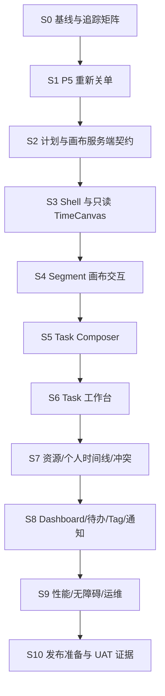

# 项目管理系统 v2.1 重构与前端 v1.0 执行总计划

## 1. 文档定位

本目录是 `management_system` 项目管理模块的可执行重构计划。它基于：

- 设计基线：《项目管理系统设计 v2.1》（25 页，2026-07-26）。
- 代码基线：当前工作树和实际测试；2026-07-28 清理基线与各阶段 handoff 仅用于历史审计。
- 现有技术栈：Next.js 16、React 19、TypeScript、Prisma 7、PostgreSQL、Auth.js、飞书、通知 outbox、Playwright。
- 前端 UX 基线：`project-management-frontend-design-v1.0/README.md` 与 01 至 12。
- 当前仓库状态：P0、P1、P2/P3 服务端主体已实现；`345b5b0` 已加入首批 `/progress` 卡片/列表页面和真实项目管理 notification channel adapter；采购、反馈、共享身份、附件和统一飞书通知基础设施继续运行。

本计划只定义重构实施，不代表这些功能已经实现。执行时每个阶段必须以实际合并的代码、迁移、测试和更新后的正式文档为准。

### 1.1 状态口径与提交时序

- **已实现**：当前代码存在，并有当前提交上的验证证据。
- **计划**：目标已经冻结，但尚未完成代码、测试和独立审查门禁。
- **延期**：明确不进入本轮 S0–S10，不能用临时客户端逻辑变相实现。

P5 handoff `handoffs/2026-07-29-p5-resource-segment-conflict-server-closure.md` 由 `2499952` 记录，描述的是实现提交 `e0317cc` 的时点。其“`/progress` 为占位页”“adapter 未启用”是历史事实；后续 `345b5b0` 已落地 adapter 和首批 UI。该 UI 仍只是基线接入：统一 `TimeCanvas`/`TimeAgenda`、Task Composer、个人时间线、待我处理、Tag 管理以及前端 v1.0 的 Task/资源/首页完成态均为**计划**。

### 1.2 冲突时的来源优先级

1. 当前代码、schema、migration 和实际测试。
2. P0 ADR、`15-P0规则冻结与安全基线关单.md`、D-001 至 D-013。
3. 阶段 handoff；与后续提交冲突时以后续实现为准。
4. `project-management-frontend-design-v1.0/README.md` 与 01 至 12，作为新版前端 UX 基线。
5. 本目录 00 至 14，作为领域、权限、测试和发布门禁。
6. `management_plan/项目管理系统设计 v2.1.md` 仅作参考，其中 Project 已被 Task + Tag 覆盖。

正式决策见 [项目管理前端 v1.0 执行基线 ADR](../adr/2026-07-30-project-management-frontend-v1-execution-baseline.md)。

## 2. 已确认的产品决策

业务负责人已于 2026-07-26 确认：

1. v2.1 全面替代现有项目管理业务。旧立项审批、ProjectStage、任务创建/删除/DDL 审批、周报等不再保留为可运行功能。
2. 目标模型不保留 Project 实体。所有执行对象统一为 Task，原 Project 概念只通过 Tag 表达。
3. 首发只支持飞书身份；通知只实现站内和飞书。邮箱账号、密码登录与邮件通知不进入本期。
4. 不需要旧项目管理功能的运行时向后兼容：不保留旧 UI，不双写旧表，不提供旧流程回退。
5. 采购报销业务不重构；共享身份、角色、附件和通知基础设施的改动必须保证采购继续运行。
6. 旧项目管理数据已在重构前直接删除；v2.1 从空项目管理数据集建设，不执行旧 Project/Task 到新 Task 的转换。

“无需向后兼容”指不保留旧功能、旧数据结构或历史数据转换。新 schema 只需兼容仍在运行的采购、反馈和共享基础设施。

## 3. 目标结果

重构完成后应具备：

- 所有业务计划统一为 Task；Task 通过 Tag 分类，不存在 Project 从属关系。
- 每个 Task 有唯一当前 Plan Version；历史版本不可直接修改。
- 每个 Plan Version 是一条有序、无分支、无循环的 Node 链。
- Task 计划修改统一通过 Revision 生效，旧计划可完整回放和比较。
- Milestone 通过多次可追溯 Review 推进，时间到达不自动完成。
- Termination 明确记录成功、失败、取消或超时。
- Person 的计划与实际投入由 Work Segment 表达，不直接推动 Task。
- 资源冲突可识别、解释和人工处理，但系统不擅自移动计划。
- 身份、对象成员关系、系统角色和状态共同决定权限。
- 所有关键状态变化、修订、验收、人员安排和权限变化可审计。
- schema 发布在维护窗口可停止；失败时可整库恢复，且不破坏采购模块。

## 4. 文档导航

| 文件 | 用途 | 主要负责人 |
|---|---|---|
| [00-目标范围与验收标准.md](./00-目标范围与验收标准.md) | 确认边界、原则、成功标准 | 产品负责人、技术负责人 |
| [01-仓库现状与差距分析.md](./01-仓库现状与差距分析.md) | 现有实现与 v2.1 差距 | 技术负责人、后端 |
| [02-目标架构与模块边界.md](./02-目标架构与模块边界.md) | 代码结构、事务、删除边界 | 技术负责人 |
| [03-领域规则与状态机.md](./03-领域规则与状态机.md) | 业务不变量与操作语义 | 产品负责人、后端、测试 |
| [04-数据库设计与迁移映射.md](./04-数据库设计与迁移映射.md) | 表、约束、索引、共享身份兼容 | 后端、DBA |
| [05-服务端操作与接口计划.md](./05-服务端操作与接口计划.md) | Server Actions、校验、幂等 | 后端 |
| [06-界面信息架构与交互计划.md](./06-界面信息架构与交互计划.md) | 页面、交互、响应式、无障碍 | 前端、产品、测试 |
| [07-身份权限与审计计划.md](./07-身份权限与审计计划.md) | Account/Person、授权矩阵、审计 | 后端、安全审查 |
| [08-通知定时任务与外部集成.md](./08-通知定时任务与外部集成.md) | 飞书、站内、cron/outbox | 后端、运维 |
| [09-数据迁移发布与回滚.md](./09-数据迁移发布与回滚.md) | 新 schema 发布、验证与回滚 | 技术负责人、DBA、运维 |
| [10-测试策略与验收用例.md](./10-测试策略与验收用例.md) | 自动化、UAT、性能、安全、门禁 | 测试负责人 |
| [11-实施阶段与团队分工.md](./11-实施阶段与团队分工.md) | 阶段、工期、RACI、依赖 | 项目经理、技术负责人 |
| [12-可执行任务清单WBS.md](./12-可执行任务清单WBS.md) | 逐项开发、测试和交付清单 | 全体执行人员 |
| [13-风险依赖与待确认决策.md](./13-风险依赖与待确认决策.md) | 风险登记、阻塞决策 | 业务负责人、技术负责人 |
| [14-需求追踪矩阵.md](./14-需求追踪矩阵.md) | 设计要求到代码和测试的映射 | 产品、测试 |
| [15-P0规则冻结与安全基线关单.md](./15-P0规则冻结与安全基线关单.md) | P0 决策、共享基线和关闭证据 | 技术负责人、测试负责人 |
| [project-management-frontend-design-v1.0/README.md](./project-management-frontend-design-v1.0/README.md) | 新版前端 UX、TimeCanvas 和页面详细设计 | 产品、前端、后端、测试 |
| [前端 v1.0 执行基线 ADR](../adr/2026-07-30-project-management-frontend-v1-execution-baseline.md) | 冻结前端冲突决策、延期项和 S0–S10 关单口径 | BO、TL、QA、SEC |

## 5. 当前执行顺序

原 P0–P8 继续表示领域建设阶段和历史 WBS；S0–S10 是当前剩余工作的执行与关单顺序，不能把二者的状态混为一谈。详细阶段映射见 `11-实施阶段与团队分工.md`，任务卡见 `12-可执行任务清单WBS.md`，需求映射见 `14-需求追踪矩阵.md`。

推荐完整团队为 1 名产品负责人、1 名技术负责人、2 名后端、2 名前端、1 名测试、0.5 名 DBA/运维、0.5 名安全/代码审查。原 8-11 周与单人 18-25 周是重构初始估算，不是 S0–S10 的重新承诺；当前排期必须基于剩余工作和实际团队重新估算。

## 6. 执行纪律

- 每个业务操作先定义状态前置条件、授权、事务边界、审计和通知，再写 UI。
- 所有新写操作必须支持重复提交保护；重要操作使用 `expectedVersion` 或等价乐观锁。
- 不编辑已应用 migration；所有 schema 变化新增 migration。
- 旧流程及其 UI、action、权限分支、提醒、测试和数据已经清理；不得重新引入兼容适配层或旧数据导入器。
- 新 Task、Tag、Plan 和人员数据从空项目管理数据集创建，不增加 `legacySource*` 字段或 Project/Task 映射表。
- 自动化测试禁止发送真实飞书。
- 每个阶段完成后执行自审、独立代码审查、回归和文档更新。
- 采购模块必须通过原有回归测试，作为共享基础设施改造的硬门禁。
