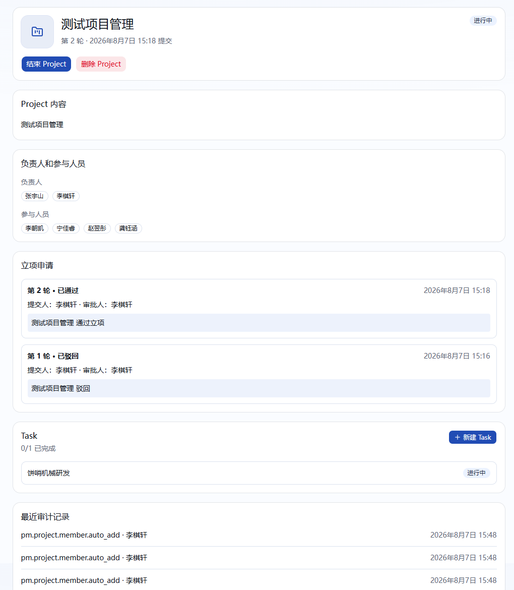
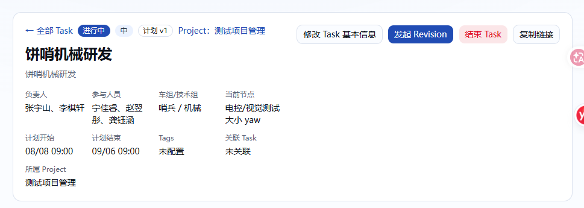
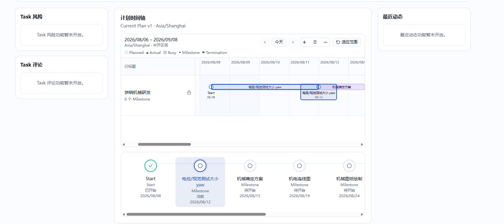
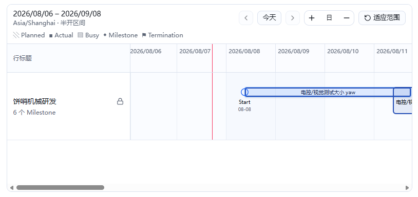

# Project 详情页 UI v2 计划

> 状态：产品决策已确认，可据此实施。
>
> 更新时间：2026-08-07。
>
> 本文只调整 `/progress/projects/[id]` 的详情页。目录名沿用现有
> `docs/plan/add-project/`，不代表本轮修改 Project 创建页。

## 1. 背景与目标

当前 Project 详情页按“概要、Project 内容、成员、立项申请、Task、最近审计记录”纵向
堆叠，页面较长，且和现有 Task 详情页的阅读方式不一致：

本轮将 Project 详情页改为与 Task 详情页一致的两段式工作台：

1. 第一段是 Project 概览，集中展示基本信息和当前用户可执行的操作；
2. 第二段是三列工作区，中间展示所属 Task 及其 Current Plan 时间线，左侧和右侧保留
   后续能力的占位卡片。

目标是改变信息组织和操作位置，不改变 Project/Task 的业务状态机、权限、并发控制、
审计、站内通知或 notification outbox 语义。

## 2. 已确认范围

### 2.1 本轮包含

- 重做 `/progress/projects/[id]` 的详情布局；
- 把 Project 基本信息合并到第一段；
- 把 Project 操作集中到第一段右上角，视觉和响应式行为参考 Task 详情；
- 把 Task 列表和 Task 时间线放入第二段中间列，列表在上、时间线在下；
- 第二段左列显示“Project 风险”和“Project 评论”占位卡片；
- 第二段右列显示“最近动态”占位卡片，其未来语义是 Project 与所属 Task 的合并动态；
- 从详情页删除“立项申请”历史卡片；
- 桌面端不得出现页面级横向溢出。

### 2.2 本轮不包含

- 不增加 Project 风险、评论或动态的数据模型、Server Action、通知事件或可编辑 UI；
- 不恢复 Project Stage、Project 自身计划、Project TimeCanvas、周报或旧审批角色；
- 不改变 Project 创建、驳回重提、批准、编辑、结束、删除规则；
- 不改变 Task 的计划、成员、Revision、Milestone、Terminal 或 Work Segment；
- 不修改 Prisma schema 或 migration；
- 不删除立项申请、领域审计或通知历史的数据库记录；
- 不把 Project 成员身份转换成 Task 写权限。

## 3. 现状约束

实现必须以当前分支为准，并特别保留下列行为：

- 所有已登录统一账号均可读取未删除 Project 详情；
- Project Owner 和全局管理员按现有授权编辑、结束或删除 Project；
- `DRAFT` Project 的原申请人、Owner 或全局管理员可以修改并重新提交；
- 只有两类全局管理员可以审批待立项 Project；
- 空 Project 可以结束；非空 Project 只有在所有未删除 Task 都为 `COMPLETED` 时才能结束；
- 删除 Project 只会软删除 Project 并解除 Task 归属，不删除 Task；
- 所有 mutation 继续使用服务端校验、事务锁和 `expectedLockVersion`；
- 状态变更继续原子写入领域审计、站内通知和相应 outbox；
- Task 列表当前采用稳定游标分页，默认每页最多 50 条；本轮按已确认决策调整为 25 条；
- 一个 Task 的时间线来自该 Task 的 Current Plan。Project 本身没有计划，因此不能生成
  独立的 Project 计划轨道。

## 4. 页面信息架构

### 4.1 第一段：Project 概览

参考 Task 详情的首段结构：

确定结构如下：

- 左上：保留“← 全部 Project”和 Project 状态；
- 主体：头像、Project 名称和完整内容，长文本保留换行并安全折行；
- 信息网格只显示负责人、参与人员和 Task 完成进度；
- 不显示申请人、最后审批人、审批时间、最后更新时间、开始时间、结束时间、立项轮次或
  提交时间；
- 右上按当前用户权限显示编辑/修改并重提、通过、驳回、结束、删除和复制链接；
- “新建 Task”保留在第二段 Task 列表标题右侧；
- 审批意见、操作错误和并发冲突必须在本段内可见，不得只依赖 toast；
- 审批意见输入紧邻通过/驳回操作；
- 停用成员继续显示“已停用”，长姓名和大量成员允许自然换行；
- 只读用户仍能看到完整概览，但看不到无权限操作。

详情页继续保留全局 `PageCommandBar`，但只显示“Project 详情”一类的页面上下文，不重复
Project 名称、状态或操作；名称和全部操作只在第一段出现。

### 4.2 第二段：三列工作区

桌面端参考 Task 详情使用
`300px / minmax(0, 1fr) / 300px` 三列结构：

- 左列：从上到下为“Project 风险”“Project 评论”占位卡片；
- 中列：上方为 Task 列表，下方为所属 Task 的计划时间线；
- 右列：“最近动态”占位卡片；
- 三个占位区只显示“功能暂未开放”，本轮不读取或拼装业务数据；
- 中列和所有子项必须设置正确的 `min-width: 0`，长 Task 名称不得撑宽页面；
- 本轮不设计专门的移动端布局或移动端时间线替代方案，也不把移动端效果列为专项验收项。

## 5. Task 列表

现有样式如下：

本轮保留以下能力：

- 以每页 25 条显示 Project 下全部未删除 Task，并继续区分
  `DRAFT/ACTIVE/COMPLETED/FAILED/CANCELLED/TIMEOUT/ARCHIVED`；
- 每项至少显示 Task 名称和状态；点击名称进入 `/progress/tasks/[id]`，另设具有可访问名称
  的“在时间线中定位”按钮；
- Project 为 `ACTIVE` 时，有权创建 Task 的用户仍可从本区进入新建页，并自动携带
  `projectId`；
- 空列表显示明确空状态；
- 保留稳定游标分页，不在固定数量后静默截断；
- 保留 `已完成数 / Task 总数`，计数使用完整 Project 数据而不是当前页长度；
- 超长名称、缺少描述、多状态和 25 条密集列表都不能产生横向溢出。

Task 按以下状态组排序：

1. 草稿：`DRAFT`；
2. 进行中：`ACTIVE`；
3. 已完成/已结束：`COMPLETED/FAILED/CANCELLED/TIMEOUT/ARCHIVED`。

同一状态组内继续按 `updatedAt desc, id asc` 排序，保证最近更新优先和游标稳定。第三组
中的各终态不再细分先后。

## 6. Task 时间线

视觉和交互基于现有只读 `TimeCanvas`，不另外实现一套时间轴：

时间线只展示各 Task 的 Current Plan：

- Start 优先使用 `currentPlanVersion.plannedStartAt`，未设置时沿用 Task 详情的
  `task.createdAt` 回退规则；
- Milestone 使用 `expectedCompletedAt`；
- Revision 使用 `revisionAt`；
- Terminal 使用 `plannedAt`；
- 继续使用 `Asia/Shanghai`；
- 时间线在 Project 详情中只读，不提供拖动、修改、Segment、Actual 或 Busy；
- 时间线同时展示当前 Task 列表页的最多 25 个 Task，每个 Task 占一行；Task 列表翻页后，
  时间线随当前页一起变化；
- 列表中的“在时间线中定位”负责把对应 Task 行滚动到画布可视区域并显示选中反馈，不改变
  页面路由；Task 名称仍负责打开详情；
- Task 或节点的选择行为必须有明确的键盘焦点和可访问名称；
- 没有 Task、Task 没有可展示时间点、数据超出安全上限和查询失败时分别显示明确状态；
- 不允许静默丢弃 Task 或节点。

所有未删除 Task 都进入时间线，包括草稿和所有终态。当前通用 TimeCanvas 只支持
`TASK_SCOPED/PERSONAL/DASHBOARD`，没有 Project scope，因此在已经校验 Project 可见性的
详情查询中读取当前页 Task 的 Current Plan，并组装 Project 详情专用的只读 model；不为
通用查询增加 `PROJECT_SCOPED`，也不允许客户端提交任意 `taskIds`。每页 25 个 Task 可使
最坏情况下 25 × 200 个节点仍不超过现有 5,000 节点上限；任何超限或数据异常都必须显式
报错，不能静默截断。

本轮不为移动端提供纵向节点导航或摘要卡，沿用同一只读 TimeCanvas，不做移动端专项调整。

## 7. 立项、审计与待办入口

“删除项目立项部分”确定为删除详情页上的“立项申请历史”卡片，不删除立项业务：

- `PENDING_APPROVAL` Project 仍必须提供通过、驳回和审批意见输入；
- `DRAFT` Project 仍必须提供“修改并重新提交”；
- 待办和通知当前链接到 `/progress/projects/[id]#establishment`，新概览段必须保留
  `id="establishment"` 锚点，使既有深链定位到审批操作；
- 概览不显示立项轮次；这是基本信息字段决策对“保留立项概要”的明确收窄；
- 立项轮次、申请人、审批人、意见和快照继续持久化；
- 原有稳定游标查询能力可保留给领域测试或未来记录入口，但详情页不再展示历史列表；
- 当前“最近审计记录”卡片也不继续出现在新布局中；右侧“最近动态”本轮只是占位，不能
  把 raw audit action 当作面向用户的动态文案。

## 8. 组件与数据改造

预计涉及以下文件，实际实现时以最小改动为准：

- `app/progress/projects/[id]/page.tsx`
  - 保留服务端鉴权和 404 语义；
  - 装配概览、Task 当前页及时间线所需数据；
  - 不再根据 URL 渲染立项历史和 raw 审计列表。
- `components/project-management/project-actions-client.tsx`
  - 将审批、结束、删除等操作适配到概览右上角；
  - 保留确认弹窗、禁用态、中文错误、刷新/跳转和版本冲突处理。
- 新增一个聚焦 Project 详情的 Client Component（名称在实现时按仓库约定确定）
  - 管理 Task 行定位、只读 TimeCanvas model 和复制链接等纯交互状态；
  - 不直接访问 Prisma，不复制服务端权限判断。
- `lib/project-management/queries/project-queries.ts`
  - 将详情 Task 页大小调整为 25，并在已校验 Project 可见性的查询中返回当前页 Task 的
    Current Plan 数据；
  - 保留完整 Task 总数、完成数、结束阻塞项和稳定分页语义；
  - 使用“草稿 → 进行中 → 所有终态”的稳定排序和相匹配的游标；
  - 对 Task/节点数量设置显式上限和错误，不静默截断。
- `tests/project-establishment.spec.ts`（或拆分 Project 详情专项 spec）
  - 增加桌面端 Project 详情 UI 回归测试；
  - 保留领域层权限、状态、审计和 outbox 断言。

本轮不修改 Prisma、Server Action 输入、mutation service 和通知事件定义。

## 9. UI 与可访问性验收

### 9.1 Desktop `1440x1000`

- 第一段信息和操作位于同一卡片，操作靠右且能在窄内容下换行；
- 第二段为左/中/右三列，中列获得剩余宽度；
- Task 列表位于时间线上方；
- TimeCanvas 的工具栏、行标题、节点和内部滚动不撑宽页面；
- 长 Project 名称、8,000 字符内容、长成员名、25 条 Task 和多状态 Badge 均不产生
  页面级横向溢出。

移动端不在本轮设计和专项验收范围内。

### 9.2 状态与权限

- 空 Project、无时间点、长名称、停用成员和查询失败均有明确显示；
- 普通只读用户无操作按钮；
- Owner、原申请人和两类全局管理员只看到现有授权允许的操作；
- `DRAFT/PENDING_APPROVAL/ACTIVE/COMPLETED` 四种 Project 状态均正确；
- 结束阻塞弹窗继续列出有界阻塞 Task，空 Project 可以确认结束；
- mutation 期间按钮禁用，错误留在可见区域，并发冲突不能被旧 lockVersion 覆盖。

## 10. 定向测试计划

按照当前任务约定，只执行与本次 UI 改造相关的定向验证：

1. 对改动的 TS/TSX 文件运行 ESLint；
2. 在 Playwright Desktop 项目运行 Project 详情专项用例；
3. 验证只读、Owner、原申请人、Project Admin、Super Admin 的按钮可见性；
4. 验证审批、驳回、编辑/重提、结束、删除仍调用原 mutation，并检查数据库状态、
   lockVersion、审计、站内通知和 outbox；
5. 验证 Task 点击、新建 Task、稳定分页及时间线与 Current Plan 一致；
6. 验证空数据、长文本、25 条 Task、状态分组排序、节点上限错误和桌面端无横向溢出；
7. 验证页面不再显示“立项申请”和“最近审计记录”，但 `#establishment` 深链仍能定位到
   待审批操作；
8. 自动化测试继续使用隔离 PostgreSQL、受控 Playwright server 和
   `NOTIFICATION_DELIVERY_DISABLED`，禁止真实飞书投递。

若隔离测试数据库环境不可用，必须报告未执行的准确命令、原因、替代验证和剩余风险，
不得绕过数据库或通知安全门禁。

## 11. 决策记录

| 编号 | 已确认结论 |
|---|---|
| D1 | 时间线展示当前 Task 列表页，列表与时间线统一为每页最多 25 条并同步翻页。 |
| D2 | 所有未删除 Task 都进入时间线，包括草稿和所有终态。 |
| D3 | Task 名称打开详情，另设“在时间线中定位”按钮。 |
| D4 | 本轮不考虑移动端，不设计移动端替代时间线或专项验收。 |
| D5 | 采用第一段操作布局建议；新建 Task 留在 Task 列表标题右侧。 |
| D6 | 只删除立项历史卡片，保留审批、驳回、重提和 `#establishment` 深链；按 D7 不展示立项轮次概要。 |
| D7 | 概览只显示头像、名称、完整内容、状态、负责人、参与人和 Task 完成进度。 |
| D8 | 按“草稿 → 进行中 → 已完成/已结束”分组；所有终态属于第三组，组内最近更新优先。 |
| D9 | 保留 PageCommandBar 作为页面上下文，Project 名称和操作只在第一段显示。 |
