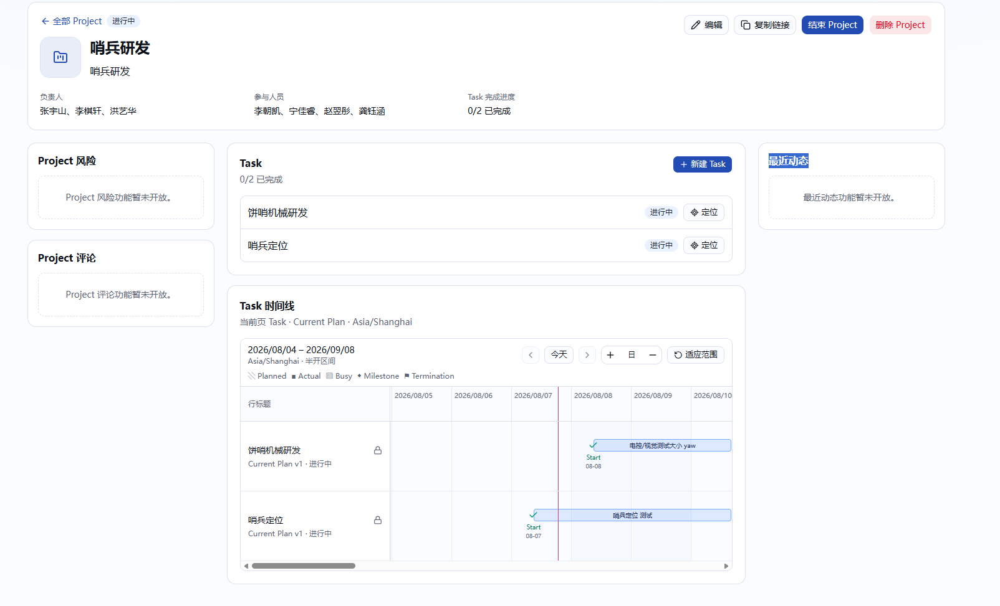
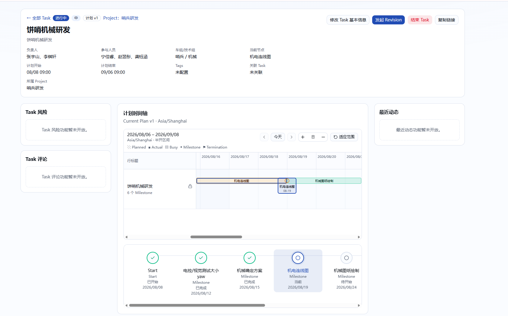
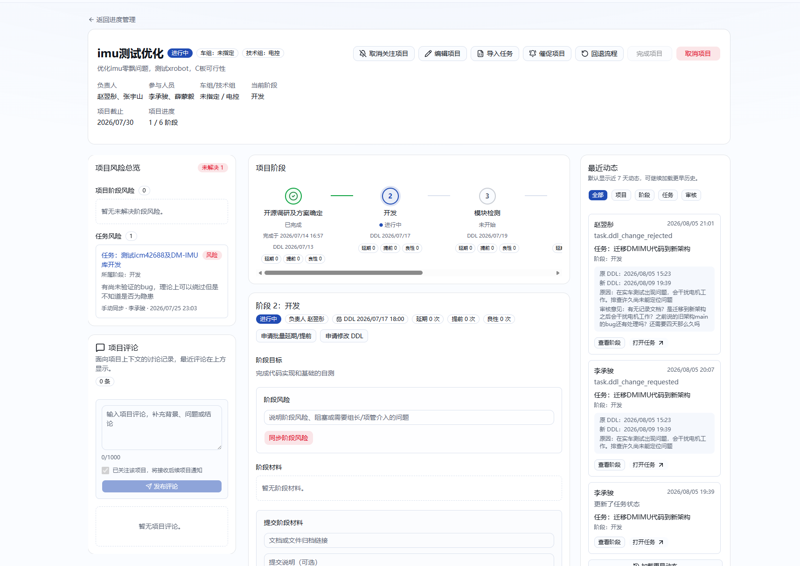
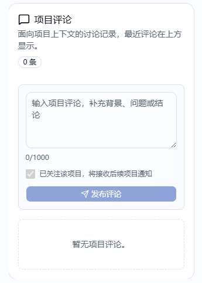

# Comment、Risk 与近期动态实施计划

> 状态：功能已实施；Prisma schema 校验、近期动态纯映射回归、定向静态检查和生产构建已通过。
> 隔离 PostgreSQL migration 部署及 Desktop Playwright 定向验收因当前环境未设置
> `PLAYWRIGHT_DATABASE_URL` 暂待执行，未使用开发或生产数据库绕过安全门禁。
>
> 更新时间：2026-08-07。
>
> 本文覆盖 `/progress/projects/[id]` 与 `/progress/tasks/[id]`。`main` 分支只作为信息架构和
> 交互参考；实现必须使用当前分支的统一 `Account/Person`、Project/Task、领域审计、站内
> 通知和 `project-management` notification outbox，不恢复旧 Project Stage、旧 `openId`
> 授权或旧 `ProgressActivityLog`。

## 1. 背景与目标

当前 Project 和 Task 详情页已经为风险、评论和近期动态预留位置，但仍是“功能暂未开放”
占位：

期望参考 `main` 分支旧 Project 详情的三列工作台：左侧集中展示风险与评论，中间保留对象
本身的主要工作区及风险录入，右侧展示可读的近期动态：

本轮目标是：

1. 正式启用 Project/Task 风险，支持提出、汇总查看和解决；
2. 正式启用评论，支持在对象上下文中讨论并按权限删除；
3. 将已有领域审计转换成面向用户的中文近期动态，不暴露内部 action、字段名或 ID；
4. 所有 mutation 继续执行服务端鉴权、输入校验、事务和领域审计；需要通知的事件同时执行
   站内通知、outbox 幂等和飞书禁发保护；
5. 完成桌面端 `1440x1000` 的交互、长内容和无横向溢出验收；本轮按已确认决策不设计、
   修改或专项验收移动端。

## 2. 术语与已经确认的产品要求

本文统一使用以下定义：

- **全局管理员**：全局 `SUPER_ADMINISTRATOR` + 全局 `PROJECT_ADMINISTRATOR`。本文后续的
  “超管”均按这一定义，不包含带车组或技术组范围的采购报销角色；
- **Project 相关人员**：全局管理员 + Project 有效负责人 + Project 有效参与人；
- **Task 相关人员**：全局管理员 + Task 有效负责人 + Task 有效参与人；
- **提出风险**：创建一条未解决风险；
- **解决风险**：保留原风险记录，并记录解决人、解决说明和解决时间，不物理删除风险。

已经确认的要求如下：

- 风险只能直接绑定一个 Project 或一个 Task，不绑定 Milestone、Revision、Terminal、计划
  版本或 Work Segment；
- Project/Task 负责人、参与人和全局管理员可以提出及解决对应对象的风险；
- Project 风险区同时展示 Project 自身风险和当前所属 Task 的风险，并明确区分来源；
- Project 评论区只展示 Project 自身评论，不混入 Task 评论；
- 所有已登录用户都可以评论；只有全局管理员可以删除评论；
- 风险和评论需要通知对应相关人员；
- Task 近期动态需要使用明确中文展示 Task 自身动态；
- Project 近期动态包含 Project 自身动态和所属 Task 的全部用户可读动态；
- 提出风险的输入区放在 Project/Task 第二段中栏的末尾；
- 解决风险从左侧风险列表发起，点击风险项的解决操作后弹出对话框，填写一行解决说明；
- 页面交互和视觉层级参考 `main`，但不复制 `main` 中已经退役的阶段、关注、权限和数据
  模型。

## 3. `main` 参考实现与当前架构差异

### 3.1 可借鉴部分

- Project 桌面三列结构：左侧风险/评论、中间业务主区、右侧近期动态；
- 风险允许保留完整历史，未解决与已解决记录具有不同视觉状态；
- 风险解决必须填写说明；评论显示作者、时间、正文和有权限时的删除入口；
- 动态按时间倒序、支持类型筛选和加载更早记录；
- 长文本使用 `whitespace-pre-wrap` 与 `break-words`，固定侧栏不会被长内容撑宽；
- mutation 成功后刷新当前页面，失败时保留输入并显示中文错误。

### 3.2 不可复制部分

- `main` 的 Project 风险只是 Project Stage 风险与 Task 风险聚合；当前没有 Project Stage，
  因此必须增加真正的 Project 风险；
- `main` 只有 Project 评论，没有 Task 评论实现；
- `main` 使用 `openId`、旧 `UserRole`、实体关注偏好和 `ProgressActivityLog`，这些都不是
  当前项目管理域的事实来源；
- 当前应使用稳定的 `accountId/personId`，飞书 `openId` 只在通知投递边界解析；
- 当前审计事实来源是 `DomainAuditEvent`。不得另建一套与领域审计并行、需要每个 mutation
  重复维护的 activity log；
- 当前 Project 每页只装配 25 个 Task，动态目标名称不能依赖当前页 Task DTO 在客户端反查；
- 当前通知同时包含站内通知和飞书 outbox，必须使用现有 notification contract、分类偏好、
  recipient 明细和幂等事件键。

## 4. 功能范围与非目标

### 4.1 本轮包含

- Project 风险创建、列表、汇总、解决和历史；
- Task 风险创建、列表、解决和历史；
- 已确认范围内的 Project/Task 评论；
- 评论软删除及删除审计；
- Project/Task 近期动态中文格式化、筛选与稳定分页；
- Project 近期动态聚合已确认范围内的 Task 动态；
- 风险、评论相关站内通知和飞书通知；
- Prisma schema 与安全 migration；
- 权限、状态、并发、审计、outbox、桌面端 UI 和长内容的定向自动化测试；
- README、TECH、TESTING 和 NOTIFICATIONS 文档更新。

### 4.2 明确不包含

- 恢复 Project Stage 或将风险绑定到计划节点；
- 风险等级、概率、影响矩阵、负责人、截止时间、附件、标签或审批流；
- 评论回复树、@ 提及、富文本、附件、表情、置顶或编辑历史；
- 用近期动态替代完整领域审计历史；
- 把内部 `before/after` JSON 原样返回浏览器；
- 让报销角色参与本项目管理域的权限判断；
- 绕过通知偏好、禁发开关、收件人 allowlist 或 outbox；
- 为旧 `main` 风险、评论或 activity 表编写迁移兼容层。

## 5. 已确认的数据模型

采用两张多目标表：`RiskRecord` 和 `Comment`。两张表都使用可空 `projectId/taskId`，由数据库
检查约束保证恰好一个目标非空；不拆成四张 Project/Task 分表，也不使用无外键的
`targetType + targetId`。

### 5.1 `RiskRecord`

至少包含：

- `id`：稳定 UUID；
- `projectId/taskId`：二选一目标，分别关联现有 Project/Task；
- `content`：trim 后 1–2,000 字纯文本；
- `status`：新枚举 `ACTIVE/RESOLVED`；
- 创建人 `createdByAccountId/createdByName`、可空 `createdByPersonId` 与 `createdAt`；
- 解决人 `resolvedByAccountId/resolvedByName`、可空 `resolvedByPersonId`、1–500 字单行
  `resolveNote` 与 `resolvedAt`；
- `updatedAt`。

风险记录是唯一事实来源；同一 Project/Task 可以同时存在多条 `ACTIVE`。不在 Project/Task
上增加 `riskNote` 或计数快照，未解决数量直接查询风险表。风险不支持编辑、删除或重新打开；
修正错误时解决原风险并重新提出。

migration 增加并验证：

- `projectId/taskId` 恰好一项非空的 XOR 检查约束；
- `ACTIVE` 时解决字段均为空、`RESOLVED` 时解决人/说明/时间完整的一致性约束；
- `(projectId, status, createdAt, id)` 与 `(taskId, status, createdAt, id)` 查询索引；
- 创建人、解决人的 Account/Person 外键与审计所需索引；Account 必填，Person 可空，以支持
  没有关联 Person 的全局管理员，同时用姓名快照保留可解释历史。

### 5.2 `Comment`

至少包含：

- `id`：稳定 UUID；
- `projectId/taskId`：二选一目标；
- `authorAccountId/authorName` 与可空 `authorPersonId`；
- `content`：trim 后 1–1,000 字纯文本；
- `deletedAt/deletedByAccountId/deletedByName` 与可空 `deletedByPersonId` 软删除信息；
- `createdAt/updatedAt`。

Project 和 Task 评论使用同一模型，但查询严格按唯一目标隔离。评论不支持编辑、回复、恢复或
作者自行删除。发布时姓名快照保证 Person 停用或身份变化后仍可解释历史；查询可额外返回当前
Person 状态以显示“已停用”。

migration 增加 `projectId/taskId` XOR 检查约束、删除状态与删除人字段一致性约束，以及
`(projectId, deletedAt, createdAt, id)`、`(taskId, deletedAt, createdAt, id)` 索引。评论作者和
删除人的 Account 必填，Person 可空，以支持没有关联 Person 的已登录账号。

### 5.3 删除与兼容策略

- Project/Task 软删除时不物理删除其风险、评论；目标页面不可读后这些记录也不可从普通接口
  单独读取；
- 外键使用 `Restrict`，不引入级联硬删除；
- 本轮不迁移 `main` 旧表，也不为旧模型添加兼容 API；
- 所有表、枚举、外键、索引和检查约束通过新 migration 添加，不编辑已有 migration；
- Prisma schema 无法表达的检查约束在 migration SQL 中显式添加，并在隔离 PostgreSQL 中验证。

## 6. 服务端权限与状态边界

在 `PROJECT_MANAGEMENT_ACTIONS` 和统一授权层增加：

- `project.risk.create`、`project.risk.resolve`；
- `task.risk.create`、`task.risk.resolve`；
- `project.comment.create`、`task.comment.create`；
- `project.comment.delete`、`task.comment.delete`。

权限矩阵如下：

| 操作 | 允许用户 | 状态限制 |
|---|---|---|
| 读取风险/评论/动态 | 所有已登录用户 | 目标未软删除且可读取 |
| 提出 Project 风险 | Project 负责人、参与人、全局管理员 | 仅 `ACTIVE` Project |
| 解决 Project 风险 | Project 负责人、参与人、全局管理员 | 风险为 `ACTIVE`；Project 可为 ACTIVE 或终态 |
| 提出 Task 风险 | Task 负责人、参与人、全局管理员 | 仅 `ACTIVE` Task，且所属 Project 状态不额外授予权限 |
| 解决 Task 风险 | Task 负责人、参与人、全局管理员 | 风险为 `ACTIVE`；Task 可为 ACTIVE 或任一终态 |
| 发布 Project/Task 评论 | 所有已登录用户 | 任一未软删除状态，包括待审批、DRAFT 和终态 |
| 删除 Project/Task 评论 | 仅两类全局管理员 | 评论尚未删除，目标仍可读取 |

Project 成员不会仅因为 Task 属于该 Project 就获得 Task 风险写权限；只有同时是 Task 成员或
全局管理员时才可以操作。UI capability 由服务端返回，不能在客户端重新推导。

每个 mutation Server Action 必须：

1. 用 Zod 校验 UUID、目标二选一、正文、解决说明、筛选和游标；
2. 获取并在事务内刷新 actor，避免已撤销成员或角色继续操作；
3. 查询未删除目标并构造当前授权资源；
4. 在服务端执行权限与状态检查；
5. 在一个事务中写业务记录与 `DomainAuditEvent`；风险提出、风险解决和评论发布同时写站内
   通知及 outbox，评论删除不创建通知；
6. 使用稳定 event key 保证通知重试不重复；
7. revalidate 对应 Project/Task、通知入口和动态版本；
8. 返回结构化中文错误，不暴露 Prisma、原始 Zod 输出或内部 ID。

评论、风险、动态和版本 token 的只读 Server Action 也必须校验输入并重新执行目标可见权限，
但不得产生审计、通知或其他外部副作用。

## 7. 风险业务流程

### 7.1 创建风险

Project 和 Task 中栏末尾增加“提出风险”卡片，仅对当前状态和 capability 允许的用户显示：

- 多行纯文本输入，实时显示 `0/2000`；
- 空内容、超长、请求中时禁止提交；
- 错误显示在卡片内并保留输入，不只依赖 toast；
- 成功后清空输入、toast，并刷新风险、动态和版本 token；
- 一个请求只创建一条 `ACTIVE`，不覆盖或解决其他风险。

事务写入风险、`pm.project.risk.create` 或 `pm.task.risk.create` 审计、站内通知和 outbox。

### 7.2 风险总览

左侧默认只突出未解决风险，已解决历史折叠后按稳定游标每次加载 20 条：

- Project 自身风险与当前仍属于 Project 且未删除的 Task 风险必须分成两个区块并分别计数；
- Task 页面只显示该 Task 风险；
- 每个风险区块的未解决列表首屏 20 条、每次再加载 20 条，默认展开；已解决历史使用独立
  count 和独立游标，默认折叠；两者均按 `createdAt desc, id desc` 稳定排序；
- Project 下的 Task 风险显示 Task 名称并提供打开 Task 的入口；
- Task 移出、移动或软删除后，不再出现在原 Project 风险总览；归属变化仍保留在审计和动态；
- 风险项展示完整正文、提出人和时间；已解决项增加解决人、时间和说明；
- 只有对风险直接目标有解决 capability 的用户才看到“解决风险”；
- 空状态区分“当前无未解决风险”和“从未记录风险”；
- 未解决和已解决记录均不静默截断；加载更多按 ID 合并去重，并明确显示加载失败和无更多状态。

### 7.3 解决风险

点击“解决风险”打开 Dialog：

- 显示完整风险正文和所属 Project/Task；
- 单行解决说明 trim 后 1–500 字；
- 提交期间禁用关闭和重复提交；
- 服务端使用条件更新或行锁，只允许 `ACTIVE -> RESOLVED`；
- 并发重复解决返回“该风险已被解决，请刷新后查看”；
- 成功后关闭 Dialog、toast，并刷新风险和动态；
- 终态对象只允许解决既有风险，不能提出新风险；
- 不允许客户端指定状态、解决人或解决时间。

## 8. 评论业务流程

Project 和 Task 都正式启用评论，交互参考目标图，但不显示 `main` 的关注复选框：

### 8.1 发布评论

- 所有已登录用户都可在任一未删除状态发布；
- 评论是纯文本，trim 后 1–1,000 字，显示实时计数；
- 不渲染 HTML，不接受客户端提供作者或时间；
- 空、超长或请求中时禁用提交，服务端错误保留草稿并显示在卡片内；
- 成功后清空草稿并回到最新首屏；
- 评论按 `createdAt desc, id desc` 展示作者、时间和安全换行的完整正文；
- 评论、审计、站内通知和 outbox 在同一事务提交。

Project 页面只查询 Project 评论；Task 页面只查询 Task 评论，两者不相互聚合。

### 8.2 删除评论

- 仅全局管理员显示删除入口，作者不能删除自己的评论；
- 删除前确认并显示作者和有界评论预览；
- 使用 `deletedAt is null` 条件更新处理并发重复删除；
- 删除后从普通列表移除，但保留正文、删除人、删除时间和领域审计；
- 近期动态显示“删除了 Project/Task 评论”和有界预览，不返回完整已删除正文；
- 删除评论不创建站内通知或飞书 outbox。

### 8.3 分页与刷新

- 总数使用独立 count，不把当前加载数量当成总数；
- 首屏 20 条，每次稳定游标再加载 20 条，按 ID 合并去重；
- 空、加载中、加载失败和无更多记录有不同反馈；
- 发布、删除或自动版本刷新后回到最新首屏，不跨 Server Component refresh 保留旧页；
- 本轮不增加 Project/Task 关注模型，也不显示“评论后自动关注”。

## 9. 近期动态

### 9.1 唯一事实来源与 Project 归属

近期动态只读取 `DomainAuditEvent`，不新增 `ProgressActivityLog`。风险和评论 mutation 自然写入
领域审计后进入动态。

Project 采用完整聚合方案：显示 Project 自身事件，以及事件发生时属于该 Project 的 Task
全部用户可读事件，包括成员、元数据、Tag、计划、Milestone、Revision、Terminal、风险和评论，
而不只显示 Task 状态变化。

为固化事件发生时的 Project 归属：

- 功能上线后产生的 Task 审计必须同时写入事件发生时的 `projectId`；
- 无 Project 的 Task 事件只出现在 Task 动态；
- Task 加入、移出或移动 Project 的审计使用 `before/after.projectId` 保留两端，并让受影响的
  Project 都能看到准确的中文归属变化；实现可对这类 action 使用受约束的 JSON 条件查询，
  不按 Task 当前归属改写历史；
- 既有缺少 `projectId` 的 Task 审计不回填、不进入 Project 动态，仍可在 Task 详情查看；
- Project 查询不依赖当前页 25 个 Task，也不从 Task 当前归属反推普通历史事件。

### 9.2 中文展示层

新增集中式白名单 formatter，把审计 action 转换为安全 DTO：

- 中文动作标题、操作者和时间，系统事件显示“系统”；
- Project/Task/Milestone/Revision 等可读目标名称；
- 字段级中文变化摘要，例如成员增减、状态变化、计划节点变化、风险、评论和审批意见；
- 可用时提供打开 Project、Task 或定位节点的入口；
- `PROJECT/TASK/RISK/COMMENT/REVIEW/PLAN_NODE` 分类键。

不得返回 raw `before/after`，也不得展示 UUID、hash、lockVersion、内部枚举或英文 action。
过长变化显示有界中文摘要；风险和评论本身仍在各自卡片显示完整正文。未知 action 从近期动态
隐藏，但继续保留在完整审计历史。formatter 单测必须覆盖所有核心用户可见 action，新增 action
不能退化成英文键。

映射至少覆盖：

- Project 立项提交、通过、驳回、重提、成员/信息修改、结束、删除；
- Task 创建草稿、编辑、激活、成员/Tag/元数据/计划变化、加入/移出/移动 Project、删除；
- Milestone 提交验收和审批结果；
- Revision 创建、重提、通过/驳回、取消、应用；
- Terminal 确认和 Task 终态变化；
- 风险提出/解决、评论发布/删除；
- 系统和 cron 产生的用户可理解事件。

### 9.3 服务端筛选与稳定分页

- 首屏最近 20 条，每次再加载 20 条，直到完整可见历史；不采用“近 7 天全部加载”；
- 按 `createdAt desc, id desc` 排序，游标同时包含时间和 ID；
- Project 筛选：“全部、Project、Task、风险、评论、审批”；
- Task 筛选：“全部、Task、计划节点、风险、评论、审批”；
- 筛选由服务端执行，每个筛选状态维护独立游标；不能只过滤浏览器已加载记录；
- action 白名单必须进入服务端查询或有界补页逻辑，未知 action 不得占用返回给客户端的 20 条
  配额，也不能导致错误的“没有更多”；
- Server Action 校验目标、分类和游标，并重新执行 Project/Task 可见权限；
- Task/Project 名称从审计关系或安全查询装配，不依赖已分页的页面列表；
- 空、加载中、加载失败和无更多历史有准确文案。

### 9.4 自动版本轮询

采用 `main` 风格的自动更新，但使用当前领域审计设计轻量版本 token：

- Project token 来自其最新可见审计事件的 `createdAt + id`；Task token 按 `taskId` 计算；
- 风险和评论 mutation 必须同步写审计，因此不需要另外轮询三张业务表；
- Client Component 每 5 秒检查一次；页面隐藏时暂停，恢复可见后立即检查；
- 同一时间只允许一个请求，旧请求结果不能覆盖新 token；
- token 变化时调用 `router.refresh()`，刷新后以服务端新 token 为基线；
- 自动刷新保留用户当前选择的动态筛选，但丢弃该筛选下已经加载的旧游标页，并从最新 20 条
  重新开始，避免新旧稳定游标结果混排；
- 当前用户 mutation 成功仍立即 refresh，不等待下一次轮询；
- 轮询失败不清空现有内容，只显示非阻塞状态并在下一周期重试；
- Project 下新的 Task 审计必须带 `projectId`，否则 Project token 无法变化。

## 10. 通知与外部副作用

新增事件使用当前 `project-management` channel 和通知机器人：

- 风险提出、风险解决、评论发布都创建站内通知与飞书 outbox；
- 评论删除只写审计和动态，不通知；
- 全部事件均为非 mandatory；飞书投递尊重目标对应 `PROJECT/TASK` 分类偏好；
- 站内通知沿用当前语义创建，不因 FEISHU 偏好关闭而省略；
- Project 风险/评论收件人：Project 负责人、参与人、两类全局管理员；
- Task 风险/评论收件人：Task 负责人、参与人、两类全局管理员；
- 不额外通知仅属于 Project、但不是该 Task 成员的人员；
- 当前操作人从本次事件收件人中排除；
- 停用 Person、无 Account 的 Person 不收通知；收件人按 Account 去重；
- 飞书身份在投递边界解析，不以 `openId` 作为业务外键。

通知 payload 至少包含操作人、对象类型、Project/Task 名称、动作、完整风险或评论正文、风险
解决说明和应用链接。事件 kind、payload Zod、机器人渲染、站内通知和 outbox 使用一致的事件键
与 payloadVersion；普通通知不得使用审批机器人。

自动化测试必须设置 `NOTIFICATION_DELIVERY_DISABLED`，断言站内通知、outbox、recipient、
botKind、偏好过滤和幂等键，不调用真实飞书接口。

## 11. 页面与桌面端设计

### 11.1 Project 详情

- 保留现有概览和三列工作区；
- 左列从上到下为 Project 风险总览、Project 评论；
- 中列保持 Task 列表和 Current Plan 时间线，在最末尾增加“提出 Project 风险”；
- 右列替换为 Project 近期动态；
- Project 风险总览中分组显示 Project 自身风险和所属 Task 风险；
- Project 评论只读写 Project 评论；
- 动态中的 Task 入口即使不在当前 25 条 Task 页也必须可打开。

### 11.2 Task 详情

- 保留现有概览、三列工作台、节点导航和当前节点操作；
- 左列替换为 Task 风险总览和 Task 评论；
- 中列最末尾增加“提出 Task 风险”；
- 右列替换为 Task 近期动态；
- 风险/评论交互不得改变当前节点选择、Revision、Milestone 验收或 Terminal 操作状态。

### 11.3 桌面布局与可访问性

- Desktop `1440x1000` 使用左/中/右三列，侧栏内容可独立滚动或按现有工作台行为吸顶；
- Textarea、长无空格文本、长姓名、长 Task 名和动态摘要必须折行；
- 所有输入有可关联 label，Dialog 有标题和说明，按钮有稳定可访问名称；
- mutation 期间有 loading/disabled 状态，错误使用 `role=alert`，成功使用 toast 或
  `role=status`；
- Desktop `1440x1000` 页面级 `scrollWidth` 不得超过 viewport；
- 删除、解决等破坏性或不可逆操作必须提供明确确认或结果说明。

本轮按已确认范围不设计、不修改，也不专项验收移动端布局；实施时不得为了本功能顺带重构
现有移动端 Project/Task 工作台。

## 12. 预计代码改造

实际文件名以实施时的最小改动为准，预计包括：

- `prisma/schema.prisma` 与新 migration：风险、评论、外键、检查约束和索引；
- `lib/project-management/authorization/index.ts`：风险和评论 action/capability；
- `lib/project-management/validations/`：风险、评论、动态分页输入；
- `lib/project-management/application/`：风险和评论 service、事务锁、审计和通知；
- `lib/project-management/queries/project-queries.ts`：Project 风险/评论/动态摘要及游标；
- `lib/project-management/queries/task-queries.ts` 或独立查询：Task 风险/评论摘要；
- 独立的近期动态查询、版本 token 查询和中文 formatter，避免把完整 lifecycle 查询用于侧栏
  加载更多；
- 所有新产生 Task 审计的 service：在事件上固化当时的 `projectId`；Task 加入、移出和移动
  Project 时同时保留 `before/after.projectId`，供新旧 Project 两端查询归属变化；
- `app/actions/project-management/`：风险、评论、动态加载更多和版本 token 的薄 Server Action；
- `lib/project-management/notifications/contract.ts` 与事件生成：新增通知 kind/payload；
- Project/Task 详情页及聚焦的 Risk、Comment、RecentActivity Client Components，以及共享的
  5 秒版本 token 轮询组件；
- `README.md`、`docs/TECH.md`、`docs/TESTING.md`、`docs/NOTIFICATIONS.md`；
- Project/Task 详情专项 Playwright 及 service/domain 回归测试。

不把风险、评论和动态继续堆入已经较大的 `task-workbench.tsx`；应按真实领域边界拆出聚焦
组件，但不为简单 DTO 创建无意义转发层。

## 13. 实施顺序与定向验证

### 13.1 实施阶段

1. 按已确认的数据模型创建 schema、索引、检查约束和 migration；
2. 实现风险和评论的 validation、authorization、service、query、audit 和通知；
3. 补齐新 Task 审计事件的 Project 归属，建立安全中文 formatter、服务端筛选和稳定分页；
4. 实现版本 token 查询和 5 秒轮询，再接入 Project 详情 UI 与 Task 详情 UI；
5. 增加通知、权限、并发、桌面 UI、长内容、动态筛选和自动刷新测试；
6. 更新正式文档并完成完整 diff 自查。

### 13.2 定向测试

按当前会话约定，本功能实施后只执行受影响范围的定向检查，不运行全量测试或独立子代理
审查：

- 改动文件的 ESLint 与定向 TypeScript 检查；
- Prisma schema 格式/验证及针对隔离 PostgreSQL 的新 migration 部署验证；
- 风险/评论/动态 service 或集成测试；
- Project 详情专项 Playwright：Desktop `1440x1000`；
- Task 详情专项 Playwright：Desktop `1440x1000`；
- 通知 contract/outbox 定向测试，保持 `NOTIFICATION_DELIVERY_DISABLED`；
- `git diff --check` 和完整 diff 自查。

测试至少覆盖：

- Project/Task 负责人、参与人、普通旁观者、两类全局管理员的允许和拒绝路径；
- DRAFT、PENDING_APPROVAL、ACTIVE 和终态对象；
- 多个同时未解决风险、并发重复解决、解决说明校验；
- 评论发布、仅管理员删除、并发重复删除、空结果和多页评论；
- Project 自身风险与所属 Task 风险分组，Task 移入/移出后的展示；
- 中文动态映射、未知 action 隐藏、稳定分页、服务端筛选、系统 actor、已停用用户和长内容；
- 功能上线后的 Task 审计固化 `projectId`，Task 加入/移出/移动事件可由两端 Project 查询；
- 既有缺少 `projectId` 的 Task 审计不进入 Project 动态，也不被 migration 回填；
- 5 秒版本 token 轮询在 token 变化时刷新、页面隐藏时暂停、恢复可见时立即检查，并防止请求
  竞态和失败时清空当前内容；
- DB 风险/评论状态、领域审计、站内通知、outbox、recipient 和幂等 event key；
- 通知偏好与禁发门禁，不发送真实飞书；
- Desktop `1440x1000` 无错误 overlay、无未捕获浏览器错误、无页面级横向溢出。

若隔离 Playwright 数据库不可用，必须报告准确命令、门禁错误、替代验证和剩余风险，不使用
开发或生产数据库绕过门禁。

## 14. 已确认决策

| 编号 | 最终结论 |
|---|---|
| D1 | Project 与 Task 都启用评论，彼此隔离。 |
| D2 | 同一对象允许多条 `ACTIVE` 风险并存。 |
| D3 | 风险不支持编辑、删除或重新打开。 |
| D4 | 仅 `ACTIVE` 对象可提出风险；终态可解决遗留风险；所有未删除对象均可评论。 |
| D5 | Task 风险写权限只授予 Task 成员和全局管理员，不由 Project 成员身份继承。 |
| D6 | Project 只汇总当前仍归属且未删除 Task 的风险。 |
| D7 | 未解决风险优先；已解决历史折叠，并每次加载 20 条。 |
| D8 | 风险正文 2,000 字、评论 1,000 字、解决说明 500 字。 |
| D9 | 评论首屏及每次加载均为 20 条；mutation 或自动刷新后回到最新首屏。 |
| D10 | 不增加 Project/Task 关注模型或 UI。 |
| D11 | 通知对象相关人员并排除操作人；Task 通知不扩大到仅属于 Project 的成员。 |
| D12 | 风险提出、风险解决、评论发布发站内与飞书；评论删除不通知；全部非 mandatory。 |
| D13 | Project 动态采用方案 B，聚合所属 Task 的全部可读动态；Project 风险分 Project 自身与当前所属 Task 两组。 |
| D14 | 既有缺少 `projectId` 的 Task 审计不回填，也不进入 Project 动态。 |
| D15 | 动态使用服务端筛选和 20 条稳定分页，不限制为最近 7 天。 |
| D16 | 未知 action 从近期动态隐藏，完整审计仍保留。 |
| D17 | 动态显示字段级中文摘要，不暴露 raw JSON 或内部字段。 |
| D18 | 使用 5 秒轻量版本 token 轮询自动发现其他用户的更新。 |
| D19 | 本轮不设计、不修改、不专项验收移动端。 |
| D20 | 使用 `RiskRecord`、`Comment` 两张多目标表，并添加数据库 XOR 约束。 |

当前没有待产品回答的决策项；实施中若发现会改变上述产品语义的新问题，应先补充到本文并
等待确认，不得以技术实现便利替代产品决策。

## 15. Definition of Done

- schema、migration、检查约束和索引符合第 5 节，并已在隔离 PostgreSQL 验证；
- Project/Task 风险和评论的允许、拒绝、状态边界与并发路径均由服务端执行并有定向覆盖；
- Project 风险按 Project 自身与当前所属 Task 两组展示，Task 归属变化后结果准确；
- 动态仅来自 `DomainAuditEvent`，核心 action 有中文字段级映射，筛选和分页在服务端执行；
- 新 Task 审计固化事件发生时的 `projectId`，移动事件可由两端 Project 查询，旧审计不回填；
- 自动版本轮询、页面可见性、请求竞态和失败重试行为符合第 9.4 节；
- 风险与评论 mutation 原子写入业务记录、审计、站内通知和 outbox，收件人及禁发保护正确；
- Project/Task Desktop `1440x1000` 定向 Playwright 覆盖主要流程、长内容和无横向溢出；
- README、TECH、TESTING、NOTIFICATIONS 描述已实现行为；
- 第 13.2 节列出的定向检查通过，完整 diff 已自查且不存在无关改动。
