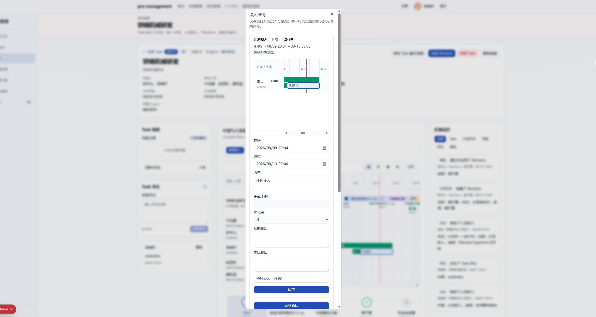
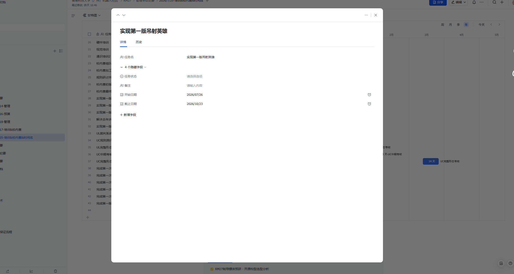
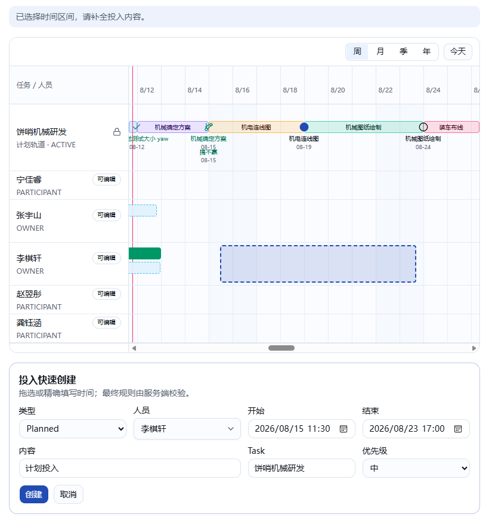

# 投入详情、时间线编辑与“我的工作”合并计划

> 状态：**决策已收敛，可作为实施基线**。
>
> 更新时间：2026-08-11。
>
> 本计划覆盖投入详情、投入快速创建、时间线直接调整，以及“我的时间”合并到“我的工作”四组
> 需求。第 5 节记录最终产品决策；其中此前未决项目已按“系统正确、复用现有能力、复杂度最低”
> 原则收敛，后续实施不得重新引入已排除分支。

## 1. 背景与目标

当前投入详情 Dialog 在桌面宽屏上仍被共享 Dialog 的 `sm:max-w-sm` 限制，实际显示为狭长单列：



目标视觉参考为更宽、按业务区块纵向组织的详情界面：



当前投入快速创建已经有画布拖选、人员/Task/时间/内容/优先级表单和虚线待创建区间，但待创建
区间与表单状态没有完全同步，也不能填写预期输出：



本轮目标是：

1. 将投入详情改为真正的宽 Dialog，按“上下文时间线 → 基本信息 → 确认/取消 → 来源与变更
   历史”组织；
2. 详情中的时间线上只有当前打开的投入可以修改，其他投入只作为参照；
3. 部分确认补齐内容、预期输出和实际输出，并继续保留当前前缀确认、来源追溯、事务和并发规则；
4. 修复快速创建的待创建区间不跟随人员、缺少预期输出和无法用 Esc 取消等问题；
5. 在时间线上支持未保存创建草稿的横向移动、两端缩放和跨人员行移动；已保存投入在总览保持
   只读，继续通过详情表单修改；
6. 未保存的待创建区间也参与内容范围计算，在边界附近动态扩展内容驱动时间线；
7. 将 `/progress/my-timeline` 的完整时间线能力合并到 `/progress`“我的工作”，移除重复导航，
   并把到期计划与确认队列放到 Active Task 区域之后；
8. 保留服务端鉴权、Segment 状态机、31 天上限、乐观锁、来源关系、变更历史、领域审计和
   notification outbox 安全边界。

## 2. 当前实现核对结果

### 2.1 投入详情

- `ResourcePlannerCanvasClient` 使用 `DialogContent` 打开详情。调用方虽然传入
  `max-w-[min(96vw,88rem)]`，共享 Dialog 同时带有 `sm:max-w-sm`；二者响应式前缀不同，桌面端
  仍命中较窄的 `sm:max-w-sm`，这正是截图中狭长布局的直接原因；
- 打开详情时会并行读取 `getWorkSegment` 和第一页 20 条 `listWorkSegmentChanges`；
- 当前详情时间线只保留目标投入所属的一行，而不是打开详情前完整的当前时间线；
- 目标投入可以在详情时间线上横向移动和缩放，但只修改本地草稿，点击“保存”才统一调用
  `updateWorkSegment`；同一行其他投入已经被覆盖为只读；
- 当前编辑表单含开始、结束、内容、完成比例、优先级、预期输出、实际输出和修改原因；
- Planned 可完整确认、部分确认、取消；Actual 可编辑和软删除；
- 部分确认已经被服务端限定为从权威 Planned 起点开始，只能生成一条 Actual 和最多一条尾部
  Planned；等于完整区间时必须走完整确认；
- 当前部分确认 UI 只填写确认终点和原因，没有提交 Actual 的内容、预期输出、实际输出；
- 当前历史 UI 直接显示 `CREATE/UPDATE/CONFIRM/...` 等内部英文 action。查询还把 raw
  `before/after`、内部 ID 和 `actorAccountId` 返回到浏览器，但没有提供可读的操作者姓名和中文
  字段差异；
- 历史只展示首 20 条，没有“加载更多”，会静默遗漏更早记录。

### 2.2 投入创建与总览时间线

- 服务端 `createWorkSegmentInputSchema`、`WorkSegment` 模型和创建 service 已支持
  `expectedOutput`；缺失的是快速创建表单字段及提交参数，不需要为此修改数据库；
- 待创建区间 `createDraft` 保存初始 `rowId/personId/startMs/endMs`，人员选择器却在
  `QuickCreatePanel` 内另存 `personId`。改变人员只会改变提交值，不会改变画布中的虚线区间，
  因而出现“责任人已变、虚线仍留在原行”的问题；
- 当前没有为创建草稿注册 Esc 取消逻辑；输入框、人员/Task 下拉框和详情 Dialog 各自也会使用
  Esc，因此需要定义事件优先级，不能用无条件的全局监听误关其他浮层；
- `TimeCanvas` 已支持 Segment 左右边缘缩放、整体横向拖动、Shift+左右键移动、Alt+左右键调整
  结束点和边缘自动横向滚动；总览故意没有传 `onSegmentTransform`，所以这些能力只在详情中
  生效；
- `TimeCanvas` 当前会拒绝离开原人员行的拖放，并固定提示“不支持跨人员行拖放”；transform
  请求也不携带目标 `rowId/personId`；
- `movePlannedSegments` 只更新 Planned 的开始/结束时间，不支持改变 `personId`。通用
  `updateWorkSegment` 也不接受 `personId`；
- 有效 Planned 保存成功后已经会刷新权威 `rowPageKey`、扩展内容范围并预加载目标及相邻块；
  但保存之前的 `createDraft` 不参与 `contentRange/fullRange/model.range` 计算，也不会扩展画布；
- 内容驱动画布按权威内容两侧各两个上海日历月计算范围、按最多 180 天数据块加载，并限制单次
  逻辑窗口不超过三个上海日历年；`/progress/resources` 的显式 `from/to` 则是硬业务边界。
- `docs/TESTING.md` 仍写着“Task 详情禁止创建”，但当前 Task 工作台实现、现有 Playwright 和本次
  需求截图都明确允许按既有权限创建。本计划以当前生产行为和本次需求为准保留创建，并要求实现
  阶段修正文档，不按过时描述删除入口。

### 2.3 “我的时间”与“我的工作”

- `/progress`“我的工作”当前包含指标、未来 7 天只读紧凑时间线、行动待办、最多 12 条 Active
  Task 和最近通知；其 `DASHBOARD` 时间线只读取本人一行和固定 7 天范围；
- `/progress/my-timeline`“我的时间”才使用完整的 `ResourcePlannerCanvasClient`：支持内容驱动
  范围、Task 当前计划行、本人投入、创建、详情、周/月/季/年、今天、URL 视口和自适应数据块；
- “我的时间”的当前 Task 页与计划行来自同一个受约束响应，默认 25 条 Active Task，可切换
  草稿和全部终态；客户端不能注入任意 Task ID 扩大查询范围；
- 到期计划与确认队列目前只在“我的时间”底部。它另有一套完整/部分/未执行表单，其中部分
  确认仍允许编辑开始时间，且缺少本轮要求的内容、预期输出、实际输出；
- 左侧/移动端导航同时存在“我的工作”和“我的时间”；Action Inbox 的 Segment 待确认链接仍
  指向 `/progress/my-timeline?focus=...`，而到期飞书/站内通知已指向 `/progress`；
- `/progress` 当前不解析 `center/scale/focus/taskCursor/tasks`，直接移除旧页面会破坏已有书签、
  Action Inbox 深链和浏览器历史。

## 3. 既有业务约束

以下约束不是本轮产品决策，不得因 UI 改造而放宽：

### 3.1 数据和状态机

- Work Segment 只有 `PLANNED` 和 `ACTUAL` 两种类型；
- 状态为 `PLANNED / IN_PROGRESS / PENDING_CONFIRMATION / CONFIRMED / CANCELLED`；
- 单条投入最长 31 天，时间区间使用半开区间 `[startAt, endAt)`；
- 不同投入允许重叠，本轮不恢复资源冲突、投入比例、职责或 TaskNode 关联；
- 时间线继续隐藏 `PLANNED + CONFIRMED/CANCELLED`，但不得删除事实记录、来源和历史；
- 完整确认在事务内锁定 Planned、创建 Actual 和 `WorkSegmentSource`，再把 Planned 置为
  `CONFIRMED`；
- 部分确认固定覆盖 Planned 前缀，原 Planned 置为 `CANCELLED`，创建 Actual 和最多一条尾部
  Planned；不能重新开放任意拆分；
- 所有时间移动和缩放继续以 30 分钟吸附，服务端仍接受合法的分钟级精确表单值。

### 3.2 权限

- 所有已登录统一账号可查看未删除的完整 Segment；
- Task Participant 只可管理自己在该 Task 下的投入；
- Task Owner 可管理该 Task 全部有效成员的投入；
- 两类全局管理员可管理全部投入；
- 无 Task 投入只有本人或全局管理员可管理；
- Task 关联投入的 `personId` 必须是该 Task 的有效 Owner/Participant；
- 停用 Person 的历史投入可查看，但不能成为新建或转移投入的目标；
- UI capability 只控制控件展示，所有 mutation 必须在事务内刷新 actor、重新鉴权并校验状态。

### 3.3 并发、审计和通知

- 每次修改既有 Segment 继续携带 `expectedUpdatedAt`；创建操作没有旧版本，不能伪造版本字段；
  stale 修改不得覆盖服务器新版本；
- 多写操作继续使用事务、Task 关联锁和稳定顺序 Segment 行锁；
- 每次有效变更继续写 `WorkSegmentChange` 和 append-only `DomainAuditEvent`；
- 本轮不能绕过 `NOTIFICATION_DELIVERY_DISABLED`、通知偏好、收件人 allowlist、outbox 或逐收件
  人重试；
- 自动测试不得发送真实飞书消息；
- 未经 D9 决策，不给普通创建、编辑、移动或确认凭空增加新通知事件。

## 4. 本轮范围与非目标

### 4.1 包含

- 宽版投入详情及四段信息架构；
- 详情时间线、基本信息、完整/部分确认、取消、Actual 软删除和来源/历史；
- 中文变更历史 DTO、操作者、字段差异、稳定分页和加载失败状态；
- 快速创建人员/虚线同步、预期输出、Esc 取消和待创建范围扩展；
- 对未保存创建草稿提供总览横移、两端缩放和跨人员行移动；
- 平滑预览、边缘滚动、创建失败保留草稿、详情 stale 刷新和 reduced-motion；
- “我的时间”合并到“我的工作”、导航去重、旧路由删除、内部深链迁移和到期确认队列迁移；
- Desktop `1440x1000` 与 Pixel 5 的完整回归；
- README、TECH、TESTING、必要时 NOTIFICATIONS 的同步更新。

### 4.2 不包含

- 恢复 Segment 拆分、合并、批量移动入口；
- 新增资源冲突、人员容量、投入比例、职责或 TaskNode 关联；
- 改变 Task/Project 生命周期、审批规则或成员角色；
- 拖到未加载的人员分页，或由客户端任意请求额外 Person/Task ID；
- 拖动 Busy、Task Plan 行、Milestone、Revision 或 Terminal；
- 用 CSS 动画掩盖服务端失败，或在 pointer move 中连续发 mutation；
- 为本轮 UI 引入新的拖拽、动画或状态管理依赖；
- 删除既有 Segment、来源、变更、审计或已发送通知历史。

## 5. 产品决策记录

以下保留备选项及最终选择，便于追溯取舍。所有项目已经收敛；标记“不适用”的项目不得进入
实现。

| 状态 | 决策项 |
|---|---|
| 已选 | D1=A、D2=A、D3=B、D4=A、D5=B、D6=A、D8=A、D10=B、D11=B2、D12=B、D13=C、D14=A、D15=A、D16=B、D17=A、D18=A、D19=A、D20=A |
| 不适用 | D7、D9（D6=A，不修改或转移已保存 Segment） |

### D1：详情中的“同一个时间线”范围

- **A（建议）**：复用打开 Dialog 前的完整当前时间线：相同筛选、行分页、计划行、已加载数据
  块、尺度和视口；仅目标投入可修改，所有其他投入和计划对象只读。
- **B**：只复用目标投入所属人员行，保持当前实现的单行上下文；尺度、时间范围和视口仍与外层
  一致。

影响：A 最符合“打开前后是同一个时间线”，但 Dialog 需要固定画布高度和纵向虚拟滚动；B 更
紧凑，但不能查看目标人员与其他人员/计划行的时间关系。

**状态：已选 A。**

### D2：基本信息区保留哪些字段

- **A（建议）**：开始、结束、内容、优先级、预期输出、实际输出可按既有权限编辑；类型、状态、
  所属人员和关联 Task 以只读摘要展示。
- **B**：严格只保留开始、结束、内容、预期输出、实际输出；优先级从详情 UI 移除。
- **C**：请在回复模板中给出自定义字段清单及哪些字段可编辑。

**状态：已选 A。**

### D3：“删除完成比例”的数据范围

- **A（建议）**：只从投入详情和新确认 UI 删除完成比例，不再提交该字段；保留数据库字段、历史
  值、服务端兼容和既有审计，避免无关迁移和历史丢失。
- **B**：从 validation、service 写入和普通 DTO 中退役 `completionPercent`，数据库列改为只读历史
  兼容，不再产生新值；不做 drop migration。
- **C**：在整个项目管理域彻底删除 `completionPercent`；部署前用确定性 `source=MIGRATION` 审计
  固化每条非空历史值，再通过新 migration 删除 Prisma/数据库字段及接口兼容。
- **D**：在整个项目管理域直接删除，不做兼容和额外历史快照；仍必须用一条新的 Prisma
  migration 删除数据库列，并删除 validation/service/DTO/UI 的读写。数据库列中的现有非空值
  会不可逆丢失；既有 append-only change/audit JSON 不改写、不删除，但新安全历史 DTO 忽略其中
  的完成比例字段。

影响：C/D 都是数据库和接口变更，必须在隔离数据库验证 migration 与 `db:deploy`；D 明确接受
实时列历史值丢失，但不能违反 append-only 审计规则去清洗既有审计事件。

**最终选择：B。** “直接删”落实为从有效 UI、validation、service 写入和普通 DTO 中彻底移除，
但保留数据库只读历史列和 append-only 历史；这是无需 migration、没有历史数据丢失且复杂度最低
的方案。

### D4：部分确认字段的默认来源与必填规则

- **A（建议）**：内容、预期输出默认继承“来源 Planned 投入”；三项提交前都必须非空，其中实际
  输出通常需要用户补充。Task 本身没有预期/实际输出字段，不能直接从 Task 继承。
- **B**：仍默认继承来源 Planned，但只要求内容非空，预期/实际输出允许为空。
- **C**：从 Task 的标题/描述推导；请在回复中明确内容、预期输出、实际输出各自的映射规则。

**状态：已选 A。**

### D5：完整确认是否也填写 Actual 信息

- **A**：完整确认和部分确认都先展示 Actual 的内容、预期输出、实际输出表单，再提交确认。
- **B（建议）**：完整确认保持当前一键操作；只按原需求为部分确认增加三项表单。

影响：A 的确认数据更完整且两条路径一致；B 改动更小，但完整确认生成的 Actual 仍可能没有实际
输出。

**状态：已选 B。**

### D6：直接拖动的对象范围

- **A（建议，最贴近已有回复）**：只允许拖动尚未保存的虚线 `createDraft`；可横移、调整两端和
  跨当前已加载 Person 行。已保存的 Planned/Actual 在总览中均只读，仍可在详情表单精确修改。
  拖动只改客户端草稿，最终创建时才执行一次既有服务端鉴权和写入。
- **B**：除 `createDraft` 外，也允许未删除且未 `CONFIRMED/CANCELLED` 的已保存 Planned 横移、
  调整两端和跨人员行；Actual 继续只在详情表单修改。
- **C**：只允许已保存的有效 Planned 直接拖动，创建草稿仍使用现有拖选和表单，不给虚线增加
  二次拖动能力。

数据库目前没有“是否由时间线拖选创建”的来源字段，因此不能实现“只允许曾经通过拖选创建的
已保存投入可拖动”。必须按对象当前是否还是未保存草稿来区分。

**最终选择：A。** “通过时间线上选中时间快速创建的部分”解释为仍显示虚线、尚未提交的创建
草稿。已保存 Planned/Actual 不增加总览 transform，因此不新增服务端人员转移 mutation、乐观
缓存或转移通知。

### D7：总览拖动何时保存

- **A（建议）**：pointer/key 操作结束后立即提交一次 mutation；等待期间保留乐观位置，失败回滚，
  stale 则刷新权威数据。
- **B**：拖动只形成未保存草稿，显示“保存/取消”浮条，用户再次确认后才提交。

**最终选择：不适用。** D6=A 的 pointer/key 操作只更新同一个客户端创建草稿；用户仍通过现有
QuickCreate“创建”按钮提交，不存在额外的 transform 保存动作。

### D8：跨人员行移动的目标范围

- **A（建议）**：只允许拖到当前已加载、可创建/管理且为 `PERSON` 的行；不能拖到 Plan 行、下一
  人员分页或筛选外人员。需要其他人员时先调整页面筛选/分页。
- **B**：拖到画布边缘时自动搜索并插入筛选外人员临时行。

影响：B 会扩大当前受约束行分页并引入新的授权、分页和虚拟化语义，不能只做前端插行。

**状态：已选 A。**

### D9：跨人员转移是否新增通知

- **A（建议）**：不新增通知；与现有 Segment 普通创建/更新一致，只写中文变更历史和领域审计。
- **B**：通知原人员和新人员；必须使用通知机器人、站内通知和 durable outbox，消息包含操作人、
  Task/独立投入、原/新人员、时间区间和状态。

**最终选择：不适用。** D6=A 不转移已保存 Segment；创建草稿提交前没有“原人员”，沿用普通
创建的现有通知行为，不新增“人员转移”事件。

### D10：Esc 取消已经编辑过的创建草稿

- **A**：只要创建草稿存在，Esc 就立即丢弃，不二次确认。
- **B（建议）**：未改表单时直接取消；内容、人员、时间、Task、预期输出等任一字段已改时先确认
  是否放弃。下拉框、日期控件或 Dialog 自己消费 Esc 时不触发草稿取消。

**状态：已选 B。**

### D11：待创建区间是否突破人员计划的显式 `from/to`

- **A（建议）**：内容驱动的“我的工作”和 Task 详情可按既有“两侧两个上海日历月”规则动态扩
  展；`/progress/resources` 的显式 `from/to` 仍是硬边界，待创建区间只能在该范围内显示。
- **B1**：所有页面都允许扩展。`/progress/resources` 先取原范围与草稿的 union；不超过服务端
  366 天上限时扩展一端，超过时移动最多 366 天的窗口，完整包含最长 31 天的草稿并尽量保留
  原窗口内容。用 URL `replace` 同步 `from/to`，清除已落在新范围外的 cursor/focus，日期筛选器
  同步；重新取数期间必须保留未提交的完整草稿和 dirty 状态。
- **B2**：所有页面都允许扩展，但 `/progress/resources` 只在 union 不超过 366 天时改写
  `from/to`；超过时拒绝该日期并提示用户先手动调整资源范围。其余 URL 和草稿保留规则同 B1。

影响：该页当前按完整显式范围一次查询，不是内容驱动 adaptive block；不能套用三年逻辑窗口，
也不能向服务端提交超过 366 天的查询。

**最终选择：B2。** 允许在 union 不超过 366 天时自动扩展；超限时明确拒绝并提示先手动调整
资源范围，不引入窗口自动平移及其额外导航语义。

### D12：移动端直接拖动策略

- **A（建议）**：Desktop 和触摸设备都支持指针拖动，并同时提供键盘/精确表单路径；触摸拖动
  需要明确手柄、边缘自动滚动和防止页面误滚，`prefers-reduced-motion` 下关闭非必要过渡。
- **B**：不为 Pixel 5 新增直接拖动手势；创建草稿通过时间/人员表单调整，已保存投入通过详情
  表单精确修改。仍必须验证移动端可以完成创建/编辑、页面无横向溢出、触摸滚动不误操作以及
  loading/error/disabled 状态，不把“移动端不做拖动”解释为免测移动端。

**状态：已按“移动端不管”明确为 B。**

### D13：旧 `/progress/my-timeline` 路由

- **A（建议）**：保留兼容入口并永久重定向到 `/progress`，迁移和规范化
  `center/scale/focus/taskCursor/tasks`，并把旧 `date/mode/zoom` 映射为当前参数。
- **B**：保留同内容别名页，但导航只显示“我的工作”。
- **C**：删除并返回 404，不兼容旧书签和待办链接。

**状态：已选 C。旧路由和旧参数明确不兼容；实现前先把仓库内 Action Inbox 等内部链接全部
更新为 `/progress`，新页面只解析自己的 `center/scale/focus/taskCursor/tasks`。**

### D14：Active Task 与“参与 Task”如何合并

- **A（建议）**：合并为一个受约束 Task 区：默认 Active、可切换显示全部状态、每页 25 条稳定
  分页；同一个 Task page 同时驱动表格和时间线 Plan 行。指标中的 Active Task 总数仍独立计数。
- **B**：保留当前最多 12 条 Active Task 表；时间线内部另取 25 条 Task page，但不再单独显示
  参与 Task 列表。
- **C**：只在时间线显示本人 Segment，不显示 Task Plan 行，保留当前 Active Task 表。

影响：B 会让表格与时间线展示不同 Task；C 会丢失“我的时间”现有的 Task 计划上下文。

选择 A 时，合并后的 Task 表必须继续展示现有的 Task 名称、状态、当前节点（Active Milestone
或 Active Termination）和当前计划版本号。不能直接复用字段不足的 `searchTaskOptions` DTO；应
建立受当前 actor TaskMember 范围约束的页面 DTO，并由同一结果生成表格与 Plan 行。

**状态：已选 A。**

### D15：到期确认队列的“放在 Active Task 下面”

- **A（建议）**：作为独立全宽区块，紧接“行动待办 + Active Task”双栏之后；桌面和移动端都
  有足够宽度展示长内容和错误。
- **B**：放入 Active Task 所在右栏，并位于 Task 表格下方；行动待办保持左栏。

**状态：已选 A。**

### D16：到期确认队列中的操作方式

- **A**：队列内保留完整确认、部分确认、未执行三类表单，并抽取共享确认组件，确保与详情使用
  相同字段和校验。
- **B（建议）**：队列只展示待处理项和“处理”按钮；点击后在同页定位投入并打开统一详情
  Dialog，所有确认/取消只维护一套 UI。
- **C**：完整确认和未执行保留快捷按钮，部分确认打开统一详情 Dialog。

**状态：已选 B。**

### D17：快速创建的输出字段范围

- **A（建议）**：Planned 和 Actual 快速创建都显示“预期输出”并提交；直接创建 Actual 仍不新增
  “实际输出”字段，本轮严格修复原需求指出的缺项。
- **B**：只有 Planned 显示“预期输出”，Actual 快速创建保持现状。
- **C**：Planned 显示预期输出；Actual 同时显示预期输出和实际输出。

**状态：已选 A。**

### D18：行动待办是否继续显示到期 Planned

- **A（建议）**：继续计入行动待办列表和行动待办总数，条目定位同页详情。下方到期队列是完整
  处理区，行动待办是跨类型统一摘要，接受同页出现两处入口。
- **B**：合并后从行动待办列表及总数中移除 `SEGMENT_CONFIRMATION`，到期 Planned 只在专用队列
  出现。

**状态：已选 A。**

### D19：到期 Planned 是否新增计入“紧急待办”指标

当前 `criticalCount` 只统计逾期 Milestone 和 Termination；Segment confirmation 虽可显示为
`HIGH/MEDIUM`，但从未计入该指标。因此这不是“是否继续”，而是是否改变现有指标口径。

- **A（建议）**：保持现状，不把到期 Planned 计入紧急待办；D18=A 只影响列表和总数。
- **B**：新增计入；请同时定义从何时算紧急（进入 `PENDING_CONFIRMATION`、已到结束时间，还是
  逾期指定时长），并同步指标文案、查询和测试。

**最终选择：A。** 保持当前指标口径，不把本次页面合并变成指标定义变更。

### D20：来源区是否展示已软删除 Actual

- **A（建议）**：保持现有可见性规则，所有查看者都不看到已软删除 Actual；Planned 来源区只列
  未删除的派生 Actual。删除事实仍持久化在该 Actual 自身的 `WorkSegmentChange` 和
  `DomainAuditEvent` 中，但不跨 Segment 聚合，因此不在 Planned 详情的来源区或变更历史展示。
- **B**：仅当前仍可管理该 Planned 的用户和全局管理员看到不含内容、时间、ID 的“曾生成的
  Actual 已删除”墓碑；普通只读查看者继续完全隐藏。
- **C**：所有能查看 Planned 的人都看到上述无敏感字段墓碑，这会扩大当前数据可见性。

按 A 实施时，历史中的 Task/Tag/Person 名称解析仍必须复用现有 readable/archived 过滤；不可见
或已删除对象统一显示“不可见对象”，不能通过历史 `before/after` 泄露名称。

**最终选择：A。** 保持当前软删除可见性和查询边界，不新增跨 Segment 聚合或墓碑授权规则。

## 6. 目标信息架构

决策确认后，投入详情按以下四段实现；字段细节由 D1–D5 决定。

### 6.1 第一段：当前时间线

- Dialog 使用明确的桌面宽度覆盖类，例如 `sm:max-w-[min(96vw,88rem)]`，消除共享
  `sm:max-w-sm` 的响应式覆盖；最大高度保留在 `92–94dvh`，Dialog 自身纵向滚动；
- 时间线使用打开前的权威 model 和当前客户端块缓存，不额外发起一套可扩大权限的查询；
- 保留打开前的 `scale`、视口中心、筛选、行分页和显示规则，不能在 Dialog 打开时跳回默认周
  视图或重置滚动位置；
- 目标投入高亮，只有目标投入保留服务端 capability；其余 Segment、Plan、anchor 和 Busy 全部
  只读；
- 详情中的本地时间草稿与开始/结束输入双向同步，点击“保存”才调用一次
  `updateWorkSegment`；
- 时间线区域设置稳定高度和内部纵向/横向滚动，长人员列表继续虚拟化，不能把整个 Dialog 撑到
  屏幕外；
- 加载、空、数据块失败、版本冲突和目标已不可见分别显示中文状态；
- 未保存时关闭按钮、Esc、遮罩和外部 URL/`rowPageKey` 变化继续执行放弃确认，不丢表单。

### 6.2 第二段：基本信息

- 使用响应式网格而非狭长单列：Desktop 可并排展示短字段，内容和输出占整行；Pixel 5 纵向
  排列；
- 开始/结束使用上海时区 `datetime-local`，最终由服务端校验结束晚于开始和 31 天上限；
- 内容 trim 后 1–2,000 字；预期/实际输出沿用 2,000 字上限；
- 类型、状态、人员、关联 Task、来源状态全部使用中文标签，不显示内部枚举；
- `canEdit=false` 时展示同样的信息结构，但使用只读文本，不渲染伪可用控件；
- 删除完成比例 UI 后不能留下空标签、禁用输入或仍提交旧值；历史已有值仅按 D3 处理；
- 保存中禁用重复提交；网络失败保留输入，validation 显示字段级中文错误，stale 提供重新加载
  权威版本的路径。

### 6.3 第三段：确认、取消与删除

- 仅有效 Planned 且 `canConfirm` 时显示完整/部分确认；
- 部分确认开始点固定为权威 `detail.startAt`，只允许选择
  `detail.startAt < coveredEndAt < detail.endAt`；等于终点时切换为完整确认；
- 部分确认表单按 D4 提交 `actual.content/expectedOutput/actualOutput`，不得先修改 Planned 再确认，
  必须由一个确认事务原子生成 Actual、来源、尾段、change 和 audit；
- `partiallyConfirmSegmentInputSchema` 只对该 action 增加所选必填规则，不能错误收紧独立 Actual
  创建或历史兼容；
- 完整确认按 D5 决定是否提交 `actual` override；
- Planned 取消和 Actual 软删除继续要求原因及明确的破坏性确认；
- mutation 进行中禁止关闭和重复提交；成功后关闭详情、刷新权威模型并保持外层视口；
- stale、并发确认、cron 状态推进和重复点击只有一个合法写入成功，失败方零新增来源、尾段、
  change、audit 和通知。

### 6.4 第四段：来源与中文变更历史

来源关系继续单独展示：

- Planned：只列出由它确认生成的未删除 Actual、覆盖区间和 Actual 区间，不展示已软删除 Actual
  或墓碑；
- Actual：列出来源 Planned、覆盖区间和 Planned 中文状态；
- 只返回 actor 有权查看且未软删除的来源，不因历史区块泄露其他 Task/人员数据。

变更历史改为服务端安全格式化 DTO：

- `CREATE / UPDATE / MERGE / CONFIRM / CANCEL / DELETE` 分别显示“创建投入 / 修改投入 / 合并计划
  （历史）/ 确认投入 / 取消计划 / 删除实际投入”；`SPLIT` 若历史 `after` 含
  `sourcePartialConfirmSegmentId`，显示“部分确认后生成剩余计划”，否则显示“拆分计划（历史）”。
  该内部来源标记只允许 formatter 在服务端判别，不能进入安全 DTO；
- 展示操作者中文姓名；系统/cron 显示“系统”，账号没有 Person 时使用安全的管理员/未知操作者
  文案，不展示 Account ID；
- `UPDATE` 对 `startAt/endAt/personId/content/priority/expectedOutput/actualOutput/taskId/status/tagIds`
  生成中文字段差异；人员、Task 和 Tag 名称在服务端按当前页出现的有界 ID 批量解析；
- 时间统一按 Asia/Shanghai 展示；空原因显示“未填写原因”，不能显示 `null`；
- raw `before/after`、作为可展示业务内容的数据库 UUID、lock/version token、内部字段名和未知
  英文 action 不下发浏览器；协议层允许保留不渲染的稳定 item key 和分页 cursor；
- 未知历史 action 固定显示安全的“发生了系统变更”，不展示字段详情，同时记录结构化日志；
  不能把 raw action 当兜底文案；
- 使用 `createdAt + id` 的稳定 cursor 加载，每页 20 条；cursor/item key 只用于协议和 React
  标识，不作为业务字段展示。查询每页都重新执行 actor 权限和 `segmentId` 约束，伪造或跨
  Segment cursor 不能扩大结果；提供加载中、失败重试、无更多和去重；
- formatter 增加纯映射回归，覆盖两类 `SPLIT`、所有其他枚举 action、组合字段差异、长文本截断
  和未知字段，并断言内部部分确认来源标记不下发。

## 7. 快速创建方案

### 7.1 单一创建草稿状态

把 `rowId/personId/startMs/endMs/type/taskId/content/priority/expectedOutput` 收敛为上层受控创建草稿，
表单与画布不再各存一份关键状态：

- 拖选或“新增投入”创建草稿后，虚线区间读取同一个草稿；
- 人员选择改变时，立即把 `rowId` 切换为当前 model 中对应的 Person 行，虚线区间同帧移动；
- 目标人员不在当前已加载行时，不伪造有权限的临时行；表单显示“请先在当前页面加载该人员”，
  并禁止提交或按 D8 的最终决策处理；
- 开始/结束输入改变时，虚线长度和位置同步；无效区间保留输入并显示字段错误，不能生成 NaN
  布局；
- Task、内容、预期输出等表单值在网络失败和权威刷新被延迟时保留；
- 输出字段和提交参数按 D17 实现；不能只渲染输入而漏传 action，也不能因切换类型意外清空用户
  已填写内容；
- 成功后才清空草稿，刷新后使用 mutation 返回的 Planned 范围预加载权威块；
- 取消后清除虚线、表单错误和 pending 范围，但保留原画布视口。

### 7.2 Esc 事件优先级

Esc 按以下顺序处理：

1. 已打开的人员/Task 下拉、日期原生浮层或其他子浮层先消费；
2. 已打开投入详情时执行详情自己的未保存关闭规则；
3. 没有上层浮层且存在创建草稿时，按 D10 取消；
4. 只有普通 Segment 选中时清除选择，不触发 mutation；
5. 输入法组合态、`event.defaultPrevented` 或 mutation 进行中不重复处理。

TimeCanvas 根节点或页面级 handler 必须在卸载时移除监听，并用 Playwright 验证 Esc 不会同时关闭
下拉框和丢弃创建表单。

## 8. 总览直接调整方案

### 8.1 未保存创建草稿（D6=A）

当前虚线 `creationRange` 是 `pointer-events-none` 的纯展示对象。需要把它改为独立的可交互草稿，
不能伪装成已有 `segmentId/version` 的 Segment：

- 新增 `CreateDraftTransformRequest`，只携带 `kind/startMs/endMs/targetRowId/targetSourceId`；上层更新
  第 7.1 节的同一个受控草稿，不调用更新 mutation；
- 正文用于整体横移，两端手柄用于缩放，跨行只命中 D8 允许且 actor 当前可创建的 Person 行；
- 拖动只更新 `requestAnimationFrame` preview，pointer up 后把最终值写回 QuickCreate 表单；用户
  点击“创建”时才调用一次既有 create action，由服务端重新校验 Person/Task/时间和创建权限；
- 横向接近边缘自动滚动画布，纵向接近容器边缘滚动已加载行；通过实际挂载的
  `[data-canvas-row]` hit-test，不能用虚拟列表中的固定 y 偏移；
- 合法 Person 行高亮，Plan/Busy/只读/筛选外区域显示禁止态；拖草稿不能同时触发新范围拖选；
- Desktop 保留键盘路径：Shift+左右整体移动 30 分钟，Alt+左右调整结束，Alt+Shift+左右调整
  开始，Alt+上下移到相邻合法 Person 行；D12=B 时 Pixel 5 只使用表单；
- `aria-label` 宣告“待创建投入”、当前人员与区间，live region 反馈结果；reduced-motion 关闭非
  必要过渡但保留即时位置反馈。

草稿移动不产生乐观服务器缓存、stale 版本、change/audit 或人员转移通知。网络/validation 失败
时保留最终草稿和视口供修改重试，创建成功后才由服务端 DTO 和权威范围接管。

### 8.2 已保存投入保持现状

- 总览不传 `onSegmentTransform`，已保存 Planned/Actual 不显示直接拖动或缩放手柄；
- 用户仍可打开第 6 节宽版详情，用既有本地草稿 + 单次 `updateWorkSegment` 修改有权限的目标投入；
- 不扩展 `movePlannedSegments` 或 `updateWorkSegment` 的 `personId`，不新增跨人员转移 mutation、
  乐观块缓存同步、转移 change/audit 或通知；
- 详情既有 `expectedUpdatedAt`、stale 回滚、状态机和服务端鉴权保持不变。

## 9. 待创建区间与动态范围

### 9.1 内容驱动画布

在客户端增加“展示内容范围”派生值：

```text
displayContentRange = union(authoritativeContentRange, activeCreateDraftRange)
displayNavigationRange = 上海日历月对齐并向两侧各扩展 2 个月
displayLogicalRange = 在现有 3 个上海日历年窗口规则内裁剪
```

- 创建草稿存在时，`model.range/contentRange/fullRange/navigationRange` 的展示值使用上述派生结果；
- 草稿落在当前左/右边界附近时，画布宽度和底部滚动范围动态扩展，虚线始终可见；
- 扩展保持当前尺度和视口中心，不得因为 range 起点改变让用户看到内容横向跳动；需要根据旧/
  新 scale 重新计算等价 scrollLeft；
- 草稿只是客户端展示对象，不进入 `rowPageKey`、数据库查询、审计或通知；
- 权威 aggregate 已证明扩展区间之外没有当前页既有内容时，可显示空白缓冲区，不能伪造服务端
  数据；
- 保存成功后由服务端重新计算权威范围并接管；只有新 `rowPageKey` 和目标/相邻块到位后才移除
  临时范围，避免先收缩再扩展的闪烁；
- 取消或创建失败不把草稿写入权威缓存；失败时保留派生范围以便用户修正并重试；
- `/progress/resources` 不套用上述三年窗口，严格按第 9.2 节的 366 天显式范围处理。

### 9.2 `/progress/resources` 显式范围（D11=B2）

- 该页保持服务端最多 366 天的 validation，不把内容驱动画布的三年窗口误用于显式资源查询；
- 取原范围和草稿的 union，统一使用上海日期边界；union 不超过 366 天时更新 `from/to` 并完整
  显示最长 31 天草稿；超过 366 天时拒绝本次日期修改、恢复草稿最后一个合法时间（其他 dirty
  字段保留），不改 URL/权威范围，并显示“请先缩小或调整资源时间范围”；
- 使用 URL replace 而非每次表单输入都新增浏览器历史；只有日期合法且需要越界时才同步；
- 新范围使 cursor/focus 失效时清除对应参数，人员/Task/日期筛选保持不变，日期控件同步新范围；
- 取数和 Server Component 刷新期间，上层受控草稿的人员、Task、内容、输出、时间和 dirty 标记
  不能丢失；失败恢复原权威范围但保留表单并提供重试；
- 不将尚未创建的草稿混入数据库 aggregate、row cursor 或权限 universe；扩出的真实数据必须由
  新范围权威查询返回，不能把未知区域当成已证实空白；
- Playwright 单独覆盖 union 小于/等于/超过 366 天、URL 后退/前进、请求失败和草稿最终创建。

### 9.3 极端范围

- 草稿仍受单条 31 天限制；
- 草稿距离当前内容超过三个上海日历年时，沿用现有三年逻辑窗口和“最早/最新内容”导航，不把
  整段压缩到一个不可用画布；
- 无权目标人员、无效日期、开始不早于结束时不扩展；
- 草稿跨上海月份、年界、闰日和夏令时无关时区输入都使用现有 Asia/Shanghai 工具函数；
- 多数据块容量失败时只显示对应失败块和重试，不丢创建表单。

## 10. “我的时间”合并到“我的工作”

### 10.1 目标页面

`/progress` 继续名为“我的工作”，保留：

- 工作指标；
- 新建 Task；
- 行动待办；
- Active/参与 Task 区；
- 最近通知。

把当前“未来 7 天个人时间”只读紧凑画布替换为“我的时间”的完整
`ResourcePlannerCanvasClient`：

- 内容驱动范围和两侧两个上海日历月缓冲；
- 当前 Task 页 Plan 行和本人 Segment 行；
- 周/月/季/年、今天、底部滚动条、URL 中心和尺度；
- 创建/调整未保存草稿、打开宽版详情并在详情中处理确认；已保存投入在总览保持只读；
- 自适应 180 天块、容量错误、重试和视口保持；
- 默认只展示 Active 参与 Task，可切换显示全部状态，表格与 Plan 行使用同一稳定分页。

不再保留第二个“打开个人时间线”链接；页面标题、描述和空状态统一使用“我的工作/我的投入”。

### 10.2 单一受约束页面查询

采用一个服务端“我的工作页面数据”装配组合 dashboard 指标和 `getMyTimelinePageData`，而不是让
客户端分别传 Task/Person ID：

- 输入只接受 `taskCursor/showAll/preferredCenter/load` 等显示选择器；
- 服务端从当前 actor 的有效 TaskMember 重新派生 Task page；
- 同一 Task page 驱动 Task 表格和 Plan 行，人员固定为 actor 本人；页面 Task DTO 明确保留名称、
  状态、Active Milestone 或 Active Termination、当前计划版本号和 Plan 行所需时间字段，不复用
  字段不足的通用 option DTO；
- Active Task 总数、行动待办总数、未读通知数继续独立 count，不受 25 条显示分页限制；
- `getPersonalDueSegments` 独立按本人和 `PENDING_CONFIRMATION` 查询，使用
  `endAt + id` 稳定游标和“加载更多”，不能只显示 `100+` 而无继续查看路径；
- adaptive block 的 `MY_TIMELINE` kind 继续在服务端按 `taskCursor/showAll` 重建 universe；
- 保留现有 `getMyWorkDashboard` action/dispatcher 输入输出作为内部兼容路径，避免无关破坏；新增
  页面装配复用抽出的指标 helper，不再为主页面额外查询一遍旧 7 天画布。

### 10.3 页面顺序

按已确认的 D14=A、D15=A 排列：

1. PageCommandBar；
2. 四个指标；
3. 完整“我的投入与 Task 计划”时间线；
4. “行动待办 + Active/参与 Task”响应式双栏；
5. 到期计划与确认队列；
6. 折叠的最近通知。

Pixel 5 全部纵向排列；只有 TimeCanvas 和确有必要的 Task 表内部允许横向滚动，页面根节点不得
横向溢出。

### 10.4 路由、导航和深链

- 左侧导航和移动端抽屉删除“我的时间”，只保留“我的工作”；
- 所有新链接使用 `/progress?focus=<segmentId>`；Action Inbox 的 Segment 待确认链接同步更新；
- `/progress` 只解析并规范化自己的 `center/scale/focus/taskCursor/tasks`，不解析旧页
  `date/mode/zoom`；
- focus 只允许定位本人可见且属于本人的 Segment；伪造他人 ID 返回通用“无法定位”并清除
  focus，不泄露对象存在性；
- 按已选 D13=C 删除 `/progress/my-timeline` 页面和对应 `routes.progress.myTimeline`，任何参数组合
  均返回 404，不重定向、不保留旧参数；删除前先迁移仓库内所有内部链接；
- 浏览器前进/后退必须同步 Task 状态筛选、分页、尺度、中心和 focus；
- 通知 event key、收件人和 outbox 历史不因页面合并而改变；仅更新安全链接目标。

### 10.5 到期确认队列

- 队列只读取本人有效 `PENDING_CONFIRMATION` Planned，不因 Task 显示筛选漏掉独立投入或终态
  Task 下的历史待确认项；
- 列表按 `endAt asc, id asc` 稳定排序并分页；
- 每项显示内容、关联 Task/独立投入、开始/结束、逾期状态和可执行 capability；
- 队列只提供“处理”按钮，点击后在同页 focus 该投入并打开第 6 节统一详情；完整/部分确认与取消
  只维护同一套 action/validation；
- mutation 成功后同时刷新队列、画布、行动待办和指标，不能只移除当前 DOM；
- 同一待确认项继续保留在行动待办列表/总数中；两个入口使用同一 focus 和权威版本；
- `criticalCount` 保持只统计逾期 Milestone/Termination，不因移动队列位置而纳入 Segment；
- 空、加载、失败、无权限、stale、长内容和 100+ 项均有明确状态。

## 11. 数据库、审计与通知影响

### 11.1 无数据库结构变更

按 D3=B、D6=A、D20=A，本轮不需要 Prisma schema 或 migration：

- `WorkSegment.personId/expectedOutput` 已存在；
- `completionPercent` 列保留为只读历史；从有效 validation/service 写入和普通 DTO 中删除，不能
  再产生新值；
- 不修改已保存 Segment 的 `personId` mutation；
- 中文历史 DTO 是查询层变化，不改写历史记录；
- 来源区继续过滤软删除 Actual，不恢复记录或新增墓碑；
- 页面合并只改查询装配、路由和客户端。

### 11.2 审计与通知

- 快速创建和详情保存继续使用 `pm.segment.create/update` change/audit；创建草稿拖动不写审计，
  最终创建成功时只写一次既有 create change/audit；
- 中文历史只格式化事实，不修改 append-only `DomainAuditEvent`；
- 部分确认继续写 Planned/Actual 的 `CONFIRM`，尾段写 `SPLIT`；
- 不新增人员转移或指标变更通知；现有确认等通知行为、event key、notification outbox 和机器人
  路由保持不变；自动测试继续检查禁发 guard，不产生真实外发。

## 12. 建议改动位置

决策确认后的预计文件如下；实现时以最终最小 diff 为准：

- `components/project-management/resource-planner-canvas-client.tsx`
  - 拆出受控创建草稿和宽版详情，不接入已保存 Planned 总览 transform；
- `components/project-management/time-canvas/time-canvas.tsx`
  - Esc/键盘、跨行 hit-test、目标行预览、边缘滚动和 transform 请求；
- `components/project-management/time-canvas/types.ts`
  - 增加无 Segment ID 的创建草稿 transform 契约；
- 可新增聚焦的 `segment-detail-dialog.tsx`、`segment-confirmation-form.tsx`、
  `work-segment-history.tsx`，避免现有 1,700 行客户端文件继续膨胀；
- `lib/project-management/validations/segments.ts`
  - 部分确认 Actual 字段校验，并退役有效输入中的 `completionPercent`；
- `lib/project-management/application/segment-service.ts`
  - 确认字段和审计，停止新写 `completionPercent`；
- `lib/project-management/queries/resource-queries.ts`
  - 中文安全历史 DTO、稳定 cursor/key、操作者/可读名称批量解析和 D20 来源过滤；
- `lib/project-management/queries/dashboard-queries.ts`
  - “我的工作”指标与完整时间线装配；
- `lib/project-management/queries/time-canvas-queries.ts`
  - 我的工作 Task page/Plan 行、due 分页和 adaptive block 复用；
- `app/progress/page.tsx`
  - 合并后的页面、URL 规范化和完整时间线；
- `app/progress/my-timeline/page.tsx`
  - 按已选 D13=C 删除，使旧路由返回 404；
- `app/progress/resources/page.tsx`
  - 按 D11=B2 实现 366 天内的显式 union、URL、超限拒绝和脏草稿保持；
- `components/project-management/personal-due-queue.tsx`
  - 新位置、分页和 D16 操作；
- `components/project-management/shell/project-management-shell.tsx`、`lib/routes.ts`
  - 导航与路由去重；
- `lib/project-management/queries/action-inbox-queries.ts`
  - Segment 待确认深链改到 `/progress`，保留现有列表/总数/紧急数口径；
- 相关 `tests/project-management-*.spec.ts`；
- `README.md`、`docs/TECH.md`、`docs/TESTING.md`、`docs/project_management/README.md`、
  `docs/FULL_FUNCTIONAL_TEST_PLAN.md`；仅当现有通知文档实际记录受影响链接时同步
  `docs/NOTIFICATIONS.md`。

## 13. 实施阶段

### 阶段 0：冻结验收

1. 以第 5 节已确认的 D1–D20 为唯一范围；
2. 固化 D6=A 的“只拖未保存草稿”、D11=B2 的 366 天超限拒绝；
3. 固化 D12=B 的 Desktop/Pixel 5 能力边界和 D13=C 的旧路由 404；
4. 确认不新增 schema/migration、已保存人员转移 mutation、转移通知或紧急指标口径变更。

### 阶段 1：安全历史与确认领域闭环

1. 先写部分确认字段 validation/service regression；
2. 实现中文历史 formatter、受约束名称解析和 opaque 分页 DTO；
3. 验证 raw before/after、业务 ID、不可见对象名称和英文 action 不下发；
4. 保持 D20=A 的来源过滤，再接入共享确认 UI；
5. 自审、定向测试、独立复审并修正。

### 阶段 2：宽版详情

1. 修复响应式宽度；
2. 按 D1 接入同一时间线和稳定视口；
3. 实现基本信息、确认/取消、来源/历史四段；
4. 覆盖 read-only、loading、error、stale、dirty close 和长内容；
5. Desktop/Pixel 5 定向 E2E、自审和复审。

### 阶段 3：受控创建草稿和动态范围

1. 提升创建草稿状态；
2. 修复人员/时间/虚线同步，增加预期输出；
3. 实现 Esc 优先级；
4. 实现虚线草稿横移、缩放和跨当前已加载 Person 行；
5. 将草稿纳入展示范围并保持视口；按 D11=B2 实现 resources 366 天 union、URL 和超限拒绝；
6. 验证左右边界、跨月/年、取消/失败/成功接管；
7. 自审和复审。

### 阶段 4：合并“我的时间/我的工作”

1. 建立单一受约束页面装配；
2. 用完整时间线替换 7 天只读预览；
3. 合并 Task 表和 Plan 行，迁移 due queue；
4. 更新导航和内部深链，删除旧路由，并验证 404 及新页面浏览器历史；
5. 验证 Task 当前节点/版本字段，保持行动待办列表/总数/紧急数口径且 count 不受分页影响；
6. Desktop/Pixel 5 定向 E2E、自审和复审。

### 阶段 5：全量回归与文档

1. 更新根 README、TECH、TESTING、`docs/project_management/README.md`、
   `docs/FULL_FUNCTIONAL_TEST_PLAN.md` 和必要的 NOTIFICATIONS，删除“个人时间线”为独立可访问
   入口的旧描述；
2. 运行定向测试；
3. 运行 `npm run check`；
4. 运行完整 `npm run test:e2e`；
5. 因路由边界和 Server Component 装配变化运行 `npm run build`；
6. 完整 diff 自审，独立复审；修复后重跑受影响检查，直到没有新 actionable finding。

## 14. 自动化测试计划

### 14.1 领域与查询回归

- 创建 Planned 时 `expectedOutput` 正确持久化并进入 DTO/change/audit；
- 部分确认继承和必填规则按 D4 生效，Actual/来源/尾段/change/audit 原子一致；
- 伪造中间开始点、空必填字段、越界结束、完整区间误走 partial 均零写入拒绝；
- 创建草稿 transform 不调用 update mutation、不产生 change/audit/outbox，最终 create action 仍
  执行既有 allowed/denied 权限回归；总览不出现已保存 Segment transform mutation；
- `completionPercent` 不再被有效 validation 接受、不再写入新 Segment 或 update；已有数据库值和
  append-only 历史保持原样，普通 DTO 不返回该字段；
- 历史 formatter 覆盖所有 action、字段组合、系统操作者、名称解析失败、未知 action 和游标；
- 历史响应不含 raw `before/after`、可展示业务字段中的数据库 UUID、内部 action/字段名；协议
  cursor 跨 Segment/actor 或被篡改时不能扩大结果或泄露记录；
- 普通查看者、当前管理者和管理员都不从 Planned 来源区看到软删除 Actual，并验证不可见
  Task/Tag/Person 名称不会从历史泄露；另需区分“删除事实仍持久化在 Actual 自身
  change/audit”与“Planned 详情不聚合、不显示该事实”；
- 我的工作 Task page 与 Plan 行一致，伪造 cursor/Segment/Person/Task ID 不能扩大可见范围；
- Task DTO 对 Active Milestone、Active Termination 和当前计划版本号完整，表格与 Plan 行使用同一
  25 条 page；Active Task 总数、待办总数和未读数不受显示分页影响；
- Segment confirmation 继续进入行动待办列表/总数但不进入 `criticalCount`，查询、UI 和 deep
  link 口径一致；
- due queue 稳定分页且不受 Task 显示筛选影响。

### 14.2 TimeCanvas/客户端回归

- 人员改变后虚线立即移动到目标行；开始/结束改变后虚线同步；
- D17 选择的输出字段在类型切换、失败重试和最终持久化后保持一致；
- Esc 按 D10 取消，且不会越过打开的 combobox/Dialog；
- 草稿位于左边界、右边界和同时跨界时，展示范围按上海月扩展并保持 viewport/scale；
- resources 的 union/366 天边界、URL replace、超限日期回退、失效参数清理和刷新期间草稿保持
  符合 D11=B2；
- 取消、网络失败、validation 失败、成功权威接管均无闪烁或错误收缩；
- 虚线草稿的横移、两端缩放、跨行、非法行拒绝和边缘滚动正确；pointer move/up 都
  不发 update mutation，点击创建只发一次 create；
- 已保存 Planned/Actual 在总览无 transform 手柄且不会触发 update mutation；
- D12=B 下 Desktop 键盘路径、aria live 和 reduced-motion 可用，Pixel 5 不出现草稿/Segment 拖动
  手柄且表单路径完整。

### 14.3 Playwright Desktop 与 Pixel 5

两种配置都必须覆盖：

1. `/progress` 展示原有指标、行动待办、Task、通知和新的完整时间线；
2. 导航不再出现“我的时间”，`/progress/my-timeline` 带或不带任意旧参数均返回 404；新
   `/progress` 的 focus/scale/center 和浏览器前进/后退独立正常；
3. Active/参与 Task 的筛选、25 条分页和 Plan 行严格同步，表格保留当前节点和计划版本号；
4. 到期队列位于 D15 位置，处理后队列、画布、待办和指标一致刷新；
5. 创建投入时人员/虚线同步、预期输出持久化、Esc、网络失败保留输入；
6. 草稿在左右边界动态扩展，底部滚动条可到达且页面根节点无横向滚动；另在 resources 覆盖
   D11 的 366 天和 URL 行为；
7. 打开详情后宽度和四段布局正确；按 D1=A 验证外层/内层行、对象、scale 和 viewport 一致；
8. 只有目标投入显示 transform 手柄，其他对象不能修改；
9. 完成比例不出现，基本字段、部分确认字段、来源和中文历史正确；
10. 历史加载更多、空、失败重试和长文本不溢出；
11. allowed/denied 用户分别验证详情保存、草稿跨人员创建、确认和取消；总览不允许拖动已保存
    Planned/Actual；
12. 创建的网络/validation 失败保留草稿；详情修改验证 stale 和权威版本恢复；
13. D12=B：Desktop 实际执行 pointer/keyboard；Pixel 5 通过人员/时间表单完成相同草稿调整，且
    不因画布手势误滚；
14. 长 Task/人员/内容/输出/错误、空 Task、无到期项、密集投入和只读状态均不产生 Next error
    overlay、未捕获浏览器错误或意外页面级横向滚动；
15. 自动测试环境保持 `NOTIFICATION_DELIVERY_DISABLED=true`，不发生真实飞书外发。

## 15. 完成验收标准

只有以下条件全部满足才可完成实现：

- D1–D20 已形成单一已确认方案，计划中不再存在会改变实现的未决分支；
- 投入详情在 Desktop 为宽版，在 Pixel 5 可用，四段信息完整且无完成比例 UI；
- 部分确认按确定规则采集内容/输出，来源、尾段、审计和并发语义正确；
- 历史只展示中文安全 DTO，可分页，无 raw 业务 ID/action/字段泄露；软删除来源保持 D20=A 的
  现有隐藏规则；
- 快速创建虚线与人员/时间同步，支持预期输出和安全 Esc；
- 待创建区间按确定范围规则动态扩展，保存/取消/失败都保持稳定视口；
- 创建草稿可在 Desktop 横移、缩放和跨合法 Person 行，最终 create 仍服务端鉴权；已保存
  Planned/Actual 在总览保持只读；
- “我的时间”能力完整合并到“我的工作”，没有重复导航，内部深链全部迁移，旧
  `/progress/my-timeline` 明确返回 404；
- Task 表保留当前节点/版本字段并与 Plan 行使用同一 page；due queue 与行动待办在 mutation 后
  一致，Segment confirmation 保留列表/总数且不进入紧急数；
- `npm run check`、完整 `npm run test:e2e`、`npm run build` 实际成功；本轮没有 migration，
  不需要 `db:deploy`；
- 独立复审没有新的 actionable finding；
- 根 README、TECH、TESTING、`docs/project_management/README.md`、
  `docs/FULL_FUNCTIONAL_TEST_PLAN.md` 和适用的 NOTIFICATIONS 描述最终实现而非计划，且不再把
  `/progress/my-timeline` 列为可访问入口。

## 16. 风险与控制

| 风险 | 控制措施 |
|---|---|
| 宽 Dialog 仍被响应式类覆盖 | 使用同 breakpoint 的 max-width override，并用 Desktop bounding box E2E 验证 |
| Dialog 复用完整时间线导致高度失控 | 固定画布高度、虚拟行、内部滚动，Dialog 总高不超过视口 |
| 跨行草稿绕过权限 | 客户端 capability 只改善交互；最终 create 在服务端重查目标 Person、Task 成员和权限 |
| 拖动过程中高频请求 | pointer move 只更新 rAF preview；草稿 pointer up 不请求，点击创建才提交一次 |
| 草稿范围与服务端逻辑范围冲突 | 草稿只扩展客户端空白展示；保存后等待权威 rowPageKey/块接管 |
| resources `from/to` 超过 366 天或丢草稿 | D11=B2 超限回退最后合法时间，URL/刷新/失败 E2E 验证其他 dirty 字段保持 |
| 部分确认 UI 出现两套规则 | 按 D16 抽取共享组件或统一打开详情，action/validation 只有一套 |
| 页面合并后 Task 表和 Plan 行分叉 | 同一受约束 Task page 响应驱动两者 |
| 删除旧路由留下失效内部链接 | 删除前穷举更新 Action Inbox、导航和通知模板；旧外部书签按 D13=C 有意 404 |
| 历史泄露 raw JSON/ID 或不可见名称 | 服务端白名单 formatter、readable filter、稳定 cursor 和负向 DTO 测试 |
| 旧客户端继续提交完成比例 | 服务端 validation 不再接受有效写入字段；数据库历史列只读，不新增值 |

## 17. 最终决策结果

全部决策已收敛，无需继续回复：

```text
D1=A  D2=A  D3=B  D4=A  D5=B  D6=A  D7=N/A  D8=A  D9=N/A  D10=B
D11=B2  D12=B  D13=C  D14=A  D15=A  D16=B  D17=A  D18=A  D19=A  D20=A
```

系统代选项的取舍为：D3=B 避免 migration 和历史丢失；D6=A 避免新增已保存 Segment 转移状态机；
D11=B2 避免自动平移 366 天窗口；D19=A、D20=A 保持现有指标与可见性；D9 随 D6=A 不适用。
