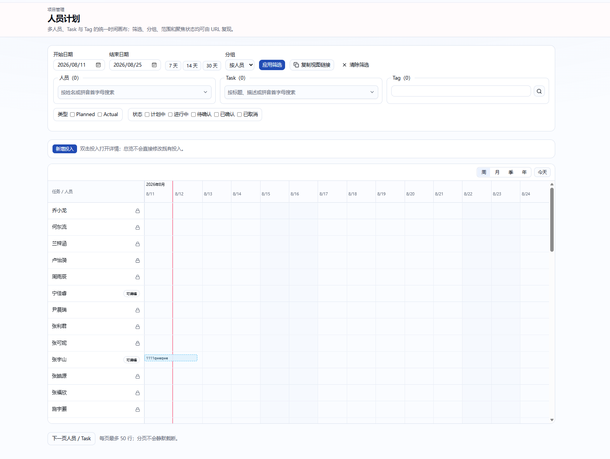

# 资源计划聚合页与 Tag 退役计划

## 1. 目标

本计划把现有 `/progress/resources` 从“人员计划筛选页”重构为面向所有已登录用户开放的
“资源计划”聚合页：用户选择 Project、Task、Person 或直接选择全部资源，系统在同一时间画布中
展示相应 Task 的 Current Plan 轨道与人员的完整投入轨道。

同时将 Project Management 领域中的 Tag 功能完整退役。此次明确不保留 Tag 的读写、筛选、
展示、路由或数据库兼容层，但必须保留已经写入 append-only 审计记录的历史事实。

当前页面参考：



## 2. 验收结果

完成后必须满足：

1. 页面、导航、README 和技术文档统一使用“资源计划”，不再出现“人员计划”入口文案。
2. 页面默认勾选“显示全部资源”，展示当前分页内全部可见 Task 的 Current Plan 和全部可见人员
   的投入时间线。
3. 关闭“显示全部资源”后，可多选 Project、Task、Person；选择结果在 URL 中可恢复和分享。
4. 选择 Project 会纳入该 Project 的全部未删除 Task、Project 有效成员及这些 Task 的有效成员；
   选择 Task 会纳入 Task Current Plan 及其有效成员；显式选择 Person 会额外纳入该人员。
5. Task 集合与 Person 集合采用并集，不使用交集筛选；一个 Person 行展示该人员全部未软删除
   Planned/Actual Segment，不因 Task 选择而隐藏其其他投入。
6. 同一画布同时显示 Task Plan 行和 Person 行，不再提供“按人员/按 Task”分组。
7. 不再提供开始/结束日期、7/14/30 天、类型、状态、待确认或 Tag 筛选。
8. 时间范围按当前 Task/Person 页实际内容计算，与 Task 工作台一致：内容两侧补两个上海日历月、
   逻辑窗口最多三年、数据按最多 180 天自适应块加载，并保证“今天”可导航。
9. Person 行显示全部未软删除 Planned/Actual，包括已确认和已取消 Planned；状态继续由既有视觉
   和详情表达，不删除历史计划事实。
10. 所有用户可读取资源计划；服务端继续按现有 capability 决定可创建、编辑、确认、取消或删除
    哪些人员的 Segment，不能因聚合选择扩大写权限。
11. Desktop 支持既有未保存创建草稿的直接交互；Pixel 5 继续只允许精确表单。Task Plan 行只读，
    Person 行沿用现有投入详情和创建能力。
12. Project、Task、Person 大集合有稳定分页和明确上限，不静默截断；非法、跨选择或过期 cursor
    返回中文局部错误或规范化回第一页。
13. 系统中不再存在 Tag 管理页、导航、Server Action、业务 service/query、Task/Segment Tag 输入、
    DTO、筛选、展示和 Prisma 模型。
14. 新 Prisma migration 先删除 `TaskTag`、`SegmentTag`，再删除 `Tag`；不修改旧 migration。
15. `/progress/tags` 返回 404；旧带 `tags` 查询参数的资源计划链接忽略并在下一次导航时清理，
    不提供 Tag 兼容结果。
16. 历史 `DomainAuditEvent` 和 `WorkSegmentChange` 不改写、不删除；安全 formatter 不再解析或展示
    `tagIds`，未知旧字段仍不得泄露原始 JSON。

## 3. 最终决策

### D1：一个全选开关

使用一个“显示全部资源”复选框，而不是给 Project、Task、Person 分别增加三个 All 开关：

- URL 没有显式选择时默认开启；
- 开启时 Project/Task/Person 选择器禁用并显示“已包含全部可见资源”；
- 关闭后使用三个多选器；三者均为空时显示明确空态，不把空集合解释为全部；
- 聚焦合法 Segment 时，服务端把其 Person 和可选 Task 临时并入当前集合，详情能够可靠打开。

该方案避免 `allProjects + selectedTasks + allPeople` 等难以解释的组合状态。

### D2：集合展开规则

显式模式下服务端构建：

```text
TaskSet = selected Task
        ∪ 未删除且 projectId ∈ selected Project 的 Task

PersonSet = selected Person
          ∪ selected Project 的有效 ProjectMember
          ∪ TaskSet 的有效 TaskMember
```

Task 和 Person 查询都必须再次应用现有全局可见性与 `deletedAt` 条件。客户端只能提交 Project、Task、
Person ID，不能提交展开后的成员或 Task 集合来绕过服务端装配。

### D3：混合轨道而不是分组

- TaskSet 当前页转为只读 `PLAN` 行，展示 Current Plan 的 Start、Milestone、Revision、Termination；
- PersonSet 当前页转为 `PERSON` 行，展示该人员全部非软删除 Segment；
- 不生成普通 `TASK` Segment 分组行；Task 选择用于增加 Plan 行和人员，而不是限制 Person 行事实；
- Task Plan 行排在 Person 行之前，两个分区都使用稳定名称排序。

### D4：默认、分页与预算

- 全部模式默认每页最多 25 条 Task Plan、50 条 Person；分别使用 `taskCursor`、`personCursor`；
- 显式 Project 展开超过一页时同样分页，不因一个 Project Task 多而失败；
- 单页最多 50 个 Task anchor、5,000 个 Node、5,000 个时间对象，沿用现有拒绝而非截断规则；
- cursor 绑定选择模式和 Project/Task/Person 集合 hash，伪造或修改选择后的旧 cursor 无效；
- 翻页保留选择、缩放和视口中心，且 Task/Person 可独立回到第一页。

### D5：内容驱动时间范围

- 当前页 Person Segment 与 Task Current Plan 共同参与内容边界；
- 没有内容时以今天为中心显示两个上海日历月缓冲范围；
- 内容超过三年时保留完整导航边界，但当前逻辑窗口夹紧为三年并显示既有裁剪提示；
- 初始只读取中心所在的 180 天块，左右导航按既有自适应 block action 加载；
- 删除显式 `from/to`，创建草稿不再扩写 URL 日期，而是由内容范围和草稿显示范围处理。

### D6：URL 协议

保留：

- `all=1|0`
- `projects=<csv>`、`tasks=<csv>`、`people=<csv>`
- `taskCursor`、`personCursor`
- `scale`、`center`、`focus`、`focusError`

删除：`from`、`to`、`group`、`types`、`statuses`、`tags` 和旧 `zoom`。ID 每类最多 50 个，去重后
按稳定顺序序列化。无选择的旧 URL 默认进入全部模式；包含旧 people/tasks 选择的链接进入显式模式。

### D7：Project 选择器

新增可多选的 Project picker，查询所有未删除且当前用户可见的 Project，而不是复用只允许 ACTIVE
Project 的 Task 归属选择器。搜索支持名称和拼音首字母，选中项可异步解析，单次最多 50 个。

### D8：权限与写操作

- 资源聚合查询只改变读取集合，不新增权限；
- 非成员仍可读取全局可见 Task、Plan 和 Segment，但不能修改；
- Person 行 `canCreateSegment`、Segment 详情 capability、Task Owner 管理他人投入等继续由服务端
  `authorize` 计算；
- 画布上的 Task Plan 行强制只读；
- 聚焦、分页、自适应 block 每次都重新鉴权并验证选择签名。

### D9：Tag 全量退役

本轮删除：

- Prisma `Tag`、`TaskTag`、`SegmentTag` 及 Account/Task/WorkSegment 反向关系；
- Tag migration 后的所有运行时 Prisma 访问；
- `/progress/tags`、导航、管理组件、actions、service、queries；
- Task 创建、草稿编辑、Active metadata、Revision composer 中的 Tag 字段；
- Segment create/update/batch/history DTO 中的 Tag 字段；
- Task picker、资源计划、列表、详情、通知摘要中的 Tag 展示或筛选；
- `canManageTags` capability 和 `tag.*` authorization action；
- README、TECH、TESTING 中仍描述有效 Tag 功能的内容。

保留旧 migration 和 append-only audit payload。新代码不得依赖旧 Tag 表存在。

### D10：数据库迁移

新增时间戳 migration：

```sql
DROP TABLE IF EXISTS "SegmentTag";
DROP TABLE IF EXISTS "TaskTag";
DROP TABLE IF EXISTS "Tag";
```

部署必须使用隔离 PostgreSQL 验证 `npm run db:deploy`。本迁移明确丢弃 Tag 数据，无法自动恢复；上线前
如需留档由运维做数据库备份，本应用不提供兼容导出逻辑。

## 4. UI 结构

资源计划页从上到下为：

1. 标题“资源计划”和一句聚合语义说明；
2. 紧凑选择卡：全选开关、Project/Task/Person 三个多选器、复制视图链接、清除选择；
3. 已选摘要：全部模式显示总览说明，显式模式显示 Project/Task/Person 数量；
4. TimeCanvas：Task Plan 分区在上、Person 分区在下；
5. Task 与 Person 独立分页；
6. 空选择、无结果、加载失败、范围裁剪和 focus 失败均使用中文局部状态。

Desktop 使用三列选择器；Pixel 5 堆叠为单列，按钮可换行，页面本身不得产生横向滚动。长名称在 picker
与行标题中截断但保留可访问全名。

## 5. 实现范围

主要改动位置：

- `app/progress/resources/page.tsx`：新 URL、选择装配、内容驱动画布与独立分页；
- `components/project-management/resource-filter-bar.tsx`：替换为资源集合选择器；
- `components/project-management/project-picker.tsx`：增加可见 Project 多选模式；
- `lib/project-management/queries/*`：Project 选项、资源集合分页、内容范围和 adaptive block；
- `components/project-management/time-canvas/adapter.ts`：资源计划显示混合 Plan/Person 行；
- `prisma/schema.prisma` 与新 migration：Tag 数据结构退役；
- Task/Segment validation、service、query、DTO、UI：删除 Tag 契约；
- `app/progress/tags`、Tag actions/service/query/component：删除；
- README、TECH、TESTING、相关回归测试：同步最终行为。

## 6. 测试计划

### 6.1 领域与查询

- 默认全部模式、显式 Project、Task、Person 以及三者并集；
- Project Task/成员展开、移出成员、已删除 Task/Project、停用但有历史投入人员；
- Person 行不因 Task 选择丢失其他 Task/独立投入；
- Planned/Actual 及终态 Planned 均返回，软删除 Actual 不返回；
- Task/Person 独立稳定分页，选择变化后旧 cursor 被拒绝；
- 内容范围、无内容、超过三年、180 天 block、结构版本冲突；
- 非管理员只读与允许/拒绝的 Segment mutation；
- Tag 表 migration 在隔离 PostgreSQL 上删除三张表且其他数据保留。

### 6.2 UI E2E

Desktop `1440x1000` 与 Pixel 5 均验证：

- 页面标题和导航统一为“资源计划”，旧 Tag 页面 404；
- 默认全选、关闭全选、三个 picker、清空和复制链接；
- Project/Task/Person 选择恢复、back/forward、刷新、非法 URL 规范化；
- Task Plan 与 Person 行同时出现，长名称、空结果、50+ 人员、25+ Task；
- Desktop 创建草稿、详情编辑和权限拒绝；Pixel 5 仅表单编辑；
- 首次/自适应加载失败、范围裁剪、focus 成功/失败；
- 无 Tag、类型、状态、日期和分组控件；
- 无 Next.js error overlay、未捕获错误和页面级横向滚动。

### 6.3 必跑命令

```bash
npm run check
npm run test:e2e
npm run build
npm run db:deploy
```

E2E 与 migration 只能使用安全 runner 和隔离 PostgreSQL；缺少凭据时必须报告未执行命令、替代验证
和剩余风险，禁止连接开发或生产数据库。

## 7. 完成定义

- 本计划的集合语义、权限、分页、范围和 Tag 退役全部实现；
- Prisma migration 与生成客户端一致；
- 运行时和有效文档没有 Tag 功能入口或契约；
- 新增领域、迁移和 Desktop/Pixel 5 回归；
- `npm run check`、`npm run build` 通过；安全环境可用时 E2E 与 db deploy 通过；
- 一次独立定向审查无新增可执行问题。
