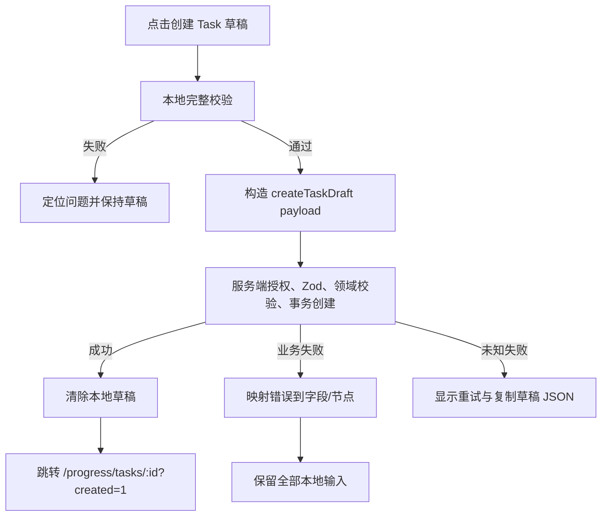

# 03. Task 创建工作台

## 1. 页面目标

创建页不是“填写一张长表单”，而是一个 **Task Plan Composer（任务计划编排器）**。用户应能在同一画面完成：

- Task 基本信息。
- 组织范围、优先级、Tag、关联 Task。
- 成员和角色。
- Revision/Review 策略。
- 计划开始时间。
- 多个 Milestone 的时间位置、顺序和详情。
- Termination 的时间和预期结果。
- 可选的初始人员 Planned Segment。
- 完整校验、草稿恢复和最终创建。

用户原句“这个 task 创建应该支持”未列完后续内容，本方案按“支持现有后端可表达的全部创建字段，并为关联 Task、自审策略、计划开始与初始 Segment 预留”处理。

## 2. 路由与页面状态

- 路由：`/progress/tasks/new`
- 查询参数：
  - `templateTaskId`：从现有 Task 复制结构。
  - `relatedTaskId`：预填关联 Task。
  - `start`：预填计划开始日期。
- 页面状态：
  - `EMPTY`：尚未开始。
  - `DIRTY_LOCAL_DRAFT`：本地有未提交修改。
  - `VALIDATING`：本地或服务端预检。
  - `SUBMITTING`：最终创建。
  - `CREATED`：获得服务端 Task ID 后跳转工作台。
  - `RECOVERABLE_DRAFT`：检测到同浏览器未完成草稿。

## 3. 桌面布局

```text
┌──────────────────────────────────────────────────────────────────────────────┐
│ ← 全部 Task   新建 Task                 本地已保存 10:32  撤销 重做 [校验] [创建草稿] │
├───────────────┬───────────────────────────────────────────────┬──────────────┤
│ 基本信息 300px │ 计划时间画布                                 │ 检查器 360px │
│               │                                               │              │
│ 标题          │ 计划开始 ┃────◆ M1────◆ M2────◆ M3────⚑ 结束 │ Milestone 2  │
│ 描述          │            阶段 1      阶段 2      阶段 3     │ 目标         │
│ 优先级        │                                               │ 完成条件     │
│ Team/Group    │ + 在时间轴上点击或拖入 Milestone              │ 截止时间     │
│ Tags          │                                               │ 验收要求     │
│ 关联 Task     ├───────────────────────────────────────────────┤ 业务说明     │
│ 成员          │ 可选：初始人员投入（折叠）                     │ 删除/复制    │
│ 策略          │ 张三 ─── [计划区间]                            │              │
└───────────────┴───────────────────────────────────────────────┴──────────────┘
```

### 3.1 左侧基本信息栏

默认 300px，可折叠为 48px 图标栏。分为：

1. **基本信息**：标题、描述、优先级。
2. **组织与分类**：team、techGroup、Tag、relatedTask。
3. **成员**：人员、Task role、Owner 标识。
4. **流程策略**：Revision approval mode、allow self review。
5. **计划设置**：计划开始时间、业务时区、默认吸附单位。

字段较多时使用折叠 section，但标题和成员完整性一直可见。

### 3.2 中央计划画布

- 顶部 96–128px 为计划轨道。
- 每个 Milestone 按真实日期间距显示。
- 两个 Milestone 之间显示阶段带和时长。
- Termination 固定为终点。
- 下方可选显示初始人员投入区，不在 P0 时可折叠为提示卡。
- 画布空白处始终有可发现的创建入口，不能只依赖隐藏的双击。

### 3.3 右侧检查器

选中对象时显示对象表单；未选中时显示“计划概览”：

- Milestone 数量。
- 总计划跨度。
- 时间顺序错误。
- 未完成字段。
- 无成员/无 Owner 警告。
- 计划与初始 Segment 的冲突提示。

## 4. 顶部命令栏

左侧：返回、页面标题、草稿名称。  
中间：本地保存状态、撤销、重做。  
右侧：预览/校验、创建草稿、更多。

### 4.1 主按钮

- 默认主按钮：`创建 Task 草稿`。
- 旁边下拉可提供：
  - `创建草稿并进入详情`。
  - `创建后立即激活`（仅在后端支持安全串联、且全部激活条件满足时显示）。
- 未通过本地必填校验时按钮可点击但提交后聚焦错误，不要只灰掉而不解释。

### 4.2 离开保护

有本地未保存草稿时：

- 浏览器关闭/刷新使用 `beforeunload` 提示。
- 站内跳转使用自定义确认对话框。
- 提供“保存本地草稿并离开”“放弃”“继续编辑”。

## 5. Task 字段设计

| 字段 | 控件 | 创建页规则 |
|---|---|---|
| 标题 | 单行 Input | 必填；最大长度由服务端 schema 决定；画布和列表即时同步。 |
| 描述 | Textarea | 支持多行；不抢占首屏，默认 3 行。 |
| 优先级 | Segmented/Select | 低/中/高等现有枚举。 |
| team | Combobox | 可输入已有值或选择标准项；后端若无字典接口先文本输入。 |
| techGroup | Combobox | 与 team 联动但不硬编码。 |
| Tags | 多选 Combobox | 显示颜色、说明；无 Tag CRUD 时只选择。 |
| relatedTask | 搜索选择器 | 仅关联，不形成父子层级；显示状态和当前 Milestone。 |
| members | 人员多选表 | 每行 person + role；至少一个 Owner 或按现有规则校验。 |
| revisionApprovalMode | Radio/Select | 显示每种模式的行为解释。 |
| allowSelfReview | Switch | 需要后端创建字段支持。 |
| plannedStartAt | DateTime | 建议新增到 TaskPlanVersion；用于首阶段起点。 |
| timezone | 只读/Select | P0 可固定 Asia/Shanghai 并明确显示。 |

### 5.1 成员编辑

成员不是简单头像多选，而是表格：

```text
人员             角色              操作
张三             Owner             移除
李四             Contributor       移除
[+ 添加成员]
```

- 搜索结果显示姓名、团队、技术组、账号状态。
- 同一人员是否允许多个角色依服务端规则决定；前端不臆测。
- 移除唯一 Owner 时立即警告。
- 计划画布初始人员行从成员中选择，不自动为所有成员创建 Segment。

## 6. Milestone 创建交互

### 6.1 创建入口

提供四种等价入口：

1. 工具栏 `+ Milestone`，默认放在最后一个节点之后。
2. 在时间轴空白处单击，出现 `在此创建 Milestone` 小按钮。
3. 双击时间轴空白处。
4. 键盘按 `M`，在当前焦点日期创建。

不建议只做“从左侧拖一个图标到时间轴”，因为可发现性和键盘操作较差；拖入可作为额外快捷路径。

### 6.2 新建后的默认值

- 临时 ID：`draft-node-*`。
- goal：空。
- expectedCompletedAt：吸附后的目标日期。
- completionCriteria：空。
- reviewRequirements：空。
- businessDescription：空。
- sequence：按日期和同日排序计算。

创建后立即选中并打开右侧检查器，焦点放到“目标”。

### 6.3 Milestone 快速卡片

单击菱形时先出现锚定小卡，展示：

- 节点序号和目标。
- 截止时间。
- 完整度/错误数。
- `编辑详情`、`复制`、`在后面插入`、`删除`。

用户点击“编辑详情”或按 Enter 后打开固定右侧检查器。快速卡片适合浏览，检查器适合编辑，避免每次点击都遮住画布。

### 6.4 拖动与顺序

- 拖动改变 `expectedCompletedAt`。
- 节点顺序通常由时间自动决定。
- 同一时间点的节点允许通过小型上下/左右排序控件调整 sequence。
- 拖过其他节点时显示插入位置和“序号 2 → 4”。
- 日期改变后，右侧日期字段同步更新。
- 若拖动造成时间规则错误，先允许预览，但以明确警示显示；保存前必须修复。

### 6.5 删除

- 空白新节点可立即删除并支持撤销。
- 已填写较多字段的节点删除需确认。
- Termination 不能删除，只能编辑。
- 至少保留一个 Milestone；删除最后一个时阻止并说明。

### 6.6 复制

复制保留业务字段，日期默认放到原节点之后一个吸附单位或下一个合理空档；标题可加“副本”但不强制。

## 7. Milestone 检查器字段

```text
Milestone #2                                  [•••]
状态：草稿节点

目标 *
[完成前端时间画布 MVP]

预期完成时间 *
[2026-08-12 18:00]

完成条件 *
[可拖选创建、拖动和调整 Planned Segment；E2E 通过]

验收要求 *
[由 Task Owner 与 Reviewer 依据测试记录验收]

业务说明
[范围、限制、交付物说明]

关联初始投入（可选）
[张三 8/5–8/9] [李四 8/8–8/12]

[删除节点]                         [应用]
```

- 完成条件关注“做到什么算完成”。
- 验收要求关注“谁、依据什么、如何审查”。
- 两者必须使用独立标签和辅助文案。
- 日期字段旁提供“移动到前一节点后 7 天”等相对快捷选项，但最终存绝对时间。

## 8. Termination 设计

Termination 固定显示在轨道末尾，使用旗帜形态。

字段：

- `plannedAt`：计划结束时间，必填。
- `plannedOutcomeCriteria`：Task 整体预期结果，必填。
- `businessDescription`：可选。

规则：

- 不能早于最后一个 Milestone。
- 拖动 Termination 改变计划总跨度。
- 当最后一个 Milestone 向后拖过 Termination 时，优先显示冲突，不自动静默移动终点；可提供“一并后移 Termination”的确认快捷操作。

## 9. 计划阶段背景带

Milestone 是时间点，但用户还需要感知阶段长度。画布在节点间渲染弱背景带：

```text
计划开始 ┃──── 阶段 1 ────◆ M1──── 阶段 2 ────◆ M2──── 收尾 ────⚑
```

阶段名称默认使用“至 Milestone X”，也可只显示目标摘要。阶段带只用于理解，不是新数据模型。

## 10. 初始 Segment（建议 P1，接口可先预留）

在创建 Task 时可展开“初始人员投入”：

- 行只包括已选成员。
- 在人员行拖选创建 Planned Segment。
- 新 Segment 自动关联当前 Task 草稿和选中 Milestone。
- 因 Task 尚无服务端 ID，Segment 暂存在本地 draft 中。
- 最终创建需要后端提供事务式“创建 Task + 初始 Segment”，或先创建 Task 后批量创建 Segment并对失败进行明确补偿。

P0 若后端不改，可把该区显示为“创建 Task 后安排人员”，不应伪装为已保存。

## 11. 校验设计

### 11.1 实时本地校验

- 标题非空。
- 至少一个 Milestone。
- 每个 Milestone 的 goal、completionCriteria、expectedCompletedAt、reviewRequirements 完整。
- Termination 完整。
- Milestone 日期不早于计划开始。
- 日期按 sequence 非递减或严格递增（由业务最终确定）。
- Termination 不早于最后 Milestone。
- 成员和 Owner 规则满足。
- 相同人员、角色、重复 Tag 等结构性问题。

### 11.2 校验呈现

- 顶部 `校验` 按钮显示错误数量。
- 画布节点显示小型错误徽标。
- 左侧 section 标题显示错误数。
- 右侧“问题列表”可点击定位到字段或节点。
- 提交失败后自动选择第一个错误对象并聚焦字段。

### 11.3 服务端校验

最终提交仍调用服务端 schema 和领域验证。前端错误文案必须映射为用户可理解的中文，不直接显示原始 Zod path、SQL 或内部 ID。

## 12. 本地草稿

由于现有后端只支持一次性创建，建议：

```ts
type LocalTaskDraft = {
  schemaVersion: 1;
  draftId: string;
  savedAt: string;
  task: TaskCreateForm;
  nodes: DraftPlanNode[];
  initialSegments: DraftSegment[];
  selectedEntityId: string | null;
  viewport: { rangeStart: string; rangeEnd: string; zoom: string };
};
```

### 12.1 保存策略

- 用户停止输入后约 500–1000ms 写入 IndexedDB 或 localStorage。
- 只保存纯 JSON，不保存文件对象和敏感令牌。
- 进入页面时检查同账号、同环境的未完成草稿。
- 展示保存时间和恢复/放弃操作。
- schemaVersion 不兼容时只允许导出 JSON 或安全放弃，不能崩溃。

### 12.2 撤销/重做

- 记录领域命令：新增节点、移动节点、字段修改、删除、成员变更。
- 文本输入按短时间窗口合并，避免每个字符一条历史。
- Server submit 后清空本地历史。

## 13. 提交流程



必须携带稳定 `idempotencyKey`，用户重复点击或网络重试不能创建两个 Task。

## 14. 创建成功后的落点

跳转到 Task 工作台并显示一次性成功提示：

- 已创建 Draft Task。
- 当前计划版本 v1。
- 下一步：安排人员、检查计划、激活 Task。
- 若用户选择“创建后激活”，则展示激活结果；激活失败不能删除已创建草稿。

## 15. 移动端布局

移动端改为：

1. 顶部精简命令栏。
2. 基本信息折叠卡。
3. 纵向计划时间线：按日期排序的 Milestone 卡片。
4. 底部固定 `+ Milestone` 和 `创建草稿`。
5. 点击节点进入全屏/底部抽屉表单。
6. 日期调整用字段和“前移/后移一天”按钮，不要求横向拖动。

## 16. P0 验收

- 能创建包含 1–200 个 Milestone 的本地计划草稿。
- 能在时间轴上点击或双击新增 Milestone。
- 能拖动 Milestone 改变日期和顺序。
- 能打开快速卡和右侧检查器编辑全部字段。
- Termination 始终为最后节点且不能被删除。
- 刷新后可恢复本地草稿。
- 创建失败不丢输入。
- 重复提交不重复创建。
- 只用键盘可新增、选中、移动和编辑节点。
- Pixel 5 使用纵向计划编辑，不出现不可用的压缩甘特图。
