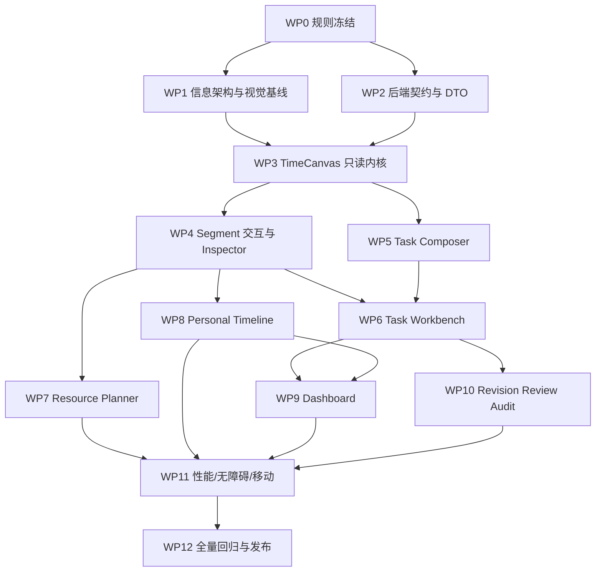

# 10. 实施 WBS 与分工

## 1. 角色建议

即使由少数人兼任，也应明确职责：

| 角色 | 主要职责 |
|---|---|
| 产品负责人 | 冻结业务规则、优先级、验收口径，处理 Draft/Active/Revision 等语义。 |
| UX/UI 设计 | 信息架构、交互原型、视觉变量、极端状态和移动端适配。 |
| 前端平台负责人 | TimeCanvas 内核、状态机、虚拟化、无障碍、技术边界。 |
| 前端业务负责人 | Task Composer、Task Workbench、Resource Planner、Dashboard。 |
| 后端负责人 | 查询 DTO、Actions、权限、并发、冲突、迁移。 |
| QA/测试 | Playwright、权限、状态机、并发、视觉/响应式和性能验收。 |
| 评审人 | 独立检查领域正确性、安全、可维护性和回归风险。 |

## 2. 工作包依赖图

## 3. WP0：规则冻结

### 负责人

产品负责人 + 后端负责人 + 前端负责人。

### 需要冻结的问题

1. Milestone 日期必须严格递增还是允许同日？
2. 计划开始时间是否必填，存 TaskPlanVersion 还是其他位置？
3. Task 创建时是否必须有 Owner？一个人能否多角色？
4. Draft Task 的节点如何增量保存？
5. Active Task 哪些元数据可直接改，哪些必须 Revision？
6. 谁能为他人创建/移动 Planned Segment？
7. Actual 是否允许修改时间，谁能改？
8. 其他 Task 的占用向谁显示详情，向谁只显示 Busy？
9. Allocation 的单位与冲突规则。
10. Task 创建时是否 P0 支持初始 Segment。
11. 业务时区是否固定 Asia/Shanghai。
12. 跨人员重新指派是否进入范围。

### 输出

- 决策记录 ADR。
- 权限矩阵。
- 状态机表。
- 日期/时区规则。
- P0/P1/P2 边界。

### 完成条件

所有阻塞设计的规则不再以“前端自行判断”存在；未冻结项明确降级方案。

## 4. WP1：信息架构与视觉基线

### UX/UI 任务

- 设计项目管理左侧导航和页面命令栏。
- 设计桌面 1440×1000 的 Task Composer、Task Workbench、Resource Planner、Dashboard。
- 设计 Pixel 5 的 Task Composer、Task Workbench Agenda、个人 Agenda、Dashboard。
- 定义状态矩阵、画布图例、Inspector、Popover、Dialog。
- 为正常、空、加载、错误、只读、冲突、逾期、长文本制作状态稿。
- 定义可点击/拖动命中区域和键盘路径。

### 前端任务

- 对齐现有 Tailwind/theme token。
- 设计语义 CSS 变量。
- 决定 Shell 迁移路径。
- 创建静态 fixture 页面验证布局，不接业务。

### 输出

- Figma/原型或同等级设计稿。
- 组件状态清单。
- 视觉 token 对照表。
- 响应式规则。

### 完成条件

每个关键页面都有正常 + 至少 4 个极端状态；交互稿说明点击、拖动、键盘和失败行为。

## 5. WP2：后端契约与 DTO

### 后端任务

- 增加 plannedStartAt 与迁移。
- 增加计划日期顺序校验。
- 设计 `getTimeCanvasData`。
- 设计 person/task/tag 搜索。
- 为 Segment/Task/Node 返回 permission flags。
- 增加 versionToken/陈旧写入错误。
- 设计 Busy DTO。
- 设计 Draft Task 更新 Actions。
- 设计统一错误 code。

### 前端配合

- 提供 TypeScript DTO 需求。
- 编写 mock adapters。
- 检查返回量和数据缺口。

### QA

- 校验权限泄露。
- 校验日期边界、分页、范围上限。
- 校验并发错误。

### 完成条件

前端可用 mock 和真实 DTO 相同类型开发；接口有权限、错误和分页契约，不靠口头约定。

## 6. WP3：TimeCanvas 只读内核

### 前端平台任务

- 时间坐标转换与 snap。
- Time Axis、Grid、Today Line。
- Row Header 与 Canvas 同步滚动。
- 计划轨道、Milestone、Termination。
- Segment block、Busy block、冲突覆盖。
- 泳道布局。
- 纵向/横向窗口化。
- 选择与 Inspector 容器，不含业务表单。
- URL range/zoom adapter。
- 移动端 TimeAgenda 数据映射。

### UX 验收

- 各缩放档位可读。
- 同日节点、重叠 Segment、长文本不崩。
- 图例与状态一致。

### QA

- 200 节点、50 人、30 天 fixture。
- 横向滚动只发生在画布。
- Sticky 对齐。
- 键盘焦点可达。

### 完成条件

只读 Demo 能稳定渲染四种模式的 fixture；滚动、缩放、聚焦和选择可用。

## 7. WP4：Segment 交互与 Inspector

### 前端平台

- Brush Create 状态机。
- Drag/Resize、吸附、自动滚动。
- 多选和批量工具条。
- 乐观更新、回滚、陈旧数据处理。
- 屏幕阅读器播报。

### 前端业务

- Segment Quick Create。
- Segment 完整 Inspector。
- Split/Merge/Cancel/Confirm/Partial Confirm Dialog。
- mutation adapter 接现有 Actions。
- Conflict Inspector。

### 后端

- 补充即时冲突预览/复扫。
- 确认 move/update 的版本契约。
- 批量 mutation 返回逐项结果。

### QA

- 鼠标、触控板、键盘路径。
- 权限允许/拒绝。
- 网络失败、重复提交、陈旧版本。
- 时间边界和最小时长。

### 完成条件

在独立 TimeCanvas Demo 中可完成 Segment 创建→移动→调整→确认/取消的完整闭环。

## 8. WP5：Task Composer

### 前端业务

- `/progress/tasks/new` 路由。
- 左侧 Task metadata/members/policy。
- 本地草稿与恢复。
- Milestone Quick Card、Inspector、拖动和排序。
- Termination。
- 计划校验面板。
- 撤销/重做。
- `createTaskDraft` 提交、字段错误映射和 idempotency。
- 创建成功落点。

### 后端

- 补齐 create 字段。
- chronology validation。
- Draft update（若本阶段纳入创建后继续编辑）。

### UX

- 首次空白引导。
- 200 节点可操作性。
- 计划范围自动 fit。

### QA

- 刷新恢复、离开保护。
- 提交失败不丢输入。
- 重复点击不重复创建。
- Termination 规则。
- 移动端纵向编辑。

### 完成条件

能从空白创建合法 Task Draft，并在失败、刷新和键盘操作下保持可靠。

## 9. WP6：Task Workbench

### 前端业务

- 新 Task Header。
- 标签页框架。
- 计划与资源默认视图。
- 参与人行和 Busy overlay。
- 在人员行创建 Segment。
- Milestone 只读/可编辑语义。
- Active Task `发起 Revision` 入口。
- Overview 字段与权限。

### 后端

- Task-scoped TimeCanvas data。
- Busy DTO。
- metadata/member/tag mutations（可按 P1 分拆）。
- 权限 flags。

### QA

- Draft/Active/Completed/Archived。
- Owner/Member/Reviewer/Viewer。
- 无成员/无 Segment/无 Busy 权限。
- 当前阶段默认范围。

### 完成条件

用户在一个画面中能理解计划和资源，并能从 Task 上下文创建/调整合法 Segment。

## 10. WP7：Resource Planner

### 前端业务

- 多人员/Task/Tag 筛选。
- 按人员/Task 分组。
- 多选批量操作。
- 冲突中心深链。
- URL 复现视图。
- 复制视图链接。

### 后端

- 多 ID 聚合查询与人员分页。
- 搜索接口。
- 批量动作逐项结果。

### QA

- 50 人与大量 Segment。
- 筛选组合、空结果。
- 无详情 Busy。
- 冲突定位和返回。

### 完成条件

可指定人员和 Task，可靠地查看并调整范围内的安排；页面不退化为卡片列表。

## 11. WP8：Personal Timeline

### 前端业务

- `/progress/my-timeline`。
- 日/周模式。
- 个人 Quick Create。
- 独立 Segment。
- 到期确认队列。
- 移动 Agenda。

### 后端

- 个人范围查询。
- 到期 Planned 查询。
- permission flags。

### QA

- 本人和代排场景。
- Planned→Actual 完整/部分确认。
- 冲突、关联需复核。
- Pixel 5 核心流程。

### 完成条件

普通成员无需进入全局资源页即可完成自己的日常计划和确认。

## 12. WP9：Dashboard

### 前端业务

- 指标条。
- 个人时间预览。
- Action Inbox。
- Active Task 表。
- 通知降级区。

### 后端

- `getMyWorkDashboard` 或拆分后的等价查询。
- 统一待办排序和 permission-aware action。

### QA

- 有数据、空数据、部分查询失败。
- 待办排序。
- 快速创建和跳转上下文。
- 移动布局。

### 完成条件

首页首屏突出今天的时间和待办，可完成至少一个高频动作。

## 13. WP10：Revision、Review、Audit 深化

### 前端

- Revision 编辑器复用 Plan Rail。
- Current vs Candidate 比较。
- Review Evidence 与历史。
- Audit 列表和筛选。

### 后端

- 完整 Review/Audit 查询。
- 受影响 Segment 摘要。
- 权限和分页。

### QA

- 基线陈旧。
- Completed 前缀锁定。
- Approve/Reject/Revision Required。
- 无权限证据。

### 完成条件

计划变更和验收不再依赖隐藏 Action，具备完整可视化上下文。

## 14. WP11：性能、无障碍、移动

### 前端平台

- 虚拟化调优。
- pointermove 帧合并。
- reduced motion。
- keyboard drag/live region。
- Agenda 完整适配。
- 长文本和重叠聚合。

### QA

- 桌面/Pixel 5 全量 E2E。
- 性能 fixture。
- 屏幕阅读器基本路径。
- 页面级横向滚动检查。

### 完成条件

达到 `11-测试与验收标准.md` 的非功能验收。

## 15. WP12：全量回归与发布

### 任务

- `npm run check`。
- 项目管理 E2E 全量。
- 全站采购等模块冒烟，确保 Shell/CSS 未污染。
- Prisma migration 在隔离 PostgreSQL 验证。
- 通知 side effect 使用安全 guard。
- 数据迁移/回滚脚本和运行手册。
- 文档更新：README、TECH、TESTING、NOTIFICATIONS（如行为改变）。
- 独立评审至少两轮，修复后复测。

### 完成条件

无已知高严重问题；所有未运行测试、限制和风险被明确记录。

## 16. 任务粒度要求

每个开发任务必须包含：

- 用户可见结果。
- 业务状态与权限。
- 输入/输出 DTO。
- Loading/empty/error/disabled/success。
- Desktop/Pixel 5 行为。
- 自动化测试。
- 文档影响。
- 非目标。

禁止把“实现甘特图”作为一个无法评审的大任务；必须拆成时间轴、行、对象层、选择、创建、拖动、Resize、虚拟化、Inspector 等独立可验收工作包。

## 17. 建议提交边界

- Shell/路由与 TimeCanvas 内核不混同一提交。
- 后端 schema migration 与前端使用可成一组，但不能夹带无关重构。
- 每个业务页面接入单独提交。
- 视觉 token 与大范围格式化分离。
- 每个关键状态转换附回归测试。
- 新依赖单独说明目的、体积、维护和替代方案。
