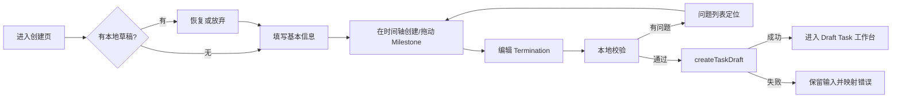
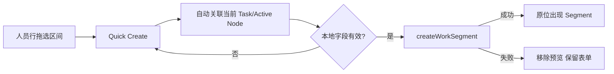
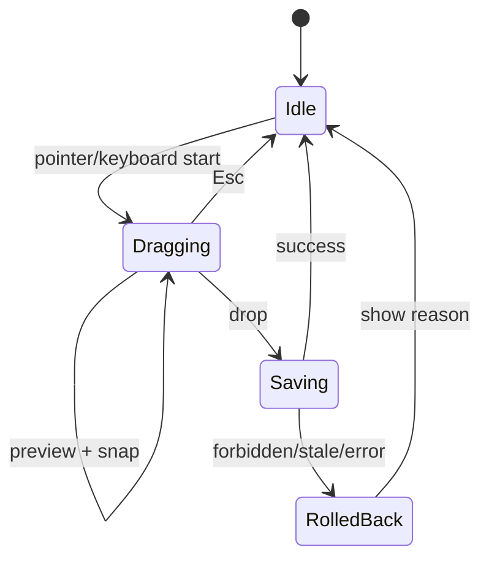
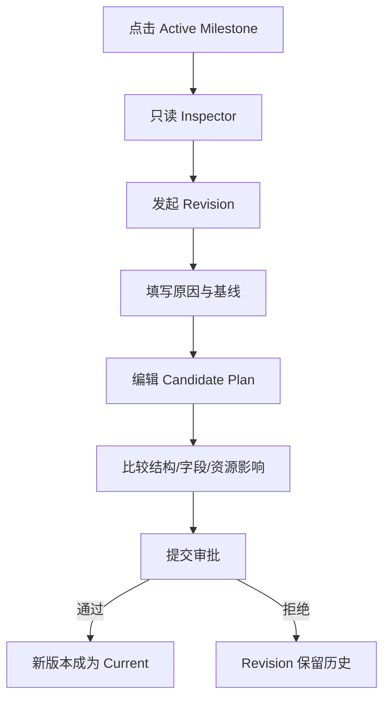
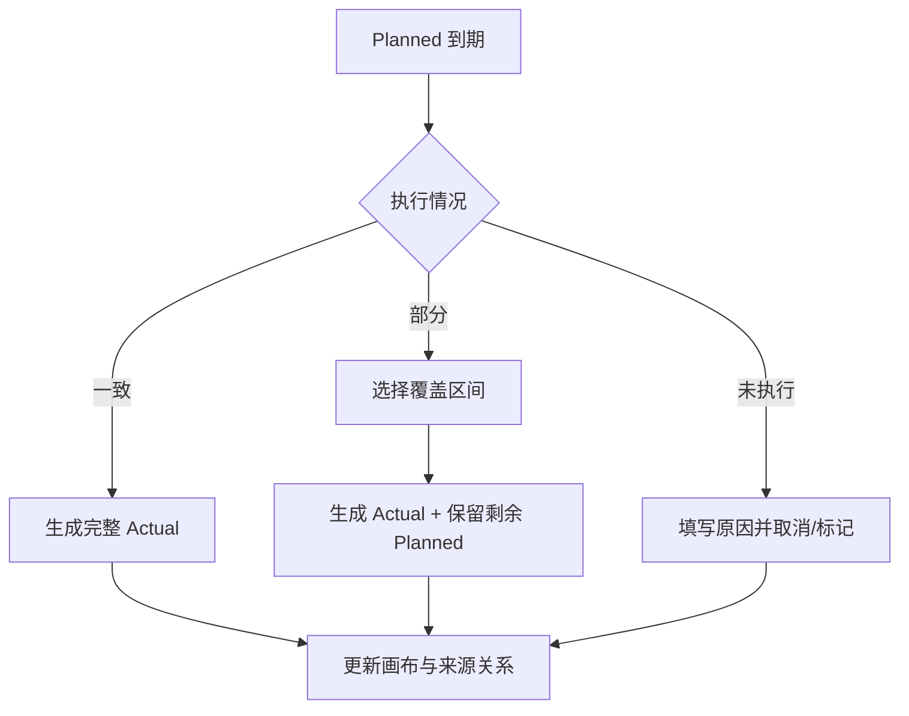

# 12. 页面线框与关键流程

本文档提供可直接交给 UX/UI 和前端的文本线框。尺寸是相对关系，不是最终像素稿。

# A. 项目管理 Shell

## A1. 桌面

```text
┌──────────────────────────────────────────────────────────────────────────────┐
│ 全站 AppHeader：Logo / 系统入口 / 全局搜索 / 通知 / 用户                     │
├──────────────┬───────────────────────────────────────────────────────────────┤
│ 项目管理      │ 页面命令栏                                                    │
│              ├───────────────────────────────────────────────────────────────┤
│ 我的工作      │                                                               │
│ 我的时间      │ 页面内容                                                      │
│ Task          │                                                               │
│ 资源计划      │                                                               │
│ 资源冲突      │                                                               │
│ 待我处理      │                                                               │
│ 通知          │                                                               │
│              │                                                               │
│ [折叠]        │                                                               │
└──────────────┴───────────────────────────────────────────────────────────────┘
```

### 行为

- 左侧导航 sticky，占满 AppHeader 下方高度。
- 当前项同时有形态和文字标识。
- 折叠后保留图标和 Tooltip。
- 低宽桌面可默认折叠。
- 页面内容 `min-width: 0`。

## A2. 移动

```text
┌─────────────────────────────┐
│ ☰  项目管理 / 当前页面   ••• │
├─────────────────────────────┤
│ 页面内容                    │
│                             │
└─────────────────────────────┘
```

导航使用 Drawer，不增加底部过多入口。

# B. Task 创建工作台

## B1. 空白状态

```text
┌──────────────────────────────────────────────────────────────────────────────┐
│ ← 全部 Task     新建 Task                        草稿尚未保存      [创建草稿] │
├───────────────┬───────────────────────────────────────────────┬──────────────┤
│ 基本信息       │ 计划时间线                                    │ 计划概览     │
│               │                                               │              │
│ 标题 *         │ 计划开始                                      │ 0 个节点     │
│ [          ]   │ 2026/08/01 ┃──────────────────────⚑ 结束      │ 4 个问题     │
│               │                                               │              │
│ 描述           │     点击时间轴，或                            │ • 标题为空   │
│ [          ]   │     [+ 添加第一个 Milestone]                  │ • 无成员     │
│               │                                               │ • 无节点     │
│ 优先级         │                                               │ • 结束未填   │
│ Team / Group   │                                               │              │
│ Tag            │                                               │              │
│ 成员           │                                               │              │
│ 流程策略       │                                               │              │
└───────────────┴───────────────────────────────────────────────┴──────────────┘
```

## B2. 有计划状态

```text
┌──────────────────────────────────────────────────────────────────────────────┐
│ ← 全部 Task   时间画布重构 [本地草稿]      已保存 10:32  ↶ ↷  [校验 1] [创建]│
├───────────────┬───────────────────────────────────────────────┬──────────────┤
│ 基本信息       │ [−] 日 [+] [适应计划] [+ Milestone]           │ Milestone #2 │
│               ├───────────────────────────────────────────────┤              │
│ 标题           │ 8/1       8/5       8/10      8/15      8/20  │ 目标 *       │
│ 描述           │  ┃────────◆──────────◆─────────◆─────────⚑    │ [前端 MVP]   │
│ 高优先级       │           M1         M2 当前    M3         结束│              │
│ Team A         │      阶段 1       阶段 2      阶段 3          │ 截止 *       │
│ Frontend       │                                               │ [8/10 18:00] │
│ Tag: 重构      │                                               │              │
│               │ 选中节点时显示对齐线和日期                    │ 完成条件 *   │
│ 成员 4         │                                               │ [          ] │
│ Owner 张三     ├───────────────────────────────────────────────┤              │
│ Dev 李四       │ 初始人员投入（可折叠）                        │ 验收要求 *   │
│ Reviewer 王五  │ 张三     ░ 原型 ░░                            │ [          ] │
└───────────────┴───────────────────────────────────────────────┴──────────────┘
```

## B3. Milestone Quick Card

```text
                  ┌────────────────────────────┐
        ◆ M2 ─────│ Milestone #2               │
                  │ 前端时间画布 MVP            │
                  │ 8 月 10 日 18:00             │
                  │ 1 个字段未完成               │
                  │ [编辑详情] [复制] [•••]      │
                  └────────────────────────────┘
```

## B4. 拖动 Milestone

```text
原位置：◇ M2
新位置：            ◆ M2
                    │ 8 月 12 日 18:00
                    │ 序号 2 → 3
时间轴：────◆ M1────┼────◆ M3────⚑
```

### 交互

- 鼠标按下时选中。
- 移动超过阈值进入 dragging。
- 辅助线显示 snap 日期。
- 松开更新本地草稿。
- Esc 恢复原位置。

# C. Task 详情工作台

## C1. Header

```text
← Task
时间画布重构                         [Active] [高] [重构]  v3
当前：M2 前端 MVP · 8 月 12 日 18:00 · 剩余 8 天
4 名成员 · 6 条计划 · 3 条实际 · 1 个冲突
                                        [发起 Revision ▼]
```

## C2. 计划与资源

```text
┌──────────────────────────────────────────────────────────────────────────────┐
│ [计划与资源] [概览] [修订与历史] [验收] [审计]                               │
├──────────────────────────────────────────────────────────────────────────────┤
│ 7/27–8/16  ‹  今天  ›   [−] 日 [+]  [当前阶段] [适应Task] [筛选 2] [图例]    │
├──────────────┬───────────────────────────────────────────────┬───────────────┤
│ 计划          │ ┃────✓ M1────◆ M2 当前────◇ M3────⚑           │ Inspector     │
│              │             今天│                             │               │
├──────────────┼───────────────────────────────────────────────┤ Segment        │
│ 张三          │ █ 原型 Actual █ ░ 前端实现 Planned ░░  !      │ 前端实现      │
│ Owner · 80%   │                                               │ Planned       │
├──────────────┼───────────────────────────────────────────────┤ 张三          │
│ 李四          │ ▒ Busy ▒       ░ 接口联调 ░                   │ 8/5–8/10      │
│ Dev · 冲突1   │                                               │ Task / M2     │
├──────────────┼───────────────────────────────────────────────┤ [保存]        │
│ 王五          │                      ░ 验收准备 ░              │               │
│ Reviewer      │                                               │               │
└──────────────┴───────────────────────────────────────────────┴───────────────┘
```

## C3. 拖选创建

```text
李四行：──────────┌────────────────────┐──────────
                  │ 8/7 09:00–8/9 18:00│
                  │ 3 天               │
                  └────────────────────┘

松开后：
┌─────────────────────────────┐
│ 新建计划投入                │
│ 李四 · 当前 Task · M2       │
│ 8/7 09:00–8/9 18:00         │
│ 内容 * [接口联调        ]   │
│ Allocation [80%]            │
│ [更多字段]     [取消] [创建]│
└─────────────────────────────┘
```

## C4. Active 节点只读

```text
Milestone #2                         [锁]
前端时间画布 MVP
截止：8 月 12 日 18:00

当前 Task 已激活。Current Plan 不能直接修改。
要调整目标、条件、顺序或时间，请创建 Revision。

[查看验收]                    [发起 Revision]
```

# D. 全局资源甘特

## D1. 默认

```text
┌──────────────────────────────────────────────────────────────────────────────┐
│ 资源计划                                             [创建 Segment]           │
├──────────────────────────────────────────────────────────────────────────────┤
│ 人员 [张三 ×][李四 ×]  Task [A ×][B ×]  未来14天  分组[人员]  [筛选 3]       │
├──────────────┬───────────────────────────────────────────────────────────────┤
│ 人员          │ 7/29   7/30   7/31   8/1   8/2   8/3   8/4                 │
├──────────────┼───────────────────────────────────────────────────────────────┤
│ 张三 100% !1 │ ░ Task A ░░░      █ Task B █                               │
├──────────────┼───────────────────────────────────────────────────────────────┤
│ 李四 60%     │    ░ Task B ░        ▒ Busy ▒                              │
├──────────────┼───────────────────────────────────────────────────────────────┤
│ 王五 40%     │                 ░ Review ░                                  │
└──────────────┴───────────────────────────────────────────────────────────────┘
```

## D2. 多选工具条

```text
                        ┌────────────────────────────────────────────┐
                        │ 已选 4 项  [平移] [改关联] [取消] [确认] × │
                        └────────────────────────────────────────────┘
```

## D3. Conflict Inspector

```text
资源冲突 · 高
张三 · 8/1 09:00–18:00

涉及安排
• Task A / 前端实现 / Planned / 80%
• Task B / 演示支持 / Planned / 60%

触发原因
该时间段 Allocation 合计超过允许范围。

[预览建议]
[确认已知] [调整安排] [解决] [忽略至…]
```

# E. 个人时间线

## E1. 桌面周视图

```text
┌──────────────────────────────────────────────────────────────────────────────┐
│ 我的时间   7/27–8/2       ‹ [今天] ›   [日|周]                     [新建]    │
├─────────────┬────────────────────────────────────────────────────────────────┤
│ 本周摘要     │ 周一   周二   周三   周四   周五   周六   周日               │
│ 计划 6 项    │ ░ A ░   █ B █   ░ 独立 ░░    !                              │
│ 待确认 2     │                                                                │
│ 冲突 1       │                                                                │
├─────────────┴────────────────────────────────────────────────────────────────┤
│ 到期确认                                                                    │
│ Task A · 原型  计划 7/29 09:00–12:00   [一致] [部分完成] [未执行]            │
└──────────────────────────────────────────────────────────────────────────────┘
```

## E2. 移动 Agenda

```text
┌──────────────────────────────┐
│ 我的时间       7 月 29 日  › │
│ 计划 6h · 待确认 1 · 冲突 1  │
├──────────────────────────────┤
│ 09:00–11:00                  │
│ 前端原型                     │
│ Task A · Planned             │
├──────────────────────────────┤
│ 13:00 ◆ Milestone            │
│ 原型评审                     │
├──────────────────────────────┤
│ 14:00–18:00                  │
│ 接口联调                     │
│ Task A · Actual              │
├──────────────────────────────┤
│               [＋ 新建安排]  │
└──────────────────────────────┘
```

# F. `/progress` 首页

## F1. 桌面

```text
┌──────────────────────────────────────────────────────────────────────────────┐
│ 我的工作 · 2026/7/29 周三                           [新建安排] [创建 Task]    │
├──────────────────────────────────────────────────────────────────────────────┤
│ 今日计划 6h │ Active 4 │ 待我处理 3 │ 冲突 1 │ 本周临期 2                   │
├─────────────────────────────────────────────┬────────────────────────────────┤
│ 我的时间                                    │ 待我处理                       │
│ 当前周迷你时间线                            │ [逾期] M2 待提交验收            │
│                                             │ [冲突] 张三 8/1                 │
│ 可拖选新建                                  │ [审批] Revision v4              │
│                           [打开完整时间线]   │                     [查看全部] │
├─────────────────────────────────────────────┴────────────────────────────────┤
│ Active Task                                                                  │
│ Task A | M2 | 8/12 | Owner | 本周3项 | 冲突1 | 打开                         │
│ Task B | M1 | 8/18 | Member| 本周1项 | 正常  | 打开                         │
├──────────────────────────────────────────────────────────────────────────────┤
│ 近期通知（折叠）                                                             │
└──────────────────────────────────────────────────────────────────────────────┘
```

# G. 关键流程

## G1. 创建 Task



## G2. 从 Task 创建 Segment



## G3. 移动 Segment



## G4. Active 计划修改



## G5. Planned 确认



# H. 设计交付检查表

UI/UX 提交最终稿前逐项确认：

- [ ] Task Composer 空白/正常/错误/200 节点。
- [ ] Milestone hover/selected/dragging/invalid/keyboard focus。
- [ ] Planned/Actual/Busy/Conflict/Association Review。
- [ ] Task Draft/Active/Archived/只读。
- [ ] Inspector dirty/saving/error/stale。
- [ ] Resource Planner 无筛选/多筛选/空结果/50 人。
- [ ] Dashboard 有数据/无数据/待办过多。
- [ ] Desktop 1440×1000。
- [ ] Pixel 5 Agenda 和表单。
- [ ] reduced motion 和焦点状态。
- [ ] 超长中文/英文名称。
- [ ] 日期绝对值与业务时区提示。
