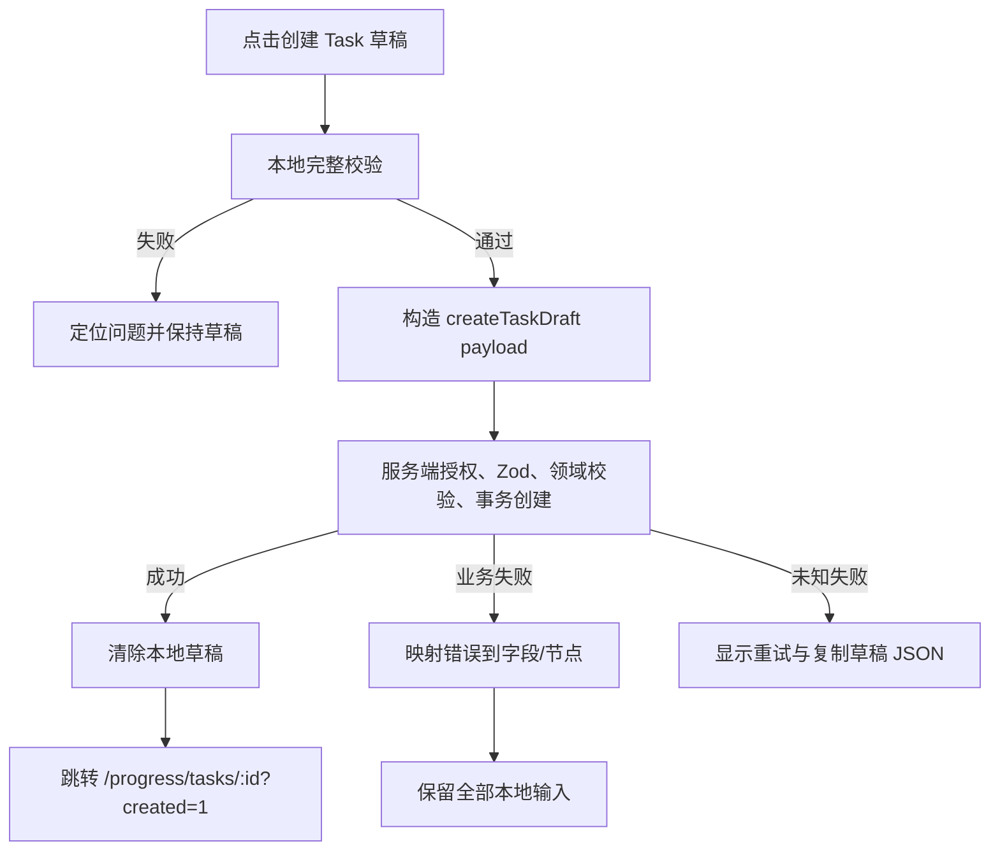
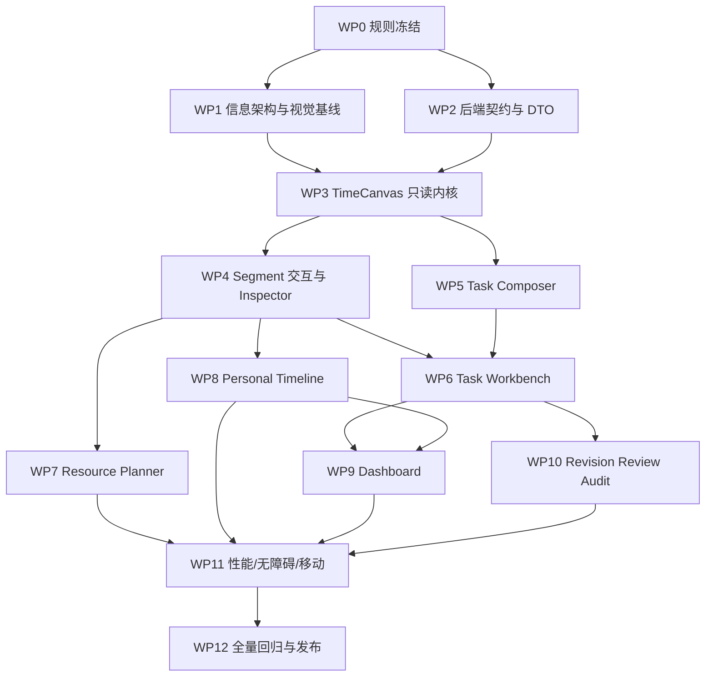
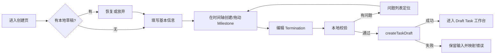
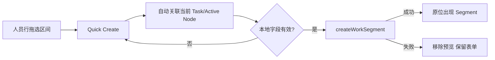
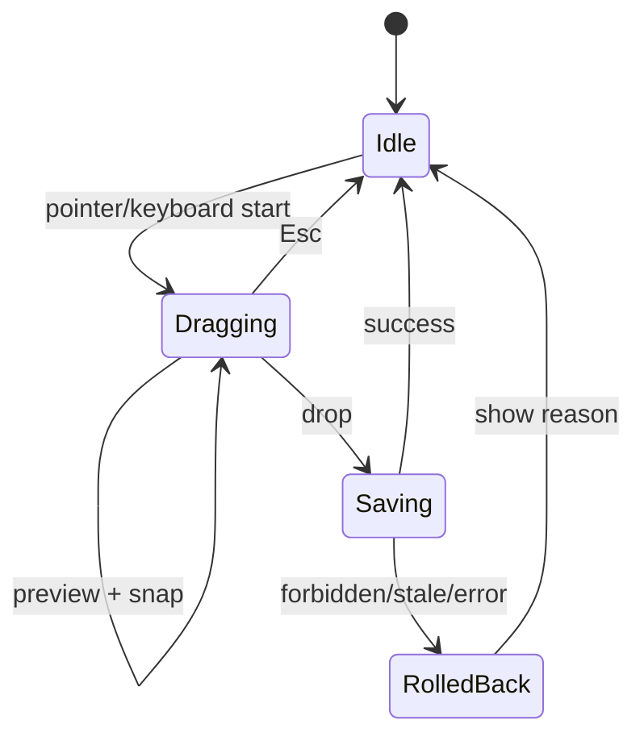
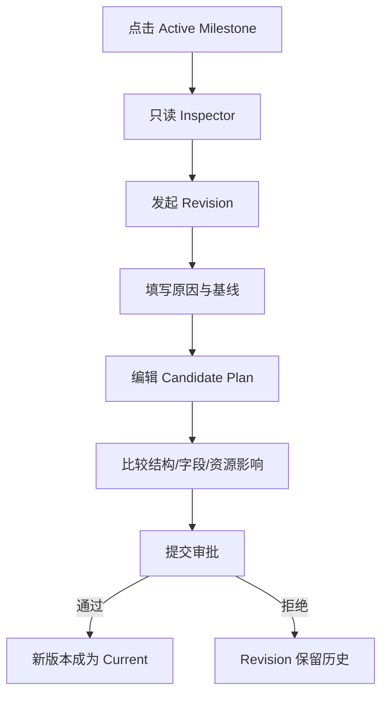
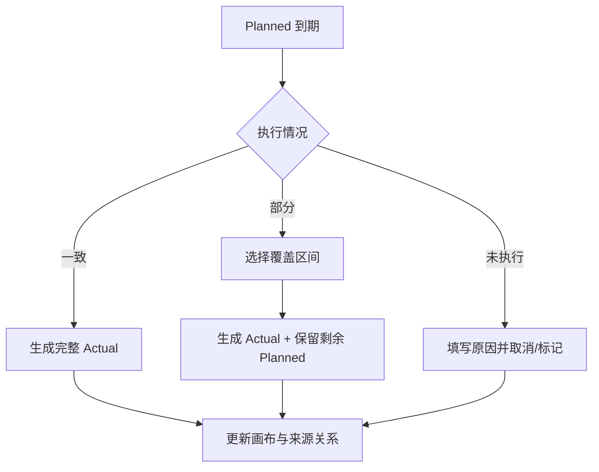

# 项目管理系统前端详细设计方案 v1.0（合并版）

> 本文件将目录中的分册合并，便于整体评审。执行时仍建议按分册分工。

## 合并版目录

1. 项目管理系统前端详细设计方案 v1.0
2. 01. 现状审计与设计原则
3. 02. 统一时间画布 TimeCanvas 设计
4. 03. Task 创建工作台
5. 04. Task 详情工作台
6. 05. 资源甘特与个人时间线
7. 06. `/progress` 首页重构
8. 07. 视觉规范与交互细则
9. 08. 前端组件架构与技术实现
10. 09. 后端配合与接口契约
11. 10. 实施 WBS 与分工
12. 11. 测试与验收标准
13. 12. 页面线框与关键流程

---

## 项目管理系统前端详细设计方案 v1.0

> 适用仓库：`management_system-managementv2.1`  
> 设计对象：项目管理模块（`/progress`）  
> 重点范围：Task 创建、Task 详情、统一时间画布/甘特图、Work Segment、个人时间线、`/progress` 首页  
> 本方案基于 2026-07-29 对现有代码、Prisma 模型、Server Actions、查询层与既有规划文档的检查。

### 1. 一句话方案

不要分别为 Task、人员计划、个人日程各做一套“看起来像时间线”的页面，而应先建设一个统一的 **TimeCanvas（时间画布）**，再用不同模式组合成四类业务界面：

1. **Task 创建模式**：在计划轨道上放置、拖动 Milestone，并在侧边检查器中编辑节点。
2. **Task 工作台模式**：上方展示计划节点，下方叠加参与人的 Planned/Actual Segment 与其他占用。
3. **资源甘特模式**：按人员或 Task 分组，对多人的 Segment 进行筛选、框选、拖动和批量操作。
4. **个人时间线模式**：用户只编辑自己的行，以更轻量的日/周视图安排和确认工作。

这四类页面共享同一套时间坐标、缩放、滚动、选择、冲突提示、权限判断和视觉语义，避免后期出现四套交互互不一致、修一个 bug 要改四次的问题。

### 2. 本次核心产品决策

| 编号 | 决策 | 原因 |
|---|---|---|
| D-01 | Task 创建采用“单页规划工作台”，不采用强制三步向导 | 用户的核心工作是边看全局时间范围边调整基本信息、Milestone、成员和角色；硬切步骤会破坏上下文。 |
| D-02 | Task 创建前使用浏览器本地草稿，最终一次提交后端；创建成功后到 Task 工作台排期 | 现有 `createTaskDraft` 是完整初始计划的一次性原子创建，没有服务端增量草稿接口；本轮创建 payload 不包含 Segment。 |
| D-03 | 已激活 Task 不直接改当前计划节点，统一通过 Revision | 这与现有版本化计划、锁版本和审批语义一致，防止 UI 绕过领域规则。 |
| D-04 | 时间线中的 Milestone 是“时间锚点”，Segment 是“时间区间”，两者分层渲染 | Milestone 负责计划阶段和验收，Segment 负责人力投入；混成同一种条形会误导用户。 |
| D-05 | Task 详情默认进入“计划与资源”页，而不是元数据概览 | 用户进入 Task 后最关心当前节点、截止时间、参与人安排和冲突。 |
| D-06 | `/progress` 改成“个人工作驾驶舱”，不再放四块等权卡片 | 首页必须突出今天要做什么、哪些事需要处理，而不是展示四类统计入口。 |
| D-07 | 桌面端使用甘特/时间画布，移动端切换为日列表和纵向节点卡，不强缩桌面画布 | 复杂横向甘特图在 Pixel 5 宽度下不可用。 |
| D-08 | 拖拽只是快捷方式，所有操作必须有键盘和表单等价路径 | 满足无障碍、精确日期录入和自动化测试需要。 |
| D-09 | 本轮禁止把 Segment 拖到另一个人员行；跨人员重新指派属于延期非目标 | 普通 move 不能修改 `personId`；reassign 需另行冻结权限、并发、审计和通知契约。 |
| D-10 | 其他 Task 的安排默认显示为“忙碌块”，详情受权限控制 | Task 详情需要看到参与人的占用，但不能因为甘特图而扩大数据暴露。 |

### 3. 推荐信息架构

```text
项目管理
├── 我的工作                    /progress
├── 我的时间                    /progress/my-timeline          [新增]
├── Task
│   ├── 全部 Task               /progress/tasks
│   ├── 创建 Task               /progress/tasks/new            [新增]
│   └── Task 工作台             /progress/tasks/[id]
├── 资源计划                    /progress/resources
├── 资源冲突                    /progress/resources/conflicts
├── 待我处理                    /progress/approvals            [后续]
├── 通知                        /progress/notifications
├── Tag                         /progress/tags                 [后续]
└── 管理设置                    /admin/project-management      [后续]
```

模块导航建议从当前页面顶部的第二条横向导航改成 **左侧窄导航栏 + 顶部页面工具栏**。全站 `AppHeader` 保留，项目管理内部不再重复一整行大型标题和导航按钮。

### 4. 交付文件说明

| 文件 | 用途 |
|---|---|
| `01-现状审计与设计原则.md` | 说明现有页面问题、设计目标和不应破坏的领域规则。 |
| `02-统一时间画布-TimeCanvas.md` | 定义通用甘特图/时间线的视觉、组件、交互状态机和性能方案。 |
| `03-Task创建工作台.md` | Task 创建页的完整布局、字段、Milestone 交互、校验与草稿机制。 |
| `04-Task详情工作台.md` | Task 详情页的标签、计划与资源主视图、Revision/Review/审计入口。 |
| `05-资源甘特与个人时间线.md` | 全局人员计划、个人时间线、Segment 创建编辑和批量操作。 |
| `06-progress首页重构.md` | `/progress` 首页的信息层级、模块和响应式方案。 |
| `07-视觉规范与交互细则.md` | 颜色之外的状态语义、尺寸、密度、空状态、加载与错误规则。 |
| `08-前端组件架构与技术实现.md` | 推荐目录、组件 API、状态管理、路由状态、依赖与实现边界。 |
| `09-后端配合与接口契约.md` | 现有能力、缺口、建议接口、权限与隐私要求。 |
| `10-实施WBS与分工.md` | 按依赖顺序拆分工作包、角色、输入输出和完成条件。 |
| `11-测试与验收标准.md` | Playwright 场景、性能目标、权限、并发、极端状态和移动端验收。 |
| `12-页面线框与关键流程.md` | 可直接交给 UI/UX 与前端的文本线框、交互流程和状态图。 |
| `项目管理前端详细设计方案-合并版.md` | 上述文档的合并版，适合整体评审。 |

### 5. 建议的实施顺序

```text
基础导航与设计变量
        ↓
只读 TimeCanvas + 时间数学
        ↓
Segment 创建/拖动/缩放/检查器
        ↓
Task 创建工作台
        ↓
Task 详情“计划与资源”
        ↓
全局资源甘特 + 个人时间线
        ↓
/progress 首页重构
        ↓
Revision / Review / Audit 深化
        ↓
移动端、性能、无障碍与全量回归
```

必须先做 TimeCanvas 的只读和交互基础，再分别接页面；不要先在 Task 详情里硬写一套甘特图，之后再抽象。

### 6. P0 范围建议

第一批必须形成一个完整可用闭环：

- 新增 `/progress/tasks/new`。
- 支持编辑 Task 全部创建字段。
- 在计划时间轴上创建、选中、移动、删除 Milestone；Termination 固定在末尾。
- 支持本地自动保存、恢复、撤销/重做和提交前完整校验。
- Task 详情默认展示计划轨道 + 参与人 Segment。
- 在人员行拖选时间创建 Planned Segment，点击区间打开右侧检查器。
- `/progress/resources` 使用同一 TimeCanvas，至少支持人员筛选、7/14/30 天、拖动与调整区间。
- `/progress` 改为个人时间线 + 待办入口 + Active Task 列表。
- 桌面 1440×1000 和 Pixel 5 均无页面级意外横向滚动。
- 所有拖拽具备键盘/表单替代操作，服务端继续做权限和状态验证。

Revision 的完整可视化比较、多人资源高级分析、依赖线、基线对比等可放到 P1/P2，不能阻塞 P0 主闭环。

---

## 01. 现状审计与设计原则

### 1. 审计范围

本方案检查了以下现有实现：

- `app/progress/page.tsx`
- `app/progress/tasks/page.tsx`
- `app/progress/tasks/[id]/page.tsx`
- `app/progress/resources/page.tsx`
- `app/progress/resources/conflicts/page.tsx`
- `components/project-management/progress-shell.tsx`
- `components/project-management/task-list.tsx`
- `components/project-management/task-workbench.tsx`
- `components/project-management/resource-timeline-client.tsx`
- `app/actions/project-management/*`
- `lib/project-management/queries/*`
- `lib/project-management/application/*`
- `prisma/schema.prisma`
- `docs/plan/06-*界面信息架构与交互计划.md`

### 2. 当前前端问题

#### 2.1 信息架构问题

当前页面同时存在全站 `AppHeader` 和 `ProgressShell` 顶部横向导航，造成：

- 页面首屏被两层导航和大标题占据。
- 导航项增长后只能横向滚动。
- 用户难以识别当前所在模块和层级。
- 页面操作按钮与导航混在同一视觉层级。

**调整原则**：全站头部只负责全局身份与系统切换；项目管理模块使用固定左侧导航，页面顶部只放上下文标题、筛选和主要动作。

#### 2.2 `/progress` 首页问题

当前首页由四块等权卡片组成：Active Task、未来 7 天投入、待确认/冲突、通知。问题是：

- “今天该做什么”没有成为视觉中心。
- 卡片只能读，不能直接编排个人时间。
- 待办、冲突和通知被拆开，用户要逐块扫描。
- Active Task 只显示简单卡片，无法比较截止时间和当前阶段。
- 空状态占据大量面积，但没有引导用户创建计划。

**调整原则**：首页是个人工作驾驶舱，主区域必须是个人时间线；右侧统一显示“需要我处理”的动作队列；Active Task 放在第二层。

#### 2.3 Task 详情问题

现有 `TaskWorkbench` 按“元数据卡片 → 成员卡片 → 当前计划列表 → 人员投入卡片”纵向堆叠。问题是：

- 计划节点只有顺序，没有真实时间距离。
- Milestone 与人员投入分离，无法判断计划是否有资源支撑。
- 当前节点、临期点、冲突没有形成视觉焦点。
- 点击节点没有统一检查器，后续操作只能继续堆卡片或跳页。
- 页面越完整就越长，重要信息反而被淹没。

**调整原则**：Task 详情默认以“计划锚点 + 人员时间区间”的组合画布为主体，元数据、成员和节点详情进入上下文检查器或独立标签页。

#### 2.4 资源页面问题

当前 `ResourceTimelineClient` 实际上是左侧创建表单、右侧 Segment 卡片列表，不是时间轴。问题是：

- 用户无法发现人员之间、Task 之间的时间重叠。
- 创建区间需要输入开始和结束时间，操作成本高。
- 移动、拆分、合并虽有后端能力，但前端缺少直观位置语义。
- 固定大表单长期占据画面。
- 选择多个 Segment 后的操作和上下文不够明确。

**调整原则**：把表单降级为检查器；把时间画布升级为主操作面。框选创建、拖动平移、两端缩放是主路径，精确表单是补充路径。

#### 2.5 组件与技术问题

- 当前没有统一时间坐标和区间几何工具。
- 没有行/列虚拟化，大数据量甘特图无法直接堆 DOM。
- 没有统一的选择、拖拽、缩放状态机。
- Server Action 调用分散在页面组件中，乐观更新和失败回滚难以复用。
- 当前路由状态对时间范围、人员选择和任务选择表达不足。

**调整原则**：先建立 TimeCanvas 内核、统一 mutation adapter 和 URL 状态，再做业务页面。

### 3. 当前后端已具备的可用基础

#### 3.1 Task 与计划

现有数据模型已经覆盖：

- Task 基本信息、状态、优先级、组织范围、Tag、关联 Task。
- Task 成员与角色。
- 当前计划版本、版本号、基线版本、快照哈希、锁版本。
- Milestone、Revision、Termination 三类 Node。
- Milestone 目标、完成条件、预期完成时间、验收要求。
- Revision 的基线、目标版本、审批状态和影响摘要。
- Termination 的计划时间、结果、原因和总结。

#### 3.2 Work Segment

现有服务端已经支持：

- 创建单个或批量 Planned Segment。
- 完整更新 Segment。
- 批量移动 Planned Segment。
- 拆分、合并、取消。
- 完全确认、部分确认并生成 Actual。
- 创建和软删除 Actual。
- 重新关联 Task/Node。
- Segment 变更历史。
- 资源冲突扫描、确认、解决、忽略和建议预览。

因此，时间画布的核心修改动作不需要重写领域服务，重点是提供适合画布的聚合查询和少量补充 mutation。

### 4. 不能被前端破坏的领域规则

#### 4.1 Task 状态与计划版本

- 新建 Task 默认是 `DRAFT`。
- 激活后首个 Milestone 才进入当前执行语义。
- Active Task 的当前计划不是普通表单，不应被直接就地修改。
- 计划修改必须通过 Revision 草稿、提交、审批和生效流程。
- Task mutation 必须把已读取的 `lockVersion` 作为 `expectedLockVersion` 携带；Segment mutation 使用其冻结的 expected version 字段，遇到陈旧版本不能静默覆盖。

#### 4.2 Milestone 与 Termination

- 初始计划至少一个 Milestone。
- Termination 固定为计划链末尾。
- Milestone 的完成条件和验收要求是两个不同字段，不能合并成“备注”。
- 已完成前缀节点在 Revision 中应只读。
- 节点状态不能只凭 UI 拖动改变，必须调用合法状态转换。

#### 4.3 Segment

- Planned 与 Actual 是不同业务语义，不能仅用同一个条形的颜色变化代替。
- Segment 可独立存在，不强制属于 Task。
- Segment 可关联 Task 和 Node，但关联需要权限和一致性检查。
- Planned 的确认、部分确认、取消、拆分、合并都有审计含义。
- 本轮禁止跨人员移动；所有目标人员行都显示 invalid drop，且不得通过普通 move 或客户端修改 `personId` 变相实现。

#### 4.4 权限和数据可见性

- UI 隐藏按钮不是权限控制，所有操作仍由服务端授权。
- Task 详情可显示参与人的其他占用，但未必可显示占用内容。
- Viewer、成员、Owner、Reviewer、管理员看到的动作不同。
- 已删除、已归档、无权限对象要显示安全空状态，不能泄露名称和详情。

### 5. 设计目标

#### 5.1 用户目标

1. 创建者能在一个画面中理解 Task 的完整时间结构。
2. 用户能用拖选和拖动快速创建、调整 Segment，同时能精确输入日期。
3. Task 负责人能直接看出“计划节点是否有人员安排支撑”。
4. 个人能在自己的时间线上安排、确认和记录实际工作。
5. 管理者能在统一甘特图中选择人员和 Task，查看冲突与负载。
6. 所有关键动作都保留状态、权限、并发和审计语义。

#### 5.2 工程目标

- 时间画布只实现一次，在四类页面复用。
- 页面只负责业务组合，不重复时间计算和拖拽逻辑。
- 大范围时间和多人员场景只渲染可见区域。
- URL 可以复现筛选、时间范围和分组方式。
- 异步操作具备加载、成功、失败、回滚和陈旧数据处理。
- 桌面与移动端是两种适配布局，而不是同一画布强行缩放。

### 6. 非目标与边界

第一阶段不建议实现：

- Microsoft Project 式复杂前后置依赖网络。
- 自动资源平衡或自动改期。
- AI 自动生成整套计划。
- 任意级 Task 子任务树。
- 在同一画布中编辑历史计划版本。
- 无限精度到分钟级的全年横向时间轴。
- 用拖拽直接触发 Milestone 完成、Review 通过或 Revision 生效。

这些功能会大幅增加业务规则和交互复杂度，应在基础画布稳定后再评估。

### 7. 设计原则

#### 原则 A：时间关系优先于卡片陈列

只要页面的核心问题是“什么时候、持续多久、是否冲突”，时间画布必须成为主视图；卡片仅承载详情。

#### 原则 B：直接操作与精确输入并存

拖动适合快速调整，日期时间字段适合精确输入。两者修改同一个 draft state，不维护两套数据。

#### 原则 C：状态必须可解释

每种状态至少由“颜色 + 图标/线型 + 文本/Tooltip”三者中的两种表达，不能只靠颜色。

#### 原则 D：局部编辑，不丢失画布上下文

点击 Milestone 或 Segment 默认打开右侧检查器；只有复杂审批、版本比较和危险操作才进入对话框或独立页面。

#### 原则 E：权限决定可操作性，不决定是否可理解

只读用户仍应看到计划结构、状态原因和禁止操作的解释，而不是空白页面。

#### 原则 F：乐观但不冒进

Segment 拖动可先在画布中预览和乐观更新；服务端失败必须原位回滚并说明原因。计划版本切换、审批和终止不做无确认乐观提交。

#### 原则 G：移动端重新编排

移动端使用日列表、纵向节点时间线、底部抽屉和日期表单，不显示被压缩到不可读的桌面甘特图。

---

## 02. 统一时间画布 TimeCanvas 设计

### 1. 定位

`TimeCanvas` 不是一个固定业务页面，而是项目管理模块的时间可视化与直接操作内核。它同时承载：

- Milestone/Termination 等时间锚点。
- Planned/Actual Work Segment 等时间区间。
- 人员、Task、Node 等行分组。
- 当前时间、工作日、临期、逾期、冲突等覆盖层。
- 框选、拖动、缩放、多选、平移、键盘调整等交互。

页面通过配置决定“显示什么、允许操作什么”，而不是复制一套甘特代码。

### 2. 四种业务模式

```ts
type TimeCanvasMode =
  | "TASK_COMPOSER"      // 创建 Task，编辑计划锚点
  | "TASK_WORKBENCH"     // Task 详情，计划 + 人员 Segment
  | "RESOURCE_PLANNER"   // 多人/多 Task 资源甘特
  | "PERSONAL_TIMELINE"; // 单人可编辑日程
```

| 模式 | 主分组 | 可编辑对象 | 默认范围 | 典型入口 |
|---|---|---|---|---|
| `TASK_COMPOSER` | 单一计划轨道 | Milestone、Termination | 自动适配整个计划 | `/progress/tasks/new` |
| `TASK_WORKBENCH` | 计划轨道 + 参与人 | 有权限的 Planned Segment；Draft 计划节点 | 当前阶段附近 | `/progress/tasks/[id]` |
| `RESOURCE_PLANNER` | Person / Task 切换 | 有权限的 Planned Segment | 14 天 | `/progress/resources` |
| `PERSONAL_TIMELINE` | 当前用户 | 本人的 Segment | 当前周 | `/progress/my-timeline` |

### 3. 画布整体结构

```text
┌────────────────────────────────────────────────────────────────────────────┐
│ Toolbar: 日期范围 | 今天 | 缩放 | 分组 | 筛选 | 图例 | 冲突 | 更多       │
├────────────────┬───────────────────────────────────────────────────────────┤
│ 左侧行标题区    │ 时间轴：周 / 日 / 小时                                    │
│ sticky 240px   ├───────────────────────────────────────────────────────────┤
│ 计划            │ ◆ M1 ────────── ◆ M2 ───────── ◆ M3 ─────── ⚑ 结束       │
├────────────────┼───────────────────────────────────────────────────────────┤
│ 张三  80%       │      ░░ 计划 A ░░░        █ 实际 A █                      │
│ 前端 / Owner    │                  ! 冲突                                   │
├────────────────┼───────────────────────────────────────────────────────────┤
│ 李四  60%       │  ░ 其他占用 ░     ░ 当前 Task 计划 ░░░                    │
├────────────────┼───────────────────────────────────────────────────────────┤
│ 王五            │              [拖选创建中的半透明区间]                     │
└────────────────┴───────────────────────────────────────────────────────────┘
                                                ┌────────────────────────────┐
                                                │ 右侧 Inspector 360px      │
                                                │ Segment / Milestone 详情   │
                                                └────────────────────────────┘
```

#### 3.1 固定区域

- **Toolbar**：56px，高优先级操作保持在一行；次要筛选进入 Popover。
- **Row Header**：桌面默认 240px，可在 200–360px 调整并记忆。
- **Time Axis**：两级或三级表头，随缩放粒度变化。
- **Canvas Body**：唯一的横向滚动容器；页面本身不能横向溢出。
- **Inspector**：桌面 360px 右侧面板；移动端为底部抽屉。

#### 3.2 图层顺序

从底到顶：

1. 工作日/非工作日背景。
2. 网格线。
3. 计划阶段背景带（可选）。
4. 其他占用 Busy Block。
5. Planned Segment。
6. Actual Segment。
7. Milestone/Termination 锚点。
8. 冲突、逾期、待确认覆盖层。
9. 选择框、拖拽预览、吸附辅助线。
10. 当前时间线和悬浮提示。

图层顺序必须统一，否则不同页面会出现选中框被条形遮住、冲突标识压住文本等问题。

### 4. 时间坐标模型

#### 4.1 核心函数

```ts
type TimeScale = {
  rangeStartMs: number;
  rangeEndMs: number;
  viewportWidthPx: number;
  contentWidthPx: number;
  msPerPixel: number;
  snapMs: number;
};

function timeToX(timeMs: number, scale: TimeScale): number;
function xToTime(x: number, scale: TimeScale): number;
function snapTime(timeMs: number, snapMs: number, mode: "round" | "floor" | "ceil"): number;
function intervalToRect(startMs: number, endMs: number, scale: TimeScale): { left: number; width: number };
```

所有 Milestone、Segment、当前时间线和框选区间都使用同一套函数，不允许组件自行计算比例。

#### 4.2 缩放档位

| 档位 | 可见范围建议 | 主刻度 | 次刻度 | 默认吸附 |
|---|---|---|---|---|
| 小时 | 1–3 天 | 日 | 30 分钟/1 小时 | 30 分钟 |
| 日 | 7–21 天 | 周 | 日 | 1 天 |
| 周 | 4–12 周 | 月 | 周 | 1 天或 1 周 |
| 月 | 3–12 月 | 月/季度 | 周/月 | 1 周 |

用户通过 `− / +`、Ctrl/Cmd + 滚轮或菜单调整。缩放中心保持在鼠标位置或当前选择对象，而不是每次跳回范围起点。

#### 4.3 默认范围策略

- Task 创建：计划开始时间到 Termination，左右各增加约 10% 留白。
- Task 详情：默认“当前阶段”，从上一个 Milestone 前 3 天到下一个 Milestone后 7 天；若没有上下节点则自动扩展。
- 资源甘特：当前日期起 14 天，可切 7/14/30 天或自定义。
- 个人时间线：当前周；“今天”按钮将今天滚到视口中央。

#### 4.4 时区

前端内部统一使用绝对时间戳，显示层固定按 `Asia/Shanghai` 格式化，数据库仍存 UTC。前端不能按浏览器本地时区重解释；页面工具栏只展示固定业务时区，不提供另一套用户时区口径。

### 5. 行模型与分组

```ts
type TimeCanvasRow = {
  id: string;
  kind: "PLAN" | "PERSON" | "TASK" | "GROUP";
  label: string;
  sublabel?: string;
  avatarUrl?: string;
  height: number;
  collapsed?: boolean;
  editable: boolean;
  capacity?: number | null;
  children?: TimeCanvasRow[];
};
```

#### 5.1 Person 分组

左侧显示：头像、姓名、Task 角色、范围内 Allocation 概览、冲突数。可按团队/技术组折叠。

#### 5.2 Task 分组

左侧显示：Task 名、状态、优先级、当前 Milestone。适合从多个 Task 角度看时间点与投入。

#### 5.3 行高

- 普通 Segment 行：48px。
- 同行重叠需要泳道时：每增加一层 +24px，上限 120px；超出后显示 `+N` 聚合。
- 计划轨道：96–128px，可展示节点标题和日期。
- Group 行：36px。

不要让所有行无限增高，否则滚动性能和空间利用率会恶化。

### 6. 时间锚点视觉语义

| 对象 | 形态 | 附加信息 |
|---|---|---|
| Milestone Pending | 空心菱形 | 下方标题、日期 |
| Milestone Active | 实心/高对比菱形 + 外环 | “当前”标签、距截止时间 |
| Milestone Submitted | 菱形 + 时钟/待审图标 | “待验收” |
| Milestone Completed | 菱形 + 对勾 | 实际完成日期 Tooltip |
| Milestone Revised | 弱化菱形 + 分支箭头 | 指向新版本或 Revision |
| Revision | 分支节点/橙色圆角标记 | 原因摘要、版本号 |
| Termination | 旗帜/终点线 | 计划终止时间 |
| Overdue | 状态图标 + 警示描边 | 显示逾期天数，不只变红 |

同一天多个节点采用垂直堆叠与轻微横向错位；缩小到月级时聚合为 `3 个节点` 标记，点击展开 Popover。

### 7. Segment 视觉语义

#### 7.1 Planned

- 浅填充或斜纹。
- 虚线/弱实线边框。
- 左侧显示内容，空间不足时省略。
- 末端显示 Allocation 或时长摘要。

#### 7.2 Actual

- 实填充。
- 较稳定的实线边框。
- 可叠加完成比例进度层，但不改变区间长度。

#### 7.3 状态覆盖

| 状态 | 表达 |
|---|---|
| 待确认 | 右上角时钟徽标 + “待确认” Tooltip |
| 部分确认 | Planned 剩余区间与 Actual 已确认区间同时显示，并用来源连线/同组标识 |
| 取消 | 默认不在主画布显示；开启历史后以低透明度和删除线显示 |
| 需重新关联 | 链接断开图标 + 警示边框 |
| 冲突 | 区间顶部警示条 + 冲突图标；选中后显示涉及对象和规则 |
| 无权限详情 | 中性“忙碌”块，只显示时间和占用程度 |

#### 7.4 重叠布局

同一行重叠 Segment 采用小型泳道，不允许完全覆盖。若重叠数量过多：

- 行高达到上限后聚合。
- 聚合块显示数量、总 Allocation 和冲突状态。
- 点击聚合块在 Inspector 中列出全部区间。

### 8. 核心交互状态机

```ts
type InteractionMode =
  | { type: "IDLE" }
  | { type: "PANNING"; originX: number }
  | { type: "BRUSH_CREATING"; rowId: string; anchorMs: number; cursorMs: number }
  | { type: "DRAGGING_SEGMENT"; segmentId: string; originalStartMs: number; originalEndMs: number }
  | { type: "RESIZING_SEGMENT"; segmentId: string; edge: "START" | "END" }
  | { type: "DRAGGING_MILESTONE"; nodeId: string; originalAtMs: number }
  | { type: "RANGE_SELECTING"; ids: string[] }
  | { type: "KEYBOARD_MOVING"; entityId: string };
```

同一时刻只能处于一个主交互状态。打开 Inspector 不算主交互状态。

#### 8.1 点击

- 单击空白：清除选择。
- 单击对象：选中并打开/更新 Inspector。
- Ctrl/Cmd + 单击：加入或移出多选。
- 双击空白行：在吸附后的时间创建默认长度 Segment。
- 双击计划轨道：创建 Milestone。

#### 8.2 框选创建 Segment

1. 鼠标在可编辑人员行空白处按下。
2. 横向拖动显示半透明预览区间和起止时间。
3. 松开后若区间小于最小单位，则按默认时长扩展。
4. 打开轻量 Quick Create 卡片，预填 person、task、node、start、end。
5. 用户输入内容后保存；按 Esc 取消。
6. 服务端成功后变成正式 Segment；失败则移除预览并保留表单输入。

按住 Space 或中键应切换为平移，防止用户想滚动画布却误创建。

#### 8.3 拖动 Segment

- 只能拖动 Planned 且具备权限的 Segment。
- 默认保持时长不变，按当前缩放档位吸附。
- 拖动时显示原位置轮廓、新起止时间、与相邻对象的对齐线。
- 超出当前范围时边缘自动滚动，但速度有上限。
- 松开后先保持乐观位置，调用 move/update action。
- 成功：显示轻量 Toast，并更新版本时间。
- 冲突或权限失败：原位回滚，Inspector 显示服务端原因。
- 陈旧数据：回滚并提示“该安排已被其他人修改”，提供刷新后重新应用。

#### 8.4 缩放 Segment

- Hover/选中时显示左右 Resize Handle，最小可点击宽度 12px。
- 开始端不能超过结束端减最小区间。
- 跨日与工作时段限制只做提示，除非业务规则明确禁止。
- 按 Alt 可临时关闭吸附；键盘路径使用精确日期输入。

#### 8.5 移动 Milestone

- 仅 Task Composer 或 Draft Plan 模式可直接拖动。
- Active Task 当前计划只显示锁图标，拖动时不启动；点击后给出“发起 Revision”。
- 移动时自动重排节点顺序，但相同日期节点保留显式 sequence。
- 若拖到相邻节点之外，显示“将从第 2 节点移动至第 4 节点”。
- Termination 只能沿时间轴移动，不能拖到最后一个 Milestone 之前。
- 完成节点在 Revision 画布只读。

#### 8.6 多选与批量操作

- Ctrl/Cmd 点击或框选多个 Segment。
- 批量工具条浮在画布下方：平移、取消、确认、批量修改 Task/Node、清除选择。
- 只展示所有已选对象共同允许的动作。
- 混合 Planned/Actual 时禁止不适用动作并解释原因。
- 批量平移显示统一偏移量，不逐项输入新日期。

### 9. Inspector 设计

Inspector 是统一详情编辑容器，不是每个页面单独做一套 Drawer。

```ts
type InspectorEntity =
  | { kind: "MILESTONE"; id: string }
  | { kind: "TERMINATION"; id: string }
  | { kind: "REVISION"; id: string }
  | { kind: "SEGMENT"; id: string }
  | { kind: "MULTI_SEGMENT"; ids: string[] }
  | { kind: "CONFLICT"; id: string }
  | null;
```

#### 9.1 Inspector 层级

1. 标题与状态。
2. 起止/截止时间和核心字段。
3. Task/Node/Person 关联。
4. 产出、Allocation、Role、Priority 等高级字段。
5. 冲突、权限、历史提示。
6. 主操作和危险操作。

#### 9.2 保存策略

- 文本和复杂字段：显式“保存”。
- 简单选择和日期：仍进入 dirty state，不建议每个字段立即请求。
- 关闭有未保存内容时提示保存/放弃。
- 拖拽产生的时间更新是独立原子 mutation，不与尚未保存的文本表单混合。

### 10. Toolbar 设计

从左至右建议：

1. 范围标题：`2026/07/27 – 08/09`。
2. 上一范围、今天、下一范围。
3. 缩放 `− / +` 与档位菜单。
4. `适应计划` / `适应选择`。
5. 分组选择：人员 / Task。
6. 筛选入口，显示已启用数量。
7. 冲突开关、其他占用开关、Actual 开关。
8. 图例。
9. 更多：导出、复制视图链接、重置布局。

Task Composer 模式替换为：计划开始、适应计划、添加 Milestone、撤销、重做、校验。

### 11. 键盘操作

| 操作 | 快捷键建议 |
|---|---|
| 移动焦点 | 方向键 |
| 选中/打开 | Enter |
| 开始拖动 | Space |
| 移动一个吸附单位 | 拖动状态下方向键 |
| 移动较大单位 | Shift + 方向键 |
| 取消拖动 | Esc |
| 删除草稿节点/可删除 Segment | Delete / Backspace，需确认 |
| 新建 Milestone | M |
| 新建 Segment | S |
| 适应选择 | F |
| 回到今天 | T |
| 撤销/重做 | Ctrl/Cmd + Z / Shift + Ctrl/Cmd + Z |

屏幕阅读器 live region 需要播报：“已选中张三的计划区间，7 月 30 日 09:00 至 17:00”“已移动到 7 月 31 日，按空格放下”。

### 12. 性能设计

#### 12.1 虚拟化

- 纵向只渲染可见 Person/Task 行和前后 overscan。
- 横向按时间列或可见时间窗口计算，避免全年每日格全部进入 DOM。
- Segment 先在数据层按可见时间范围过滤，再进行碰撞/泳道布局。
- 固定 Row Header 与 Canvas 使用同一个纵向虚拟列表，防止滚动错位。

#### 12.2 渲染边界

- 行组件使用稳定 key 和 memo。
- 交互中的光标位置使用 `requestAnimationFrame` 合并更新。
- 拖动预览尽量使用 transform，不在 pointermove 时触发服务端或全列表排序。
- Tooltip 延迟加载详情，不把全部历史随初次画布数据返回。
- 当前时间线按分钟级更新，不按秒触发整画布重渲染。

#### 12.3 数据窗口

API 按 `rangeStart/rangeEnd` 返回相交区间；不能获取所有历史后在浏览器筛选。人员分页与时间范围分页需要分别考虑：

- 人员很多：按人员游标/搜索加载。
- 时间很长：改变范围时重新查询。
- 画布移动少量范围：可预取前后一个窗口。

### 13. 空、加载和错误状态

- 初次加载：显示时间轴骨架和 5–8 行 Skeleton，保留列宽，避免布局跳动。
- 无人员：显示“选择人员或 Task 后查看计划”，不是空白网格。
- 有人员无 Segment：仍显示可拖选空行，并在行内给创建提示。
- 查询失败：画布区域内显示重试，不丢失筛选与范围。
- mutation 失败：仅回滚受影响对象，不整页刷新。
- 权限只读：画布仍可缩放、筛选、查看；编辑控制统一锁定并说明。

### 14. 移动端替代视图

`TimeCanvas` 在移动端不直接缩放为完整甘特图，而通过相同数据模型渲染 `TimeAgenda`：

```text
7 月 29 日 周三
├── 09:00–11:00  Task A / 前端实现      Planned
├── 13:00         Milestone：原型评审
└── 14:00–18:00  其他占用               Busy

7 月 30 日 周四
└── 10:00–12:00  Task A / 接口联调      Actual
```

- 日期为折叠分组。
- Milestone 是时间点卡片，Segment 是区间卡片。
- 新建使用浮动按钮和日期表单。
- 调整时间使用底部抽屉，不依赖精细拖动。
- 个人模式可支持长按后简单上下移动，但不是 P0 必需。

---

## 03. Task 创建工作台

### 1. 页面目标

创建页不是“填写一张长表单”，而是一个 **Task Plan Composer（任务计划编排器）**。用户应能在同一画面完成：

- Task 基本信息。
- 组织范围、优先级、Tag、关联 Task。
- 成员和角色。
- Revision/Review 策略。
- 必填的计划开始时间。
- 多个 Milestone 的时间位置、顺序和详情。
- Termination 的时间和预期结果。
- 完整校验、草稿恢复和最终创建。

Task 创建不接受任何 Segment 字段；创建成功后统一进入 Task 工作台排期。本节描述冻结目标，不表示 Task Composer 或 TimeCanvas UI 已经实现。

### 2. 路由与页面状态

- 路由：`/progress/tasks/new`
- 查询参数：
  - `templateTaskId`：从现有 Task 复制结构。
  - `relatedTaskId`：预填关联 Task。
  - `start`：预填计划开始日期。
- 页面状态：
  - `EMPTY`：尚未开始。
  - `DIRTY_LOCAL_DRAFT`：本地有未提交修改。
  - `VALIDATING`：本地或服务端预检。
  - `SUBMITTING`：最终创建。
  - `CREATED`：获得服务端 Task ID 后跳转工作台。
  - `RECOVERABLE_DRAFT`：检测到同浏览器未完成草稿。

### 3. 桌面布局

```text
┌──────────────────────────────────────────────────────────────────────────────┐
│ ← 全部 Task   新建 Task                 本地已保存 10:32  撤销 重做 [校验] [创建草稿] │
├───────────────┬───────────────────────────────────────────────┬──────────────┤
│ 基本信息 300px │ 计划时间画布                                 │ 检查器 360px │
│               │                                               │              │
│ 标题          │ 计划开始 ┃────◆ M1────◆ M2────◆ M3────⚑ 结束 │ Milestone 2  │
│ 描述          │            阶段 1      阶段 2      阶段 3     │ 目标         │
│ 优先级        │                                               │ 完成条件     │
│ Team/Group    │ + 在时间轴上点击或拖入 Milestone              │ 截止时间     │
│ Tags          │                                               │ 验收要求     │
│ 关联 Task     │                                               │ 业务说明     │
│ 成员          │ 创建成功后进入 Task 工作台安排 Segment        │ 删除/复制    │
│ 策略          │                                               │              │
└───────────────┴───────────────────────────────────────────────┴──────────────┘
```

#### 3.1 左侧基本信息栏

默认 300px，可折叠为 48px 图标栏。分为：

1. **基本信息**：标题、描述、优先级。
2. **组织与分类**：team、techGroup、Tag、relatedTask。
3. **成员**：人员、Task role、Owner 标识。
4. **流程策略**：Revision approval mode、allow self review。
5. **计划设置**：计划开始时间、业务时区、默认吸附单位。

字段较多时使用折叠 section，但标题和成员完整性一直可见。

#### 3.2 中央计划画布

- 顶部 96–128px 为计划轨道。
- 每个 Milestone 按真实日期间距显示。
- 两个 Milestone 之间显示阶段带和时长。
- Termination 固定为终点。
- 创建页不显示人员 Segment 轨道；创建成功后由 Task 工作台承接 Segment 排期。
- 画布空白处始终有可发现的创建入口，不能只依赖隐藏的双击。

#### 3.3 右侧检查器

选中对象时显示对象表单；未选中时显示“计划概览”：

- Milestone 数量。
- 总计划跨度。
- 时间顺序错误。
- 未完成字段。
- 无成员/无 Owner 警告。

### 4. 顶部命令栏

左侧：返回、页面标题、草稿名称。  
中间：本地保存状态、撤销、重做。  
右侧：预览/校验、创建草稿、更多。

#### 4.1 主按钮

- 默认主按钮：`创建 Task 草稿`。
- 旁边下拉可提供：
  - `创建草稿并进入详情`。
  - `创建后立即激活`（仅在后端支持安全串联、且全部激活条件满足时显示）。
- 未通过本地必填校验时按钮可点击但提交后聚焦错误，不要只灰掉而不解释。

#### 4.2 离开保护

有本地未保存草稿时：

- 浏览器关闭/刷新使用 `beforeunload` 提示。
- 站内跳转使用自定义确认对话框。
- 提供“保存本地草稿并离开”“放弃”“继续编辑”。

### 5. Task 字段设计

| 字段 | 控件 | 创建页规则 |
|---|---|---|
| 标题 | 单行 Input | 必填；最大长度由服务端 schema 决定；画布和列表即时同步。 |
| 描述 | Textarea | 支持多行；不抢占首屏，默认 3 行。 |
| 优先级 | Segmented/Select | 低/中/高等现有枚举。 |
| team | Combobox | 只选择现有固定组织选项，不接受任意文本。 |
| techGroup | Combobox | 只选择与 team 契约一致的现有固定选项。 |
| Tags | 多选 Combobox | 显示颜色、说明；无 Tag CRUD 时只选择。 |
| relatedTask | 搜索选择器 | 仅关联，不形成父子层级；显示状态和当前 Milestone。 |
| members | 人员多选表 | 每行 person + role；必须恰好一个 active OWNER。 |
| revisionApprovalMode | Radio/Select | 显示每种模式的行为解释。 |
| allowSelfReview | Switch | 默认关闭；只有 System Administrator 可开启并写审计。 |
| plannedStartAt | DateTime | 必填并存入 TaskPlanVersion；新 Revision 的目标计划也必填。 |
| timezone | 只读 | 固定 `Asia/Shanghai`；数据库时间仍存 UTC。 |

#### 5.1 成员编辑

成员不是简单头像多选，而是表格：

```text
人员             角色              操作
张三             Owner             移除
李四             Contributor       移除
[+ 添加成员]
```

- 搜索结果显示姓名、团队、技术组、账号状态。
- 同一人员可兼任多个不同 role，授权取所有 active role 的并集；重复的 `personId + role` 必须拒绝。
- 移除唯一 Owner 时立即警告。
- 创建 payload 必须拒绝 0 个或 2 个及以上 active OWNER。
- 成员选择不创建 Segment；Task 创建成功后在工作台按需排期。

### 6. Milestone 创建交互

#### 6.1 创建入口

提供四种等价入口：

1. 工具栏 `+ Milestone`，默认放在最后一个节点之后。
2. 在时间轴空白处单击，出现 `在此创建 Milestone` 小按钮。
3. 双击时间轴空白处。
4. 键盘按 `M`，在当前焦点日期创建。

不建议只做“从左侧拖一个图标到时间轴”，因为可发现性和键盘操作较差；拖入可作为额外快捷路径。

#### 6.2 新建后的默认值

- 临时 ID：`draft-node-*`。
- goal：空。
- expectedCompletedAt：吸附后的目标日期。
- completionCriteria：空。
- reviewRequirements：空。
- businessDescription：空。
- sequence：按日期和同日排序计算。

创建后立即选中并打开右侧检查器，焦点放到“目标”。

#### 6.3 Milestone 快速卡片

单击菱形时先出现锚定小卡，展示：

- 节点序号和目标。
- 截止时间。
- 完整度/错误数。
- `编辑详情`、`复制`、`在后面插入`、`删除`。

用户点击“编辑详情”或按 Enter 后打开固定右侧检查器。快速卡片适合浏览，检查器适合编辑，避免每次点击都遮住画布。

#### 6.4 拖动与顺序

- 拖动改变 `expectedCompletedAt`。
- 节点顺序通常由时间自动决定。
- 同一时间点的节点允许通过小型上下/左右排序控件调整 sequence。
- 拖过其他节点时显示插入位置和“序号 2 → 4”。
- 日期改变后，右侧日期字段同步更新。
- 若拖动造成时间规则错误，先允许预览，但以明确警示显示；保存前必须修复。

#### 6.5 删除

- 空白新节点可立即删除并支持撤销。
- 已填写较多字段的节点删除需确认。
- Termination 不能删除，只能编辑。
- 至少保留一个 Milestone；删除最后一个时阻止并说明。

#### 6.6 复制

复制保留业务字段，日期默认放到原节点之后一个吸附单位或下一个合理空档；标题可加“副本”但不强制。

### 7. Milestone 检查器字段

```text
Milestone #2                                  [•••]
状态：草稿节点

目标 *
[完成前端时间画布 MVP]

预期完成时间 *
[2026-08-12 18:00]

完成条件 *
[可拖选创建、拖动和调整 Planned Segment；E2E 通过]

验收要求 *
[由 Task Owner 与 Reviewer 依据测试记录验收]

业务说明
[范围、限制、交付物说明]

[删除节点]                         [应用]
```

- 完成条件关注“做到什么算完成”。
- 验收要求关注“谁、依据什么、如何审查”。
- 两者必须使用独立标签和辅助文案。
- 日期字段旁提供“移动到前一节点后 7 天”等相对快捷选项，但最终存绝对时间。

### 8. Termination 设计

Termination 固定显示在轨道末尾，使用旗帜形态。

字段：

- `plannedAt`：计划结束时间，必填。
- `plannedOutcomeCriteria`：Task 整体预期结果，必填。
- `businessDescription`：可选。

规则：

- 不能早于最后一个 Milestone。
- 拖动 Termination 改变计划总跨度。
- 当最后一个 Milestone 向后拖过 Termination 时，优先显示冲突，不自动静默移动终点；可提供“一并后移 Termination”的确认快捷操作。

### 9. 计划阶段背景带

Milestone 是时间点，但用户还需要感知阶段长度。画布在节点间渲染弱背景带：

```text
计划开始 ┃──── 阶段 1 ────◆ M1──── 阶段 2 ────◆ M2──── 收尾 ────⚑
```

阶段名称默认使用“至 Milestone X”，也可只显示目标摘要。阶段带只用于理解，不是新数据模型。

### 10. 创建后 Segment 排期

- Task Composer 只编辑 Task、成员与版本化计划，不创建或暂存 Segment。
- `createTaskDraft` 成功后跳转 Task 工作台，用户可在人员行拖选并通过既有 Segment Actions 排期。
- 工作台继续支持 Segment 创建、批量创建、编辑和冲突提示；这些能力不进入 Task 创建 payload 或本地草稿。
- 创建后的 Draft 编辑分为 metadata、members、plan 三个 action；plan 采用整包 replace，合法已有节点保留 `nodeId`，新节点使用 `clientKey` 映射，被 Segment 引用的节点不得隐式删除或迁移。
- Task 激活后，节点目标、条件、时间、顺序和 `plannedStartAt` 等计划语义只能通过 Revision 修改。

### 11. 校验设计

#### 11.1 实时本地校验

- 标题非空。
- `plannedStartAt` 必填。
- 至少一个 Milestone。
- 每个 Milestone 的 goal、completionCriteria、expectedCompletedAt、reviewRequirements 完整。
- Termination 完整。
- Milestone 日期不早于计划开始。
- Milestone 允许同日；日期按 `sequence` 必须非递减。
- Termination 不早于最后 Milestone。
- 恰好一个 active OWNER；同一人员可有多个不同 role，但不得重复相同 `personId + role`。
- 重复 Tag 等结构性问题。

#### 11.2 校验呈现

- 顶部 `校验` 按钮显示错误数量。
- 画布节点显示小型错误徽标。
- 左侧 section 标题显示错误数。
- 右侧“问题列表”可点击定位到字段或节点。
- 提交失败后自动选择第一个错误对象并聚焦字段。

#### 11.3 服务端校验

最终提交仍调用服务端 schema 和领域验证。前端错误文案必须映射为用户可理解的中文，不直接显示原始 Zod path、SQL 或内部 ID。

### 12. 本地草稿

本节定义冻结目标，不表示该本地草稿 UI 已经实现。Task 创建草稿固定使用 `localStorage`：

```ts
type LocalTaskDraft = {
  schemaVersion: 1;
  draftId: string;
  savedAt: string;
  task: TaskCreateForm;
  nodes: DraftPlanNode[];
  selectedEntityId: string | null;
  viewport: { rangeStart: string; rangeEnd: string; zoom: string };
};
```

#### 12.1 保存策略

- 用户停止输入后约 500–1000ms 写入 `localStorage`。
- storage key 必须同时包含部署环境、`accountId` 和 `schemaVersion`（例如 `task-draft:${deploymentEnvironment}:${accountId}:v${schemaVersion}`），不同环境、账号或 schema 版本不得互相恢复草稿。
- 只保存纯 JSON，不保存文件对象和敏感令牌。
- 进入页面时检查同账号、同环境的未完成草稿。
- 展示保存时间和恢复/放弃操作。
- schemaVersion 不兼容时只允许导出 JSON 或安全放弃，不能崩溃。
- 校验失败、业务失败、网络错误或未知提交失败都不得清理草稿；只有 `createTaskDraft` 确认创建成功后才清理。

#### 12.2 撤销/重做

- 记录领域命令：新增节点、移动节点、字段修改、删除、成员变更。
- 文本输入按短时间窗口合并，避免每个字符一条历史。
- 只有 `createTaskDraft` 确认创建成功后才清空本地历史；任何提交失败都保留历史和草稿。

### 13. 提交流程



必须携带稳定 `idempotencyKey`，用户重复点击或网络重试不能创建两个 Task。

### 14. 创建成功后的落点

跳转到 Task 工作台并显示一次性成功提示：

- 已创建 Draft Task。
- 当前计划版本 v1。
- 下一步：安排人员、检查计划、激活 Task。
- 若用户选择“创建后激活”，则展示激活结果；激活失败不能删除已创建草稿。

### 15. 移动端布局

移动端改为：

1. 顶部精简命令栏。
2. 基本信息折叠卡。
3. 纵向计划时间线：按日期排序的 Milestone 卡片。
4. 底部固定 `+ Milestone` 和 `创建草稿`。
5. 点击节点进入全屏/底部抽屉表单。
6. 日期调整用字段和“前移/后移一天”按钮，不要求横向拖动。

### 16. P0 验收

- 能创建包含 1–200 个 Milestone 的本地计划草稿。
- 能在时间轴上点击或双击新增 Milestone。
- 能拖动 Milestone 改变日期和顺序。
- 能打开快速卡和右侧检查器编辑全部字段。
- Termination 始终为最后节点且不能被删除。
- 刷新后可恢复本地草稿。
- 创建失败不丢输入。
- 重复提交不重复创建。
- 新建 Task 与后续 Revision 的计划都要求 `plannedStartAt`，Milestone 按 `sequence` 日期非递减并允许同日。
- 创建 payload 和本地草稿均不含 Segment；创建成功后在 Task 工作台排期。
- 成员必须恰好一个 active OWNER；多角色授权取并集且拒绝重复相同 role。
- 只用键盘可新增、选中、移动和编辑节点。
- Pixel 5 使用纵向计划编辑，不出现不可用的压缩甘特图。

---

## 04. Task 详情工作台

### 1. 页面定位

Task 详情应从“对象资料页”升级为“执行工作台”。默认回答四个问题：

1. 当前正在执行哪个 Milestone，什么时候到期？
2. 从现在到下一阶段，参与人分别安排了什么？
3. 计划是否存在资源冲突、未确认投入或关联失效？
4. 当前用户接下来能做什么：创建 Segment、提交验收、发起 Revision、确认终止？

### 2. 推荐页面结构

```text
┌──────────────────────────────────────────────────────────────────────────────┐
│ ← Task 列表 | Task 名称 [Active] [高] [Tag]       v3  锁版本 12  [主要动作 ▼] │
│ 当前：M2 前端实现 · 8 月 12 日截止 · 剩余 8 天     2 个冲突 · 1 个待确认       │
├──────────────────────────────────────────────────────────────────────────────┤
│ [计划与资源] [概览] [修订与历史] [验收] [审计]                               │
├──────────────────────────────────────────────────────────────────────────────┤
│ TimeCanvas Toolbar                                                           │
├───────────────┬────────────────────────────────────────────────┬──────────────┤
│ 计划           │ ┃──◆ M1───◆ M2 当前────◆ M3────⚑              │ Inspector    │
├───────────────┼────────────────────────────────────────────────┤              │
│ 张三 / Owner   │    █ Actual █    ░ Planned ░░░   !             │              │
│ 李四 / Dev     │ ░ Busy ░           ░ 当前 Task ░               │              │
│ 王五 / Reviewer│                       ░ Review ░               │              │
└───────────────┴────────────────────────────────────────────────┴──────────────┘
```

### 3. 顶部 Task Header

#### 3.1 第一行

- 返回 Task 列表。
- Task 标题，超长时两行或省略 + Tooltip。
- 状态、优先级、关键 Tag。
- 当前计划版本 `vN`。
- 主要动作 Split Button。

#### 3.2 第二行执行摘要

- 当前 Active Milestone。
- 截止时间、剩余/逾期天数。
- 当前阶段时间跨度。
- 参与人数。
- Planned/Actual 数量。
- 开放冲突、待确认、需重新关联数量。

摘要项可点击定位对应对象或打开过滤后的 Inspector。

#### 3.3 主要动作规则

按状态和权限动态显示：

| 条件 | 主动作 |
|---|---|
| Draft 且可编辑 | `继续编辑计划` |
| Draft 且可激活 | `激活 Task` |
| Active 且可创建 Revision | `发起 Revision` |
| Active Milestone 可提交 | `提交验收` |
| 有待 Review 且当前用户可审 | `处理验收` |
| 到达 Termination 且可终止 | `确认结束` |
| 只读 | `复制链接` 或无主动作 |

其余动作进入 `更多`，不要同时堆十个按钮。

### 4. 标签页

#### 4.1 计划与资源（默认）

统一 TimeCanvas，显示计划锚点、参与人 Segment、冲突和其他占用。

#### 4.2 概览

- Task 描述。
- team / techGroup。
- Tag 与关联 Task。
- 成员与角色。
- Revision/Review 策略。
- 创建、更新、开始、结束时间。
- 权限摘要。

可编辑字段使用右侧抽屉或内联区块；不应回到一页多个大卡片。

#### 4.3 修订与历史

- Current Plan + 历史版本列表。
- Revision 状态、原因、发起人、审批人、时间。
- 版本比较入口。
- Draft Revision 继续编辑。
- 当前版本时间线只读，历史版本默认折叠。

#### 4.4 验收

- 当前 Milestone 的目标、条件、验收要求。
- 提交证据。
- Review 历史。
- Approve / Reject / Revision Required 操作。
- 过往 Milestone 验收记录。

#### 4.5 审计

- Task 创建、激活、Revision、Review、终止、成员与元数据变化。
- 按事件类型和操作者筛选。
- 只显示业务可读摘要，必要时展开 before/after。

### 5. “计划与资源”默认视图

#### 5.1 默认范围

优先围绕当前阶段：

- 左边界：上一个 Milestone 前 3 天；若无上一个则计划开始。
- 右边界：下一个 Milestone 后 7 天；若无下一个则 Termination 后少量留白。
- 若阶段跨度太大，自动切换周/月档位。
- 提供 `适应 Task`、`适应当前阶段`、`今天` 三个快捷入口。

#### 5.2 计划轨道

计划轨道固定在人员行上方：

- Current Plan 高对比实线。
- Active Milestone 有外环和“当前”。
- 已完成节点显示实际完成时间。
- Revision 位置显示分支标记。
- Termination 显示终点旗帜。
- Hover 显示目标、完成条件摘要、截止、状态。
- 点击打开节点 Inspector。

#### 5.3 人员行

默认只显示当前 Task 的 active members，左侧显示：

- 人员姓名和头像。
- Task role。
- 当前范围内对本 Task 的 Allocation/时长。
- 总占用摘要。
- 冲突数量。

排序默认：Owner → 当前 Milestone 负责人（若模型有）→ 其他角色 → 姓名。支持按冲突、负载、角色排序。

#### 5.4 Segment 类型

- 当前 Task 的 Planned/Actual：完整颜色和标题。
- 当前 Task 但其他 Node：颜色一致，节点标签不同。
- 参与人的其他 Task 占用：中性 Busy Block；有权限时可展开标题。
- 独立 Segment：显示“独立安排”或 Busy。
- 已取消：默认隐藏。

#### 5.5 关联安排

“与这个 Task 有关的时间安排”包括：

1. 直接 `taskId = 当前 Task` 的 Segment。
2. 直接 `nodeId` 属于当前 Task 的 Segment。
3. relatedTask 的关键 Milestone（可选叠加）。
4. 当前 Task 成员在相同范围内的其他占用（默认 Busy）。
5. 由 Revision 导致 `associationNeedsReview` 的 Segment。
6. 与当前 Segment 形成资源冲突的安排。

每类都必须在图例和筛选中可开关，避免画布信息过载。

### 6. 在 Task 时间线上创建 Segment

#### 6.1 主路径

1. 用户在某个人员行拖选一段时间。
2. 画布显示起止时间、时长、与 Milestone 的对齐关系。
3. 松开后弹出 Quick Create：
   - Person：当前行，锁定。
   - Task：当前 Task，锁定但可选择“独立安排”（视权限）。
   - Node：默认当前 Active Milestone，可改为其他可关联节点。
   - Type：默认 Planned。
   - Content：必填。
   - Allocation：默认空或用户个人默认值。
4. 保存后原位生成 Segment。

#### 6.2 快速创建卡

保持小而快：

```text
新建计划投入
张三 · 当前 Task · M2
7/30 09:00 — 7/31 18:00

内容 * [前端时间轴交互]
Allocation [80%]

[更多字段]                 [取消] [创建]
```

“更多字段”切换到右侧完整 Inspector，包含 Role、Priority、expectedOutput、Tag 等。

#### 6.3 创建权限

- 用户能否为自己创建。
- Task Owner 能否为成员创建。
- 管理者能否跨人员创建。
- Viewer 只能查看。

行的可编辑性由服务端返回 permission flags 决定，不能仅按当前账号是否等于 personId 推断。

### 7. Segment 详情与操作

点击 Segment 后 Inspector 显示：

- Person、Type、Status。
- Start/End、时长、Allocation。
- Content、Role、Priority。
- Task、Node、Tag。
- Expected/Actual Output、Completion %。
- 关联需复核提示。
- 冲突摘要。
- 变更历史入口。

动作按状态显示：

- 编辑 Planned。
- 移动/调整时间。
- 拆分。
- 与相邻兼容 Segment 合并。
- 取消 Planned。
- 确认一致并生成 Actual。
- 部分确认。
- 重新关联 Node。
- Actual 的允许编辑/软删除动作。

危险动作必须使用 Alert Dialog 并说明审计结果。

### 8. Milestone 点击与编辑语义

#### 8.1 Draft Task

若当前 Task 为 Draft 且用户有权限：

- 节点 Inspector 可编辑。
- 可进入完整 Draft Plan Composer。
- 修改后保存到服务端草稿接口（需要新增）。

#### 8.2 Active Task

- 当前计划节点默认只读。
- Inspector 中显示 `发起 Revision 修改此节点`。
- 点击后以该节点为 revisedFrom/起始上下文创建 Revision Draft。
- 不显示误导性的“保存”按钮。

#### 8.3 历史版本

- 只读。
- 提供与 Current 比较。
- 不允许在历史画布中创建或移动 Segment。

### 9. 冲突展示

#### 9.1 行内

- 冲突区间顶部显示警示条。
- 冲突点显示图标，点击选中冲突而非单个 Segment。
- 左侧人员行显示范围内冲突数量和最高严重级别。

#### 9.2 Inspector

展示：

- 冲突时间范围。
- 涉及 Segment。
- Allocation 总和或触发规则。
- Task、Node、Priority。
- 服务端 explanation。
- 可选建议预览。
- `确认已知`、`调整安排`、`解决`、`忽略至某日`。

不能在 UI 中自动应用建议，必须明确确认。

### 10. 计划与实际对比

在 Toolbar 开启“计划/实际对比”后：

- Planned 与来源 Actual 按同一组显示。
- Actual 可放在 Planned 下方细轨或覆盖进度层。
- 显示偏移：提前/延后、实际时长差、Allocation 差。
- 对部分确认，保留 Planned 未覆盖区间。
- 不把 Actual 简单替换掉 Planned，否则失去计划偏差信息。

### 11. Revision 入口与比较

#### 11.1 发起 Revision

从以下位置可发起：

- Header 主动作。
- Milestone Inspector。
- 发现计划时间无法满足时的冲突提示。

创建 Revision 时预填：

- 基线版本和 Task 当前 `lockVersion`；提交 mutation 时将后者作为 `expectedLockVersion` 携带。
- 修订起始节点。
- 修订原因（用户填写）。
- 受影响 Segment 预览。

#### 11.2 版本比较

比较视图分三层：

1. **结构差异**：新增、删除、移动、延续节点。
2. **字段差异**：目标、条件、时间、验收要求。
3. **资源影响**：哪些 Planned Segment 需要重新关联或确认。

Task 详情只显示摘要，完整比较可在同路由子视图或全屏 Dialog 中进行。

### 12. 成员与元数据编辑

概览标签内使用轻量 section：

- 标题/描述/组织/优先级/Tag/关联 Task。
- 成员角色表。
- 策略字段。

需要新增后端 metadata/member/tag mutations。保存成功后更新 Header 和 TimeCanvas 行，不整页刷新。

### 13. 权限呈现

- 可编辑：正常控件。
- 只读但可见：文本 + 锁图标，Tooltip 说明原因。
- 不可见字段：不渲染，不用灰色占位泄露存在性。
- 操作因状态禁止：按钮可见但 disabled，并说明“Task 已激活，请通过 Revision 修改”。
- 操作因权限禁止：可选择隐藏或 disabled，统一由产品规则决定；高风险操作倾向隐藏。

### 14. 空状态

| 情况 | 页面表现 |
|---|---|
| 无关联 Segment | 人员空行仍可见；有权限者显示“拖动创建计划投入”。 |
| 无其他占用权限 | 不查询或只显示 Busy；图例解释。 |
| 无成员 | 计划轨道正常显示，主提示“添加成员后安排投入”。 |
| Task Draft 无 Active Milestone | 显示完整计划，Header 主动作“激活 Task”。 |
| Task Archived | 全页只读，显示归档原因/时间（若有）。 |
| 对象已删除/无权限 | 安全不可用页，不展示 Task 名称。 |

### 15. 移动端

- Header 压缩为标题 + 状态 + `•••`。
- 标签页可横向滚动，但页面正文不横溢。
- “计划与资源”改为：
  1. 当前 Milestone 摘要。
  2. 纵向节点时间线。
  3. 按日期分组的成员 Segment 列表。
  4. 浮动 `+ Segment`。
- Inspector 为底部抽屉/全屏表单。
- 冲突和待确认作为可展开提示条。

### 16. P0 验收

- 默认视图能同时看到计划锚点和参与人 Segment。
- 默认范围围绕当前阶段，不要求用户先调日期。
- 在人员行拖选可创建 Planned Segment。
- 点击 Segment 可编辑、移动、取消或确认，权限/状态正确。
- Active Task 节点不能直接修改，能清楚进入 Revision。
- 可切换显示其他占用、Actual、冲突。
- 50 人、当前 30 天范围下滚动和选择可用。
- 刷新 URL 后保留范围、筛选和分组。
- 移动端有独立 Agenda，不显示不可读的缩小甘特图。

---

## 05. 资源甘特与个人时间线

### 1. 统一原则

全局资源甘特、Task 详情中的人员区、个人时间线都使用同一个 `TimeCanvas` 内核，但产品目标不同：

- **资源甘特**：比较多人、多 Task 的安排和冲突，偏管理与协调。
- **个人时间线**：快速安排和确认自己的工作，偏日常执行。
- **Task 人员区**：围绕单个 Task 检查计划是否被人员安排支撑。

不要用一张配置复杂到不可理解的页面同时满足三类用户；复用组件，不强行复用页面。

## A. 全局资源甘特 `/progress/resources`

### 2. 页面目标

允许用户指定某些 Task、某些人员和时间范围，统一查看：

- Milestone/Termination 时间点。
- 每个人的 Planned/Actual Segment。
- Task 相关与其他占用。
- Allocation、冲突、待确认和关联需复核。
- 批量调整和确认。

### 3. 页面布局

```text
┌─────────────────────────────────────────────────────────────────────────────┐
│ 资源计划                                      [创建 Segment] [复制视图链接] │
├─────────────────────────────────────────────────────────────────────────────┤
│ 人员 [6]  Task [3]  Tag [2]  状态  类型  7/14/30天  分组:人员  [清除筛选]   │
├─────────────────────────────────────────────────────────────────────────────┤
│ TimeCanvas（全宽；Inspector 在选中对象后从右侧出现）                        │
└─────────────────────────────────────────────────────────────────────────────┘
```

筛选栏默认单行；复杂筛选进入 Popover。选中的人员、Task 以可删除 Chip 显示，避免只看到“筛选 8 项”而不知内容。

### 4. 筛选设计

#### 4.1 人员

- 多选搜索。
- 按 team、techGroup 快速选择。
- `我`、`我的 Task 成员`、`有冲突人员`快捷项。
- 人员很多时服务端搜索，不一次加载全量。

#### 4.2 Task

- 多选搜索。
- 状态、优先级、Tag、team/techGroup。
- `我参与的 Active Task`快捷项。
- 选择 Task 后可选择是否自动加入其成员。

#### 4.3 Segment

- Planned / Actual。
- Pending、Confirmed、Cancelled 等状态。
- Role、Priority、Tag。
- 只看冲突、只看待确认、只看需重新关联。

#### 4.4 时间范围

- 7 / 14 / 30 天。
- 本周 / 下周 / 本月。
- 自定义起止。
- 日期和筛选写入 URL。

### 5. 分组模式

#### 5.1 按人员

主模式。每行一人，可在行内创建和移动 Segment。Milestone 作为顶部或独立 Task 轨道叠加。

#### 5.2 按 Task

每个 Task 为组，组内按人员子行：

```text
Task A [Active / 高 / M2]
  张三  ░░░ Planned
  李四       █ Actual
Task B [Draft / 中]
  张三              ░ Planned
```

适合比较指定 Task 的资源覆盖。Task 组标题显示 Milestone 时间点和当前阶段。

#### 5.3 按团队/技术组

作为人员分组的折叠层，不建议作为独立数据模式。组标题显示人数、范围内总计划、冲突数。

### 6. 创建 Segment

提供三条路径：

1. 人员行拖选时间，最快。
2. 顶部 `创建 Segment`，适合精确输入和移动端。
3. 从 Task/Milestone Inspector 选择“安排人员投入”。

#### 6.1 未选择人员时

顶部创建按钮打开完整表单；画布空白不能创建，因为无法确定 person。

#### 6.2 已选择多人员时

可支持“为多人创建相同时间和内容”的批量创建，但必须清楚说明将创建多条独立 Segment，并调用已有 batch create 能力。

### 7. 拖动和调整

- Planned：具备权限时可拖动和 Resize。
- Actual 不提供画布 drag/resize；只有具备服务端权限的用户可在 Inspector 精确修改，并保留变更历史。
- 跨人员行：禁止并显示不可投放状态。
- 跨 Task 组：拖动不改变 Task 关联；修改 Task 需 Inspector 或批量操作。
- 拖动前可显示冲突预览，松开后以服务端校验为准。

### 8. 多选与批量操作

选中 2 条以上后底部显示浮动工具条：

```text
已选 5 项 | 平移 | 修改 Task/Node | 修改优先级 | 取消 | 确认 | 清除
```

规则：

- 平移使用 `+1 天 / -1 天 / 自定义偏移`，保持每条时长。
- 只有 Planned 才显示取消、批量移动。
- Confirm 需要按人员权限和状态过滤；若部分不可操作，先展示可操作/不可操作数量。
- 批量修改 Task/Node 后可能触发 `associationNeedsReview`，提交前预览影响。
- 所有批量动作统一调用一次有界的服务端事务式批量 mutation，整体成功或整体失败；客户端不得逐条或分批提交。

### 9. 冲突中心联动

资源甘特与 `/progress/resources/conflicts` 互相定位：

- 甘特点击冲突 → Inspector → `在冲突中心打开`。
- 冲突中心点击“调整 Segment” → 返回甘特并聚焦相关人员、时间和 Segment。
- URL 传递 `conflictId`、`focusSegmentIds`、`rangeStart/rangeEnd`。
- 冲突解决后局部刷新相关行。

### 10. 视图复现与保存视图边界

- 本轮只把筛选、时间范围和分组写入 URL，并提供“复制视图链接”。
- 服务端保存视图属于延期非目标，不显示保存入口，也不以 localStorage 假装服务端保存。
- 重新纳入前必须先冻结 owner、分享范围、query config 版本和存储模型。

### 11. 资源统计辅助

左侧人员行显示轻量摘要，而不是再做独立大图：

- 当前可见范围内 Planned Allocation。
- Actual 时长。
- 冲突数。
- 待确认数。

Hover 或 Inspector 中再展示按日分布。不能把“总小时数”误当容量结论，尤其当 Allocation 为空或跨日工作时段未建模时。

## B. 个人时间线 `/progress/my-timeline`

### 12. 页面目标

让每个人低成本完成：

- 看今天/本周安排。
- 创建与调整自己的 Planned Segment。
- 记录独立工作或关联 Task/Node。
- 到期后确认计划、部分确认或标记未执行。
- 补充 Actual Output 和 Completion。
- 看到冲突和需复核关联。

### 13. 桌面布局

```text
┌─────────────────────────────────────────────────────────────────────────────┐
│ 我的时间   本周 7/27–8/2           [今天] [周/日] [新建]                    │
├─────────────────────────────────────────────────────────────────────────────┤
│ 左侧日摘要 │ 单人 TimeCanvas：小时/日网格                                  │
│ 今日 6h    │ ░ Task A ░   █ Task B Actual █   ░ 独立安排 ░                │
│ 待确认 2   │                                                             │
│ 冲突 1     │                                                             │
├─────────────────────────────────────────────────────────────────────────────┤
│ 到期计划与确认队列（可折叠）                                                │
└─────────────────────────────────────────────────────────────────────────────┘
```

个人页面只显示自己的主行；需要时可开启“相关同事占用”但默认关闭，避免视觉噪声。

### 14. 日/周模式

#### 14.1 周模式

- 横轴 7 天。
- 适合拖选跨日计划和周级安排。
- Planned/Actual 同时显示。

#### 14.2 日模式

- 横轴按小时。
- 显示工作时段、当前时间线。
- 吸附 30 分钟。
- 适合当天精细安排。

#### 14.3 月概览

P1 可提供只读热力/列表，不建议在同一画布编辑整月小时区间。

### 15. 快速创建

个人行拖选后只要求：

- 内容。
- Task（可为空）。
- Node（Task 有值时可选，默认 Active Milestone）。

其他字段折叠。系统记忆用户上一次 Role、Allocation 默认值，但不能跨账号共享。

### 16. 独立 Segment

Task 不是必填。创建独立 Segment 时：

- 显示 `独立安排` 标签。
- 仍可设置 Tag、Role、Priority、expectedOutput。
- 以后可通过 Inspector 关联 Task/Node。
- 关联后保留变更历史。

### 17. 到期确认队列

个人页面底部或右侧显示到期 Planned：

```text
Task A · 前端原型
计划：7/29 09:00–12:00
[与计划一致] [部分完成] [未执行] [编辑实际]
```

- 与计划一致：调用 confirm，并生成 Actual。
- 部分完成：选择实际覆盖时间，生成 Actual，保留剩余 Planned。
- 未执行：调用取消/适用领域动作并要求原因。
- 编辑实际：完整 Actual 表单。

确认后直接更新画布，不跳页。

### 18. 个人权限

- 默认仅本人可编辑自己的行。
- 管理者/Task Owner 是否可代排由服务端 permission flag 决定。
- 即使他人可代排，个人仍能看到谁创建/更新了 Segment。
- 对本人无权修改的 Actual，Inspector 显示只读与原因。

### 19. 个人冲突提示

- 画布冲突区间显示警示。
- 页面摘要显示开放冲突数。
- 冲突卡直接提供“查看两个安排”“调整我的计划”。
- 若另一个安排不可见，只显示 Busy 时间和冲突规则。

### 20. 移动端个人页面

个人时间线是移动端最重要页面，采用纵向 Agenda：

```text
今天 · 7 月 29 日
09:00–11:00  前端原型      Task A / Planned
12:30–13:30  讨论           独立安排
14:00–18:00  接口联调       Task A / Actual

[＋ 新建安排]
```

- 左右滑动或日期选择切换日。
- 顶部显示当日总计划、待确认、冲突。
- 点击卡片打开底部抽屉。
- 新建使用开始/结束字段与常用时长按钮。
- 不要求移动端拖动 Resize。

### 21. P0 验收

#### 资源甘特

- 可同时选择多个人员和 Task。
- 可按人员展示 Segment，Task 锚点可叠加。
- 可拖选创建、拖动和 Resize Planned。
- 可显示 Busy、Actual、冲突、待确认。
- 可多选并批量平移/取消/确认适用对象。
- URL 可复现筛选和时间范围。

#### 个人时间线

- 用户可在周/日模式查看和编辑自己的 Planned。
- 支持独立 Segment。
- 支持到期确认、部分确认和查看 Actual。
- 冲突与关联需复核可见。
- Pixel 5 使用 Agenda，核心流程无需桌面拖拽。

---

## 06. `/progress` 首页重构

### 1. 首页职责

`/progress` 不应是项目管理所有模块的缩略目录，而应是 **当前用户的工作驾驶舱**。用户进入后无需筛选，首屏就能回答：

- 我今天和本周安排了什么？
- 哪些计划需要我确认、验收或审批？
- 哪些 Task 正处于关键节点或逾期？
- 是否存在资源冲突或关联失效？
- 下一步最重要的动作是什么？

### 2. 当前布局为何不好用

现有 2×2 大卡片的问题：

- 四个模块视觉权重相同，无法突出今天的工作。
- “通知数量”占据一整块，却没有动作优先级。
- Active Task、未来投入、冲突彼此割裂。
- 页面主要是入口列表，不能直接完成安排或确认。
- 空数据时大面积空卡片使页面显得稀疏且无行动方向。

### 3. 新桌面布局

```text
┌──────────────────────────────────────────────────────────────────────────────┐
│ 我的工作 · 7 月 29 日 周三                       [新建安排] [创建 Task]       │
├──────────────────────────────────────────────────────────────────────────────┤
│ 今日计划 6.5h  │ Active Task 4 │ 待我处理 3 │ 开放冲突 1 │ 本周临期 2        │
├──────────────────────────────────────────────┬───────────────────────────────┤
│ 我的时间（约 2/3）                           │ 待我处理（约 1/3）             │
│ 当前周迷你 TimeCanvas / 今日 Agenda           │ 1. Planned 待确认              │
│                                               │ 2. Milestone 待 Review          │
│ 可直接拖选创建自己的 Segment                  │ 3. Revision 待审批              │
│                                               │ 4. 冲突需要处理                 │
├──────────────────────────────────────────────┴───────────────────────────────┤
│ Active Task / 当前 Milestone 表格                                             │
│ Task | 当前节点 | 截止 | 我的角色 | 本周投入 | 风险/冲突 | 下一动作           │
├──────────────────────────────────────────────────────────────────────────────┤
│ 近期事件与通知（折叠/分页）                                                   │
└──────────────────────────────────────────────────────────────────────────────┘
```

### 4. 顶部区域

#### 4.1 页面标题

显示绝对日期与星期，例如“我的工作 · 2026 年 7 月 29 日，周三”。相对词“今天”可作为辅助，但不能在有时区疑义时替代日期。

#### 4.2 快捷动作

只保留两个高频入口：

- `新建安排`：打开个人 Segment Quick Create。
- `创建 Task`：进入 `/progress/tasks/new`。

其余入口放在左侧模块导航，不在首页重复。

### 5. 摘要条

使用一行紧凑指标，不做五张大卡：

| 指标 | 定义 | 点击行为 |
|---|---|---|
| 今日计划 | 当前用户今天相交的 Planned 总览 | 聚焦个人时间线今天 |
| Active Task | 当前用户参与的 Active Task 数 | 滚到 Task 表或打开任务列表 |
| 待我处理 | 所有可执行待办总数 | 过滤右侧队列 |
| 开放冲突 | 与当前用户或其负责 Task 有关的开放冲突 | 打开冲突列表/过滤 |
| 本周临期 | 7 天内到期的 Active Milestone | Task 表按截止排序 |

指标不能给出虚假的精确容量结论。若工作时长/Allocation 数据不足，显示“4 项安排”优于计算“8.0 小时”。

### 6. 我的时间主模块

#### 6.1 默认形态

桌面显示当前周的单人迷你 TimeCanvas：

- 只显示当前用户。
- Planned、Actual、Milestone 和冲突。
- 行高更大、字段更少。
- 可拖选创建 Planned。
- 点击对象使用轻量 Popover；复杂编辑跳个人时间线或打开 Inspector。

#### 6.2 切换

- `周视图`：默认。
- `今日列表`：更适合安排密集或窄窗口。
- `打开完整时间线`：跳 `/progress/my-timeline` 并保留日期。

#### 6.3 空状态

没有安排时，不显示空白大网格，而显示当前周轴线与：

> 本周还没有计划安排。在时间线上拖动一段时间，或点击“新建安排”。

### 7. “待我处理”统一队列

把待确认、Review、Revision、冲突和关键通知统一为可执行队列，而不是按来源拆卡。

```ts
type ActionInboxItem = {
  id: string;
  kind:
    | "SEGMENT_CONFIRM"
    | "MILESTONE_REVIEW"
    | "REVISION_REVIEW"
    | "RESOURCE_CONFLICT"
    | "ASSOCIATION_REVIEW"
    | "TERMINATION_CONFIRM"
    | "NOTIFICATION";
  priority: "URGENT" | "NORMAL" | "LOW";
  dueAt?: string;
  title: string;
  context: string;
  primaryAction?: { label: string; href?: string; actionKey?: string };
};
```

#### 7.1 排序

1. 已逾期且可执行。
2. 当天到期。
3. 严重资源冲突。
4. 待审批/待验收。
5. 一般通知。

#### 7.2 队列卡片

每项只显示：类型图标、标题、业务上下文、截止/发生时间、一个主动作。次要信息在展开后显示。

示例：

```text
[待验收] Task A · M2 前端实现
提交人：张三 · 截止今天 18:00
                                      [处理验收]
```

#### 7.3 快速处理边界

- 低风险动作如“标为已读”可在首页完成。
- Segment “与计划一致”可在首页完成，但需要明确对象和时间。
- Review、Revision 审批、冲突解决进入专门上下文，不在首页做极简一键批准。

### 8. Active Task 表

替代当前 Task 卡片列表，使用紧凑、可比较的表格或桌面列表：

| 字段 | 说明 |
|---|---|
| Task | 标题、状态、优先级、Tag |
| 当前节点 | Active Milestone 目标 |
| 截止 | 绝对日期 + 剩余/逾期 |
| 我的角色 | Owner/Contributor/Reviewer 等 |
| 本周投入 | 当前用户关联 Segment 摘要 |
| 风险 | 冲突、待确认、需 Revision 等徽标 |
| 下一动作 | 打开工作台、提交验收等 |

默认按逾期 → 临期 → 优先级 → 最近更新排序。支持 `只看我负责`、`7 天内到期` 快捷筛选。

移动端改为 Task 卡片，但字段顺序保持一致。

### 9. 近期事件与通知

通知降到页面第三层：

- 默认展示最近 5 条与业务相关的事件。
- 未读数继续在全局/模块导航显示。
- 支持“全部已读”。
- 点击跳业务对象。
- 纯系统性通知可折叠，不与可执行待办竞争。

### 10. 加载与刷新

- 服务端初次加载 Overview。
- 个人时间线与待办可使用流式/分块加载，避免一个慢查询阻塞整页。
- Segment 变更后只刷新摘要和个人时间线相关数据。
- 页面获得焦点时可按节流策略刷新待办，但不轮询到影响服务端。
- 展示“更新于 10:32”，让用户理解数据新鲜度。

### 11. 响应式

#### 11.1 桌面 ≥ 1200px

- 主时间线 2/3，待办 1/3。
- Active Task 完整表格。

#### 11.2 平板 768–1199px

- 时间线与待办上下排列。
- 摘要条横向滚动或 3+2 换行。
- Task 表隐藏次要列。

#### 11.3 Pixel 5

顺序：

1. 标题与两个快捷动作。
2. 今日摘要横向 Chip。
3. 今日 Agenda。
4. 待我处理。
5. Active Task 卡片。
6. 近期通知。

移动端不显示周甘特图，使用按小时/日期的 Agenda。

### 12. 后端数据需求

现有 `getProjectManagementOverview` 可作为起点，但需要扩展或拆分：

- 当前用户今日/本周 Segment 聚合。
- 统一 Action Inbox，而不是只返回 pendingConfirmations/openConflicts。
- Active Task 的我的角色、本周投入、风险数和下一动作。
- Milestone 临期/逾期。
- Revision/Review/Termination 待办。
- 每项待办的 permission-aware 主动作。

建议不要让首页自己调用五个列表再在客户端拼排序；服务端提供统一、权限过滤后的 Overview DTO。

### 13. 验收标准

- 首屏视觉中心是个人时间和待办，而不是四块入口卡。
- 用户可从首页直接创建个人 Planned Segment。
- 待办按可行动性和截止排序，至少覆盖 Segment、Review、Revision、Conflict。
- Active Task 可比较当前节点和截止。
- 空状态有下一步动作。
- 1440×1000 首屏能看到个人时间、待办和至少部分 Active Task 表。
- Pixel 5 无页面级横向溢出，Agenda 和 Task 卡片可完成核心浏览。

---

## 07. 视觉规范与交互细则

### 1. 视觉方向

建议采用“专业、密集但不拥挤”的工作台风格：

- 大面积使用中性背景，时间关系通过线、形态和层级表达。
- 主色只用于当前选择、主动作和 Active 状态，不把每个 Task 都染成高饱和色。
- 业务状态依靠图标、线型、文本和颜色联合表达。
- 表单从主画面移到 Inspector，时间画布保持连续、稳定。
- 不追求“漂亮的大卡片”，追求快速扫描、比较和操作。

### 2. 页面尺度

#### 2.1 桌面模块 Shell

| 区域 | 建议尺寸 |
|---|---|
| 全站 AppHeader | 沿用现有高度 |
| 项目管理左侧导航 | 展开 216–232px；折叠 56–64px |
| 页面顶部命令栏 | 56–64px |
| TimeCanvas Toolbar | 48–56px |
| Row Header | 默认 240px，可调 200–360px |
| Inspector | 360px；复杂 Review 可 420–480px |
| 普通行高 | 48px |
| 计划轨道 | 104px 左右 |
| Group 行 | 36px |

#### 2.2 间距

采用 4px 基准：4 / 8 / 12 / 16 / 24 / 32。  
画布内元素使用 4–8px 间距；页面 section 使用 16–24px；避免现有大卡片普遍 16px padding 后仍叠多层卡片造成空间浪费。

### 3. 文字层级

- 页面标题：24px/32px，semibold。
- Task 标题/重要节点：16–18px，medium/semibold。
- 常规正文：14px/20px。
- 辅助信息：12–13px/18px。
- 画布对象标题：12–13px，单行省略。
- 时间轴刻度：11–12px。

超长名称：

- 行标题最多两行，之后省略。
- Segment 文本单行省略。
- Hover/Focus Tooltip 展示完整内容。
- Inspector 标题允许两行。

### 4. 颜色与状态 Token

不要在业务组件中到处写 Tailwind 具体颜色，应定义语义变量：

```css
:root {
  --pm-canvas-bg: ...;
  --pm-grid-major: ...;
  --pm-grid-minor: ...;
  --pm-weekend-bg: ...;
  --pm-selection: ...;
  --pm-focus-ring: ...;

  --pm-planned-bg: ...;
  --pm-planned-border: ...;
  --pm-actual-bg: ...;
  --pm-actual-border: ...;
  --pm-busy-bg: ...;

  --pm-active: ...;
  --pm-success: ...;
  --pm-warning: ...;
  --pm-danger: ...;
  --pm-muted: ...;
}
```

颜色具体值由 UI 设计师结合现有主题确定；设计评审重点是对比度和语义一致性，而不是固定某个品牌色值。

### 5. 状态表达矩阵

| 状态 | 颜色 | 图标/形态 | 文本 |
|---|---|---|---|
| Active Milestone | 主色 | 菱形外环 | 当前 |
| Completed | 成功色 | 对勾 | 已完成 |
| Pending Review | 警示/中性色 | 时钟 | 待验收 |
| Rejected | 危险色 | 叉/说明 | 未通过 |
| Revision Required | 警示色 | 分支箭头 | 需修订 |
| Planned | 浅色 | 虚线/斜纹条 | 计划 |
| Actual | 实色 | 实线条 | 实际 |
| Conflict | 危险色 | 顶部警示条 + 图标 | 冲突 |
| Busy/No detail | 中性 | 纹理块 | 忙碌 |
| Read-only | 中性 | 锁 | 只读 |
| Association review | 警示色 | 断链 | 需复核 |

### 6. 时间轴细节

#### 6.1 网格

- Major grid：周/月边界，较明显。
- Minor grid：日/小时边界，较弱。
- 周末或非工作日用轻微背景，不用强色块。
- 今天整列有弱背景；当前时间使用细实线。
- 画布滚动时，时间轴和行标题保持 sticky。

#### 6.2 对齐线

拖动对象接近以下位置时显示辅助线：

- Milestone。
- Segment 开始/结束。
- 日/周边界。
- 当前时间。

辅助线旁显示吸附值，如 `8 月 12 日 18:00`。

#### 6.3 最小宽度

很短的 Segment 至少渲染 6–8px 可视宽度，但真实区间仍用于命中与 Tooltip。选中后 Resize Handle 扩大命中区，不能因区间短而无法操作。

### 7. 选择与焦点

- Hover：轻微提升边框或背景，不改变尺寸。
- Selected：稳定高对比描边 + Inspector 同步。
- Keyboard focus：独立 focus ring，不与 selected 混淆。
- Multi-selected：对象有共同标识，底部显示批量工具条。
- Dragging：原位置保留轮廓，拖动对象增加阴影/透明度。
- Invalid drop：使用禁止光标和文本解释，不只变红。

### 8. Popover、Inspector、Dialog 的边界

| 容器 | 使用场景 |
|---|---|
| Tooltip | 只读短提示、完整名称、快捷键；不能放关键操作。 |
| Popover / Quick Card | 快速浏览、轻量创建、少量动作；锚定画布对象。 |
| Inspector | 持续编辑对象，不丢画布上下文。 |
| Dialog | 需要集中确认的复杂/危险操作，如删除、审批、终止。 |
| Full page / full-screen dialog | Revision 比较、大量证据、复杂历史。 |

不能把完整 Milestone 表单塞进小 Popover，也不能为每次简单查看都打开模态 Dialog。

### 9. 表单规范

- Label 始终可见，不以 placeholder 代替。
- 必填用 `*` 与说明，不只用红边。
- 字段错误紧贴字段，顶部可有问题摘要。
- 日期字段同时接受选择和键盘输入。
- 时间范围显示明确时区。
- 高级字段默认折叠，但已填/有错时自动展开。
- 保存中仅锁定相关表单，不冻结整个画布。
- 成功后保持选择，不自动关闭 Inspector，除非是 Quick Create。

### 10. 空状态

空状态遵循“发生了什么 + 为什么 + 下一步”：

- 无 Segment：`当前范围内没有安排。拖动某个人员行，或点击“创建 Segment”。`
- 无筛选结果：`没有符合当前筛选的人员或安排。` + `清除筛选`。
- 无成员：`Task 还没有成员，无法显示人员计划。` + `添加成员`。
- 无权限：`你可以查看该 Task，但不能修改其计划。` + 原因/可用动作。
- 无待办：简短成功状态，不占大卡片。

### 11. Loading

- 页面级：保留 Shell 和 Toolbar，内容区域 Skeleton。
- 画布级：时间轴和行骨架，避免白屏。
- Inspector：对象详情延迟加载时显示局部 Skeleton。
- mutation：对象显示局部 pending 状态；拖动后可在条形右侧显示小 spinner。
- 避免每次日期范围变化都整页 loading；保留旧画布并用顶部进度指示刷新。

### 12. Error

#### 12.1 可恢复错误

如网络失败、陈旧版本：

- 在对象原位置回滚。
- Toast 简述。
- Inspector 显示详细原因和重试。
- 保留用户输入。

#### 12.2 领域错误

如 Task 已激活、状态不允许：

- 显示可理解规则。
- 提供正确路径，例如“发起 Revision”。
- 不显示原始枚举或堆栈。

#### 12.3 全局错误

查询失败时画布内显示重试，不清空 Header、筛选、日期与本地草稿。

### 13. Toast 与反馈

- 创建/移动成功：简短、可撤销时提供 `撤销`。
- 批量操作：显示成功/失败数量，失败项可展开。
- 审批/终止：使用明确完成页内状态，不只依赖 Toast。
- 本地自动保存：命令栏静态状态文字，不持续弹 Toast。

### 14. 动画

- 仅用于位置变化、Inspector 开合、对象增删。
- 时长短且可被 `prefers-reduced-motion` 关闭。
- 拖动过程中不使用复杂弹性动画，避免位置判断困难。
- 服务端回滚以快速、清晰的位置恢复表达，不使用迷惑性过渡。

### 15. 图标与文案

- 图标必须有可读名称或邻近文本。
- 不使用只有 `•••` 却无 `aria-label` 的按钮。
- 用户文案使用现有业务术语：Task、Milestone、Revision、Termination、Planned、Actual 可在首次出现时带中文解释，但全系统保持一致。
- 日期同时提供绝对日期；“明天”“3 天后”只作为辅助。
- 危险动作写清结果，如 `取消 Planned Segment`，不写泛化的“删除”。

### 16. 页面密度模式

P1 可提供舒适/紧凑模式；P0 固定一种经过验证的密度。不要在基础组件未稳定时同时维护两套尺寸。

### 17. 无障碍检查清单

- 所有画布对象可 Tab 聚焦。
- 拖拽有 KeyboardSensor 或自定义键盘等价操作。
- Live region 播报选择、移动、放置和错误。
- 对话框焦点锁定，关闭后返回触发点。
- 颜色对比满足可读要求。
- 状态不只靠颜色。
- Resize Handle 有可读名称，如“调整开始时间”。
- 时间轴视觉表头有对应屏幕阅读器描述。
- 错误字段使用 `aria-describedby`。
- Reduced Motion 下禁用非必要运动。

### 18. 极端内容

必须在设计稿和 Storybook/测试页中放入：

- 100+ 字 Task 标题。
- 100+ 字 Milestone 目标。
- 中文、英文、数字混合名称。
- 同一天 10 个 Milestone。
- 一行 10 个重叠 Segment。
- 200 节点、50 人、30 天。
- 0 Segment、0 Tag、0 成员。
- 长错误文案。
- 只读、归档、已终止、逾期、冲突、关联需复核。

---

## 08. 前端组件架构与技术实现

### 1. 当前技术栈约束

仓库当前使用：

- Next.js 16 App Router。
- React 19、TypeScript。
- Tailwind CSS 4、shadcn 风格共享组件。
- `@base-ui/react`。
- React Hook Form + Zod。
- Server Actions。
- Prisma/PostgreSQL。
- Playwright。

实现应尽量沿用现有栈，不引入一整套重型 Gantt 商业组件。原因不是“自己造轮子”，而是本系统的对象语义包括 Milestone、Revision、Termination、Planned/Actual、权限、审批和关联复核，通用甘特组件往往需要大量绕行。

### 2. 推荐目录

```text
components/project-management/
├── shell/
│   ├── project-management-shell.tsx
│   ├── project-management-sidebar.tsx
│   └── page-command-bar.tsx
├── time-canvas/
│   ├── time-canvas.tsx
│   ├── time-canvas-toolbar.tsx
│   ├── time-axis.tsx
│   ├── time-grid.tsx
│   ├── row-header-pane.tsx
│   ├── canvas-body.tsx
│   ├── plan-rail.tsx
│   ├── plan-stage-band.tsx
│   ├── milestone-marker.tsx
│   ├── termination-marker.tsx
│   ├── segment-block.tsx
│   ├── segment-resize-handle.tsx
│   ├── conflict-overlay.tsx
│   ├── today-line.tsx
│   ├── brush-selection.tsx
│   ├── drag-preview.tsx
│   ├── multi-selection-toolbar.tsx
│   ├── time-canvas-inspector.tsx
│   ├── time-agenda.tsx
│   ├── interaction-controller.ts
│   ├── lane-layout.ts
│   ├── time-math.ts
│   ├── accessibility.ts
│   ├── reducer.ts
│   ├── selectors.ts
│   └── types.ts
├── task-editor/
│   ├── task-plan-composer.tsx
│   ├── task-metadata-panel.tsx
│   ├── member-editor.tsx
│   ├── milestone-inspector.tsx
│   ├── termination-inspector.tsx
│   ├── plan-validation-panel.tsx
│   ├── local-draft-store.ts
│   └── task-create-schema.ts
├── task-workbench/
│   ├── task-workbench.tsx
│   ├── task-header.tsx
│   ├── task-tabs.tsx
│   ├── task-plan-resource-view.tsx
│   ├── task-overview-panel.tsx
│   ├── task-revision-history.tsx
│   ├── milestone-review-panel.tsx
│   └── task-audit-panel.tsx
├── segments/
│   ├── segment-quick-create.tsx
│   ├── segment-inspector.tsx
│   ├── segment-form.tsx
│   ├── segment-confirm-dialog.tsx
│   ├── segment-split-dialog.tsx
│   ├── segment-merge-dialog.tsx
│   └── segment-mutation-adapter.ts
├── resources/
│   ├── resource-planner.tsx
│   ├── resource-filter-bar.tsx
│   ├── person-picker.tsx
│   └── task-picker.tsx
└── dashboard/
    ├── work-dashboard.tsx
    ├── metric-strip.tsx
    ├── action-inbox.tsx
    ├── personal-timeline-preview.tsx
    └── active-task-table.tsx
```

不要一次创建所有空壳文件；按阶段创建真正使用的文件。

### 3. 路由结构

```text
app/progress/
├── layout.tsx                         # 新的项目管理 Shell
├── page.tsx                           # 我的工作
├── my-timeline/page.tsx               # 新增
├── tasks/page.tsx
├── tasks/new/page.tsx                 # 新增
├── tasks/[id]/page.tsx
├── resources/page.tsx
├── resources/conflicts/page.tsx
└── notifications/page.tsx
```

建议将 `ProgressShell` 从每页手动包裹迁移为 `app/progress/layout.tsx`，但迁移应单独提交，确保不影响权限重定向和现有页面。

`lib/routes.ts` 增加：

```ts
progress: {
  root: "/progress",
  myTimeline: "/progress/my-timeline",
  tasks: "/progress/tasks",
  taskNew: "/progress/tasks/new",
  taskDetail: (id: string) => `/progress/tasks/${id}`,
  resources: "/progress/resources",
  conflicts: "/progress/resources/conflicts",
  notifications: "/progress/notifications",
}
```

### 4. Server/Client 边界

#### 4.1 Server Component 负责

- 身份和权限入口检查。
- 读取页面所需的 Task、人员、Segment、筛选字典。
- 构造稳定、最小 DTO。
- 处理 `searchParams` 并校验范围。
- 渲染页面壳与错误边界。

#### 4.2 Client Component 负责

- TimeCanvas 滚动、缩放、选择和拖拽。
- Inspector 表单。
- 本地草稿。
- 乐观更新和局部回滚。
- URL 浅更新/导航。
- 键盘和 Pointer 交互。

#### 4.3 禁止

- Client Component 直接访问 Prisma。
- 把完整 Prisma 对象传客户端。
- 在 pointermove 中调用 Server Action。
- 在客户端复制权限规则作为最终判断。
- 把所有查询都塞入一个超大 Client Component。

### 5. TimeCanvas 公共 API

```ts
export type TimeCanvasProps = {
  mode: TimeCanvasMode;
  timezone: string;
  range: TimeRange;
  zoom: TimeZoom;
  rows: TimeCanvasRow[];
  anchors: TimeAnchor[];
  segments: TimeCanvasSegment[];
  conflicts: TimeConflict[];
  selection: TimeCanvasSelection;
  permissions: TimeCanvasPermissionMap;
  display: TimeCanvasDisplayOptions;

  onRangeChange(next: TimeRange): void;
  onZoomChange(next: TimeZoom): void;
  onSelectionChange(next: TimeCanvasSelection): void;
  onCreateInterval?(draft: IntervalDraft): void;
  onMoveSegment?(request: MoveSegmentRequest): Promise<MutationResult>;
  onResizeSegment?(request: ResizeSegmentRequest): Promise<MutationResult>;
  onMoveAnchor?(request: MoveAnchorRequest): void;
  onOpenInspector?(entity: InspectorEntity): void;
};
```

TimeCanvas 不直接导入业务 Server Action；由页面/adapter 注入 callback。这样同一组件可用于本地 Task 草稿和服务端 Segment。

### 6. Full Segment 与 Busy View DTO

不要把后端 `WorkSegmentDetail` 原样变成画布内部类型。Full Segment 建立显式适配，Busy 则保持 BE-09 的严格七字段白名单，两者使用可判别联合：

```ts
export type TimeCanvasSegment = FullTimeSegment | BusyBlockDto;

export type FullTimeSegment = {
  kind: "SEGMENT";
  id: string;
  personId: string;
  rowId: string;
  taskId: string | null;
  nodeId: string | null;
  type: "PLANNED" | "ACTUAL";
  status: string;
  startMs: number;
  endMs: number;
  title: string;
  allocation: number | null;
  priority: string;
  associationNeedsReview: boolean;
  conflictIds: string[];
  visibility: "FULL";
  permissions: {
    canViewDetails: boolean;
    canEdit: boolean;
    canMove: boolean;
    canResize: boolean;
    canCancel: boolean;
    canConfirm: boolean;
    canRelink: boolean;
  };
  versionToken: string;
};

export type BusyBlockDto = {
  kind: "BUSY";
  visibility: "BUSY_ONLY";
  personId: string;
  startAt: string;
  endAt: string;
  allocation: number | null;
  conflictSummary: BusyConflictSummaryDto;
};
```

Full Segment 的 `versionToken` 在当前契约中严格等于 `updatedAt`，mutation 使用 `expectedUpdatedAt` 检测陈旧写入。Busy 不得适配为 `FullTimeSegment`：`BusyBlockDto` 只包含 `kind`、`visibility`、`personId`、`startAt`、`endAt`、`allocation` 和 `conflictSummary`，不包含源 ID、type、title/内容、Task、Node、Tag、创建人、权限、更新时间或版本令牌。

### 7. 状态管理

P0 不建议立即引入全局状态库。使用：

- 页面级 `useReducer` 管理 TimeCanvas 交互和选择。
- React Hook Form 管理 Inspector 表单。
- URL 管理可分享的筛选、范围、分组。
- `localStorage` 管理未创建 Task 草稿；key 按部署环境、`accountId` 和 `schemaVersion` 隔离。
- Server Component/Server Action 管理持久数据。

#### 7.1 Reducer 示例

```ts
type CanvasState = {
  range: TimeRange;
  zoom: TimeZoom;
  selection: TimeCanvasSelection;
  interaction: InteractionMode;
  optimisticSegments: Record<string, OptimisticSegmentState>;
  inspector: InspectorEntity;
};

type CanvasAction =
  | { type: "SELECT"; selection: TimeCanvasSelection }
  | { type: "BEGIN_BRUSH"; rowId: string; atMs: number }
  | { type: "UPDATE_BRUSH"; atMs: number }
  | { type: "COMMIT_BRUSH" }
  | { type: "BEGIN_DRAG_SEGMENT"; id: string }
  | { type: "PREVIEW_SEGMENT_MOVE"; id: string; deltaMs: number }
  | { type: "COMMIT_SEGMENT_MOVE"; id: string }
  | { type: "ROLLBACK_SEGMENT"; id: string }
  | { type: "OPEN_INSPECTOR"; entity: InspectorEntity };
```

交互状态与业务数据更新分开；不要用十几个松散 `useState`。

### 8. Mutation Adapter

```ts
type SegmentMutationAdapter = {
  create(input: CreateSegmentInput): Promise<MutationResult<FullTimeSegment>>;
  update(input: UpdateSegmentInput): Promise<MutationResult<FullTimeSegment>>;
  move(input: MoveSegmentInput): Promise<MutationResult<FullTimeSegment[]>>;
  split(input: SplitSegmentInput): Promise<MutationResult<FullTimeSegment[]>>;
  merge(input: MergeSegmentInput): Promise<MutationResult<FullTimeSegment>>;
  cancel(input: CancelSegmentInput): Promise<MutationResult>;
  confirm(input: ConfirmSegmentInput): Promise<MutationResult>;
};
```

职责：

- 调用现有 Server Actions。
- 规范化错误。
- 将服务端完整 Segment DTO 转换为 `FullTimeSegment`；Busy 保持严格安全 DTO。
- 触发相应 route revalidation 或客户端局部更新。
- 不包含画布几何逻辑。

### 9. 乐观更新

#### 9.1 适合乐观

- 移动 Planned Segment。
- Resize Planned Segment。
- 本地 Task 草稿节点移动。
- 简单选择/展开状态。

#### 9.2 不适合直接乐观

- Task 激活。
- Revision 审批/生效。
- Milestone Review。
- Termination 确认。
- 复杂批量确认生成 Actual。

#### 9.3 回滚

保存 mutation 前记录受影响实体快照；失败只回滚相关对象。若服务端返回新的权威对象，使用返回值替换本地数据，不假设输入就是最终值。

### 10. URL 状态

资源页面建议：

```text
/progress/resources?
  from=2026-07-27&
  to=2026-08-09&
  zoom=day&
  group=person&
  people=p1,p2&
  tasks=t1,t2&
  types=planned,actual&
  conflict=open&
  focus=s123
```

规则：

- 只把可分享、可复现状态放 URL。
- Inspector 选中 ID 可放 URL 但不必为 hover 更新。
- Row Header 宽度等个人 UI 偏好放 localStorage。
- 参数必须服务端校验，限制最大范围和 ID 数量。

### 11. Pointer Events 与键盘等价路径

#### 11.1 冻结交互实现

本轮不引入 dnd-kit。画布连续时间拖动、Resize、框选以及 Milestone 拖放统一使用 Pointer Events + 时间数学，因为：

- 时间不是离散列表索引。
- 需要吸附、边缘自动滚动、连续预览。
- Resize 不是标准 sortable。

所有拖动必须提供键盘、排序按钮或精确表单的等价路径；Milestone 同日排序也不得只依赖指针交互。

#### 11.2 虚拟化

纵向 Person/Task 行固定使用 `@tanstack/react-virtual`，只渲染可见行和 overscan，并保持 Row Header、Canvas 与 Sticky group header 对齐。本轮不保留自建窗口化替代方案；实施时依赖变更必须同步更新 `package.json` 和 lockfile。横向时间坐标继续由冻结范围内的时间数学处理。

### 12. Base UI 与现有 UI 复用

- Popover：Milestone/Segment Quick Card。
- Dialog：Revision/Review/危险操作。
- Positioned Dialog：桌面 Inspector。
- Drawer：移动端 Inspector。
- Combobox/Autocomplete：人员、Task、Tag 搜索。
- Tooltip：完整名称、状态说明、快捷键。
- Alert Dialog：删除、取消、终止、驳回。

现有 `components/ui/*` 继续作为项目封装层，业务组件不必直接散落导入 Base UI 原语。

### 13. Form 设计

- Zod schema 在客户端用于即时体验，但服务端使用独立可信校验。
- React Hook Form 的 defaultValues 来自 DTO 或本地草稿。
- 日期范围建议封装 `DateTimeRangeField`。
- Person/Task/Node 选择器使用 ID，显示值由 option DTO 提供。
- Server Action 返回字段级问题时映射到 `setError`。
- 表单提交期间保留 TimeCanvas 选择和滚动位置。

### 14. 时间数学与日期库

当前仓库未列出专门日期库。可使用原生 `Date` + 明确时区工具，但复杂时区计算风险较高。业务时区已固定为 `Asia/Shanghai`：输入和展示转换集中在 `lib/project-management/date-time.ts` 和新的纯函数模块，数据库仍存 UTC，不在组件中按浏览器本地时区散写。

需要支持用户多时区时，再单独评估 Temporal polyfill 或成熟日期库，不能在 UI 组件里逐步临时修补。

### 15. CSS 与布局

- TimeCanvas 使用 CSS Grid：左侧固定列 + 右侧滚动列。
- 行标题和画布行共享高度数据。
- Segment 使用 absolute positioning，仅在行内部。
- 拖动使用 `transform: translate3d(...)`。
- 时间表头 sticky top；Row Header sticky left。
- 外层容器 `min-width: 0`，避免 Flex/Grid 子项撑出页面。
- 页面只允许画布内部横向滚动。

### 16. 测试接口与稳定选择器

- 优先 accessible role/name。
- 画布对象增加稳定但语义化的 `data-testid`：
  - `milestone-marker-${id}`
  - `segment-block-${id}`
  - `timeline-row-${rowId}`
- 不以像素位置作为唯一断言。
- 提供测试辅助函数将日期转换为画布坐标。
- 键盘路径作为拖拽逻辑的稳定回归测试。

### 17. 推荐拆分提交

1. Shell 与路由，不改业务。
2. Time math、类型和只读 Demo 页/Story fixture。
3. 只读 Plan Rail 与 Segment Layer。
4. 选择、Inspector、键盘导航。
5. Brush Create。
6. Segment Move/Resize 与 mutation adapter。
7. Task Composer 本地草稿。
8. Task Workbench 接入。
9. Resource Planner 与 Personal Timeline。
10. Dashboard 重构。
11. 移动 Agenda、性能与无障碍。

每个提交保持可运行、可测试，不把组件内核和所有页面一次性大爆炸替换。

---

## 09. 后端配合与接口契约

### 1. 总结

后端的领域对象与 Segment 操作能力已经较完整，足以支撑大部分拖拽甘特交互；真正缺口主要在：

1. **Task 草稿的增量编辑**。
2. **计划的明确开始时间与日期顺序校验**。
3. **面向画布的批量聚合查询**。
4. **人员、Task、Tag 的搜索选择接口**。
5. **细粒度 permission flags 与隐私安全 Busy 数据**。
6. **Task 元数据、成员、Tag 的修改动作**。
7. **即时冲突预览/复扫与乐观并发契约**。
8. **完整 Review、Audit 与统一首页待办查询**。

不建议为了前端重写现有 lifecycle/segment service；应在查询层和 Server Action 边界补齐契约。

### 2. 现有可直接复用的能力

#### 2.1 Task / Plan

| 已有 Action/Query | 前端用途 |
|---|---|
| `createTaskDraft` | 创建完整初始 Task 草稿和 v1 计划。 |
| `activateTask` | 激活 Draft Task。 |
| `getTaskWorkspace` | 获取 Task、Current Plan、成员、Tag、权限。 |
| `getPlanVersion` | 历史/候选版本详情。 |
| `listTaskPlanVersions` | 版本列表。 |
| `comparePlanVersions` | Revision/历史比较。 |
| `createRevisionDraft` | 从当前上下文发起 Revision。 |
| `submitRevision` | 提交 Revision。 |
| `approveRevision` / `rejectRevision` / `cancelRevision` | Revision 审批闭环。 |
| Milestone submit/approve/reject/require revision Actions | 验收闭环。 |
| `confirmTermination` | Task 终止确认。 |

#### 2.2 Segment

| 已有 Action/Query | 前端用途 |
|---|---|
| `createWorkSegment` | Quick Create。 |
| `batchCreatePlannedSegments` | 多人/批量创建。 |
| `updateWorkSegment` | Inspector 完整更新。 |
| `movePlannedSegments` | 单个或批量平移。 |
| `splitPlannedSegment` | 拆分。 |
| `mergePlannedSegments` | 合并。 |
| `cancelPlannedSegment` | 取消。 |
| `confirmPlannedSegment` | 与计划一致确认并生成 Actual。 |
| `partiallyConfirmSegment` | 部分确认。 |
| `createActualSegment` | 直接记录 Actual。 |
| `relinkPlannedSegment` | 重新关联 Task/Node。 |
| `softDeleteActualSegment` | Actual 软删除。 |
| `listWorkSegments` / `getWorkSegment` | Segment 查询。 |
| `listWorkSegmentChanges` | 变更历史。 |

#### 2.3 Conflict

已有 scan/list/get/acknowledge/resolve/ignore/preview/apply 等能力，可直接接冲突 Inspector 和冲突中心。

### 3. P0 必需后端改动

### BE-01：Task 计划开始时间

#### 问题

现有 Task 只有 `startedAt`，更接近实际激活/开始状态；`TaskPlanVersion` 没有计划开始。甘特图若只有第一个 Milestone 截止点，就无法准确表示第一阶段的起点和总计划范围。

#### 冻结契约

在 `TaskPlanVersion` 增加：

```prisma
plannedStartAt DateTime? @db.Timestamptz(6)
```

数据库字段保留 nullable 仅用于兼容迁移前的旧数据。计划开始属于版本化计划，而不是不可变 Task 元数据；Revision 可修改未来计划开始/基线。

#### 迁移

- 迁移前的旧数据可为空。
- 仅旧数据读取时允许 fallback：Task.startedAt → 最早相关 Segment → 第一个 Milestone 前的显示默认，但 UI 明确“未设置”。
- 新建 Task 与新 Revision 的计划 payload 都必须提交非空 `plannedStartAt`；服务端边界拒绝缺失或 `null`，不得使用旧数据 fallback 代替。

### BE-02：计划日期顺序服务端校验

#### 问题

结构验证不足以保证拖动后的时间合理。

#### 冻结规则

- 每个 Milestone 的 `expectedCompletedAt >= plannedStartAt`。
- Milestone 允许同日；按 `sequence` 排列时，`expectedCompletedAt` 必须非递减。
- `termination.plannedAt >= 最后一个 Milestone.expectedCompletedAt`。
- 时间字段必须使用同一业务时区规则解析。
- Revision target plan 同样校验。

返回字段级错误：

```ts
{
  code: "PLAN_CHRONOLOGY_INVALID",
  issues: [
    { entityId: "node-id", field: "expectedCompletedAt", message: "不得早于上一 Milestone" }
  ]
}
```

### BE-03：Draft Task 增量更新

#### 问题

`createTaskDraft` 只支持完整一次性创建；Task 创建后若仍为 Draft，现有前端没有 metadata、member、plan 的更新 Action。

#### 冻结 Actions

```ts
updateTaskDraftMetadata(input: {
  taskId: string;
  expectedLockVersion: number;
  title: string;
  description: string;
  team: string;
  techGroup: string;
  priority: TaskPriority;
  revisionApprovalMode: RevisionApprovalMode;
  allowSelfReview: boolean;
  relatedTaskId: string | null;
  tagIds: string[];
}): ActionResult<TaskDraftSummary>

replaceTaskDraftPlan(input: {
  taskId: string;
  planVersionId: string;
  expectedLockVersion: number;
  plannedStartAt: string;
  milestones: DraftMilestoneInput[];
  termination: DraftTerminationInput;
  idempotencyKey: string;
}): ActionResult<TaskPlanVersionDto>

replaceTaskDraftMembers(input: {
  taskId: string;
  expectedLockVersion: number;
  members: Array<{ personId: string; role: TaskMemberRole }>;
}): ActionResult<TaskMemberDto[]>
```

#### 规则

- 仅 Task.status = DRAFT。
- Draft 计划沿用 `TaskPlanVersion.status=CURRENT + activatedAt=null`，不新增第二套 Draft Plan 状态。
- 三个 action 各自只接受所属字段，验证服务端权限和 `expectedLockVersion`，锁 Task，并在同一事务完成 mutation、DomainAuditEvent 与 `lockVersion + 1`，成功返回新的 `lockVersion`。
- `replaceTaskDraftPlan` 采用事务式整包 replace：合法已有节点必须保留 `nodeId`，新节点使用稳定 `clientKey` 并返回映射。
- 被 Segment 引用的节点不得被隐式删除或迁移关联；任何节点或完整计划校验失败时整包回滚。
- metadata、members 不得塞入 plan replace；Draft tags 只通过 metadata action 更新。

### BE-04：创建字段补齐

现有 `createTaskDraft` 输入必须补充：

- `allowSelfReview`。
- `relatedTaskId`。
- 必填 `plannedStartAt`。

所有 ID 需验证可见性和关联合法性。

### BE-05：画布聚合查询

#### 问题

现有 `listWorkSegments` 偏单一过滤，单次最多约 100 项，不能高效支持“某些人员 + 某些 Task + 时间范围 + 冲突 + Busy”。

#### Query

```ts
getTimeCanvasData(input: {
  scope: TimeCanvasScopeDto;
  rangeStart: string;
  rangeEnd: string;
  personIds?: string[];
  taskIds?: string[];
  tagIds?: string[];
  nodeIds?: string[];
  types?: WorkSegmentType[];
  statuses?: WorkSegmentStatus[];
  groupBy: "PERSON" | "TASK";
  includeTaskAnchors?: boolean;
  includeActual?: boolean;
  includeBusyBlocks?: boolean;
  includeConflicts?: boolean;
  cursor?: string;
  rowLimit?: number;
}): Promise<TimeCanvasDataDto>
```

客户端只通过 actor-free 的 `app/actions/project-management/canvas.ts` 或 strict `POST /api/project-management/canvas` 调用。HTTP body 为 `{ operation, input }`，actor 始终由 Auth.js session 在 validation/authorization 前解析；body 中的 `actor`、账号、人员或角色字段会被拒绝。

`scope` 与 `timeCanvasScopeSchema` 一致：Task scope 分支必须同时携带 `kind` 和 `taskId`，standalone scope 分支只携带 `kind`。输入是 strict object，不接受未声明字段；行分页只使用 `cursor` 和 `rowLimit`。

#### DTO

```ts
type TimeCanvasDataDto =
  | {
      scope: TimeCanvasScopeDto;
      timezone: string;
      range: { startAt: string; endAt: string };
      groupBy: "PERSON";
      rows: Array<{
        id: string;
        kind: "PERSON";
        label: string;
        sublabel: string | null;
        capabilities: { canCreateSegment: boolean };
      }>;
      anchors: TimeCanvasTaskAnchorDto[];
      segments: Array<TimeSegmentDto | BusyBlockDto>;
      conflicts: TimeCanvasConflictDto[];
      nextCursor: string | null;
      generatedAt: string;
    }
  | {
      scope: TimeCanvasScopeDto;
      timezone: string;
      range: { startAt: string; endAt: string };
      groupBy: "TASK";
      rows: Array<{
        id: string;
        kind: "TASK";
        label: string;
        sublabel: string | null;
        capabilities: { canCreateSegment: boolean };
      }>;
      anchors: TimeCanvasTaskAnchorDto[];
      segments: TimeSegmentDto[];
      conflicts: TimeCanvasConflictDto[];
      nextCursor: string | null;
      generatedAt: string;
    };
```

响应的上述字段全部必填；`nextCursor` 在没有后续页时为 `null`，`sublabel` 为必填的 nullable 字段，`generatedAt` 为带时区偏移的时间字符串。

#### 查询规则

- `scope`、`rangeStart`、`rangeEnd` 和 `groupBy` 必填；时间必须带时区偏移，范围是非空半开区间 `[rangeStart, rangeEnd)`，最长 366 天。
- `personIds`、`taskIds`、`tagIds`、`nodeIds`、`types` 和 `statuses` 可选，默认为空数组；所有 ID 数组都禁止重复，其中 `personIds`、`taskIds` 和 `tagIds` 各最多 50 个，`nodeIds` 没有该 50 项冻结上限。
- `includeTaskAnchors` 和 `includeActual` 默认为 `true`；`includeBusyBlocks` 和 `includeConflicts` 默认为 `false`。`groupBy: "TASK"` 时不允许开启 `includeBusyBlocks`。
- `cursor` 可选，trim 后长度为 1–500；`rowLimit` 可选，默认 25，必须是 1–50 的整数。
- 响应只包含与 `range` 相交且属于当前行分页的时间对象。按 Person 分组可返回 Full Segment 和 Busy；按 Task 分组只返回 Full Segment。
- 行以 `kind + id` 唯一。按 Person 分组时，Segment/Busy 与可见 Conflict 必须属于当页 Person 行；按 Task 分组时，Segment 和 anchor 必须属于当页 Task 行。
- Task 分组使用 `TaskTag OR 授权且范围内的 SegmentTag`；无范围内 Segment 的可读 TaskTag Task 仍返回 Task 行与 anchor，授权谓词位于并集之外，不能借 Tag 泄露隐藏 Task。
- 授权分类后序列化的 Full Segment 与 Busy 共用 5,000 条上限；超限时拒绝整个查询，不得静默截断。
- Conflict DTO 独立最多 5,000 条，Task anchor 独立最多 50 条，当前计划非删除 anchor Node 合计最多 5,000 条；均使用授权后的 limit+1/count，单个 200-node 计划与 25 个各 200-node 的计划在预算内。

#### 稳定错误码

- `QUERY_LIMIT_EXCEEDED`：时间跨度超过 366 天，`personIds` / `taskIds` / `tagIds` 任一超过 50 个，`rowLimit` 超过 50，或授权分类后的 Full Segment + Busy 超过 5,000 条。
- 其他类型、格式、必填项、重复 ID、半开区间与 Busy 分组约束违反按输入校验失败处理；BE-05 校验 schema 不为这些情形定义额外的稳定业务错误码。

### BE-06：人员、Task、Tag 搜索

#### 人员

现有 `listTimelinePeople` 只覆盖当前 actor 和已有 Segment 人员，不足以新增成员或为尚无 Segment 的人排期。

```ts
type SearchPeopleInput =
  | {
      purpose: "VISIBLE";
      query?: string;
      cursor?: string;
      limit?: number;
    }
  | {
      purpose: "TASK_CREATE";
      team: TeamOption;
      techGroup: TechGroupOption;
      query?: string;
      cursor?: string;
      limit?: number;
    }
  | {
      purpose: "TASK_MEMBERS";
      taskId: string;
      query?: string;
      cursor?: string;
      limit?: number;
    };

type PersonOption = {
  id: string;
  displayName: string;
  avatar: string | null;
  status: "ACTIVE";
  accountAvailability: "UNBOUND" | "ACTIVE" | "DISABLED";
};

searchPeople(input: SearchPeopleInput): Promise<PersonOptionPage>
```

`VISIBLE` 保持现有最小可见目录，只覆盖 actor 自身以及其可见 Task/Segment 已关联人员，不扩大 Task 或 Segment 可见性。`TASK_CREATE` 必须提交受固定选项约束的 `team`、`techGroup`，服务端通过 `task.create` 对该 scope 授权后才搜索全体 Active Person。`TASK_MEMBERS` 必须提交 `taskId`，服务端按可读范围防枚举加载 Task，并通过 `task.manage_members` 后才搜索全体 Active Person。System Administrator 也必须提交完整且可判别的 purpose 上下文。

所有 purpose 都隐藏 inactive Person。游标绑定规范化 query、purpose 以及 `TASK_CREATE` scope 或 `TASK_MEMBERS.taskId`，不得跨查询、purpose、scope、taskId 或 Task/Tag kind 复用。DTO 仅返回上面的固定字段；`accountAvailability` 区分未绑定账号、Active Account 和 Disabled Account，不返回 `accountId`、openId、unionId、identity、tenant 等身份字段。

#### Task

```ts
searchTaskOptions(input: {
  query?: string;
  statuses?: TaskStatus[];
  tagIds?: string[];
  mine?: boolean;
  cursor?: string;
  limit?: number;
}): Promise<TaskOptionPage>
```

返回 id、title、status、priority、activeMilestone 摘要、permission。

#### Tag

```ts
type TagOption = {
  id: string;
  name: string;
  color: string;
  isArchived: boolean;
};

type TagOptionPage = {
  items: TagOption[];
  nextCursor: string | null;
};

listTagOptions(input: {
  query?: string;
  includeArchived?: boolean;
  cursor?: string;
  limit?: number;
}): Promise<TagOptionPage>
```

`includeArchived` 默认 `false`；`limit` 默认 25，必须是 1–50 的整数；`cursor` 是 trim 后长度 1–500 的可选分页游标。`nextCursor` 在没有后续页时为 `null`。

### BE-07：Segment permission flags 和并发令牌

#### 问题

前端不能仅凭对象状态猜测能否移动/确认/取消。

每个完整 Segment DTO 返回：

```ts
permissions: {
  canViewDetails: boolean;
  canEdit: boolean;
  canMove: boolean;
  canResize: boolean;
  canSplit: boolean;
  canMerge: boolean;
  canCancel: boolean;
  canConfirm: boolean;
  canRelink: boolean;
  canSoftDelete: boolean;
};
updatedAt: string;
versionToken: string; // 读 DTO 中严格等于 updatedAt
```

需要乐观并发校验的现有 Segment mutation 使用 `expectedUpdatedAt`，其值取自最近一次读取的 `updatedAt`；并发字段不得改名为版本令牌入参。陈旧时返回的安全权威快照契约为：

```ts
type StaleSegmentAuthoritativeDto = {
  kind: "SEGMENT";
  id: string;
  updatedAt: string;
  versionToken: string;
};

{
  ok: false;
  error: {
    code: "STALE_SEGMENT";
    message: string;
    current?: StaleSegmentAuthoritativeDto;
  };
}
```

`StaleSegmentAuthoritativeDto.updatedAt` 与 `versionToken` 严格相等。`current` 是可选字段；它仅用于标识当前权威版本，不包含 Segment 内容、Task、Node、Tag、权限或其他业务详情。前端在回滚并提示后应重新读取其有权查看的完整对象，不得把 `current` 当作完整 Segment DTO。

### BE-08：即时冲突预览/重扫

#### 问题

当前 cron 扫描适合后台一致性，但拖动后用户需要即时反馈。

#### 公共协议

```ts
previewSegmentPlacement(input: {
  segmentId?: string;
  personId: string;
  startAt: string;
  endAt: string;
  allocation?: number | null;
  associationIntent?: "KEEP" | "RELINK"; // 默认 KEEP
  taskId?: string | null; // 仅 RELINK，必须与 nodeId 同时提交
  nodeId?: string | null; // 仅 RELINK，可为 null
  priority?: TaskPriority;
}): Promise<SegmentPlacementPreviewDto>
```

```ts
type SegmentPlacementConflictDto =
  | {
      kind: "PLACEMENT_CONFLICT";
      visibility: "VISIBLE";
      reason: ResourceConflictKind;
      severity: ResourceConflictSeverity;
      range: { startAt: string; endAt: string };
    }
  | {
      kind: "PLACEMENT_CONFLICT";
      visibility: "HIDDEN";
      blocked: true;
    };

type SegmentPlacementPreviewDto = {
  personId: string;
  range: { startAt: string; endAt: string };
  allocation: number | null;
  conflicts: SegmentPlacementConflictDto[];
  generatedAt: string;
};
```

可见冲突只携带 `reason`、`severity` 和 `range` 及其判别字段。所有不可见命中最多聚合为一个 `{ kind: "PLACEMENT_CONFLICT", visibility: "HIDDEN", blocked: true }` 通用项，不携带隐藏冲突或 Segment 的 ID、人员、时间、版本、proposal 或其他详情。

`previewSegmentPlacement` 只执行校验、授权、读取和冲突检测，不写入 Segment、Conflict 或其他业务记录。前端预览只能提示；mutation 成功后由服务端对受影响范围重新扫描，最终状态以该 mutation 后的服务端复扫结果为准。

`KEEP` 保留旧关联与 `associationNeedsReview`；final update 的 `RELINK` 还必须提供非空审计原因，且只有在待重关联 Planned Segment 的可见、`DRAFT/ACTIVE` Task、Current Plan Node 和管理权限全部有效时才清除该标志。preview 不提交审计原因，但关联判断与 final mutation 一致；隐藏目标为 `NOT_FOUND`，其他最终关联错误为 `ASSOCIATION_INVALID`。预览最多读取 5,000 个重叠候选，第 5,001 个返回 `QUERY_LIMIT_EXCEEDED`。

### BE-09：隐私安全 Busy Block

Task 工作台需要看到参与人的其他占用，但不能泄露内容。

DTO 采用严格安全白名单：

```ts
type BusyConflictSummaryDto = {
  count: number;
  severity: ResourceConflictSeverity | null;
};

type BusyBlockDto = {
  kind: "BUSY";
  visibility: "BUSY_ONLY";
  personId: string;
  startAt: string;
  endAt: string;
  allocation: number | null;
  conflictSummary: BusyConflictSummaryDto;
};
```

`conflictSummary` 必填，`count` 是非负整数；没有可报告的严重度时 `severity` 为 `null`。Busy 不返回源 Segment ID、title/内容、`taskId`、`nodeId`、Tag、创建人、`updatedAt` / `versionToken` 或其他身份字段。若用户有详情权限，返回普通 Segment DTO。

### 4. P1 后端改动

### BE-10：Task 元数据、成员与 Tag 修改

Active Task 的非计划语义元数据、成员和 Tag 使用三个独立契约：

- `updateTaskMetadata`。
- `replaceTaskMembers`。
- `replaceTaskTags`。

三者只允许 `Task.status=ACTIVE`，服务端验证权限和 `expectedLockVersion`、锁 Task，并在同一事务完成 mutation、DomainAuditEvent 与 `lockVersion + 1`，成功返回新的 `lockVersion`。stale、无权、终态或 Archived 请求必须零写入。目标、完成条件、节点时间/顺序、Termination 和 `plannedStartAt` 等计划语义字段不得由这些 action 修改，只能创建 Revision。`replaceTaskMembers` 维持恰好一个 active OWNER 和多角色权限并集规则；`replaceTaskTags` 只审计、不广播。

### BE-11：完整 Review 查询

当前工作台若只带最近结果，不足以渲染验收页。需要：

- Milestone 的全部 Review 历史。
- Evidence 摘要和按需详情。
- 当前用户可执行动作。
- revoked 状态。
- 分页。

### BE-12：Task 审计查询

```ts
listTaskAuditEvents(input: {
  taskId: string;
  eventTypes?: string[];
  actorId?: string;
  cursor?: string;
  limit?: number;
}): AuditEventPage
```

DTO 提供业务摘要、发生时间、操作者、可展开 before/after；敏感字段脱敏。

### BE-13：统一 Action Inbox / Dashboard Overview

```ts
getMyWorkDashboard(input: {
  from: string;
  to: string;
  actionLimit: number;
  taskLimit: number;
}): {
  metrics: ...;
  personalTimeline: ...;
  actionInbox: ActionInboxItem[];
  activeTasks: ActiveTaskDashboardItem[];
  recentNotifications: ...;
};
```

服务端统一排序和权限过滤，避免客户端拼多个列表。

### BE-14：保存资源视图（延期）

本轮不设计或实现保存视图。重新纳入前必须先冻结 owner、分享范围、query config 版本和存储模型，不能把仅本地偏好伪装成服务端视图。

### BE-15：Segment 重新指派（延期）

本轮不提供 reassign action，也不允许通过普通 move 或客户端修改 `personId` 变相实现。跨人员行投放始终显示 invalid drop；重新纳入前必须先冻结 reassign 的授权、并发、审计、原/新人员通知、冲突复算和 Task 成员约束。

### 5. Task 创建与 Segment 排期边界

- 本轮 `createTaskDraft` 只创建 Task、v1 计划与成员，不接受 Segment 字段，也不串联 Segment mutation。
- 创建成功后跳转 Task 工作台，用户再通过既有 `createWorkSegment` / `batchCreatePlannedSegments` 能力排期。
- Task 创建的成功或失败只反映 Task 创建事务；工作台中的 Segment 排期是后续独立操作，并沿用既有授权、校验、并发、冲突和审计契约。

### 6. 建议错误契约

统一 ActionResult：

```ts
type StaleTaskAuthoritativeDto = {
  kind: "TASK";
  id: string;
  lockVersion: number;
  updatedAt: string;
};

type StaleSegmentAuthoritativeDto = {
  kind: "SEGMENT";
  id: string;
  updatedAt: string;
  versionToken: string;
};

type ProjectManagementAuthoritativeDto =
  | StaleTaskAuthoritativeDto
  | StaleSegmentAuthoritativeDto;

type ProjectManagementError = {
  code:
    | "UNAUTHENTICATED"
    | "VALIDATION_ERROR"
    | "FORBIDDEN"
    | "NOT_FOUND"
    | "STATE_CONFLICT"
    | "PLAN_VERSION_CONFLICT"
    | "STALE_TASK"
    | "STALE_SEGMENT"
    | "PLAN_CHRONOLOGY_INVALID"
    | "ASSOCIATION_INVALID"
    | "QUERY_LIMIT_EXCEEDED"
    | "DUPLICATE_OPERATION"
    | "INTERNAL_ERROR";
  message: string;
  fieldErrors?: Record<string, string[]>;
  current?: ProjectManagementAuthoritativeDto;
};
```

只有 `STALE_TASK` / `STALE_SEGMENT` 可能携带与错误类型匹配的最小 `current`，且序列化源缺失或无效时会省略该字段。Segment 权威快照中 `updatedAt` 与 `versionToken` 严格相等；两种快照都不携带完整业务对象。前端不依赖 message 判断类型，只依赖稳定 code。

### 7. 日期范围与分页约束

以下是冻结的服务端查询上限：

- 时间范围最长 366 天。
- `personIds`、`taskIds`、`tagIds` 各最多 50 个。
- `rowLimit` 默认 25，最大 50。
- 授权分类后序列化的 Full Segment 与 Busy 合计最多 5,000 条；超限拒绝整个查询并返回 `QUERY_LIMIT_EXCEEDED`，不得聚合替代或静默截断。
- Preview 候选与 Conflict DTO 各最多 5,000、Task anchor 最多 50、anchor Node 合计最多 5,000；预算彼此独立并以 limit+1/count 明确拒绝。
- `[start, end)` 半开区间契约统一，避免边界重复。

Segment mutation 与 Conflict scanner 统一使用 `person advisory lock（稳定排序）→ Conflict row（稳定排序）→ Segment row（稳定排序）`，并在 mutation 同一事务返回前复扫旧/新范围；竞争或 no-op 不重复写 history、audit、通知或 outbox。S7 的 Conflict `versionToken` 消费与 S9 可能增加的更高有限 `nodeIds`/全局复杂度 guard 仍明确延期。

### 8. 权限矩阵建议

后端应按“对象 + 动作”返回最终判断，而不是只返回几个 Task 级权限：

| 对象 | 动作 |
|---|---|
| Task | view, updateMetadata, manageMembers, manageTags, activate, archive |
| Plan | editDraft, createRevision, submitRevision, reviewRevision |
| Milestone | submitReview, review, viewEvidence |
| Termination | confirm |
| Segment | viewDetails, createForPerson, edit, move, resize, split, merge, cancel, confirm, relink, deleteActual |
| Conflict | view, acknowledge, resolve, ignore, applySuggestion |

权限返回只是 UI 辅助，Server Action 内仍重复授权。

### 9. API 完成优先级

| 优先级 | 能力 | 阻塞页面 |
|---|---|---|
| P0-Blocker | plannedStartAt + chronology validation | Task 创建、完整计划带 |
| P0-Blocker | TimeCanvas 聚合查询 | Task 详情、资源甘特、个人时间线 |
| P0-Blocker | person/task/tag 搜索 | 创建页、筛选、成员编辑 |
| P0-Blocker | permission flags + versionToken | 安全拖动与编辑 |
| P0 | Draft Task 更新 | 创建后继续编辑、Draft 工作台 |
| P0 | Busy DTO | Task 详情参与人其他安排 |
| P0 | 即时 conflict preview/re-scan | 拖动体验 |
| P1 | metadata/member/tag mutations | Task 概览完整编辑 |
| P1 | full reviews/audit | 验收和审计标签 |
| P1 | dashboard action inbox | `/progress` 完整重构 |
| 延期 | saved views / reassign | 重新纳入前先补 ADR 与完整服务端契约 |

---

## 10. 实施 WBS 与分工

### 1. 角色建议

即使由少数人兼任，也应明确职责：

| 角色 | 主要职责 |
|---|---|
| 产品负责人 | 冻结业务规则、优先级、验收口径，处理 Draft/Active/Revision 等语义。 |
| UX/UI 设计 | 信息架构、交互原型、视觉变量、极端状态和移动端适配。 |
| 前端平台负责人 | TimeCanvas 内核、状态机、虚拟化、无障碍、技术边界。 |
| 前端业务负责人 | Task Composer、Task Workbench、Resource Planner、Dashboard。 |
| 后端负责人 | 查询 DTO、Actions、权限、并发、冲突、迁移。 |
| QA/测试 | Playwright、权限、状态机、并发、视觉/响应式和性能验收。 |
| 评审人 | 独立检查领域正确性、安全、可维护性和回归风险。 |

### 2. 工作包依赖图



### 3. WP0：规则冻结

#### 负责人

产品负责人 + 后端负责人 + 前端负责人。

#### 已冻结的执行契约

以下是 Accepted ADR 的确定结论；它们冻结验收口径，不表示对应 UI 已经完成：

1. 新建 Task 与新 Revision 的计划都必须提交 `TaskPlanVersion.plannedStartAt`；数据库可空只用于兼容旧数据。
2. Milestone 允许同日，按 `sequence` 的日期必须非递减；Termination 不得早于最后一个 Milestone。
3. Task 创建不接受任何 Segment 字段；创建成功后在 Task 工作台排期。
4. 每个 Task 必须恰好一个 active OWNER；同一人员可兼任多个不同 role，权限取 active role 并集，重复 `personId + role` 必须拒绝。
5. Draft 更新拆为 metadata、members、plan 三个 action；plan 使用整包 replace，合法已有节点保留 `nodeId`，新节点用 `clientKey` 映射，被 Segment 引用的节点不得隐式删除或迁移。
6. Active Task 只有非计划语义 metadata、members、tags 可走各自 action；目标、条件、节点时间、顺序、`plannedStartAt` 等计划语义只能通过 Revision。
7. Planned 的本人编辑与代排分别由服务端 `segment.manage_self` / `segment.manage_others` 和 permission flags 决定；前端不从角色名称自行推断。
8. Actual 不在画布拖动；只有具备服务端权限的用户可在 Inspector 精确编辑，并保留变更历史。
9. Busy 必须由服务端按响应级权限脱敏生成；前端不得先取得完整 Segment 再遮挡，DTO 不含源 Segment ID、内容、Task、Node、Tag、创建人或版本令牌。
10. Allocation 单位为百分比，可空表示未知；非空值范围 `(0,100]`。重叠 Planned 的已知 Allocation 合计恰好 100% 不冲突，超过 100% 冲突，重叠且有缺失值按缺失 Allocation 规则单独提示。
11. 业务时区固定 `Asia/Shanghai`，输入与展示按该时区解释，数据库仍存 UTC。
12. 跨人员 Segment reassign 延期；所有跨人员行投放均为 invalid drop，不能用普通 move 或客户端改 person 变相实现。

本轮真正延期的非目标只有 Accepted ADR 列出的 Unavailable Time 模型与扫描、跨人员重新指派、保存资源视图、自动资源平衡、复杂依赖线和 Task 创建时初始 Segment。重新纳入前必须先冻结相应授权、事务、审计、通知、隐私和测试契约。

#### 输出

- 决策记录 ADR。
- 权限矩阵。
- 状态机表。
- 日期/时区规则。
- P0/P1/P2 边界。

#### 完成条件

所有阻塞设计的规则不再以“前端自行判断”存在；未冻结项明确降级方案。

### 4. WP1：信息架构与视觉基线

#### UX/UI 任务

- 设计项目管理左侧导航和页面命令栏。
- 设计桌面 1440×1000 的 Task Composer、Task Workbench、Resource Planner、Dashboard。
- 设计 Pixel 5 的 Task Composer、Task Workbench Agenda、个人 Agenda、Dashboard。
- 定义状态矩阵、画布图例、Inspector、Popover、Dialog。
- 为正常、空、加载、错误、只读、冲突、逾期、长文本制作状态稿。
- 定义可点击/拖动命中区域和键盘路径。

#### 前端任务

- 对齐现有 Tailwind/theme token。
- 设计语义 CSS 变量。
- 决定 Shell 迁移路径。
- 创建静态 fixture 页面验证布局，不接业务。

#### 输出

- Figma/原型或同等级设计稿。
- 组件状态清单。
- 视觉 token 对照表。
- 响应式规则。

#### 完成条件

每个关键页面都有正常 + 至少 4 个极端状态；交互稿说明点击、拖动、键盘和失败行为。

### 5. WP2：后端契约与 DTO

#### 后端任务

- 接入并验证 `plannedStartAt` 的新建 Task / Revision 必填与旧数据兼容读取。
- 接入并验证 Milestone 同日、按 `sequence` 日期非递减的服务端校验。
- 设计 `getTimeCanvasData`。
- 设计 person/task/tag 搜索。
- 为 Segment/Task/Node 返回 permission flags。
- 增加 versionToken/陈旧写入错误。
- 接入服务端脱敏 Busy DTO，禁止客户端遮挡完整对象。
- 接入三个 Draft Task 更新 action 及 plan 整包 replace 的 `nodeId` / `clientKey` 契约。
- 设计统一错误 code。

#### 前端配合

- 提供 TypeScript DTO 需求。
- 编写 mock adapters。
- 检查返回量和数据缺口。

#### QA

- 校验权限泄露。
- 校验日期边界、分页、范围上限。
- 校验并发错误。

#### 完成条件

前端可用 mock 和真实 DTO 相同类型开发；接口有权限、错误和分页契约，不靠口头约定。

### 6. WP3：TimeCanvas 只读内核

#### 前端平台任务

- 时间坐标转换与 snap。
- Time Axis、Grid、Today Line。
- Row Header 与 Canvas 同步滚动。
- 计划轨道、Milestone、Termination。
- Segment block、Busy block、冲突覆盖。
- 泳道布局。
- 纵向/横向窗口化。
- 选择与 Inspector 容器，不含业务表单。
- URL range/zoom adapter。
- 移动端 TimeAgenda 数据映射。

#### UX 验收

- 各缩放档位可读。
- 同日节点、重叠 Segment、长文本不崩。
- 图例与状态一致。

#### QA

- 200 节点、50 人、30 天 fixture。
- 横向滚动只发生在画布。
- Sticky 对齐。
- 键盘焦点可达。

#### 完成条件

只读 Demo 能稳定渲染四种模式的 fixture；滚动、缩放、聚焦和选择可用。

### 7. WP4：Segment 交互与 Inspector

#### 前端平台

- Brush Create 状态机。
- Drag/Resize、吸附、自动滚动。
- 多选和批量工具条。
- 乐观更新、回滚、陈旧数据处理。
- 屏幕阅读器播报。

#### 前端业务

- Segment Quick Create。
- Segment 完整 Inspector。
- Actual 只允许在 Inspector 精确编辑，不提供画布 drag/resize。
- Split/Merge/Cancel/Confirm/Partial Confirm Dialog。
- mutation adapter 接现有 Actions。
- Conflict Inspector。

#### 后端

- 补充即时冲突预览/复扫。
- 确认 move/update 的版本契约。
- 批量 mutation 使用单次有界请求和服务端事务，整体成功或整体失败。

#### QA

- 鼠标、触控板、键盘路径。
- 权限允许/拒绝。
- 网络失败、重复提交、陈旧版本。
- 时间边界和最小时长。

#### 完成条件

在独立 TimeCanvas Demo 中可完成 Segment 创建→移动→调整→确认/取消的完整闭环。

### 8. WP5：Task Composer

#### 前端业务

- `/progress/tasks/new` 路由。
- 左侧 Task metadata/members/policy。
- 本地草稿与恢复。
- Milestone Quick Card、Inspector、拖动和排序。
- Termination。
- 计划校验面板。
- 撤销/重做。
- `createTaskDraft` 提交、字段错误映射和 idempotency。
- 创建 payload 与本地草稿都不含 Segment；成功后在 Task 工作台排期。
- 创建成功落点。

#### 后端

- 补齐 create 字段。
- chronology validation。
- 接入 metadata、members、plan 三个 Draft action；plan 采用带 `nodeId` / `clientKey` 的整包 replace。

#### UX

- 首次空白引导。
- 200 节点可操作性。
- 计划范围自动 fit。

#### QA

- 刷新恢复、离开保护。
- 提交失败不丢输入。
- 重复点击不重复创建。
- Termination 规则。
- 移动端纵向编辑。

#### 完成条件

能从空白创建合法 Task Draft，并在失败、刷新和键盘操作下保持可靠。

### 9. WP6：Task Workbench

#### 前端业务

- 新 Task Header。
- 标签页框架。
- 计划与资源默认视图。
- 参与人行和 Busy overlay。
- 在人员行创建 Segment。
- Milestone 只读/可编辑语义。
- Active Task `发起 Revision` 入口。
- Active 计划语义字段保持只读，修改统一进入 Revision。
- Overview 字段与权限。

#### 后端

- Task-scoped TimeCanvas data。
- Busy DTO。
- metadata/member/tag mutations（可按 P1 分拆）。
- 权限 flags。

#### QA

- Draft/Active/Completed/Archived。
- Owner/Member/Reviewer/Viewer。
- 无成员/无 Segment/无 Busy 权限。
- 当前阶段默认范围。

#### 完成条件

用户在一个画面中能理解计划和资源，并能从 Task 上下文创建/调整合法 Segment。

### 10. WP7：Resource Planner

#### 前端业务

- 多人员/Task/Tag 筛选。
- 按人员/Task 分组。
- 多选批量操作。
- 冲突中心深链。
- URL 复现视图。
- 复制视图链接。

#### 后端

- 多 ID 聚合查询与人员分页。
- 搜索接口。
- 批量动作使用单次有界、事务式全成全败结果。

#### QA

- 50 人与大量 Segment。
- 筛选组合、空结果。
- 无详情 Busy。
- 冲突定位和返回。
- 跨人员行始终拒绝投放；本轮不提供 reassign 入口。

#### 完成条件

可指定人员和 Task，可靠地查看并调整范围内的安排；页面不退化为卡片列表。

### 11. WP8：Personal Timeline

#### 前端业务

- `/progress/my-timeline`。
- 日/周模式。
- 个人 Quick Create。
- 独立 Segment。
- 到期确认队列。
- 移动 Agenda。

#### 后端

- 个人范围查询。
- 到期 Planned 查询。
- permission flags。

#### QA

- 本人和代排场景。
- Planned→Actual 完整/部分确认。
- 冲突、关联需复核。
- Pixel 5 核心流程。

#### 完成条件

普通成员无需进入全局资源页即可完成自己的日常计划和确认。

### 12. WP9：Dashboard

#### 前端业务

- 指标条。
- 个人时间预览。
- Action Inbox。
- Active Task 表。
- 通知降级区。

#### 后端

- `getMyWorkDashboard` 或拆分后的等价查询。
- 统一待办排序和 permission-aware action。

#### QA

- 有数据、空数据、部分查询失败。
- 待办排序。
- 快速创建和跳转上下文。
- 移动布局。

#### 完成条件

首页首屏突出今天的时间和待办，可完成至少一个高频动作。

### 13. WP10：Revision、Review、Audit 深化

#### 前端

- Revision 编辑器复用 Plan Rail。
- Current vs Candidate 比较。
- Review Evidence 与历史。
- Audit 列表和筛选。

#### 后端

- 完整 Review/Audit 查询。
- 受影响 Segment 摘要。
- 权限和分页。

#### QA

- 基线陈旧。
- Completed 前缀锁定。
- Approve/Reject/Revision Required。
- 无权限证据。

#### 完成条件

计划变更和验收不再依赖隐藏 Action，具备完整可视化上下文。

### 14. WP11：性能、无障碍、移动

#### 前端平台

- 虚拟化调优。
- pointermove 帧合并。
- reduced motion。
- keyboard drag/live region。
- Agenda 完整适配。
- 长文本和重叠聚合。

#### QA

- 桌面/Pixel 5 全量 E2E。
- 性能 fixture。
- 屏幕阅读器基本路径。
- 页面级横向滚动检查。

#### 完成条件

达到 `11-测试与验收标准.md` 的非功能验收。

### 15. WP12：全量回归与发布

#### 任务

- `npm run check`。
- 项目管理 E2E 全量。
- 全站采购等模块冒烟，确保 Shell/CSS 未污染。
- Prisma migration 在隔离 PostgreSQL 验证。
- 通知 side effect 使用安全 guard。
- 数据迁移/回滚脚本和运行手册。
- 文档更新：README、TECH、TESTING、NOTIFICATIONS（如行为改变）。
- 独立评审至少两轮，修复后复测。

#### 完成条件

无已知高严重问题；所有未运行测试、限制和风险被明确记录。

### 16. 任务粒度要求

每个开发任务必须包含：

- 用户可见结果。
- 业务状态与权限。
- 输入/输出 DTO。
- Loading/empty/error/disabled/success。
- Desktop/Pixel 5 行为。
- 自动化测试。
- 文档影响。
- 非目标。

禁止把“实现甘特图”作为一个无法评审的大任务；必须拆成时间轴、行、对象层、选择、创建、拖动、Resize、虚拟化、Inspector 等独立可验收工作包。

### 17. 建议提交边界

- Shell/路由与 TimeCanvas 内核不混同一提交。
- 后端 schema migration 与前端使用可成一组，但不能夹带无关重构。
- 每个业务页面接入单独提交。
- 视觉 token 与大范围格式化分离。
- 每个关键状态转换附回归测试。
- 新依赖单独说明目的、体积、维护和替代方案。

---

## 11. 测试与验收标准

### 1. 测试目标

本次重构不仅验证“页面能打开”，还必须验证：

- 计划与 Segment 时间关系正确。
- 状态转换和权限未被拖拽 UI 绕过。
- 并发、失败、重复提交不会丢数据或重复创建。
- 画布在合理大数据量下仍可使用。
- 桌面与移动端都有适合各自设备的交互。
- 无页面级意外横向滚动。
- 通知、审计和冲突副作用保持安全。

### 2. 自动化层次

#### 2.1 纯函数测试

适用：

- `timeToX` / `xToTime`。
- snap。
- 区间相交。
- 时间范围 fit。
- 泳道布局。
- 节点日期排序。
- 拖动 delta 计算。
- URL 参数解析。
- DTO → TimeCanvas model adapter。

关键边界：

- rangeStart/rangeEnd。
- 零宽与极短区间。
- 跨日、跨月、跨年。
- 同日节点。
- 非整数像素。
- 夏令时边界（即使当前固定 Asia/Shanghai，也防止未来扩展）。

#### 2.2 组件交互测试

适用：

- Milestone Quick Card / Inspector。
- Segment Quick Create。
- 日期字段与画布同步。
- 多选工具条动作可见性。
- 权限 disabled/hidden。
- 错误映射与焦点。
- 本地草稿恢复。

#### 2.3 Playwright E2E

所有新主流程必须覆盖：

- Desktop 1440×1000。
- Pixel 5 profile。

拖拽可使用鼠标路径测试，但必须额外测试键盘等价路径，降低只靠坐标的脆弱性。

#### 2.4 后端/集成测试

- Server Action 授权。
- Prisma 事务。
- lockVersion/versionToken。
- idempotency。
- chronology validation。
- Busy DTO 隐私。
- Conflict scan。
- Revision/Review 状态机。

### 3. Task Composer E2E

### TC-CREATE-01：最小 Task 创建

前置：可创建 Task 的用户。  
步骤：

1. 打开 `/progress/tasks/new`。
2. 输入标题、成员、计划开始。
3. 创建一个 Milestone，填写目标、条件、截止和验收要求。
4. 编辑 Termination。
5. 创建草稿。

验收：

- 成功跳 Task 详情。
- Task 为 DRAFT，计划 v1。
- 节点顺序正确，Termination 末尾。
- 本地草稿已清理。
- 无重复 Task。

### TC-CREATE-02：画布创建与移动 Milestone

- 单击空白创建。
- 双击空白创建。
- 拖动改变日期。
- 跨过另一节点后顺序更新。
- 日期字段同步。
- 撤销/重做正确。

### TC-CREATE-03：非法时间顺序

- 将 Milestone 拖到计划开始前。
- 将 Termination 移到最后 Milestone 前。

验收：

- 节点和问题列表显示错误。
- 提交失败并定位字段。
- 服务端也拒绝，不能通过直接 Action 绕过。

### TC-CREATE-04：刷新恢复

- 输入多个字段和节点。
- 刷新。
- 恢复本地草稿。

验收：全部字段、节点、选中对象和合理画布范围恢复。

### TC-CREATE-05：重复提交

- 模拟慢网。
- 连续点击提交或重试同 idempotency key。

验收：只创建一个 Task。

### TC-CREATE-06：超大计划

- 200 Milestone fixture。
- 选择、滚动、fit、编辑中间节点。

验收：页面可操作，无浏览器错误，无明显卡死，Termination 可定位。

### TC-CREATE-07：键盘路径

- `M` 创建。
- Tab/方向键选择。
- Space 开始移动，方向键调整，Space 放置。
- Enter 打开 Inspector。
- Esc 取消。

验收：不依赖鼠标完成节点创建和调整。

### 4. Task Workbench E2E

### TC-TASK-01：默认当前阶段

前置：Active Task，有前后 Milestone、3 名成员。  
验收：

- 默认范围包含当前阶段与留白。
- Active Milestone 高亮。
- 参与人行显示。
- Header 摘要正确。

### TC-TASK-02：拖选创建 Planned

- 在成员行拖选。
- Quick Create 预填 person、Task、Active Node、时间。
- 输入内容并保存。

验收：

- Segment 原位出现。
- Task/Node 关联正确。
- 审计/变更记录符合现有后端行为。

### TC-TASK-03：Active 节点禁止直接修改

- 点击 Active Task 的 Milestone。

验收：

- Inspector 只读。
- 显示“发起 Revision”。
- 直接调用 Draft update 也被服务端拒绝。

### TC-TASK-04：Busy 隐私

不同权限用户查看同一参与人的其他安排：

- 有权限用户看到详情。
- 无权限用户只看到 Busy 区间。
- API 响应不含被隐藏标题/Task/Node。

### TC-TASK-05：Segment 陈旧写入

- A 用户打开页面。
- B 用户修改同一 Segment。
- A 拖动旧对象。

验收：

- 服务端返回 STALE。
- A 页面回滚。
- 提示刷新后的当前值。
- 不覆盖 B 修改。

### TC-TASK-06：冲突

- 将 Planned 拖到与现有安排冲突。

验收：

- 可看到预览或 mutation 后即时冲突。
- Conflict Inspector 能解释规则。
- 调整后冲突局部刷新。

### 5. Resource Planner E2E

### TC-RESOURCE-01：筛选可复现

- 选择 5 人、2 Task、14 天、按人员。
- 刷新/复制 URL。

验收：筛选、范围、分组恢复；无非法参数崩溃。

### TC-RESOURCE-02：多选批量平移

- 选中 3 条 Planned。
- 平移 +1 天。

验收：

- 保持各自时长和人员。
- 一次批量结果显示。
- 不可操作项有解释。

### TC-RESOURCE-03：跨人员拖动禁止

- 将 Segment 拖向另一人员行。

验收：

- 不允许投放。
- 显示“本轮不支持跨人员重新指派”或等价文案，不提供会暗示详情页可绕过的入口。
- personId 未改变。

### TC-RESOURCE-04：大量行

- 50 人、数百 Segment、30 天。

验收：

- 纵向滚动时 Row Header 与画布对齐。
- 只渲染可见/overscan 行。
- 无明显输入延迟和页面级横滚。

### 6. Personal Timeline E2E

### TC-ME-01：创建独立 Segment

- 不选 Task 创建。

验收：显示“独立安排”，后续可关联 Task。

### TC-ME-02：完整确认

- 到期 Planned 点击“与计划一致”。

验收：生成 Actual，来源关系正确，画布同时表达计划与实际。

### TC-ME-03：部分确认

- 确认部分时间。

验收：Actual 覆盖指定区间，剩余 Planned 保留，区间不重叠错误。

### TC-ME-04：移动端 Agenda

Pixel 5：

- 查看今天。
- 新建安排。
- 编辑日期。
- 确认到期 Planned。

验收：无需桌面拖拽，核心流程完成，无横向溢出。

### 7. Dashboard E2E

### TC-DASH-01：信息优先级

fixture 同时有：逾期 Milestone、待 Review、冲突、未读通知。  
验收：

- 时间线与待办在首屏。
- 待办按逾期/严重级别排序。
- 通知不抢占主模块。

### TC-DASH-02：快速创建

- 从首页个人时间线创建 Segment。

验收：个人时间预览和指标局部更新。

### TC-DASH-03：空状态

无 Task、无 Segment、无待办：

- 页面不出现四块大空卡。
- 显示可执行引导。
- 创建 Task/安排入口可用。

### 8. 权限矩阵测试

至少测试以下身份：

- Task Owner。
- 普通 Member/Contributor。
- Reviewer。
- Viewer/只读。
- 系统管理员（如适用）。
- 被禁用账号或已移除成员。

关键断言：

| 动作 | UI | Server |
|---|---|---|
| 编辑 Draft Plan | 正确显示/禁用 | 未授权调用拒绝 |
| Active Plan 直接编辑 | 不提供 | 服务端拒绝 |
| 为他人创建 Segment | 按 flag | 服务端重复授权 |
| 查看其他占用详情 | Full/Busy | DTO 不泄露 |
| Confirm Planned | 按状态权限 | 非法状态拒绝 |
| Review/Revision 审批 | 按角色 | 自审策略正确 |
| 终止 Task | 按权限 | 状态机正确 |

### 9. 状态机测试

#### Task

- Draft → Active。
- Active → Terminated/Completed（按现有模型）。
- Archived/Deleted 只读和不可用行为。

#### Plan/Revision

- Revision Draft → Submitted → Approved/Rejected/Cancelled。
- 基线陈旧。
- Completed 前缀锁定。
- 生效后 Current Plan 与 versionNo 正确。

#### Milestone Review

- Submit → Approved/Rejected/Revision Required。
- 重复审批/idempotency。
- revoked 记录（如 UI 暴露）。

#### Segment

- Planned 创建/更新/移动/拆分/合并/取消。
- Planned → Actual 完整确认/部分确认。
- Actual 软删除。
- Association Needs Review。

### 10. 视觉与响应式验收

#### 10.1 Desktop 1440×1000

- Shell、Toolbar、TimeCanvas、Inspector 可同时使用。
- 页面本身无横向滚动；画布内部允许横向滚动。
- Header 不占据过多首屏。
- 计划和至少若干人员行首屏可见。
- Inspector 打开后画布最小可用宽度仍满足；窄时可覆盖而非无限压缩。

#### 10.2 Pixel 5

- 左侧导航变为抽屉/底部入口。
- TimeCanvas 页面切 Agenda。
- 对话框/抽屉不超宽。
- 固定按钮不遮内容。
- 长 Task 名、错误文案不撑宽页面。
- 输入框在软键盘下可滚动到。

### 11. 性能验收目标

目标需在真实设备和数据上校准，初始建议：

- 50 人 × 当前 30 天 × 数百 Segment 的常见视图，首次交互后滚动保持顺畅。
- pointermove 合并到 animation frame，不产生每次移动的全树渲染。
- 纵向 DOM 行数接近可见行 + overscan，而不是全部人员。
- 日期范围变化不获取所有历史。
- TimeCanvas 交互不产生 React “maximum update depth”等错误。
- 画布加载不阻塞 Header 和基本导航。

不要仅用“60 FPS”作为唯一通过标准；还要记录长任务、输入延迟、DOM 数量和请求大小。

### 12. 无障碍验收

- Tab 顺序合理。
- 所有图标按钮有名称。
- Keyboard drag 可操作。
- Live region 播报位置变化。
- Focus 不因虚拟化意外消失；被滚出可见区时有受控行为。
- 状态不只靠颜色。
- Dialog 焦点锁定与返回正确。
- reduced motion 生效。
- 日期和百分比有可读文本。

### 13. 错误与网络测试

模拟：

- 查询 500。
- mutation 500。
- 慢请求。
- 请求超时/断网。
- 重复点击。
- 服务端字段错误。
- FORBIDDEN。
- STALE。
- INVALID_STATE。
- 对象被删除。

验收：

- 输入不丢。
- 乐观对象回滚。
- 错误可理解且可重试。
- 不显示堆栈、SQL、Zod 原文。
- 页面仍可导航。

### 14. 数据库与迁移测试

针对 `plannedStartAt` 迁移：

- 在隔离 PostgreSQL 执行 migration。
- 旧 Task 数据可读取。
- rollback/runbook 明确。
- seed、维护脚本、查询和类型生成同步。
- 不编辑已应用 migration。

### 15. 通知与副作用

涉及成员、Revision、Review、Segment 代排、冲突解决时：

- 验证 notification outbox，而不发送真实飞书。
- 遵守通知 bot/审批 bot 边界。
- idempotency 防重复通知。
- 前端失败重试不会重复副作用。

### 16. 必跑命令

按照仓库规则：

```bash
npm run check
npm run test:e2e
```

涉及路由/构建：

```bash
npm run build
```

涉及 Prisma：

```bash
npm run db:deploy
```

只有实际执行并成功的命令才能写入完成报告。未运行必须说明原因、替代验证和剩余风险。

### 17. Definition of Done

一个页面/工作包完成需要同时满足：

- 接受标准通过。
- 权限服务端执行。
- 状态转换合法。
- Loading/empty/error/disabled/success 完整。
- Desktop + Pixel 5 E2E。
- 无页面级意外横滚。
- 长文本和大数据 fixture 检查。
- 并发/重复提交回归。
- 文档同步。
- 独立评审无新 actionable issue。
- 必要命令通过或限制明确记录。

---

## 12. 页面线框与关键流程

本文档提供可直接交给 UX/UI 和前端的文本线框。尺寸是相对关系，不是最终像素稿。

## A. 项目管理 Shell

### A1. 桌面

```text
┌──────────────────────────────────────────────────────────────────────────────┐
│ 全站 AppHeader：Logo / 系统入口 / 全局搜索 / 通知 / 用户                     │
├──────────────┬───────────────────────────────────────────────────────────────┤
│ 项目管理      │ 页面命令栏                                                    │
│              ├───────────────────────────────────────────────────────────────┤
│ 我的工作      │                                                               │
│ 我的时间      │ 页面内容                                                      │
│ Task          │                                                               │
│ 资源计划      │                                                               │
│ 资源冲突      │                                                               │
│ 待我处理      │                                                               │
│ 通知          │                                                               │
│              │                                                               │
│ [折叠]        │                                                               │
└──────────────┴───────────────────────────────────────────────────────────────┘
```

#### 行为

- 左侧导航 sticky，占满 AppHeader 下方高度。
- 当前项同时有形态和文字标识。
- 折叠后保留图标和 Tooltip。
- 低宽桌面可默认折叠。
- 页面内容 `min-width: 0`。

### A2. 移动

```text
┌─────────────────────────────┐
│ ☰  项目管理 / 当前页面   ••• │
├─────────────────────────────┤
│ 页面内容                    │
│                             │
└─────────────────────────────┘
```

导航使用 Drawer，不增加底部过多入口。

## B. Task 创建工作台

### B1. 空白状态

```text
┌──────────────────────────────────────────────────────────────────────────────┐
│ ← 全部 Task     新建 Task                        草稿尚未保存      [创建草稿] │
├───────────────┬───────────────────────────────────────────────┬──────────────┤
│ 基本信息       │ 计划时间线                                    │ 计划概览     │
│               │                                               │              │
│ 标题 *         │ 计划开始                                      │ 0 个节点     │
│ [          ]   │ 2026/08/01 ┃──────────────────────⚑ 结束      │ 4 个问题     │
│               │                                               │              │
│ 描述           │     点击时间轴，或                            │ • 标题为空   │
│ [          ]   │     [+ 添加第一个 Milestone]                  │ • 无成员     │
│               │                                               │ • 无节点     │
│ 优先级         │                                               │ • 结束未填   │
│ Team / Group   │                                               │              │
│ Tag            │                                               │              │
│ 成员           │                                               │              │
│ 流程策略       │                                               │              │
└───────────────┴───────────────────────────────────────────────┴──────────────┘
```

### B2. 有计划状态

```text
┌──────────────────────────────────────────────────────────────────────────────┐
│ ← 全部 Task   时间画布重构 [本地草稿]      已保存 10:32  ↶ ↷  [校验 1] [创建]│
├───────────────┬───────────────────────────────────────────────┬──────────────┤
│ 基本信息       │ [−] 日 [+] [适应计划] [+ Milestone]           │ Milestone #2 │
│               ├───────────────────────────────────────────────┤              │
│ 标题           │ 8/1       8/5       8/10      8/15      8/20  │ 目标 *       │
│ 描述           │  ┃────────◆──────────◆─────────◆─────────⚑    │ [前端 MVP]   │
│ 高优先级       │           M1         M2 当前    M3         结束│              │
│ Team A         │      阶段 1       阶段 2      阶段 3          │ 截止 *       │
│ Frontend       │                                               │ [8/10 18:00] │
│ Tag: 重构      │                                               │              │
│               │ 选中节点时显示对齐线和日期                    │ 完成条件 *   │
│ 成员 4         │                                               │ [          ] │
│ Owner 张三     │                                               │              │
│ Dev 李四       │ 创建后进入 Task 工作台安排 Segment           │ 验收要求 *   │
│ Reviewer 王五  │                                               │ [          ] │
└───────────────┴───────────────────────────────────────────────┴──────────────┘
```

### B3. Milestone Quick Card

```text
                  ┌────────────────────────────┐
        ◆ M2 ─────│ Milestone #2               │
                  │ 前端时间画布 MVP            │
                  │ 8 月 10 日 18:00             │
                  │ 1 个字段未完成               │
                  │ [编辑详情] [复制] [•••]      │
                  └────────────────────────────┘
```

### B4. 拖动 Milestone

```text
原位置：◇ M2
新位置：            ◆ M2
                    │ 8 月 12 日 18:00
                    │ 序号 2 → 3
时间轴：────◆ M1────┼────◆ M3────⚑
```

#### 交互

- 鼠标按下时选中。
- 移动超过阈值进入 dragging。
- 辅助线显示 snap 日期。
- 松开更新本地草稿。
- Esc 恢复原位置。

## C. Task 详情工作台

### C1. Header

```text
← Task
时间画布重构                         [Active] [高] [重构]  v3
当前：M2 前端 MVP · 8 月 12 日 18:00 · 剩余 8 天
4 名成员 · 6 条计划 · 3 条实际 · 1 个冲突
                                        [发起 Revision ▼]
```

### C2. 计划与资源

```text
┌──────────────────────────────────────────────────────────────────────────────┐
│ [计划与资源] [概览] [修订与历史] [验收] [审计]                               │
├──────────────────────────────────────────────────────────────────────────────┤
│ 7/27–8/16  ‹  今天  ›   [−] 日 [+]  [当前阶段] [适应Task] [筛选 2] [图例]    │
├──────────────┬───────────────────────────────────────────────┬───────────────┤
│ 计划          │ ┃────✓ M1────◆ M2 当前────◇ M3────⚑           │ Inspector     │
│              │             今天│                             │               │
├──────────────┼───────────────────────────────────────────────┤ Segment        │
│ 张三          │ █ 原型 Actual █ ░ 前端实现 Planned ░░  !      │ 前端实现      │
│ Owner · 80%   │                                               │ Planned       │
├──────────────┼───────────────────────────────────────────────┤ 张三          │
│ 李四          │ ▒ Busy ▒       ░ 接口联调 ░                   │ 8/5–8/10      │
│ Dev · 冲突1   │                                               │ Task / M2     │
├──────────────┼───────────────────────────────────────────────┤ [保存]        │
│ 王五          │                      ░ 验收准备 ░              │               │
│ Reviewer      │                                               │               │
└──────────────┴───────────────────────────────────────────────┴───────────────┘
```

### C3. 拖选创建

```text
李四行：──────────┌────────────────────┐──────────
                  │ 8/7 09:00–8/9 18:00│
                  │ 3 天               │
                  └────────────────────┘

松开后：
┌─────────────────────────────┐
│ 新建计划投入                │
│ 李四 · 当前 Task · M2       │
│ 8/7 09:00–8/9 18:00         │
│ 内容 * [接口联调        ]   │
│ Allocation [80%]            │
│ [更多字段]     [取消] [创建]│
└─────────────────────────────┘
```

### C4. Active 节点只读

```text
Milestone #2                         [锁]
前端时间画布 MVP
截止：8 月 12 日 18:00

当前 Task 已激活。Current Plan 不能直接修改。
要调整目标、条件、顺序或时间，请创建 Revision。

[查看验收]                    [发起 Revision]
```

## D. 全局资源甘特

### D1. 默认

```text
┌──────────────────────────────────────────────────────────────────────────────┐
│ 资源计划                                             [创建 Segment]           │
├──────────────────────────────────────────────────────────────────────────────┤
│ 人员 [张三 ×][李四 ×]  Task [A ×][B ×]  未来14天  分组[人员]  [筛选 3]       │
├──────────────┬───────────────────────────────────────────────────────────────┤
│ 人员          │ 7/29   7/30   7/31   8/1   8/2   8/3   8/4                 │
├──────────────┼───────────────────────────────────────────────────────────────┤
│ 张三 100% !1 │ ░ Task A ░░░      █ Task B █                               │
├──────────────┼───────────────────────────────────────────────────────────────┤
│ 李四 60%     │    ░ Task B ░        ▒ Busy ▒                              │
├──────────────┼───────────────────────────────────────────────────────────────┤
│ 王五 40%     │                 ░ Review ░                                  │
└──────────────┴───────────────────────────────────────────────────────────────┘
```

### D2. 多选工具条

```text
                        ┌────────────────────────────────────────────┐
                        │ 已选 4 项  [平移] [改关联] [取消] [确认] × │
                        └────────────────────────────────────────────┘
```

### D3. Conflict Inspector

```text
资源冲突 · 高
张三 · 8/1 09:00–18:00

涉及安排
• Task A / 前端实现 / Planned / 80%
• Task B / 演示支持 / Planned / 60%

触发原因
该时间段 Allocation 合计超过允许范围。

[预览建议]
[确认已知] [调整安排] [解决] [忽略至…]
```

## E. 个人时间线

### E1. 桌面周视图

```text
┌──────────────────────────────────────────────────────────────────────────────┐
│ 我的时间   7/27–8/2       ‹ [今天] ›   [日|周]                     [新建]    │
├─────────────┬────────────────────────────────────────────────────────────────┤
│ 本周摘要     │ 周一   周二   周三   周四   周五   周六   周日               │
│ 计划 6 项    │ ░ A ░   █ B █   ░ 独立 ░░    !                              │
│ 待确认 2     │                                                                │
│ 冲突 1       │                                                                │
├─────────────┴────────────────────────────────────────────────────────────────┤
│ 到期确认                                                                    │
│ Task A · 原型  计划 7/29 09:00–12:00   [一致] [部分完成] [未执行]            │
└──────────────────────────────────────────────────────────────────────────────┘
```

### E2. 移动 Agenda

```text
┌──────────────────────────────┐
│ 我的时间       7 月 29 日  › │
│ 计划 6h · 待确认 1 · 冲突 1  │
├──────────────────────────────┤
│ 09:00–11:00                  │
│ 前端原型                     │
│ Task A · Planned             │
├──────────────────────────────┤
│ 13:00 ◆ Milestone            │
│ 原型评审                     │
├──────────────────────────────┤
│ 14:00–18:00                  │
│ 接口联调                     │
│ Task A · Actual              │
├──────────────────────────────┤
│               [＋ 新建安排]  │
└──────────────────────────────┘
```

## F. `/progress` 首页

### F1. 桌面

```text
┌──────────────────────────────────────────────────────────────────────────────┐
│ 我的工作 · 2026/7/29 周三                           [新建安排] [创建 Task]    │
├──────────────────────────────────────────────────────────────────────────────┤
│ 今日计划 6h │ Active 4 │ 待我处理 3 │ 冲突 1 │ 本周临期 2                   │
├─────────────────────────────────────────────┬────────────────────────────────┤
│ 我的时间                                    │ 待我处理                       │
│ 当前周迷你时间线                            │ [逾期] M2 待提交验收            │
│                                             │ [冲突] 张三 8/1                 │
│ 可拖选新建                                  │ [审批] Revision v4              │
│                           [打开完整时间线]   │                     [查看全部] │
├─────────────────────────────────────────────┴────────────────────────────────┤
│ Active Task                                                                  │
│ Task A | M2 | 8/12 | Owner | 本周3项 | 冲突1 | 打开                         │
│ Task B | M1 | 8/18 | Member| 本周1项 | 正常  | 打开                         │
├──────────────────────────────────────────────────────────────────────────────┤
│ 近期通知（折叠）                                                             │
└──────────────────────────────────────────────────────────────────────────────┘
```

## G. 关键流程

### G1. 创建 Task



### G2. 从 Task 创建 Segment



### G3. 移动 Segment



### G4. Active 计划修改



### G5. Planned 确认



## H. 设计交付检查表

UI/UX 提交最终稿前逐项确认：

- [ ] Task Composer 空白/正常/错误/200 节点。
- [ ] Milestone hover/selected/dragging/invalid/keyboard focus。
- [ ] Planned/Actual/Busy/Conflict/Association Review。
- [ ] Task Draft/Active/Archived/只读。
- [ ] Inspector dirty/saving/error/stale。
- [ ] Resource Planner 无筛选/多筛选/空结果/50 人。
- [ ] Dashboard 有数据/无数据/待办过多。
- [ ] Desktop 1440×1000。
- [ ] Pixel 5 Agenda 和表单。
- [ ] reduced motion 和焦点状态。
- [ ] 超长中文/英文名称。
- [ ] 日期绝对值与业务时区提示。

---
