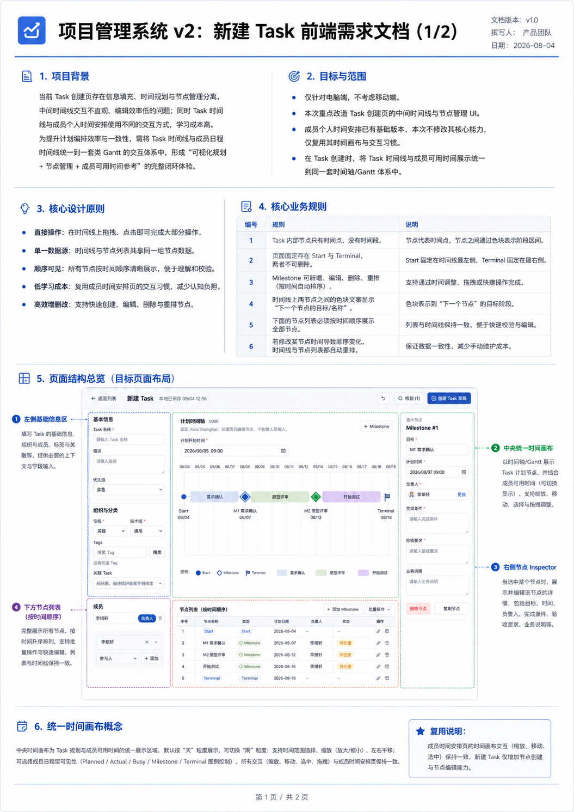
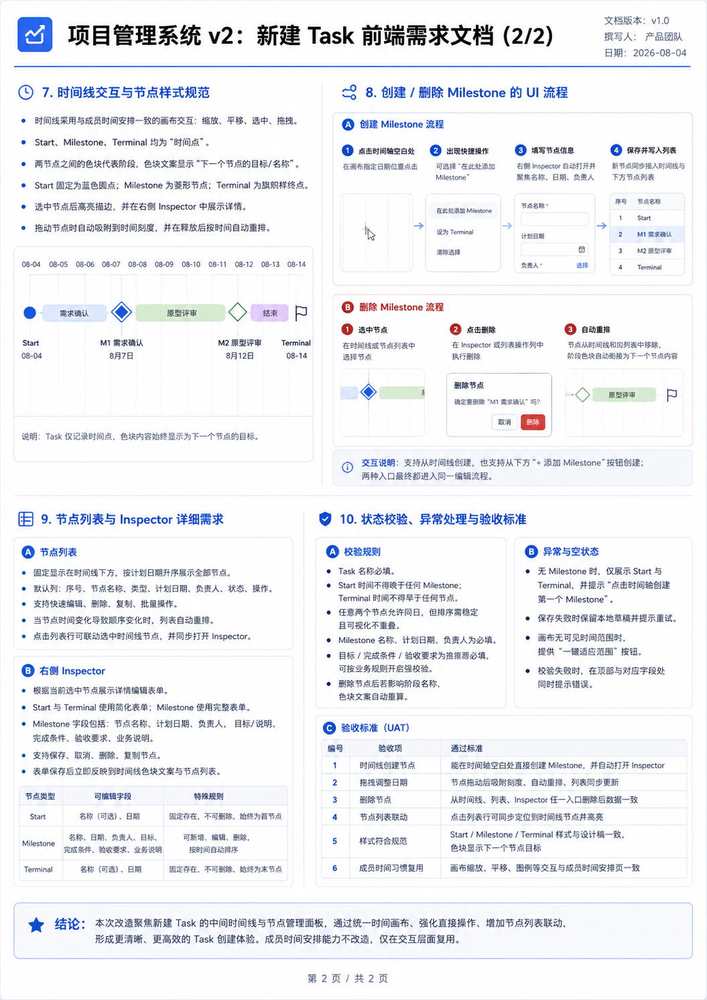

# Task Composer 创建、DRAFT 编辑与 Revision 界面最终设计

状态：已确认，作为实现与验收依据

确认日期：2026-08-05

## 1. 文档定位

本目录的两张图片是需求讨论阶段的视觉草案：

- [草案 1：页面结构与统一时间画布](./1.png)
- [草案 2：节点交互、Inspector 与验收示意](./2.png)

草案只用于说明布局和交互方向，不是字段或业务规则的来源。若图片、旧文档与本文冲突，以本文和服务端业务约束为准。尤其需要忽略草案中的节点负责人、节点状态列、可编辑 Start 名称、至少一个 Milestone 等早期设想。

## 2. 目标与边界

本次重构把 Task 计划的时间线、节点列表和节点编辑统一到一套数据与交互模型中，并由 `CREATE`、`EDIT_DRAFT`、`CREATE_REVISION` 和 `RESUBMIT_REVISION` 四种模式共用同一 Composer，降低创建、调整、复制和校验节点的操作成本。

- `/progress/tasks/new` 用于创建；`/progress/tasks/[id]/edit` 只用于编辑尚未激活的 DRAFT Task。两者在桌面端共用三栏 Composer，在 Pixel 5 共用纵向表单/节点编辑布局且不渲染桌面三栏画布。
- `/progress/tasks/[id]/revisions/new` 用于 ACTIVE Task 创建并直接送审 Revision；`/progress/tasks/[id]/revisions/[revisionId]/edit` 只用于修改被驳回的候选计划并重新送审。Revision Tab 不再包含内联候选计划编辑器。
- 创建页不查询或展示成员 Planned、Actual、Busy 数据；只复用统一 `TimeCanvas` 的时间坐标、缩放、平移、适配范围、吸附和选择习惯。
- 不增加节点级负责人。成员仍是 Task 级 `OWNER`/`PARTICIPANT`，同一人员只能有一个有效角色。
- Task 允许 `0–200` 个 Milestone；合法计划可以只有 Start 和 Terminal。
- Start 固定显示为 `Start`，不持久化名称。Terminal 名称持久化、必填，默认值为 `Terminal`。
- Milestone 不新增名称字段；必填 `goal` 同时用于 Inspector 标题、节点表名称、画布标签和阶段名称。
- 所有新建、Draft 保存、Revision 目标和模板副本提交都必须满足严格时间顺序：`Start < Milestone 1 < … < Milestone n < Terminal`。

现有 URL 预填能力必须保留：`start` 预填计划开始时间，`templateTaskId` 复制模板计划，`relatedTaskId` 预选关联 Task。现有本地草稿、撤销/重做、离开保护、请求幂等、失败保留和成功跳转工作台能力也不得回退。DRAFT 工作台不再内联编辑元数据、成员或计划；“概览”和“计划与资源”只读，统一从右上角“编辑 Task”进入 Composer。ACTIVE Task 的既有元数据、Tag 和成员编辑保持原状；Revision 的创建和驳回后修改迁入通用 Composer，审批、取消、历史、三层 Diff 和内部状态机保持不变。

## 3. 页面结构

### 3.1 顶部命令栏

顶部保留以下操作和状态：

- 创建模式返回 Task 列表；DRAFT 编辑返回 Task 工作台；Revision 创建/修改返回“修订与历史”；
- 本地草稿保存状态和最后保存时间；
- 撤销、重做；
- 当前校验问题数量及定位入口；
- 主操作依次为“创建 Task 草稿”“保存 Task”“创建并送审”“修改并重新送审”。

请求进行中时主操作不可重复触发；编辑模式无业务内容变化时主操作禁用，单纯切换所选节点不算修改。服务端失败时保留 Composer 实时节点状态和临时节点；创建模式同时保留幂等键。成功时清除对应本地草稿并跳转 Task 工作台。

### 3.2 桌面三栏

桌面 `1440x1000` 的主体使用三栏：

| 区域 | 内容 | 行为 |
|---|---|---|
| 左栏 | 创建/DRAFT 编辑时显示 Task 基础信息、Tag、关联 Task 和成员；Revision 时显示只读 Task 摘要及可编辑修订原因 | 页面正常滚动；复用现有选择器、校验和成员去重规则 |
| 中栏 | 计划时间范围、`TimeCanvas`、节点表 | 占用主要宽度；画布和表格共享同一节点状态与选中状态 |
| 右栏 | 当前节点 Inspector | 桌面吸顶、内部滚动；字段实时修改，不显示保存/取消 |

三栏在支持的桌面宽度内不得产生页面级横向滚动。长 Task 名称、节点目标、成员名、标签、字段错误和 200 个 Milestone 不能破坏栏宽；节点表和 Inspector 在自身区域内换行或滚动。

### 3.3 移动端

Pixel 5 不显示桌面 `TimeCanvas` 或三栏布局，继续使用纵向的基础信息和节点编辑流程。移动端仍必须支持零 Milestone、Terminal 名称、严格时间校验、模板复制和本地草稿恢复，并且不得出现横向溢出、不可操作控件或隐藏桌面内容带来的重复焦点。

Revision 模式在移动端使用相同纵向结构，并清楚标识只读承接节点；修订原因、当前 Revision Marker、后续 Milestone 和 Terminal 仍可完成编辑与送审。

## 4. 初始值、模板与本地草稿

### 4.1 全新创建

- Start 使用现有规则：上海时区的次日 `09:00`；若 URL 提供合法 `start`，使用预填值。
- Terminal 初始时间为 Start 后 14 天，名称为 `Terminal`。
- Milestone 初始为空。
- 创建者由服务端保证为 Owner；其他成员继续按现有成员选择和去重规则处理。

### 4.2 模板复制

模板复制保留可复制的 Task 元数据、成员角色、Milestone 内容和时间、Terminal 名称/内容及关联预填规则。复制所得计划在提交前按新规则重新校验，不自动改写相等或逆序时间；不合法时在画布、节点表和对应 Inspector 字段显示问题，用户修正后才能创建。

### 4.3 本地草稿 v3

本地草稿升级为 v3，至少保存：

- Task 基础信息、Tag、关联 Task 和 Task 级成员；
- Start、全部 Milestone、Terminal 名称和时间；
- 当前选中节点；
- 当前选中节点、临时/正式生命周期和各节点最后一次严格合法的画布时间；
- 账号、环境和草稿身份信息。

v1/v2 草稿按原值安全迁移：缺少 Terminal 名称时补为 `Terminal`，Milestone 可以迁移为空；不得为了满足严格递增而自动修改任何时间。恢复时仅按保留的时间对 Milestone 数组做视图与提交共用的规范排序，不改写时间戳；若有同刻节点，显示兼容校验提示并禁止提交，直至用户明确修正。无法兼容的草稿继续提供导出能力，不得静默丢弃。

实时节点状态参与自动保存；刷新或意外关闭后，临时节点仍同时恢复到 Inspector、画布和节点表。旧 v3 中尚未保存的 Inspector 工作副本在恢复时转换为实时节点：新增副本成为临时 Milestone，既有节点副本合并为当前输入，不静默丢失。

v3 使用分级浏览器存储：普通草稿继续直接写入按环境和账号隔离的 `localStorage`；接近合法 200 节点长文本边界的大草稿写入 IndexedDB，`localStorage` 只保留同一作用域的小型版本指针。恢复时校验指针与正文的草稿身份、保存时间和序列化长度；同账号多标签页通过浏览器存储锁串行执行读取、正文写入、指针更新和删除。离开前先取消尚未触发的防抖写入，“保存本地草稿并离开”必须等待异步写入完成；“放弃并离开”必须等待已入队写入结束后再清理。创建成功、放弃草稿或安全清理时同时删除 `localStorage` 和对应 IndexedDB 记录，任何写入失败都停留在 Composer 并提示用户不要刷新。

### 4.4 DRAFT 编辑初始值与本地草稿

编辑 Seed 必须来自权威 Workspace：完整回填元数据、当前 Tag、关联 Task、成员、Start、Milestone 和 Terminal；既有 Milestone/Terminal 保留 `nodeId` 并初始化为 `ESTABLISHED`，新 Milestone 使用 Composer 临时 ID，提交时作为稳定 `clientKey`。当前成员即使停用也继续展示并可保留；只有 `canManageMembers` 可以搜索、添加、移除或改变角色。Participant 的成员区只读，恢复草稿时也以服务端成员覆盖本地成员。若迁移后异常残留 `LEAD/MEMBER/REVIEWER/VIEWER` 历史角色，则逐行只读展示并保留、整个成员区停止修改，非成员内容仍可保存；恢复时同样丢弃本地成员差异。当前已归档 Tag 可展示和移除，但搜索只能新增未归档 Tag；关联 Task 排除自身并保留当前选项回显。

编辑草稿使用 `task-edit-draft:{environment}:{accountId}:{taskId}:v1`，正文除 Composer 完整状态外还绑定 `taskId`、`planVersionId` 和基础 `lockVersion`。只有环境、账号、Task、计划版本和锁版本完全匹配时可恢复；服务端版本变化时不恢复、不覆盖、不做隐式字段合并，只提供原始草稿导出和“放弃并加载最新版本”。保存收到 `STALE_TASK` 时停留当前页并保留本地输入。服务端保存成功后，即使浏览器存储清理失败，也按成功结果返回工作台，不能诱导用户重复提交。

### 4.5 Revision 初始值与本地草稿

Revision Seed 来自 ACTIVE Task 的权威 Current Plan。Start 固定沿用；已完成 Milestone 和已生效 Revision Marker 自动承接并只读；当前 Revision Marker 的时间和修订原因可编辑，但 Marker 只是时间锚点，不形成阶段带，也不能被 Segment 关联；Marker 之后的 Milestone 与 Terminal 可以编辑。创建成功即为 `PENDING_APPROVAL`，被驳回后修改成功直接重新送审并使 `reviewRound + 1`，不存在 DRAFT Revision 或独立 Submit。

创建草稿使用 `revision-create-draft:{environment}:{accountId}:{taskId}:v1`，重提草稿使用 `revision-resubmit-draft:{environment}:{accountId}:{revisionId}:v1`。正文分别绑定基线计划、Task 锁版本，或候选计划更新时间；稳定实体键保证服务端版本变化后仍能发现旧草稿，envelope 校验不匹配时禁止恢复和覆盖，只允许导出或“放弃并加载最新版本”。恢复会把 SSR 重新生成的 Marker ID 映射到权威 Marker，同时保留选中节点、修订时间、后续节点和最后合法画布位置。创建幂等键绑定 Composer `draftId`；冲突和服务端失败均停留页面并保留输入，成功清理草稿并返回 `?tab=revisions`。

## 5. 统一时间画布

### 5.1 展示模型

Start、每个 Milestone 和 Terminal 都是可选择的时间锚点：

- Start：蓝色圆点，标签固定为 `Start`；
- Composer Milestone：菱形，标签取 `goal`；Workbench 继续按节点状态使用既有完成勾或状态圆点；
- Revision Marker：独立时间锚点；已生效 Marker 和当前 Marker 都不作为阶段边界，当前 Marker 仅在 Revision Composer 中可编辑；
- Terminal：旗帜，标签取持久化名称。

所有 `TimeCanvas` PLAN 行都让节点符号与阶段块位于同一条水平连接线上。阶段块从前一节点中心连接至后一节点中心，文案始终取“下一节点”的名称，即下一 Milestone 的 `goal` 或 Terminal 名称；节点名称和上海时区日期显示在符号下方。颜色按 `BLUE → VIOLET → AMBER → EMERALD → ROSE → SLATE` 的固定无障碍色板依序循环，仅用于展示，不写入数据库。零 Milestone 时仍展示 Start、Terminal 和两者之间以 Terminal 名称标注的阶段块。

新增 Milestone 立即成为画布锚点。未满足完整节点校验前，节点显示琥珀色虚线和“临时”标识；与它相连的前后两段阶段块也显示琥珀色虚线浅底。时间输入被清空、同刻或越界时，Inspector 保留原输入和错误，画布使用该节点最后一次严格合法的位置；修正后立即移动到新位置。

画布复用统一组件的上海时区坐标、半开区间、缩放、平移、适配范围和可见对象渲染，不加载任何成员时间数据。选择画布节点会同步高亮节点表、该节点对应的前置阶段块并打开相同节点的 Inspector；选择表格行亦反向同步画布。阶段块本身可点击，点击后选择其“下一节点”并保持阶段高亮；零 Milestone 时点击 Start → Terminal 阶段即选择 Terminal。

### 5.2 缩放、吸附与移动

可编辑节点的拖动和键盘移动沿用画布当前档位的吸附粒度；Revision 模式的 Start、已完成 Milestone 和已生效 Revision Marker 不响应移动：

| 画布档位 | 吸附步长 |
|---|---|
| 小时 | 30 分钟 |
| 日、周 | 1 天 |
| 月 | 7 天 |

拖动按时间增量修改原值，不把时区转换为浏览器本地日历日。在创建和 DRAFT 编辑模式中 Start、Milestone、Terminal 均可拖动；Revision 模式仅允许当前 Marker、后续 Milestone 和 Terminal 移动。键盘聚焦节点后，左右方向键按一个当前吸附步长移动，`Enter`/空格选择节点。所有操作必须保持严格时间边界：

- Start 只能移动到首个 Milestone（无 Milestone 时为 Terminal）之前；
- Terminal 只能移动到最后一个 Milestone（无 Milestone 时为 Start）之后；
- Milestone 不得越过 Start 或 Terminal，但可以穿越其他 Milestone；释放后按时间自动重排，节点身份和正文不变；
- 边界内有合法吸附位置时限制到合法位置；当前粒度下没有合法位置时恢复原位置，并提示放大画布或使用 Inspector 精调。

一次成功拖动、键盘移动或自动重排作为一次撤销历史提交。拖动过程中节点符号与其前后阶段块同步预览目标时间；发生 Milestone 穿越时，阶段连接按预览时间重排，但不提前持久化。Start 与 Terminal 边界及同刻占位在拖动预览阶段即生效，锚点停在最近的合法吸附位置，不允许先越界再于松手后回弹。

### 5.3 空白位置快捷操作

单击画布的空白轨道打开定位在该时刻的快捷菜单：

- “在此添加 Milestone”：以该时刻立即建立临时 Milestone 并打开 Inspector；
- “移动 Terminal 到此处”：预览并提交 Terminal 时间修改。

若目标时刻不满足严格边界，对应操作保持可见但禁用，并展示原因。`Escape` 关闭菜单。零 Milestone 时显示“点击时间轴或添加按钮创建 Milestone”的空状态，Start 和 Terminal 仍可选择和编辑。

## 6. 节点表

节点表与画布使用同一份、按时间排序的节点数据，固定包含 Start、全部 Milestone 和 Terminal：

| 列 | 内容 |
|---|---|
| 选择 | 仅 Milestone 可勾选 |
| 序号 | 当前严格时间顺序，从 1 开始 |
| 节点名称 | `Start`、Milestone `goal` 或 Terminal 名称 |
| 类型 | Start、Milestone、Terminal |
| 计划时间 | 上海时区日期时间 |
| 操作 | 按节点类型提供编辑、复制、删除 |

负责人和状态不属于创建页节点表。Start、Terminal 可以编辑时间/内容，但不能删除、复制或批量选择。Milestone 支持编辑、复制和删除。Revision 模式中的 Start、已完成 Milestone 和已生效 Revision Marker 只读，不能复制或删除；当前 Revision Marker 只能编辑时间。

- 单个删除需要确认，完成后同步移除画布锚点和相邻色带；
- 批量操作仅有“删除所选 Milestone”，确认后一次删除，并作为一条撤销历史；
- 复制 Milestone 时复制 `goal`、完成条件、验收要求和业务说明，并按新增节点流程建立副本；复制内容与建议时间完整合法时会在同一次状态更新中自动转正，否则保持临时；
- 复制时间优先使用原节点后一天，否则在原节点与下一节点之间寻找最近的分钟级合法位置；没有合法位置时不创建并提示先调整相邻节点或 Terminal；
- 任何删除或复制都不得改变其他节点正文；时间顺序由实时有效时间自动计算。

## 7. 节点 Inspector

Inspector 直接编辑 Composer 实时状态，不显示“保存”“取消”或“未保存”。有效输入立即反映到画布、节点表、校验和本地草稿；切换节点不会弹出丢弃工作副本提示。

| 节点 | 可编辑字段 | 规则 |
|---|---|---|
| Start | 计划开始时间 | 名称固定为 `Start`；时间必填且早于下一节点 |
| Milestone | 目标、计划时间、完成条件、验收要求、业务说明 | 前四项必填，业务说明可选；不显示负责人 |
| Terminal | 名称、计划结束时间、结束条件、业务说明 | 名称、时间、结束条件必填；名称 trim 后 1–200 字符，业务说明可选 |

Revision 模式覆盖上述通用规则：承接的 Start、已完成 Milestone 和已生效 Revision Marker 全部只读；当前 Revision Marker 只编辑时间，修订原因位于左栏；后续 Milestone 和 Terminal 沿用通用 Inspector。

新增 Milestone 立即计入 `0–200` 上限并保持临时状态，直到目标、严格合法时间、完成条件和验收要求全部有效后一次性转为正式节点。转正不可逆；后续字段失效时显示“需修正”并阻止提交。临时节点切换后继续保留，可从 Inspector 或节点表显式删除；普通 Milestone 在 Inspector 保留复制和删除。

同一节点的一段连续编辑只形成一条撤销历史：第一次修改记录基线，后续输入实时替换当前状态；切换节点、结构操作、撤销或重做后开启新的编辑段。字段校验在 Inspector 内就近展示，同时计入顶部问题数量；从问题入口可选择并定位相关节点和首个无效字段。

## 8. 服务端契约与持久化

### 8.1 数据模型

- `TaskPlanVersion.plannedStartAt` 继续表示 Start，不新增 Start 名称字段。
- `TerminationNode.name` 为 `VARCHAR(200) NOT NULL DEFAULT 'Terminal'`；迁移为既有行回填 `Terminal`。
- Milestone 内容模型保持不变，不增加负责人、颜色或名称字段。

创建、Draft 计划替换、Revision 创建/更新、查询 DTO、模板复制、计划快照、版本差异和审计摘要都必须传播 Terminal 名称。任何界面或通知需要表示 Terminal 节点时使用其名称，不再把结束条件当作节点名称。

### 8.2 服务端校验

- 创建和 Draft 替换接受 `0–200` 个 Milestone；201 个及以上拒绝。
- Terminal 名称 trim 后必须非空且不超过 200 字符；新写入请求必须显式提交名称，数据库迁移和默认值只负责将既有记录兼容为 `Terminal`。
- 权威计划校验同时验证唯一末尾 Terminal、连续 sequence、有效时间和严格递增；相等时间与逆序时间都拒绝。
- 客户端校验仅用于及时反馈，不能替代 Server Action/领域服务的同等约束。
- 创建仍在单一事务中写 Task、Current Plan、节点、成员、Tag、审计、站内通知和 `channel=project-management` outbox，并保留现有幂等键冲突检查。
- DRAFT 统一编辑通过 `updateTaskDraft` 在单一事务锁定 Task 和节点关联，重新加载权限并校验 DRAFT、初始未激活 v1 Current Plan、`planVersionId`、`lockVersion`、目标组织范围、关联可见性、Tag、可选成员、Segment 引用和完整计划；随后整体更新元数据、Tag、可选成员与计划、重算 `snapshotHash`、只递增一次锁并写一条 `pm.task.draft.update` 审计。Participant 必须省略 `members`，伪造成员字段拒绝；该事务不创建站内通知或 outbox。既有三个 DRAFT mutation 只为兼容保留，统一编辑页不调用它们。
- 编辑 URL 在服务端对无 Task 查看权或无 `task.update_metadata` 权限返回脱敏 404，对非 DRAFT 重定向工作台；Server Action 再次执行权限、状态和锁校验，页面防护不能替代服务端授权。
- Revision 新建 URL 对无 `revision.create` 权限返回脱敏 404；非 ACTIVE 时返回 Task 工作台，已有 Candidate 时返回“修订与历史”。驳回修改 URL 只接受 `REJECTED && canEdit`，创建人还须保有 `revision.create`，其他操作者须有成员管理权限。Server Action 继续重新验证权限、状态、基线计划、锁版本和候选更新时间。
- Revision 创建继续原子写入候选计划、Revision Marker、审计和按 Revision ID + round 幂等的审批通知；驳回后调用 `reviseRejectedRevision` 原子替换可编辑后续计划、增加轮次并重新进入 `PENDING_APPROVAL`。每个 Task 最多一个 Candidate，且不增加普通 DRAFT Task 通知规则。

### 8.3 零 Milestone 生命周期

零 Milestone 的 Draft 可以正常激活。激活事务执行：

- Task 进入 `ACTIVE`；
- Terminal 从 `PENDING` 进入 `ACTIVE`；
- `activeMilestoneNodeId` 保持 `null`，该字段只表示活动 Milestone；
- 激活审计记录实际活动节点为 Terminal；
- 工作台和 Task 列表使用 Terminal 名称与计划时间表示当前阶段，不显示“当前没有 Active Milestone”；激活通知使用 Terminal 名称说明当前节点。

后续结束确认、审计、站内通知和 outbox 沿用现有 Terminal 状态机，不新增通知事件，也不直发飞书。

### 8.4 快照、差异与历史兼容

自定义 Terminal 名称属于计划版本内容，随 Draft、Revision 和模板复制演进。名称变化必须进入计划版本差异和有限审计摘要。

快照 canonical form 采用兼容规则：名称为默认 `Terminal` 时不新增 canonical 键，以免既有默认名称计划的 `snapshotHash` 全量变化；名称为其他值时写入 canonical form，因此自定义名称变化必然改变 hash。

迁移不修改任何历史节点时间。既有只读、Historical 或 Active Current Plan 即使含旧式同刻数据仍可读取，并显示兼容提示；不得因本次发布失去访问能力。任何新建、Draft 保存、Revision 目标或模板副本提交必须先调整为严格递增。既有同刻数据不设计自动位移，也不设计绕过新 Revision 目标校验的特殊流程。

## 9. 统一 TimeCanvas 接口要求

`TASK_COMPOSER` 模式在不改变其他模式行为的前提下扩展受控能力：

- 外部传入选中锚点，画布选择回调返回稳定节点身份；
- 空白位置创建请求返回对应上海时区时刻；
- 拖动和键盘移动回调返回节点身份、原时间、目标时间及当前吸附档位；
- 阶段带接收起止锚点、显示名称和展示颜色；
- Composer 负责业务边界、严格顺序、自动重排、实时编辑段和撤销历史，画布负责坐标、命中、预览和无障碍输入；
- Resource Planner、Personal Timeline 等既有模式不出现 Composer 的创建菜单、节点写回或阶段带行为。

## 10. 审计、通知与错误安全

- Terminal 名称进入与计划有关的有界差异/审计摘要；正文继续避免无界复制到审计 metadata。
- 创建、激活和结束确认继续在业务事务中写站内通知和 durable outbox；事件键、收件人和通知/审批机器人边界保持不变。
- 自动化测试只断言站内通知、outbox、payload 和投递保护，始终设置 `NOTIFICATION_DELIVERY_DISABLED=true`，不得联系真实飞书收件人。
- 客户端和服务端错误使用可理解的中文文案，不显示原始 Zod、SQL、堆栈、内部 ID 或敏感 payload。

## 11. 验收标准

### 11.1 数据与生命周期

- 0、1、200 个 Milestone 可创建，201 个被拒绝；零 Milestone 激活后 Terminal 为活动节点且 `activeMilestoneNodeId=null`。
- Start/Milestone/Terminal 任意同刻或逆序均不能新建或保存；合法严格递增计划可以创建、替换和 Revision。
- Terminal 名称覆盖必填、空白、200/201 字符，并在 Draft、Revision、模板、查询、工作台、差异、审计和快照中不丢失。
- 迁移在隔离 PostgreSQL 从空库和带既有 Terminal 数据的前置 schema 上成功，旧行名称为 `Terminal`，业务记录和通知记录不丢失。

### 11.2 桌面交互

- 初始画布只有 Start/Terminal；空白菜单可创建 Milestone 或移动 Terminal。
- 画布、节点表和 Inspector 选择双向同步；新增节点立即以临时样式进入三处，补全后自动转正。
- 各模式中的可编辑锚点可拖动和键盘移动，Revision 承接锚点保持只读；Milestone 穿越后自动重排，非法吸附恢复原位并给出可执行提示。
- 复制、临时节点显式删除、单删、批量删除和连续编辑撤销/重做按本文实时状态规则执行。
- 刷新恢复临时节点和最后合法画布位置；旧 v3 Inspector 工作副本安全转换，v1/v2 同刻草稿只提示和阻止提交，不自动改变时间。
- `1440x1000` 下长文本、空列表、200 节点、长错误、慢请求和失败请求均无页面级横向滚动、Next.js error overlay 或未捕获浏览器错误。

### 11.3 移动与回归

- Pixel 5 不渲染桌面三栏画布，但能完成零 Milestone 创建、Terminal 命名和严格时间错误修正。
- URL 预填、模板复制、Task 级成员权限、本地草稿隔离、幂等创建、失败保留和成功跳转均不回退；DRAFT 编辑在 Desktop/Pixel 5 都能一次保存全部区域，Participant 成员只读，过期本地草稿不能覆盖服务端新版本。
- Revision 创建和驳回后修改在 Desktop/Pixel 5 都使用通用 Composer；只读承接边界不可绕过，Marker 不切割阶段，成功直接进入待审批并返回 Revision Tab；刷新能恢复选中 Marker，基线或候选版本变化后旧草稿只能导出或显式放弃加载最新版本。
- Task Composer 与 Task Workbench 的 PLAN 行统一使用水平节点连接布局；Resource Planner、Personal Timeline 的人员/Task 行以及 Planned、Actual、Busy 行为不受影响。

完成实现前必须执行 `npm run check`、`npm run test:e2e`、`npm run build`，并在隔离 PostgreSQL 通过受控 `npm run db:deploy` 验证完整迁移链。
