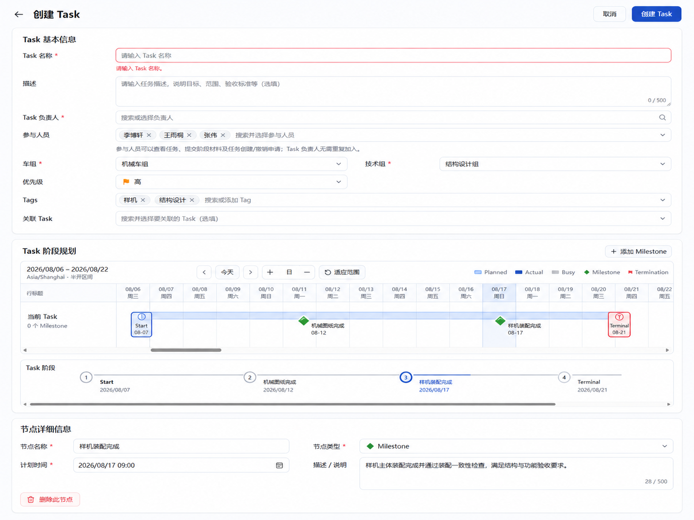
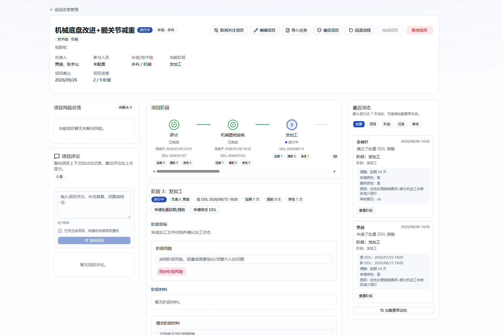

# Task UI v2 目标与实施计划

> 状态：本轮产品范围已确认，尚未进入实现。
>
> 本文只定义 Task 创建、详情和 Revision 的前端信息架构与交互调整。效果图用于表达布局和信息层级，不是像素级验收稿，也不覆盖当前 schema、权限、状态机、审计、通知和并发规则。

## 1. 背景与目标

当前 Task Composer 在桌面端采用“左侧 Task 信息 + 中间计划画布/节点表 + 右侧节点 Inspector”的三栏布局，Task 详情采用“顶部概览 + 人员投入画布 + 多标签工作台”。这两处页面功能完整，但页面横向层级较多，Task 计划节点与当前处理对象不够集中。

本轮目标是：

1. 将 Task 创建、Draft 编辑和 Revision Composer 调整为纵向主流程。
2. 在计划画布下增加统一的 Task 节点导航，直观展示 Start、Milestone、Revision 和 Terminal。
3. 节点被选中后，在节点导航下方展示该节点的详情和可用操作。
4. 将 Task 详情调整为“顶部 Task 概览 + 左中右内容区”，中间区域围绕计划节点和当前节点操作组织。
5. 创建、详情和 Revision 共用同一套节点视觉语义与选择逻辑，避免出现三套相似但行为不一致的时间线。

本轮不是业务流程重做。除本计划后续明确列为产品变更的事项外，现有服务端行为必须保持不变。

直接受影响的路由为：

- `/progress/tasks/new`
- `/progress/tasks/[id]/edit`
- `/progress/tasks/[id]`
- `/progress/tasks/[id]/revisions/new`
- `/progress/tasks/[id]/revisions/[revisionId]/edit`

Task 列表、资源计划、个人时间线、待办和通知中心不在本轮重构范围内，但必须回归它们与 Task 详情的入口及共享 TimeCanvas 不受影响。

## 2. 依据与优先级

本计划以以下内容为依据：

1. 当前分支代码、`prisma/schema.prisma`、migration 和现有自动化测试。
2. 本目录的目标效果图。
3. `main` 分支的旧项目创建页和项目详情页只作为纵向布局、阶段导航与三列信息架构参考，不复制其旧 Project/Stage 数据模型、权限和操作。

如效果图与当前业务规则冲突，以当前业务规则为准，并在实现前把冲突补充为明确的产品决策，不在 UI 中静默改变行为。

## 3. 本轮必须保持的现有业务规则

### 3.1 Task 与成员

- 所有已登录统一账号仍可创建 Task；创建者自动成为负责人。
- Task 创建成功后仍为 `DRAFT`，不会因为按钮文案或布局调整而直接激活。
- 有效成员仍只有 `OWNER`（负责人）和 `PARTICIPANT`（参与人）。
- 当前规则允许多名负责人，但至少需要一名负责人；同一 Person 在同一 Task 中只能有一个有效角色。效果图中的单个“Task 负责人”输入不代表改为单负责人。
- 非成员、参与人、负责人和全局管理员的可见与可操作能力继续由服务端 capability 决定；隐藏按钮不能替代服务端鉴权。

### 3.2 计划与节点

- 新建计划必须包含 Start 和 Terminal，可以有 0–200 个 Milestone。
- Start、Milestone、Terminal 继续遵守当前严格递增规则；上海时区语义不变。
- Revision 是时间标记，不形成计划阶段，不接受 Work Segment 关联，也不改变阶段带边界。
- Current Plan、历史计划、已完成节点、待审批对象和终态对象的只读边界保持不变。
- 节点新增、移动、单节点删除、校验、草稿恢复、撤销/重做和乐观锁语义继续保留。本轮已明确下线节点复制、桌面节点表、批量选择和批量删除，不再为这些入口提供等价 UI。

### 3.3 审批、审计与通知

- Revision 创建仍直接进入 `PENDING_APPROVAL`，不存在 Revision Draft 或单独提交步骤。
- Milestone 验收、Revision 审批和 Terminal 确认仍受单一待审批门禁与当前状态机约束。
- 只有全局管理员可以作出 Milestone/Revision 最终决定；允许提交人与审批人为同一全局管理员，但仍必须执行显式审批动作。
- UI 调整不得绕过现有事务、幂等、审计、站内通知、outbox、机器人路由和禁发保护。
- 本轮预计不需要 schema 或 migration；若实现中发现现有查询无法支撑目标界面，应先补充本文，而不是直接扩展数据模型。

## 4. 统一页面与组件约定

### 4.1 页面模式

统一 Composer 继续支持四种模式：

- 新建 Task：`CREATE`
- 编辑 Draft Task：`EDIT_DRAFT`
- 发起 Revision：`CREATE_REVISION`
- 修改并重新送审被驳回的 Revision：`RESUBMIT_REVISION`

四种模式共用页面骨架、计划画布、节点导航、节点选择与节点详情组件；根据模式决定基本信息内容、节点只读范围、主按钮文案和提交 action。

### 4.2 统一节点导航

新增共享的 Task 节点导航组件（暂称 `TaskPlanNodeNavigator`），同时用于 Composer 和 Task 详情。

组件职责：

- 按当前计划顺序展示 Start、Milestone、Revision 和 Terminal。
- 展示节点名称、上海时区日期、节点类型、状态和必要的异常/待审批提示。
- 支持鼠标、键盘和触摸选择；选中状态与画布、移动端节点列表、URL（如最终采用）和节点详情保持同步。
- 支持长名称、0 个 Milestone、200 个 Milestone 和窄屏；大量节点允许组件内部滚动，不能造成页面级横向滚动。
- Revision 作为时间标记显示，但不绘制成新的阶段区间，也不改变前后 Milestone/Terminal 的阶段带。
- Composer 中的临时或校验失败节点必须有可感知的状态，不能只依赖颜色表达。

该组件只负责展示和选择，不自行推导权限，不直接调用 mutation，不复制服务端状态机。

### 4.3 统一选择规则

- 初次进入创建或 Draft 编辑页默认选中 Start。
- 初次进入 Revision Composer 默认选中当前 Revision 标记；若现有恢复草稿已保存选择，则以通过上下文校验的恢复值为准。
- Task 详情默认优先选中当前 Active Milestone；无 Active Milestone 时选中 Active Terminal；Draft 或兼容旧数据无法确定当前节点时选中 Start。
- 点击画布锚点、节点导航项或移动端节点项，三处选择必须同步。
- 选择 Revision 只展示 Revision 信息，不把它当作 Milestone 或阶段终点。
- 节点被删除后，选择移动到相邻合法节点；不得留下指向已删除节点的 Inspector。

### 4.4 响应式与可访问性

- 桌面验收视口为 `1440x1000`；移动端为 Playwright Pixel 5 配置。
- 桌面保留可交互 TimeCanvas；移动端继续使用纵向节点交互，不把桌面画布强行缩小。
- 三列 Task 详情只在足够宽的桌面视口启用；窄屏按“概览 → 中间主内容 → 评论/风险占位 → 最近动态占位”纵向排列。
- 所有节点和操作使用语义化 button/link、可见焦点、可理解的 accessible name；不能只靠 hover 或颜色传达选择、错误和禁用原因。
- 所有异步操作必须保留 loading、disabled、success 和 error 状态；长错误必须换行并能定位到相应区域或字段。

## 5. Task 创建与 Draft 编辑

### 5.1 页面结构

页面改为纵向排列：

1. 顶部操作栏
2. Task 基本信息
3. Task 阶段规划（计划画布 + 节点导航）
4. 选中节点详情
5. 全局校验摘要（有问题时展示）

目标布局参考：



效果图中未画出的本地草稿恢复、冲突提示、提交失败反馈和移动端底部操作栏仍需保留。

### 5.2 顶部操作栏

- 返回入口：新建模式返回 Task 列表，编辑模式返回 Task 工作台。
- 主操作：新建模式仍为“创建 Task 草稿”，编辑模式为“保存 Task”。
- 提交期间禁用可能造成重复提交或状态错乱的操作。
- 本地保存状态、恢复旧草稿、版本冲突和清理失败必须继续可见。
- 保留本地保存/恢复提示和撤销/重做图标。
- 删除独立“校验”按钮；点击提交时自动执行完整校验，并在页面底部展示可点击的问题摘要。

### 5.3 Task 基本信息

将当前左侧三个卡片合并为一个全宽区块，包含：

- Task 名称（必填）
- 描述
- Task 负责人（至少一名，支持多名）
- 参与人员（可为空）
- 车组（必填，固定选项）
- 技术组（必填，固定选项）
- 优先级
- Tags
- 关联 Task（可为空）

成员选择继续使用当前 Person 搜索、停用人员限制、Draft 历史角色兼容和服务端权限规则。负责人和参与人不得在两个输入中重复出现；负责人不需要再加入参与人。

“先不考虑模板”定义为：本轮不增加模板选择 UI，也不扩展模板业务；现有 `templateTaskId`、`relatedTaskId` 和 `start` URL 预填兼容行为不得无意删除。

### 5.4 Task 阶段规划

桌面端继续复用当前 Composer TimeCanvas，保留：

- Start、Milestone、Terminal（Revision 模式另含 Revision）锚点展示与选择
- 添加 Milestone
- 在画布指定位置新增 Milestone
- 移动 Terminal
- 拖动和键盘移动锚点
- 缩放、今日、适应范围和上海时区显示
- 临时节点、非法时间和最后合法位置反馈

调整内容：

- 删除画布下方独立的“当前计划只有 Start 与 Terminal……”虚线提示框。0 Milestone 状态改由节点导航和“添加 Milestone”入口自然表达。
- 在画布下方展示共享节点导航；即使 0 Milestone，也必须显示 Start 和 Terminal，并允许选择两者。
- 节点导航不重复显示 TimeCanvas 已经表达的冗长说明。
- 画布和节点导航放在同一“Task 阶段规划”区块中。

### 5.5 选中节点详情

节点详情移到节点导航下方，采用全宽或两列字段布局，不再固定在右侧 sticky Inspector。

- Start：计划开始时间；Revision 模式中按现有规则只读。
- Milestone：目标、计划完成时间、完成条件、验收要求、业务说明和单节点删除入口；不再提供节点复制。
- Revision：Revision 名称、Revision 详细内容和 Revision 时间；三个字段均必填。当前 Revision 由页面自动插入且不可删除，已生效 Revision 保持只读；明确提示“Revision 是时间标记，不形成阶段”。
- Terminal：名称、计划时间、计划结果条件和业务说明。

字段仍采用实时同步：输入变化立即更新画布和节点导航；非法时间保留最后合法绘制位置，同时在字段和节点详情红色提示框中显示可操作的中文错误。节点详情不再重复展示独立“问题列表”。

## 6. Task 详情

### 6.1 页面结构

页面整体纵向排列：

1. 返回 Task 列表/进度管理入口
2. Task 概览和状态操作
3. 单一待审批门禁（存在时）
4. 桌面三列内容区；移动端纵向内容区

参考布局：



旧 `main` 项目详情只提供视觉参考。Task 详情必须使用当前 `TaskWorkspace`、lifecycle 查询和 capability，不能复用旧 Project/Stage action。

### 6.2 Task 概览

概览至少展示：

- Task 名称、状态、优先级
- 描述（为空时不制造大块空白）
- 负责人、参与人
- 车组/技术组
- 当前节点
- 计划开始、计划结束和计划版本
- Tags 与关联 Task（存在时）
- 旧版计划时间顺序兼容提示（存在时）

按钮必须按服务端 capability 和 Task 状态显示或禁用：

- DRAFT：编辑 Task、激活 Task、删除草稿
- ACTIVE：发起 Revision、修改 Task 基本信息、结束 Task
- 存在待审批：保留门禁提示，并禁用会与其竞争的 Revision、验收提交和结束操作
- COMPLETED / FAILED / CANCELLED / TIMEOUT / ARCHIVED：只读，不展示可写入口
- 所有状态：复制链接可以保留为次要操作

“结束 Task”入口只负责把用户带到 Terminal 详情和确认操作，不创建另一套 Terminal mutation。

“修改 Task 基本信息”采用与 `main` 项目详情相同的承载方式：点击顶部按钮打开可滚动 Dialog，在 Dialog 内编辑 Task 基本信息。Dialog 使用单一“保存修改”按钮，将 metadata、Tags、members 在一个服务端事务中统一保存；有实际变化时只递增一次 Task 锁版本，仅为发生变化的区域写入审计，无变化保存不写数据、不递增锁版本。事务内部仍分别执行各区域的权限、引用、成员、审计和通知校验，不复用只允许 DRAFT 的 Composer edit route。移动端 Dialog 使用接近全屏的可滚动布局，保存失败信息显示在 Dialog 内；发生并发冲突后冻结本次编辑基线和保存按钮，必须关闭并重新打开以加载权威数据，旧表单不能携带新锁版本重试。

### 6.3 三列内容区

#### 左列：评论与风险占位

- 展示“Task 风险”和“Task 评论”两个明确的占位卡片。
- 本轮不新增风险/评论 schema、action、通知或假提交表单。
- 占位内容必须明确“暂未开放”，不能放置看似可提交但无实际行为的控件。

#### 中列：主要详情

第一层为只读 TimeCanvas 与共享 Task 节点导航，展示 Current Plan 中的 Start、Milestone、已生效 Revision 和 Terminal。桌面显示与 Composer 一致的时间点和阶段带，移动端保留纵向节点导航；选择节点导航时 TimeCanvas 自动横向定位到对应时间点，点击 TimeCanvas 时间点时同步选中下方节点详情。待审批/被驳回的 Revision 属于候选计划历史，不应伪装成 Current Plan 已生效节点；可通过明确的候选提示展示。

第二层为选中节点详情：

- Start：计划开始、版本和只读说明。
- Milestone：目标、截止、完成条件、验收要求和状态；只有 Active Milestone 且 capability 允许时显示提交验收，只有该节点当前待审批记录且 capability 允许时显示审批操作。本轮不展示验收历史列表。
- Revision：Current Plan 中已生效 Revision 的名称、详细内容、时间、轮次、状态、审批人/意见和生效时间。待审批/被驳回候选不进入 Current Plan 节点导航；本轮不展示 Revision 历史、计划版本或候选 Diff 列表。
- Terminal：计划结果条件、计划时间；Terminal Active 且可结束时显示现有四种 outcome、原因、总结和二次确认。

Milestone/Revision 的历史记录和完整审计数据继续在服务端保存，但本轮 Task 详情不提供历史列表或“加载更多”入口。

#### 右列：最近动态占位

- 本轮只展示结构化“暂未开放”占位卡片，不新增实时订阅、审计适配或活动查询。
- 不展示伪造的示例动态。

### 6.4 移除现有工作台展示

本轮从 Task 详情页删除以下 UI 和对应的页面查询/本地状态：

- 人员投入 TimeCanvas；人员投入继续通过现有 `/progress/resources` 页面管理，本轮不在 Task 详情增加替代入口。
- 重复的 Current Plan 只读列表。
- 现有 Tab 导航及 Tab 内的概览编辑区、Revision 历史、计划版本、验收历史和完整审计列表。
- Revision Diff、历史分页和审计筛选等只服务于上述已移除区域的前端状态。

节点详情仍保留完成当前流程所必需的 Milestone 提交/审批、Revision 当前节点信息和 Terminal 确认；顶部 Dialog 承接 Active Task 基本信息修改。这里删除的是 Task 详情入口和展示，不删除数据库历史、领域 action、审计写入、通知或其他页面仍在使用的公共能力。

## 7. Task Revision

Revision 页面复用第 5 节的纵向 Composer 骨架，不另建一套表单。

与 Task 创建的差异：

- 顶部沿用 Task 创建页的“基本信息 / 组织与分类 / 成员”结构，展示当前 Task 的权威内容并保持只读；Revision 信息不再占用顶部独立卡片。
- Start、已完成 Milestone 和已生效 Revision 按当前规则只读。
- 页面自动插入一个不可删除的当前 Revision 节点；Revision 名称、Revision 详细内容和 Revision 时间与其他节点字段一样在下方节点详情中编辑且均必填，后续 Milestone 和 Terminal 按现有规则可编辑。
- Revision 标记出现在画布和节点导航中，但不形成新的阶段区间。
- 主按钮分别为“创建并送审”和“修改并重新送审”。
- 成功后回到 Task 详情的 Revision 上下文，并显示 `PENDING_APPROVAL`；失败保留输入和幂等上下文。
- 非成员、非 ACTIVE、已有候选或已有单一待审批对象的直达保护继续保持当前行为。

## 8. 实施拆分

### 阶段 A：共享节点导航与选择契约

- 定义节点导航所需的最小前端 view model；优先从现有 `TaskComposerSeed` 和 `PlanVersionSummary` 适配，不改变服务端 DTO。
- 实现桌面横向、移动端纵向展示以及键盘选择。
- 覆盖 Revision 不切割阶段、0/200 Milestone、长名称、异常状态和选择同步。
- 主要改动预计位于 `components/project-management/`；不得从 `main` 复制旧 Project/Stage 业务组件。

### 阶段 B：Composer 纵向重排

- 重排 `TaskComposerClient` 和 `TaskComposerPlanEditor`，不改 action 入参和提交顺序。
- 合并基本信息区，移动 Inspector，删除单独空状态提示。
- 删除桌面节点表、批量选择、批量删除和节点复制；保留节点导航、单节点删除、撤销/重做和问题摘要。
- 同时回归 CREATE、EDIT_DRAFT、CREATE_REVISION、RESUBMIT_REVISION。
- 预计修改 `components/project-management/task-composer-client.tsx`、`task-composer-plan-editor.tsx` 及必要的新共享组件；路由页只调整页面标题、描述或适配数据时才修改。

### 阶段 C：Task 详情重排

- 删除人员投入、历史版本、验收/Revision 历史和审计列表的页面查询，只加载概览、Current Plan、当前待审批门禁和选中节点完成当前操作所需的数据。
- 实现概览 action matrix、三列/移动端布局、Current Plan 节点导航和节点详情。
- 将现有 Milestone/Revision/Terminal 操作接到选中节点详情，继续复用现有 actions、capability 和审批门禁。
- 使用与 `main` 项目详情一致的 Dialog 承载 Active Task 基本信息修改，通过聚合 action 原子保存 metadata、Tags 和 members，同时保留各区域的权限、审计、通知和并发语义。
- 预计修改 `app/progress/tasks/[id]/page.tsx`、`components/project-management/task-workbench.tsx` 及必要的只读适配组件；只有现有查询字段确实不足时才扩展 `lib/project-management/queries/`。

### 阶段 D：清理与文档

- 删除确认不再使用的纯展示组件、分支、文案和测试，不做与本页面无关的重构。
- 更新 `docs/TESTING.md` 中仍描述旧三栏 Composer、节点表和旧工作台标签结构的步骤。
- 仅当用户工作流变化需要说明时更新 README；通知和数据模型无变化时不修改相应文档。

## 9. 验收标准

### 9.1 功能

- 四种 Composer 模式都使用新的纵向结构，且 action 入参、状态转换、审计和通知行为与改造前一致。
- Task 基本信息字段无丢失；多负责人、参与人、停用历史成员、归档 Tag 和关联 Task 规则保持不变；Active Task 从顶部 Dialog 修改。
- 0、1、200 个 Milestone 均可显示和操作；201 个仍被客户端与服务端拒绝。
- 画布、节点导航、移动端节点列表和节点详情选择同步。
- 桌面节点表、节点复制、批量选择和批量删除不再出现；Milestone 仍可通过节点详情单独删除。
- Revision 显示为时间标记且不切割阶段。
- DRAFT、ACTIVE、待审批和所有终态的按钮与节点操作符合服务端 capability。
- Milestone 提交/审批、Revision 创建/重提/审批/取消、Terminal 结束继续保持单一待审批门禁、二次确认、幂等、审计和通知安全。
- 本地草稿恢复、冲突、成功清理和失败保留继续工作。
- Task 详情不再请求或展示人员投入画布、计划版本、Revision/验收历史和完整审计；相关数据库历史、审计写入和领域状态转换不受影响。

### 9.2 UI 与极端状态

- Desktop `1440x1000` 与 Pixel 5 均无页面级横向滚动、Next.js error overlay 或新增未捕获浏览器错误。
- 验证超长 Task、节点、成员、Tag、关联 Task 名称，长校验/服务端错误，空描述/空参与人/空 Tag，0/200 节点，慢提交和禁用状态。
- 节点导航的大量节点滚动限制在组件内部；选中节点始终可见或可通过明确方式滚动到可见区域。
- 三列详情在移动端按约定顺序转为单列；占位卡片不出现无效表单。
- 所有按钮、节点和表单可通过键盘操作，并具有可理解的焦点、名称、选择、错误和禁用状态。

### 9.3 自动化与验证命令

- 修改 `tests/project-management-ui.spec.ts`，覆盖创建、Draft 编辑、Revision 创建/重提和 Task 详情的新布局；每个修改的前端流程在 Desktop 与 Pixel 5 两个项目运行。
- 需要保留或补充允许/拒绝路径、待审批门禁、终态只读和长内容/无横向溢出断言。
- 如仅重排前端且 action/DTO 未改，生命周期领域测试应作为回归而不是重写；若 action 或查询契约变化，补相应集成回归。
- 自动化测试必须使用隔离测试数据库并保持通知禁发，不发送真实飞书消息。
- 完成实现后必须实际运行：

```bash
npm run check
npm run test:e2e
npm run build
```

无 schema/migration 变化时不运行或声称运行 `npm run db:deploy`；若后续引入 schema 变化，则必须在隔离 PostgreSQL 中补 migration 测试并运行该命令。

## 10. 清理边界

“删除不需要的东西”包括本计划已明确下线的 Task 详情入口、桌面节点表和批量/复制能力；它不表示可以删除数据库业务记录、安全逻辑或仍被其他页面使用的公共能力。

允许清理：

- 已被节点导航和节点详情取代的重复节点展示，以及确认下线的节点复制、批量选择和批量删除入口。
- Task 详情中的人员投入、Tab、历史计划、Revision/验收历史和完整审计展示及其专用页面查询/状态。
- 已被真实空状态自然表达的说明性占位框。
- 不再可达且无复用者的纯前端组件、样式和测试选择器。
- 只重复界面含义、没有解释设计原因的注释和文案。

不得借本轮清理删除：

- 权限、状态、审批门禁、乐观锁、幂等、审计、通知或草稿安全逻辑。
- 计划版本、验收、Revision、Terminal 和审计历史数据库记录、写入逻辑或仍被其他授权调用方使用的读取能力；只移除本计划明确下线的 Task 详情入口。
- 错误、空状态、只读、终态、移动端和极端内容测试。
- `/progress/resources`、个人时间线等其他页面继续使用的 TimeCanvas 公共能力。
