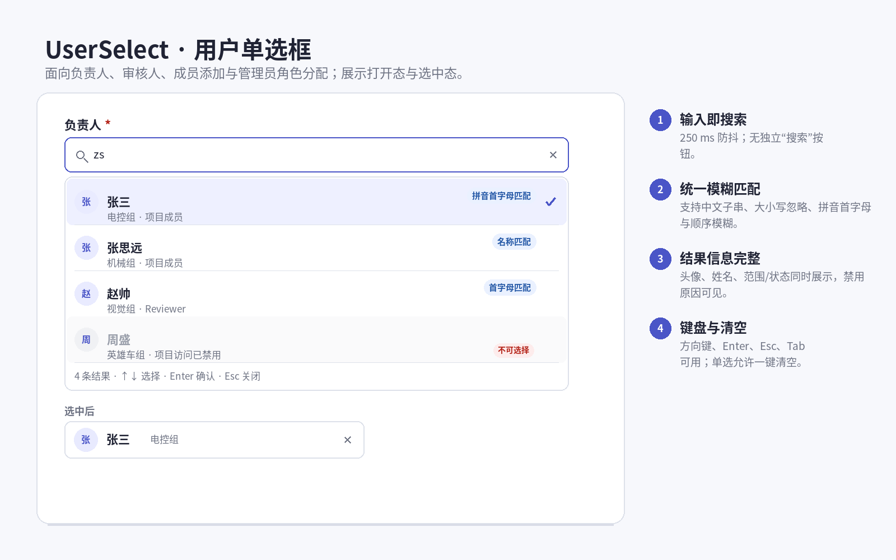
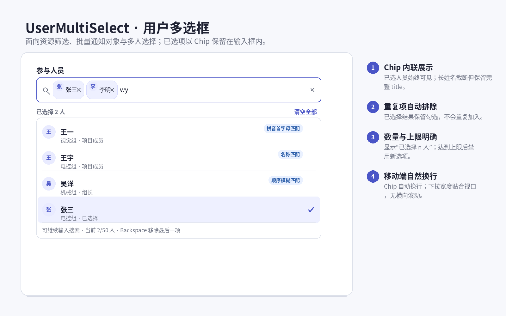
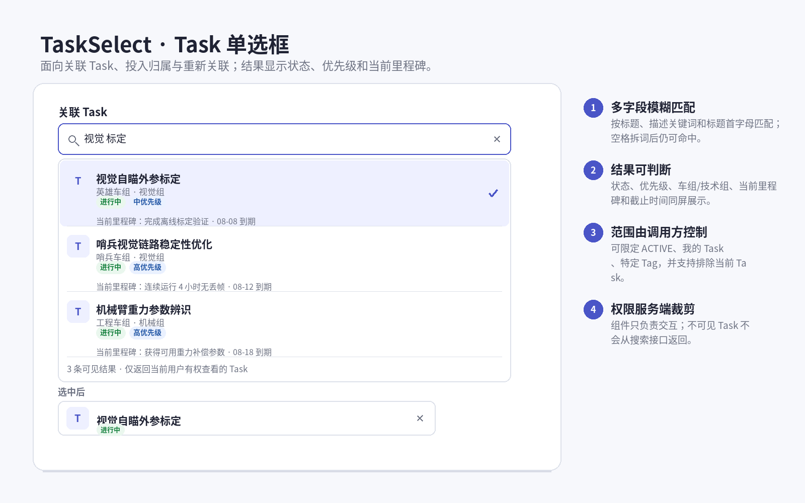
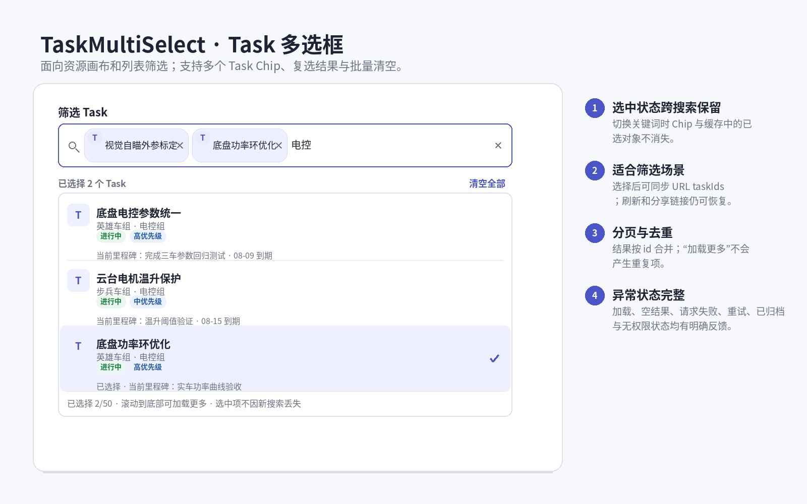

# User / Task 统一模糊搜索选择器改造计划

> 项目：`management_system`
> 目标：把项目中分散的人员与 Task 搜索、原生 `<select>`、搜索按钮组合，统一为四种可复用的模糊搜索选择器。

> 最终范围决策（2026-08-03）：账号级“项目访问禁用”机制与本改造一并移除。迁移为历史 `DISABLED` 账号写 `source=MIGRATION` 的恢复审计后删除 `Account.projectAccessStatus` 和 `AccountStatus`；不创建通知或飞书 outbox。项目入口恢复后，角色、TaskMember、人员状态和既有数据授权规则保持不变。

## 1. 目标

本次改造交付四个业务组件：

| 组件 | 选择模式 | 典型用途 |
| --- | --- | --- |
| `UserSelect` | 用户单选 | 添加 Task 成员、投入执行人 |
| `UserMultiSelect` | 用户多选 | 资源画布人员筛选、批量选择人员 |
| `TaskSelect` | Task 单选 | 关联 Task、投入归属、Task 重关联 |
| `TaskMultiSelect` | Task 多选 | 资源画布 Task 筛选、批量筛选 Task |

四个组件必须具有相同的基础交互：

- 聚焦输入框后打开结果面板，无需再点击“搜索”按钮。
- 输入后自动防抖搜索。
- 支持中文子串、英文大小写忽略、空格忽略、拼音首字母和顺序模糊匹配。
- 支持键盘操作、清空、加载、空结果、失败重试和禁用状态。
- 单选组件显示一个选中对象；多选组件使用 Chip 显示多个选中对象。
- 搜索结果始终经过现有服务端权限过滤，组件不能扩大可见范围。
- 桌面端使用锚定下拉层；窄屏下不产生横向滚动。

本次不把四个组件做成四套互相独立的实现。它们应共享一套内部 Combobox 基础能力，并由 User / Task 包装层负责不同的数据、展示和搜索范围。

---

## 2. 四种组件示意图

### 2.1 UserSelect：用户单选



关键点：

- 结果展示头像、姓名、业务范围或状态。
- 可以使用 `zs` 命中“张三”。
- 已选的停用人员仍可恢复展示，但不能新增选择，并说明原因。
- 选中后显示头像和姓名，可一键清空。

### 2.2 UserMultiSelect：用户多选



关键点：

- 已选用户以 Chip 形式保留。
- 新搜索不会丢失之前的选中项。
- 防止重复选择，显示已选择数量和最大数量。
- 支持 Backspace 删除最后一项和“清空全部”。

### 2.3 TaskSelect：Task 单选



关键点：

- 结果至少显示标题、状态、优先级。
- 推荐同时显示车组/技术组、当前里程碑及截止时间，减少选错同名 Task。
- 调用方可限制状态、Tag、是否只看我的 Task，并可排除当前 Task。

### 2.4 TaskMultiSelect：Task 多选



关键点：

- 适合资源画布和列表筛选。
- 选中项跨关键词、跨分页保留。
- 结果分页合并时按 Task ID 去重。
- 可与 URL 中的 `taskIds` 双向同步。

---

## 3. 当前实现问题

### 3.1 用户选择已有局部组件，但没有真正统一

当前 `components/user-search-select.tsx` 已经包含：

- `UserSearchSelect`
- `UserMultiSearchSelect`
- 中文姓名拼音首字母提取
- 顺序模糊匹配
- Portal 下拉层定位

但它仍存在以下限制：

1. 内部 ID 被固定为 `openId`，不能直接复用于项目管理中的 `Person.id`。
2. 只对传入的 `users` 数组做本地匹配；如果页面只加载了首批 50 人，首屏外用户仍搜索不到。
3. 项目管理中的人员选择没有复用该组件，而是继续使用“输入框 + 搜索按钮 + 原生 select”。
4. 单选与多选重复了大量打开、关闭、定位、过滤和列表代码。
5. 缺少完整的键盘高亮、`aria-activedescendant`、异步失败重试和分页加载体验。

因此不建议在现有文件上继续堆叠条件；应提取共享基础层，再保留兼容包装或直接迁移调用点。

### 3.2 Task 选择没有统一组件

当前 Task 选择主要是以下组合：

```text
搜索输入框 + “搜索 Task”按钮 + 原生 select
```

典型位置包括：

- `components/project-management/task-composer-client.tsx`
- `components/project-management/task-workbench.tsx`
- `components/project-management/resource-planner-canvas-client.tsx`
- `components/project-management/resource-filter-bar.tsx`

问题包括：

- 输入与最终选择分成两个控件，操作链路长。
- 用户必须主动点击搜索按钮。
- 原生 select 只显示 Task 标题，无法判断状态、优先级和里程碑。
- 每个页面各自维护 query、loading、error、merge options。
- 部分页面只搜索“首屏外 Task”，交互概念暴露了实现细节。

### 3.3 服务端目前主要是子串搜索

`lib/project-management/queries/option-queries.ts` 当前行为：

- 人员：`displayName contains query`
- Task：`title contains query OR description contains query`
- 大小写不敏感
- 每页最多 50 条
- 已正确复用人员可见范围和 `taskReadableWhere(actor)`

权限过滤与分页能力应保留，但搜索排序和模糊匹配需要增强。

---

## 4. 设计原则

### 4.1 组件统一，但不做“万能业务组件”

建议分为三层：

```text
AsyncCombobox / AsyncMultiCombobox
              │
      ┌───────┴────────┐
      │                │
 UserSelect        TaskSelect
 UserMultiSelect   TaskMultiSelect
```

- 基础层只处理通用交互、异步状态、键盘操作、Portal 和选中缓存。
- User 包装层负责头像、人员状态、人员搜索 scope。
- Task 包装层负责状态、优先级、里程碑、Task 搜索条件。
- 不把 User 和 Task 的所有差异做成几十个布尔参数。

### 4.2 ID 必须视为不透明字符串

当前系统仍存在两种“用户 ID”：

- 项目管理场景使用 `Person.id`
- 采购和账号管理场景仍可能使用飞书 `openId`

新组件内部统一使用：

```ts
value: string
```

并把它视为不透明 ID，不在公共组件中命名为 `openId` 或 `personId`。

本次四个项目业务包装层只传 `Person.id`；账号后台不接入选择器。基础 primitive 仍不对 ID 的业务含义做任何假设，避免未来适配时错误合并身份域。

### 4.3 不新增 UI 依赖

项目已经包含 `@base-ui/react`、React、Tailwind 和现有 UI primitives。本次优先基于现有依赖完成，不引入 `cmdk`、大型拼音库或另一套组件框架。

实施前先确认当前 `@base-ui/react` 版本的 Combobox 是否能覆盖：

- 受控单选与多选
- Portal
- 键盘导航
- ARIA

如果不能完整覆盖，则复用现有 Portal 定位逻辑实现一个小型内部 primitive，但不能继续复制四份下拉代码。

---

## 5. 统一交互规范

### 5.1 打开与关闭

- 点击或 Tab 聚焦输入框：打开下拉。
- 输入内容：保持打开并触发防抖搜索。
- 点击外部或按 Esc：关闭。
- 选中单选项：关闭下拉。
- 选中多选项：默认保持打开，方便连续选择。
- 下拉优先向下打开；空间不足时自动向上打开。
- 下拉宽度不小于输入框，且不得超出视口。

### 5.2 搜索触发

- 防抖时间：建议 250 ms。
- 输入法正在组合文字时，不响应 Enter 选择。
- 同一 scope + query 的结果可做会话级缓存。
- 后发请求覆盖先发请求；旧请求即使晚返回也不能覆盖新结果。
- 空 query 显示首批推荐或按名称排序的可见对象。
- 不再显示独立“搜索用户”“搜索 Task”按钮。

### 5.3 单选

- 未选择：显示搜索 placeholder。
- 已选择且关闭：显示对象摘要，不显示上次 query。
- 再次聚焦：可直接输入新 query 替换选择。
- `clearable=true` 时显示清空按钮。
- 可配置 `allowEmpty=false`，用于必填负责人等场景。

### 5.4 多选

- 选中项使用 Chip，顺序默认按用户选择顺序。
- 已选对象不因新搜索、分页或结果刷新而丢失。
- 相同 ID 不能重复加入。
- Backspace 在 query 为空时移除最后一个 Chip。
- 支持单项移除和清空全部。
- 默认 `maxSelected=50`，与当前时间画布筛选限制一致；其他业务可覆盖。
- 达到上限时保留搜索和浏览能力，但新选项置为禁用，并显示原因。

### 5.5 结果状态

必须覆盖：

- 首次加载
- 搜索中
- 有结果
- 空结果
- 请求失败与重试
- 加载更多
- 所有结果已经选择
- 对象不可选择
- 选中对象已归档、禁用或不在当前搜索结果中

已选对象后来被禁用时，不能静默删除。应保留展示并标记状态，保存操作是否允许由具体业务规则决定。

### 5.6 键盘与无障碍

基础层应实现标准 Combobox / Listbox 语义：

- 输入框：`role="combobox"`
- `aria-expanded`
- `aria-controls`
- `aria-activedescendant`
- 结果列表：`role="listbox"`
- 多选列表：`aria-multiselectable="true"`
- 选项：`role="option"` 与 `aria-selected`

键盘行为：

| 按键 | 行为 |
| --- | --- |
| ArrowDown / ArrowUp | 移动高亮项 |
| Enter | 选择高亮项 |
| Escape | 关闭下拉 |
| Home / End | 跳到首项 / 末项 |
| Backspace | 多选且 query 为空时移除最后一项 |
| Tab | 保持正常焦点顺序，不困住用户 |

---

## 6. 模糊搜索规则

### 6.1 文本标准化

共享 `normalizeSearchText` 应至少执行：

1. Unicode `NFKC` 标准化。
2. 去除首尾空白。
3. 英文转小写。
4. 连续空白合并。
5. 为紧凑匹配额外生成无空格版本。

### 6.2 匹配优先级

建议统一计算匹配分数，按以下顺序排序：

1. 完全相等。
2. 前缀匹配。
3. 分词前缀匹配。
4. 连续子串匹配。
5. 拼音首字母连续匹配。
6. 顺序模糊匹配，即 query 字符按顺序出现在目标中。

同分时：

- User 按姓名、ID 排序。
- Task 按 ACTIVE 优先、标题、ID 排序。

### 6.3 User 搜索字段

建议匹配：

- `displayName` / `name`
- 姓名拼音首字母
- `/admin/accounts` 列表可额外匹配默认租户的 `openId/unionId`，普通项目人员选择器不返回或展示这些标识

示例：

| Query | 可命中 |
| --- | --- |
| `张` | 张三、张思远 |
| `zs` | 张三、张思远、赵帅等按分数排序 |
| `zsi` | 张思远的顺序模糊结果 |
| `OPEN_ABC` | 仅管理员账号列表匹配相应 openId |

### 6.4 Task 搜索字段

建议匹配：

- `title`
- `description`
- 标题拼音首字母
- 可选：Tag 名称，仅在已有 Tag 数据已随查询可用时加入，不为此额外做 N+1 查询

多个空格分隔关键词采用 AND 语义：

```text
“视觉 标定”要求同一个 Task 的搜索文本同时包含“视觉”和“标定”相关命中。
```

### 6.5 第一阶段的服务端实现方式

本次属于小范围体验改造，第一阶段不建议立刻引入全文搜索服务或新增大型拼音依赖。

推荐使用“数据库直接匹配 + 有界模糊候选评分”：

1. 先使用现有权限 where 获取直接子串结果。
2. 如果直接结果不足，再在同一权限范围内读取轻量候选字段。
3. 候选扫描设置硬上限，例如 500 条。
4. 在服务端使用共享 `fuzzyScore` 计算拼音首字母和顺序模糊得分。
5. 返回得分最高的 50 条。
6. 如果候选超过扫描上限且 query 太宽，返回 `hasMore=true`，UI 提示“结果较多，请继续输入关键词”。

优点：

- 不新增依赖和数据库字段。
- 保留现有 Prisma 权限 where。
- 足以覆盖当前 RoboMaster 团队规模。

后续只有在可见 Task 达到数千条且搜索延迟明显时，再评估 PostgreSQL `pg_trgm`、搜索关键词列或独立搜索索引；不在本次小改造中提前引入。

---

## 7. 建议组件 API

以下为接口方向，不要求逐字照搬。

### 7.1 通用 Option

```ts
type PickerOption = {
  id: string;
  label: string;
  disabled?: boolean;
  disabledReason?: string;
};

type PickerPage<TOption> = {
  items: TOption[];
  nextCursor: string | null;
  hasMoreByQuery?: boolean;
};
```

### 7.2 UserSelect / UserMultiSelect

```ts
type UserPickerOption = PickerOption & {
  avatar: string | null;
  status: "ACTIVE" | "INACTIVE";
  accountBinding: "BOUND" | "UNBOUND";
  secondaryText?: string;
};
```

核心 props：

```ts
value
onValueChange
initialOptions
loadOptions
placeholder
disabled
clearable
excludeIds
maxSelected // 仅多选
```

项目人员场景的 `loadOptions` 继续携带：

- `purpose: "VISIBLE"`
- `purpose: "TASK_CREATE"` + team / techGroup
- `purpose: "TASK_MEMBERS"` + taskId

scope 变化时必须清空对应 query 缓存，避免跨权限范围复用结果。

### 7.3 TaskSelect / TaskMultiSelect

```ts
type TaskPickerOption = PickerOption & {
  status: TaskStatus;
  priority: TaskPriority;
  activeMilestone: {
    goal: string;
    expectedCompletedAt: string;
  } | null;
  secondaryText?: string;
};
```

搜索约束 props：

```ts
statuses
tagIds
mine
excludeIds
allowIndependent // 显示“独立投入”空值选项
```

`excludeIds` 用于：

- 关联 Task 时排除当前 Task。
- 不允许形成自关联。
- 特定场景排除已归档或业务不兼容对象。

---

## 8. 建议文件结构

```text
components/
  entity-picker/
    async-combobox.tsx
    async-multi-combobox.tsx
    picker-types.ts
    use-async-picker-options.ts
  project-management/
    user-picker.tsx
    task-picker.tsx

lib/
  search/
    normalize-search-text.ts
    fuzzy-score.ts
    pinyin-initials.ts
```

现有 `components/user-search-select.tsx` 的处理顺序：

1. 先把可复用的 normalize、拼音首字母和 dropdown 定位逻辑迁移到新位置。
2. 用新 `UserSelect` 替换全部调用。
3. 确认没有引用后删除旧组件。
4. 不保留两套长期并行实现。

如果基础组件能够直接使用 `@base-ui/react` Combobox，可减少自定义 `async-combobox.tsx` 中的键盘和 ARIA 代码；异步缓存、业务展示和服务端搜索仍由本项目实现。

---

## 9. 现有页面替换清单

### 9.1 管理员账号与旧角色面板

文件：`components/admin/roles-panel.tsx`

该面板已经没有入口，直接删除，不新增账号选择器。现有 `/admin/roles` 兼容重定向保持不变；当前 `/admin/accounts` 只把列表关键词查询接入统一模糊评分。

### 9.2 创建 Task

文件：`components/project-management/task-composer-client.tsx`

改造：

- “搜索关联 Task + select”替换为 `TaskSelect`。
- “搜索人员 + select + 角色 + 添加”中的人员部分替换为 `UserSelect`。
- 成员角色仍单独选择，因为每个人可能拥有不同 TaskMember role。
- 不直接使用 `UserMultiSelect` 一次添加多人，否则无法清晰地为每个人指定不同角色。
- 已添加成员列表继续保留，并防止再次选择已添加人员。

### 9.3 Task 工作台

文件：`components/project-management/task-workbench.tsx`

改造：

- 关联 Task 搜索与原生 select 替换为 `TaskSelect`。
- 添加成员的人员搜索与原生 select 替换为 `UserSelect`。
- `excludeIds` 包含当前 Task ID。
- 成员选择 `excludeIds` 包含已具有相同角色的人员；如果允许同一人多个角色，只排除相同“人员 + 角色”组合，由业务层校验。

### 9.4 资源筛选栏

文件：`components/project-management/resource-filter-bar.tsx`

改造：

- 人员 `FilterPicker` 替换为 `UserMultiSelect`。
- Task `FilterPicker` 替换为 `TaskMultiSelect`。
- Tag 筛选暂时保留，后续可独立设计 `TagMultiSelect`，不在本次范围中顺手扩张。
- 继续与 URL 中 `people`、`tasks` 参数同步。
- 刷新页面时，由服务端先解析已选 ID 对应的 option，避免显示“已选对象 xxxxxxxx”。

### 9.5 资源画布快速创建与重关联

文件：`components/project-management/resource-planner-canvas-client.tsx`

改造：

- 快速创建中的人员原生 select 替换为 `UserSelect`。
- `TaskSearchControl + select` 替换为 `TaskSelect`。
- Inspector 重关联中的 `TaskSearchControl + select` 替换为 `TaskSelect`。
- 删除页面私有的 `TaskSearchControl`、query、message 和重复 merge 逻辑。
- `allowIndependent=true` 时，TaskSelect 显示“独立投入”空值选项。

### 9.6 页面数据加载

可能需要同步调整：

- `app/progress/tasks/new/page.tsx`
- `app/progress/tasks/[id]/page.tsx`
- `app/progress/resources/page.tsx`
- `app/progress/my-timeline/page.tsx`

这些页面仍负责提供：

- 首批 option
- 当前已选 option
- 当前用户 option

但不再需要为了原生 select 一次性准备过多选项。

### 9.7 列表页搜索不强制改成选择器

以下属于“列表过滤”，不是“选择对象”：

- `app/progress/tasks/page.tsx` 的 Task 名称/描述搜索
- 管理员账号列表的用户关键词搜索

它们不应被替换为 Select 组件，否则会破坏列表搜索语义。但它们应复用同一套文本标准化和服务端模糊匹配规则，使“搜索张三”和“选择张三”的命中逻辑一致。

---

## 10. 服务端改造

### 10.1 保留现有动作入口

继续使用：

- `searchPeopleOptions`
- `searchTaskOptions`

组件不能自行调用 Prisma，也不能绕过 `getCurrentProjectManagementActor()`。

### 10.2 修改 option query

文件：`lib/project-management/queries/option-queries.ts`

人员搜索必须继续保留：

- `status = ACTIVE`
- `peopleVisibilityForPurpose`
- `TASK_CREATE` 创建权限校验
- `TASK_MEMBERS` 成员管理权限校验

Task 搜索必须继续保留：

- `taskReadableWhere(actor)`
- statuses
- tagIds
- mine

只在已授权候选集合上计算模糊得分。

### 10.3 选中项解析

异步搜索结果只包含当前 query 的候选，不能假设当前选中对象一定仍在结果中。

建议增加按 ID 解析 option 的服务端能力，或者由页面首屏直接传入当前选中 option：

```ts
resolvePeopleOptionsByIds(ids)
resolveTaskOptionsByIds(ids)
```

要求：

- 同样执行权限过滤。
- 顺序按输入 ID 恢复。
- 找不到或无权查看的 ID 不泄露对象信息。
- 多选 URL 恢复时避免 N 次独立请求。

### 10.4 分页与缓存

- option 按 ID 合并去重。
- query、scope、statuses、tagIds、mine 共同组成缓存 key。
- scope 或权限相关参数变化时丢弃旧缓存。
- 游标必须和 filter hash 绑定，继续保留现有防止跨查询游标复用的机制。
- 模糊评分结果如改变排序，游标应包含稳定排序需要的信息，或者查询模式只返回 Top 50 并提示继续收窄；不能使用不稳定排序配合旧 ID cursor。

第一阶段推荐：

- 空 query：保留当前稳定 ID cursor 分页。
- 有 query：返回评分后的 Top 50，不提供不稳定的下一页；候选过多时提示继续输入。

这样能够保持实现简单和结果稳定。

---

## 11. 状态管理与表单提交

### 11.1 不依赖原生 `<select name>`

迁移后很多表单不再能从原生 select 自动获得值。需要显式选择一种方式：

1. 受控 React state，并在提交逻辑中组装 payload；或
2. 同步一个隐藏 input：

```html
<input type="hidden" name="taskId" value="..." />
```

现有使用 `new FormData(event.currentTarget)` 的页面优先使用隐藏 input，减少对提交逻辑的无关重写。

多选可以：

- 使用多个同名 hidden input；或
- 当前页面本来就用 state 生成 URL / action payload，则继续使用 state。

### 11.2 保留选中对象缓存

组件内部除了保存 ID，还必须缓存 option 摘要，否则搜索结果变化后无法显示选中对象名称。

外部 value 发生变化时：

- 已有缓存：直接显示。
- 无缓存：通过 `initialOptions` 或 resolver 恢复。
- resolver 失败：显示安全占位，不显示原始完整 UUID 给普通用户。

---

## 12. 实施阶段

### 阶段 1：共享搜索工具

- 从旧用户选择器提取标准化、拼音首字母和模糊得分。
- 为 User / Task 写纯函数单元或集成测试。
- 定义明确的排序规则和候选上限。

### 阶段 2：基础 Combobox

- 完成单选与多选 primitive。
- 完成 Portal、上下定位、视口限制、键盘导航和 ARIA。
- 完成异步 debounce、缓存、旧请求丢弃、失败重试。
- 覆盖加载、空、错误、禁用和最大选择数状态。

### 阶段 3：User / Task 包装层

- 完成四个公开组件。
- User 结果展示头像、姓名和状态。
- Task 结果展示标题、状态、优先级和里程碑。
- 接入现有 server action。

### 阶段 4：页面迁移

建议按风险从低到高迁移：

1. Task 创建页的关联 Task 与添加成员。
2. Task 工作台。
3. 资源画布快速创建与重关联。
4. 资源筛选栏两个多选组件。
5. 删除旧角色面板、旧搜索组件、搜索按钮、原生 select 和页面私有 merge/query 逻辑。

每迁移一个阶段都执行对应 Playwright 回归，避免一次性修改所有页面后难以定位问题。

### 阶段 5：列表搜索规则统一

- Task 列表搜索复用同一 normalize / fuzzy 服务。
- 管理员账号列表搜索复用同一规则。
- 保留其列表过滤 UI，不替换成选择器。

### 阶段 6：清理与文档

- 删除无引用的 `components/user-search-select.tsx`。
- 删除无入口的 `components/admin/roles-panel.tsx`。
- 删除 `TaskSearchControl`。
- 删除各页面重复的 query / merge / message 逻辑。
- 更新 `docs/TECH.md` 中共享 UI 和 option search 说明。
- 更新 `docs/TESTING.md` 中键盘、移动端和模糊搜索用例。

---

## 13. Playwright 测试计划

依据项目规则，桌面 `1440x1000` 与 Pixel 5 均需覆盖。

### 13.1 UserSelect

- 聚焦后打开结果。
- 输入中文子串命中。
- 输入拼音首字母命中“张三”。
- ArrowDown + Enter 完成选择。
- 清空后 hidden input / state 同步为空。
- 停用人员不能新增选中并展示原因。
- 旧搜索请求晚返回时不覆盖新 query。

### 13.2 UserMultiSelect

- 连续选择两人，下拉不关闭。
- 重复点击不产生重复 ID。
- 新 query 后原 Chip 保留。
- 移除单项、Backspace 删除最后项、清空全部。
- 达到 50 项后不能继续选择。
- URL 刷新后恢复人员名称和顺序。

### 13.3 TaskSelect

- 搜索标题与描述关键词。
- 多关键词空格搜索。
- 结果显示状态和里程碑。
- 当前 Task 被排除，不能自关联。
- 无权查看的 Task 不出现在结果中。
- 选择后表单 action 收到正确 taskId。
- “独立投入”场景可提交 null。

### 13.4 TaskMultiSelect

- 选择多个 Task 并同步 URL。
- 翻页或追加结果后不重复。
- 刷新 URL 后恢复 option 摘要。
- archived / terminal Task 是否可选符合调用场景的 statuses 约束。
- 失败时显示重试，重试成功后恢复结果。

### 13.5 极端 UI

- 50 个 Chip。
- 超长用户姓名。
- 超长 Task 标题、里程碑目标和错误信息。
- 空头像、头像加载失败。
- 下拉位于页面底部时向上展开。
- 移动端软键盘打开时下拉不超出可视区域。
- 页面无水平滚动。
- 暗色模式对比度与 focus ring 清晰。

### 13.6 服务端权限回归

- 普通成员只能搜索到可见 Task。
- 无 `task.manage_members` 权限时不能使用 TASK_MEMBERS 范围获取全部人员。
- 组长范围与系统管理员范围保持原行为。
- 通过直接调用 server action 也不能越权。

---

## 14. 验收标准

本次改造完成后应满足：

1. 项目中不再出现人员或 Task 的“搜索输入框 + 搜索按钮 + 原生 select”组合。
2. 四个组件视觉、键盘、加载和错误交互一致。
3. 输入 `zs` 能在有权范围内找到“张三”。
4. 输入 Task 标题中的任意连续关键词可以命中；多个关键词可组合过滤。
5. 多选项在搜索、分页和重新渲染后不丢失、不重复。
6. 所有项目管理搜索仍执行既有服务端权限过滤。
7. 表单提交值与迁移前业务字段完全一致。
8. 桌面和 Pixel 5 不出现横向滚动或被裁切下拉。
9. 新增 Playwright 覆盖四类组件的主流程与权限拒绝路径。
10. `npm run check` 和相关 `npm run test:e2e` 实际通过。
11. 阶段化完成后进行独立 reviewer / subagent 审查，修复并重复审查至无新问题。

---

## 15. 不在本次范围

为避免“小体验优化”扩张成大规模搜索系统，本次不包含：

- Tag 统一选择器。
- 全文搜索服务。
- Elasticsearch / Meilisearch 等外部系统。
- 用户组织结构重构。
- 把项目 `Person.id` 与旧采购 `openId` 合并成一种 ID。
- 修改现有 Task / User 权限模型。
- 为批量选择人员重新设计 TaskMember 多角色业务流程。

---

## 16. 关键风险

### 风险 1：模糊候选扫描规模

若未来可见 Task 远超 500 条，有界扫描可能漏掉低排序候选。当前阶段通过“直接数据库子串结果 + 有界 fallback + 提示继续输入”控制。达到性能阈值后再引入数据库搜索索引。

### 风险 2：User ID 混用

新组件不能把 `value` 命名为 `openId`。本次项目包装层统一使用 `Person.id`，账号列表不复用选择器；提交值仍需通过回归测试确认。

### 风险 3：FormData 丢值

用 Combobox 替换原生 select 后，若没有 hidden input 或显式 payload，服务端会收到空值。每个迁移点必须验证实际 action 入参和数据库结果。

### 风险 4：选中项不在搜索页

当前已选对象可能不在新 query 结果或首批 50 条中。必须使用选中 option 缓存和按 ID resolver，不能退化为显示截断 UUID。

### 风险 5：下拉层与 Dialog / 滚动容器

现有页面包含 Dialog、固定侧栏和滚动画布。Portal 的 z-index、点击外部判断、滚动重定位和焦点恢复必须在实际页面 E2E 中验证，不能只在 Story/Fixture 页面验证。

---

## 17. 推荐最终决策

采用以下方案：

- 四个公开业务组件：`UserSelect`、`UserMultiSelect`、`TaskSelect`、`TaskMultiSelect`。
- 两个内部 primitive：单选异步 Combobox、多选异步 Combobox。
- 复用并加强现有拼音首字母与顺序模糊算法。
- 使用 250 ms 防抖和有界服务端候选评分，不新增依赖；仅为移除项目访问禁用字段新增不可逆数据库迁移。
- 保留现有权限 query 和 server action 边界。
- 项目包装层使用 `Person.id`，账号后台保持列表搜索，组件内部只处理不透明字符串 ID。
- 先迁移单选，再迁移资源筛选多选，最后删除旧实现。

这一方案能够解决当前实际问题，同时保持改动范围可控，不提前引入与当前数据规模不匹配的搜索基础设施。
