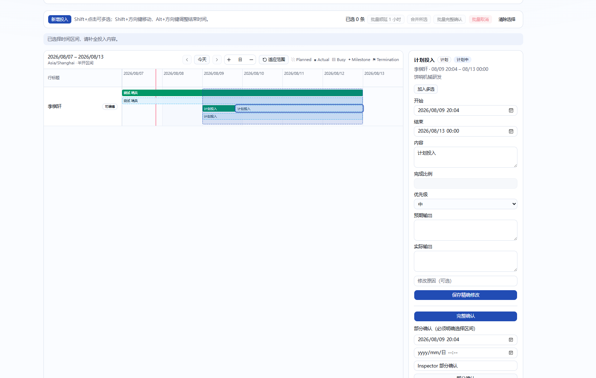
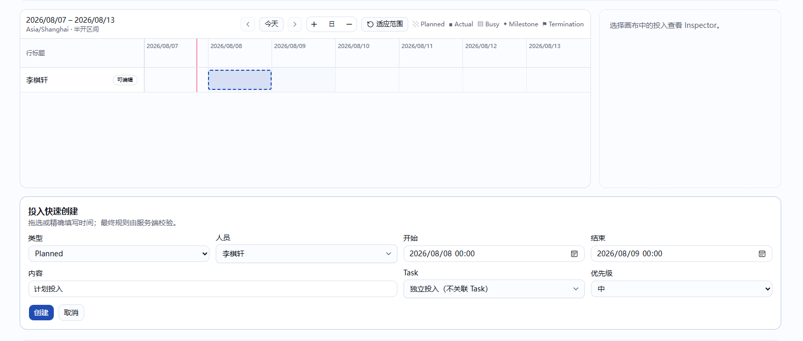

# 时间分段与人员投入 UI 优化计划

> 状态：已实施。
>
> 更新时间：2026-08-07。
>
> 目录名 `time-segement-allocation` 沿用既有拼写；本文统一使用正确术语
> `Time Segment` / `WorkSegment`，界面文案继续使用“投入”。

## 1. 背景与目标

当前 `/progress/resources`（人员计划）和 `/progress/my-timeline`（我的时间）共用
`ResourcePlannerCanvasClient`。桌面端在画布右侧常驻 Segment Inspector，单击 Segment 即读取
详情和变更历史；有权限的用户不进入独立详情流程，也可以直接在总览画布拖动、缩放、键盘
移动或执行批量移动、合并、确认和取消。创建表单位于画布下方。

当前界面如下：



空画布和快速创建区域如下：



本轮目标是把“浏览安排”和“修改一条安排”明确分开：

1. 总览时间线用于浏览、创建入口和打开详情，不能直接改变既有 Segment；
2. 双击一条可见 Segment 后，在响应式 Dialog 中打开该 Segment 的详情时间线和编辑表单；
3. 创建投入期间冻结其他 Segment 的详情与修改交互，避免未完成创建和其他 mutation 交错；
4. 简化 Planned Segment 的确认操作：移除直接拆分入口，部分确认固定从原 Segment 起点开始，
   只选择确认结束点；
5. “我的时间”补充本人参与 Task 的列表和计划时间线；
6. Task 详情和 Project 详情的现有计划时间线补充人员投入时间线；
7. 保留当前分支的统一账号、服务端权限、状态机、Task 关联校验、事务锁、乐观锁、
   `WorkSegmentSource` 来源历史、领域审计、站内通知和 notification outbox 语义。

## 2. 已确认需求

以下内容来自原始需求，可直接作为实施约束：

- 时间线不再显示 `PLANNED + CONFIRMED` 和 `PLANNED + CANCELLED`，其他 Planned 状态继续
  显示；
- 创建一条投入时，其他 Segment 不能被修改；
- 未进入某条 Segment 的详情时，不能修改该 Segment；
- Segment 详情不再通过页面右侧常驻 Inspector 展示；桌面端双击 Segment 后打开 Dialog；
- Dialog 内继续提供时间线，并且只有本次打开的目标 Segment 可以修改；
- Dialog 内对 Segment 的操作要比当前 Inspector 更易理解；
- Planned Segment 的“保存精确修改”改名为“保存”；
- 部分确认的开始点固定为当前 Segment 的开始时间；结束点既可用日期时间控件选择，也可在
  Dialog 时间线上选择；
- 删除用户可见的拆分功能；
- “我的时间”增加本人参与 Task 的时间线和 Task 列表；
- Task 时间线增加参与人的投入时间线；
- Project 时间线增加参与人的投入时间线。

## 3. 当前实现与不可破坏的约束

### 3.1 数据模型和状态机

`WorkSegment` 当前只有两种类型：

- `PLANNED`：计划投入；
- `ACTUAL`：实际投入。

状态为 `PLANNED / IN_PROGRESS / PENDING_CONFIRMATION / CONFIRMED / CANCELLED`。
Planned 完整确认后，原记录变为 `CONFIRMED`，同时创建一条 `ACTUAL + CONFIRMED`，两者通过
`WorkSegmentSource` 关联；部分确认会取消原 Planned、创建 Actual，并为未确认区间创建新的
Planned 子记录。由于事实记录和来源历史必须保留，“不显示”只能是查询或显示策略，不能删除
原记录。

Segment 最长 31 天，时间区间使用半开区间 `[startAt, endAt)`；允许不同 Segment 重叠，系统
不做资源冲突检测。定时任务把到时的 Planned 从 `PLANNED -> IN_PROGRESS ->
PENDING_CONFIRMATION` 推进，不自动生成 Actual。

本轮不恢复已经移除的 Work Segment 职责、TaskNode 关联、分配比例或冲突模型，不修改
Prisma schema，也不迁移既有 Segment 数据。

### 3.2 权限与并发

现有服务端规则必须继续生效：

- 所有已登录统一账号可以读取未删除的完整 Segment 和变更历史；
- Task Participant 只可管理自己在该 Task 下的 Segment；
- Task Owner 可管理该 Task 全部成员的 Segment；
- 两类全局管理员可管理全部 Segment；
- 无 Task 关联的 Segment 仅本人或全局管理员可管理；
- 创建或改关联时，Segment Person 必须是目标 Task 的有效 Owner/Participant；
- 停用 Person 的历史投入可读取，但不能创建新投入；
- 所有写入在服务端重新校验 actor、Person、Task 状态和成员关系；
- Task 关联变更继续锁定 Task 行，Segment mutation 继续使用稳定 ID 顺序行锁；
- `expectedUpdatedAt` 继续作为乐观锁版本；stale 时必须提示刷新，不能覆盖服务器新版本；
- mutation 继续写 `WorkSegmentChange` 和 `DomainAuditEvent`，需要通知的原有事件继续走站内
  通知和 outbox；UI 改造不能绕过 `NOTIFICATION_DELIVERY_DISABLED` 等投递保护。

Dialog 和客户端 capability 只决定控件是否出现，不能替代上述服务端鉴权和状态校验。

### 3.3 当前页面和查询结构

- `/progress/resources` 使用 `scope=RESOURCE_PLANNER`，可按 Person/Task、类型、状态和 Tag
  筛选，最多 50 行一页；完整 Segment 与 Busy 合计最多 5,000 条；
- `/progress/my-timeline` 使用 `scope=PERSONAL + groupBy=PERSON`，当前只有本人一行；Task
  anchor 只会从当前时间范围内本人已有 Segment 的 `taskId` 推导，因此“参与了但当前范围没有
  投入”的 Task 不会出现；
- Task 详情的“计划时间轴”目前在浏览器中用 `TaskWorkspace.currentPlan` 组装，只含一个 Plan
  行及 Start/Milestone/Revision/Terminal，不查询 WorkSegment；
- Project 详情的“Task 时间线”目前只展示当前分页（每页最多 25 个）Task 的 Current Plan，
  每个 Task 一条 Plan 行，也不查询 WorkSegment；
- 通用 TimeCanvas 查询已有 `TASK_SCOPED + groupBy=PERSON` 能力，可返回目标 Task 的有效成员
  行、该范围内的 Segment 和 Task anchor；当前没有 `PROJECT_SCOPED`；
- TimeCanvas 查询时间范围最多 366 天、显式拒绝超过 5,000 个可见对象，不允许静默截断；
- 移动端当前自动切换为 Agenda，不渲染可拖拽的横向时间线。

### 3.4 共享组件影响范围

`TimeCanvas` 同时服务于 Task Composer、Task Workbench、人员计划、我的时间和测试夹具。
Task Composer 的节点编辑仍依赖单击选择、拖拽节点和受控 Inspector，不能因为 Segment Dialog
而全局改成“双击才可编辑”。本轮应扩展 Segment 专用交互回调和权限覆盖，不改变 anchor
交互及 Composer 的既有行为。

## 4. 功能范围与非目标

### 4.1 本轮包含

- 人员计划和我的时间的 Segment 总览只读化；
- Segment 详情 Dialog、目标 Segment 专用时间线、详情读取、编辑、确认、取消、Actual 软删除
  和变更历史；
- 创建状态冻结与提交反馈；
- 部分确认的“固定起点 + 可视化结束点”交互和服务端约束；
- 完整删除直接拆分 UI、capability、公开 action、validation、service 和直接拆分测试；
- 我的时间参与 Task 列表和计划轨道；
- Task/Project 详情人员投入轨道；
- 查询上限、稳定分页、空态、错误态、权限态和响应式行为；
- 相关领域回归、Desktop/Pixel 5 Playwright 定向用例和文档更新。

### 4.2 明确不包含

- 新建 Project Stage、人员容量、allocation 百分比或资源冲突检测；
- 将 WorkSegment 重新绑定到 Milestone、Revision、Terminal 或任意 TaskNode；
- 改变 Segment 31 天上限、重叠允许规则、定时状态迁移或通知收件人；
- 删除确认前后的 Planned/Actual 事实记录或 `WorkSegmentSource`；
- 修改 Task/Project 生命周期、成员角色或审批规则；
- 用客户端权限判断替代 Server Action 的校验；
- 为本轮 UI 改造新增依赖。

## 5. Planned 显示规则

时间画布隐藏以下终态 Planned 事实记录：

- `type=PLANNED + status=CONFIRMED`；
- `type=PLANNED + status=CANCELLED`。

因此：

- 完整确认后只在画布显示生成的 Actual，不再叠加显示原 Confirmed Planned；
- 部分确认后显示生成的 Actual 和尚未确认的尾部 Planned，不显示被替代的 Cancelled Planned；
- 手动取消的 Planned 不再占用时间画布轨道；
- `PLANNED / IN_PROGRESS / PENDING_CONFIRMATION` 状态的 Planned 继续正常显示；
- 该规则只影响时间画布，不影响到期计划与确认队列、来源历史、变更历史、审计或数据库事实；
- 详情中的同一行只读上下文也使用相同过滤规则。已隐藏记录仍可通过可见 Actual/剩余 Planned
  的来源与变更历史追溯。

## 6. 已确认交互方案

本节已经固化全部产品决策。

### 6.1 人员计划与我的时间总览

- 移除页面右侧常驻 `SegmentInspector`，画布恢复单列全宽；
- 总览传入经过覆盖的 Segment permissions：保留 `canViewDetails`，关闭 move/resize/edit/
  merge/cancel/confirm/softDelete；直接拆分 capability 一并删除；原始 DTO 权限只交给
  Dialog，不能从总览触发写入；
- TimeCanvas 增加独立的 `onSegmentOpen` 交互，不复用普通选择回调：双击 Segment 或聚焦后按
  Enter，把稳定 `segmentId` 交给上层；
- 不再为窄屏切换 TimeAgenda。Desktop 与移动视口都渲染同一横向时间线和相同交互，窄屏通过
  画布内部横向/纵向滚动查看，不新增移动端专用按钮或手势适配；
- “我的时间”无显式日期时以今天作为窗口左端；日期平移滑杆可向左加载过去或向右加载未来，
  并把新的窗口起点写入 URL；
- 单击仅提供焦点/选中反馈，不发起 mutation；双击 Busy 不读取详情；
- 在适配或查询装配层隐藏 Confirmed/Cancelled Planned，同时保留来源历史读取；
- 移除 Shift 多选提示、多选状态、批量顺延、批量完整确认、批量取消、合并入口和总览直接
  transform handler；
- “新增投入”及空白拖选仍可开启创建草稿。创建草稿存在时：
  - 禁止打开任意 Segment Dialog；
  - 画布现有 Segment 保持只读且给出“请先完成或取消当前创建”的反馈；
  - 禁止重复开启第二个创建草稿；
  - 创建表单字段和当前虚线选区在失败时保留，成功后才清除；
  - 异步期间禁用提交、取消和重复操作，网络失败显示中文错误；
- 创建类型是否继续允许直接创建 Actual 沿用当前行为，除非后续另行提出变更。

### 6.2 Segment 详情 Dialog

新建项目管理专用 Segment Dialog（建议从 `ResourcePlannerCanvasClient` 拆出，避免单文件继续
膨胀），复用 `components/ui/dialog.tsx`：

- Dialog 标题展示 Segment 内容、类型、状态、人员、关联 Task 和完整时间；
- 打开时并行读取 `getWorkSegment` 与第一页 `listWorkSegmentChanges`；分别处理加载、失败、
  stale 和目标已不可见状态；
- Dialog 沿用打开前总览的时间范围和同一行上下文，显示该行其他 Segment 作为只读参照；目标
  Segment 高亮并保留原始服务端 permissions，点击其他 Segment 不切换目标；
- 详情时间线允许目标 Planned 拖动/缩放。拖动只更新 Dialog 本地草稿，不立即调用 Server
  Action；下方开始/结束控件与画布保持双向同步，点击“保存”后一次提交
  `updateWorkSegment`；
- 不允许跨人员/Task 行拖放，不允许超出 31 天、结束不晚于开始或超出 Dialog 安全范围；最终
  仍由服务端权威校验；
- 编辑表单继续包含内容、优先级、预期输出、实际输出和 Actual 完成比例；字段按类型和权限
  显示，不重复提交客户端无权修改的字段；
- “保存精确修改”统一改为“保存”；保存成功后用 mutation 返回的 DTO 更新 overview model，
  关闭或刷新 Dialog，并 `router.refresh()` 获取权威列表；
- stale 时不覆盖本地草稿，显示“服务器记录已变化”，提供重新加载权威版本；
- 变更历史继续按服务端稳定游标加载，不把原始 before/after JSON 直接渲染给用户；现有 action、
  原因和时间至少继续可见；
- Actual 软删除和 Planned 取消保留原因输入与二次确认；成功后关闭 Dialog，并按 Confirmed/
  Cancelled Planned 过滤规则从总览移除相应记录；
- mutation 进行中禁止重复提交和关闭；表单或时间范围有修改时，关闭按钮、Esc 和遮罩关闭均
  先确认是否放弃未保存修改；
- Dialog 设置受控初始焦点、可读标题/描述、焦点圈和关闭后焦点回到原 Segment；长内容和错误
  信息必须折行，Desktop 与 Pixel 5 都不能产生页面级横向滚动。

### 6.3 完整确认与部分确认

完整确认继续调用现有 `confirmPlannedSegment`，由服务端锁行、校验状态和版本、生成 Actual、
写来源与审计。

部分确认改为前缀确认：

1. 开始时间显示为只读的权威 `detail.startAt`，请求仍显式发送该值；
2. 用户可在日期时间控件中填写结束时间；
3. Dialog 时间线增加“确认至此”的可视化边界，起点固定，拖动或点击只改变结束点；
4. 控件和时间线使用同一状态，按当前 zoom snap，表单仍可输入分钟级精确值；
5. 结束必须满足 `segment.startAt < coveredEndAt <= segment.endAt`；等于终点时，界面明确切换
   为“完整确认”并调用 `confirmPlannedSegment`；
6. 提交 `partiallyConfirmSegment` 时，validation/service 在锁行后额外断言
   `coveredStartAt === segment.startAt`，防止绕过 UI 确认中间片段；
7. 成功后生成一条覆盖前缀的 Actual，原 Planned 取消，只在尾部创建最多一条剩余 Planned；
8. 继续原子写 `WorkSegmentSource`、`CONFIRM/SPLIT` 变更记录、领域审计及现有通知语义；
9. 并发完整确认、部分确认、移动或 cron 状态推进仍必须只有合法一方成功。

直接拆分不保留兼容入口：删除 UI、`canSplit` DTO capability、公开
`splitPlannedSegment` Server Action、输入 validation、service 和直接拆分测试。部分确认产生
剩余尾段不是用户直接拆分，内部 helper、`sourceSplitFromId` 和 `SPLIT` change 历史仍保留，用于
解释部分确认产生的新 Planned；它们不得重新暴露为通用拆分能力。

### 6.4 Task/Project 详情时间窗口

Task 与 Project 详情不再自动把整个 Current Plan 强行压入一个范围，而使用可导航的固定窗口：

- 每个窗口固定 31 天，URL 保存窗口开始日期，使刷新、复制链接和浏览器前进/后退可复现；
- Task 默认窗口优先包含当前活动且非 Revision 的节点；没有活动节点时依次使用今天、计划开始；
- Project 默认窗口以当前页 Task 中最近正在进行且非 Revision 的节点为中心；没有活动节点时
  依次使用今天、最早计划开始；
- 提供上一窗口、下一窗口、回到默认位置和日期选择；窗口仍采用 Asia/Shanghai 自然日边界；
- Plan anchor、阶段色带和人员 Segment 都只显示与当前窗口相交的内容；
- Task 节点导航或 Project“在时间线中定位”目标位于窗口外时，先更新 URL 窗口，再在新画布中
  聚焦目标，不允许只滚动到一个尚未装配的节点；
- 查询继续满足现有不超过 366 天的契约，31 天窗口不改变单条 Segment 最长 31 天的业务规则。

## 7. “我的时间”改造

页面保留日/周 Segment 视图、日期选择、到期确认队列和本人独立投入创建；新增“参与 Task”区：

- 服务端按有效 TaskMember 查询 actor 参与的 Task；默认只查询 Active，显式切换“显示全部”后
  才包含 Draft 和所有终态；
  不能再只从当前 Segment 的 `taskId` 反推；
- 使用每页 25 条的稳定游标，Task 列表与 Plan 行同步翻页，不静默截断；Task 名称进入 Task
  详情，状态使用中文 Badge；
- 当前页 Task 的 Current Plan 作为 Plan 行，与本人 Segment 行装配到同一个 TimeCanvas；
- Task 即使当前日/周没有本人 Segment，也仍出现在列表和 Plan 行；
- Task anchor 保留 Start/Milestone/Revision/Terminal 语义，Revision 只作为时间标记，不形成
  阶段，也不与 Segment 关联；
- 日/周时间范围外的节点不强行挤入当前视图；通过 Task 列表定位时按已确认的时间范围策略切换
  日期或给出明确反馈；
- 本人 Segment 的详情与创建遵循第 6 节；Task Plan 行始终只读；
- 空状态区分“没有参与 Task”和“参与 Task 在当前时间范围没有计划节点/投入”；
- 停用 Person 账号沿用当前规则：可以打开全局只读页面和 Task，但不能创建 Segment。

查询实现优先扩展 `getTimeCanvasData` 的受约束 PERSONAL 行/anchor 候选来源，或增加专用的参与
Task 分页 query 后把已授权的当前页 ID 传入内部查询；不能让客户端任意提交一组 Task ID 来
扩大可见集合。

## 8. Task 详情人员投入

Task 详情现有 `TaskDetailTimeline` 继续展示 Current Plan，并增加 Person 行：

- 在服务端完成 Task 可见性校验后，复用 `TASK_SCOPED + groupBy=PERSON` 的查询规则；
- 人员范围只包含当前有效 TaskMember（Owner + Participant）；停用但仍是有效成员的人继续显示
  并标记“已停用”，已移除成员不作为空行展示；
- Segment 只包括 `taskId=当前 Task` 且与当前窗口相交的未删除记录，并隐藏 Confirmed/Cancelled
  Planned；
- Plan 行仍包含 Start、Milestone、Revision、Terminal 和阶段色带；已完成与未完成 Milestone 的
  视觉区分继续保留；
- 人员行和计划行必须使用同一时标，才能比较计划阶段与成员投入；
- 当前下方 `TaskPlanNodeNavigator` 保留。定位节点时同步滚动画布；采用窗口方案时先切换到包含
  节点的窗口；
- 双击完整 Segment 可打开第 6 节同一 Dialog，并按该 Segment 的现有服务端权限编辑；Task 详情
  不提供创建投入入口，也不能因为页面已读到 Task 就在客户端推导写权限；
- 超过 50 个有效成员时使用稳定人员分页或明确的“下一页人员”，Plan 行在每页保留；
- 查询错误只使人员投入/时间线区域进入错误态，不影响 Task 概览、生命周期、风险、评论和动态。

## 9. Project 详情人员投入

Project 本身没有计划，也没有直接关联 WorkSegment。本轮继续以当前页 Task Current Plan 为计划
事实源，并装配 Project/Task 参与人员行：

- Project 可见性必须先由 `getProjectDetail` 校验；
- 计划行继续只包含当前 Task 分页的最多 25 个 Task，不允许客户端提交任意 Project/Task ID；
- 人员范围是“Project 当前有效 Owner/Participant”与“当前页 25 个 Task 的有效 Owner/
  Participant”的并集；没有 Segment 的 Project 成员也显示空行；
- Segment 只聚合当前页 Task，并在服务端限定 `task.projectId=当前 Project`、
  `task.deletedAt=null`；
- 相同 Person 在多个 Task 的 Segment 汇总到一条人员行，但每个 Segment 仍保留实际 `taskId`，
  Dialog/只读详情显示所属 Task；
- Project 详情人员投入轨道完全只读，不提供创建、移动、缩放或 Segment mutation；允许打开
  只读详情查看上下文和历史，但 ProjectMember 身份不能转化为 Task Segment 写权限；
- Task 列表翻页时，Task Plan、当前页 TaskMember 和 Segment 同步变化；ProjectMember 空行在
  每一页保留；
- 保留每页 25 Task、单 Task 200 节点、合计 5,000 anchor 的现有上限；Segment/人员分页另外
  使用现有 50 行和 5,000 时间对象上限，超限显示中文错误；
- “在时间线中定位 Task”仍优先定位最近正在进行且非 Revision 的节点；增加人员行后必须继续
  正确滚到目标 Task Plan 行，不能被 Person 行索引偏移破坏；
- 人员投入查询失败不影响 Project 概览、Task 列表、风险、评论和近期动态。

Project 详情查询由服务器在已验证 Project 可见性后直接使用当前页 Task ID 装配，不向客户端
开放任意 `taskIds`。本轮不需要新增可被通用 Canvas API 调用的 `PROJECT_SCOPED`。

## 10. 查询、DTO 与组件改造

### 10.1 TimeCanvas 契约

扩展而不是复制 TimeCanvas：

- `TimeCanvasInteractionOptions` 增加 Segment 双击/键盘打开回调；
- Segment block 区分单击选中与双击打开，正确抑制拖拽后的 click/double-click；
- 提供纯函数把 overview permissions 覆盖为只读、只为目标 Segment 恢复 mutation permission；
- 详情时间线的草稿范围只存在于客户端 state，保存前不修改 overview model；
- 不改变 anchor 的选择、拖动和 Task Composer 受控 Inspector 契约。

DTO 不接受客户端提供 `permissions`。所有 permissions 仍由 `time-canvas-queries.ts` 基于 actor、
Segment Person 和 Task resource 生成。

### 10.2 查询装配

预计调整：

- `lib/project-management/queries/time-canvas-queries.ts`
  - 默认排除 Confirmed/Cancelled Planned，但不影响到期队列和历史查询；
  - 让 PERSONAL scope 能按有效 membership 返回参与 Task anchor，而不是只看已有 Segment；
  - 保留 Full/Busy 隐私分类、50 行、50 anchor Task、5,000 node/Segment 和 366 天上限；
  - Task scope 始终在服务端验证，显式 ID 不得扩大授权范围；
- `lib/project-management/queries/task-queries.ts`
  - 为 Task 详情装配人员投入查询所需的服务端范围或分页信息；
- `lib/project-management/queries/project-queries.ts`
  - 为当前 Project/当前 Task 页装配 ProjectMember 与 TaskMember 并集及只读 Segment，保留现有
    Task 稳定分页和 timeline error；
- 必要时增加“参与 Task 列表”专用 query/DTO，游标绑定 actor、状态过滤和排序条件，防止把
  picker 的 50 条候选接口误当完整业务列表。

### 10.3 Segment mutation

- `partiallyConfirmSegmentInputSchema` 继续验证绝对时间格式和 `end > start`；
- service 在锁定并重新读取 Segment 后验证前缀开始点和覆盖范围；
- 移除直接 split 的 UI、`canSplit` capability、公开 action、schema、service 和专项测试，不保留
  旧调用兼容；保留部分确认内部剩余段函数及其历史解释字段；
- `updateWorkSegment`、confirm、cancel、Actual soft delete、行锁、Task 关联检查、版本锁和变更
  记录继续复用，不新建平行业务入口；
- 无需修改 Prisma schema 或 migration。

### 10.4 客户端组件

预计涉及：

- `components/project-management/resource-planner-canvas-client.tsx`
  - 收敛为 overview、创建状态和 Dialog 打开状态的协调层；
  - 删除常驻 Inspector 与按决策移除的批量 mutation；
- 新增 Segment Dialog/详情表单组件；
- `components/project-management/time-canvas/time-canvas.tsx`
  - 增加双击、键盘打开和目标 Segment 交互支持；移除窄屏自动切换 Agenda，所有视口使用同一
    横向画布；
- `components/project-management/time-canvas/time-agenda.tsx`
  - 若移除切换后没有其他调用方，则删除组件及对应 Agenda 专项测试；不保留一套不可达 UI；
- `components/project-management/task-workbench.tsx`
  - 把 Task plan-only model 改为服务端数据 + Person Segment 的组合 model；
- `components/project-management/project-task-timeline.tsx`
  - 加入人员行并修正定位行索引；
- `app/progress/my-timeline/page.tsx`、`app/progress/tasks/[id]/page.tsx`、
  `app/progress/projects/[id]/page.tsx`
  - 装配对应范围、分页、错误态与选项数据。

文件名在实现时可按职责进一步拆分，但不新增只转发 props 或 action 的空包装层。

## 11. 错误、空态与极端状态

必须覆盖：

- 没有 Segment、没有参与 Task、Task 无节点、Project 无 Task、人员行无投入；
- Segment 在打开 Dialog 前被取消、确认、删除、移动或改变 Task 关联；
- 打开后权限/成员关系被撤销，保存时服务端拒绝；
- Dialog 详情成功但历史失败，或历史成功但 mutation stale；
- mutation 网络失败时保留输入和本地草稿；
- 31 天边界、分钟级输入、夏令时无关的 Asia/Shanghai 转换和半开区间；
- 50+ 人员、25 Task、200 节点、5,000 时间对象与 366 天查询上限；
- 停用 Person、被移除成员、终态 Task/Project、Cancelled/Confirmed Planned、Actual 软删除；
- 超长人员名、Task/Project 名、2,000 字内容/输出和长中文错误；
- Dialog 打开、关闭、Esc、焦点回退、键盘操作和 reduced motion；
- Desktop `1440x1000` 与 Pixel 5 均渲染同一桌面时间线；窄屏只允许画布容器内部滚动，不能
  产生页面级横向滚动。本轮不提供移动端专用 Agenda、按钮或触摸交互兼容层。

任何 query-limit、权限、状态或并发错误都要显示可操作中文提示；不得退回旧数据、静默截断或
只写 `console.log`。

## 12. 测试计划

按照此前任务约定，实施阶段只执行与本功能相关的定向测试，不运行全量 E2E，也不邀请独立
审查代理。若后续明确改变该约定，再更新本节。

### 12.1 领域与查询回归

扩展 `tests/project-management-segments.spec.ts`：

- 部分确认开始点不等于权威 Segment 起点时零写入并返回中文校验错误；
- 前缀部分确认只创建一条尾部 Planned，时间守恒，来源、change、audit 和 outbox 语义正确；
- 结束点等于终点时切换为完整确认，不产生部分确认尾段；
- stale、权限撤销、成员变更、cron/完整确认并发保持原子性；
- 证明直接拆分 UI、capability、公开 action、validation 和 service 已不存在，部分确认历史仍
  可解释。

扩展 TimeCanvas 查询/DTO 定向测试：

- Confirmed/Cancelled Planned 的画布过滤不删除历史，也不影响到期队列；
- PERSONAL 参与 Task 不依赖当前范围已有 Segment；
- TASK/PROJECT 人员范围不能用显式 ID 越权扩张；
- Project 人员行是 ProjectMember 与当前页 TaskMember 并集，Segment 只来自当前页 Task；
- 行、anchor、Segment 和时间范围上限均显式失败，不静默截断；
- Busy DTO 继续不泄露 Task、内容、版本或内部 ID。

### 12.2 Playwright 定向验收

在 Desktop 和 Pixel 5 两个项目运行新增的 Segment/时间线专项用例：

- 总览单击、拖动、resize、Shift 多选和旧批量入口不能修改 Segment；
- Desktop 与 Pixel 5 都渲染横向时间线；双击和键盘 Enter 打开同一 Dialog，不再出现 Agenda；
- Dialog 只允许目标 Segment 变化，其他上下文 Segment 只读；
- 创建状态禁止打开/修改其他 Segment，取消后恢复，网络失败保留表单；
- 保存按钮文案、加载/失败/stale/成功、未保存关闭和焦点回退正确；
- 日期控件和画布边界双向更新部分确认结束点，开始点固定；
- 完整/部分确认后 UI、数据库 Planned/Actual/remaining、source、change、audit、站内通知和
  outbox 正确，自动化不发送真实飞书；
- Actual 编辑/软删除、Planned 取消、只读权限和停用 Person 正确；
- 我的时间默认显示 Active 参与 Task，可切换全部状态；每页 25 条同步列表/计划轨道、本人 Segment 和到期
  队列；
- Task 详情显示 Plan + 当前有效成员投入；可按现有 Segment 权限打开编辑 Dialog，但不能创建；
- Project 详情显示 Task Plan + ProjectMember/当前页 TaskMember 并集人员行，Segment 只读，
  “定位”仍命中最近进行中且非 Revision 节点；
- Task/Project 默认 31 天窗口、URL 状态、上一/下一窗口、日期选择和跨窗口节点定位正确；
- 空数据、长名称、密集重叠、上限错误和终态对象有明确反馈；
- 两种 viewport 均无 Next.js error overlay、未捕获浏览器错误或页面级横向溢出。

预计优先拆出 `tests/project-management-time-segment-allocation.spec.ts`，避免继续扩大已有
`project-management-ui.spec.ts`；纯 TimeCanvas 行为可留在 `project-management-s3-time-canvas.spec.ts`。

测试必须使用受控 Playwright server、隔离 PostgreSQL、`PLAYWRIGHT_DATABASE_URL` 和
`NOTIFICATION_DELIVERY_DISABLED=true`。若隔离数据库不可用，报告准确未执行命令、原因、
替代检查与剩余风险，不能改用开发或生产数据库绕过门禁。

### 12.3 实施后的定向命令

具体文件确定后执行：

```bash
# 改动文件定向 ESLint
npx eslint <changed-ts-and-tsx-files>

# TypeScript 与生产边界（本轮涉及共享组件、Server Component 和查询契约）
npx tsc --noEmit --pretty false --incremental false
npm run build

# Segment 领域与 TimeCanvas 纯回归
npx playwright test tests/project-management-segments.spec.ts --project=desktop
npx playwright test tests/project-management-s3-time-canvas.spec.ts --project=desktop

# 新增 UI 专项，Desktop 完整交互 + Pixel 5 同界面渲染/滚动回归
npx playwright test tests/project-management-time-segment-allocation.spec.ts --project=desktop
npx playwright test tests/project-management-time-segment-allocation.spec.ts --project=mobile

git diff --check
```

若领域 spec 实际由仓库 runner 要求不同命令，以 `docs/TESTING.md` 和 Playwright 配置为准，
实施报告只列实际成功执行的命令。

## 13. 文档更新

实施完成后同步更新：

- `README.md`：人员计划/我的时间的新详情操作、部分确认和参与 Task 使用方式；
- `docs/TECH.md`：overview/Segment Dialog 交互边界、参与 Task/Task/Project 查询范围、前缀部分
  确认的服务端规则及保留的锁/审计语义；
- `docs/TESTING.md`：新增专项用例、两种 viewport、隔离数据库与手工验收步骤；
- `docs/NOTIFICATIONS.md`：本轮预期不改变事件和收件人。若实现中确实改变通知事件或上下文，
  必须据实更新，不能在计划阶段假定变化。

## 14. 验收标准

产品决策完成并实施后，至少满足：

1. 总览不能直接修改既有 Segment；创建期间不能操作其他 Segment；
2. Desktop 与 Pixel 5 使用同一横向时间线；双击或键盘 Enter 打开详情，Dialog 只有目标
   Segment 可编辑；
3. Confirmed/Cancelled Planned 不再占用时间画布，但数据库、来源历史和到期队列语义完整；
4. 保存、完整确认、前缀部分确认、取消和 Actual 删除遵循现有权限、状态、事务和版本锁；
5. 直接拆分的 UI、capability 和公开服务端入口全部消失，部分确认的内部剩余段仍正确；
6. 我的时间默认显示 Active 参与 Task、可切换全部状态并以 25 条同步分页；Task 详情显示有效成员且允许按既有权限
   编辑；Project 详情显示成员并集且 Segment 只读；Task/Project 使用可复现的 31 天窗口；
7. 服务端拒绝伪造起点、越权 Person/Task/Project scope、stale 版本和非法状态；
8. 所有 mutation 保留 change、audit、notification/outbox 一致性且测试不真实投递飞书；
9. 空、慢、失败、长文本、密集和上限状态可理解；
10. Desktop 与 Pixel 5 均不出现 Agenda 或页面级横向溢出，窄屏通过画布内部滚动查看桌面界面。

## 15. 决策记录

全部决策均已确认。

| 编号 | 已确认结论 |
|---|---|
| D1 | 时间画布隐藏 Confirmed/Cancelled Planned；其他 Planned 正常显示，队列、历史、审计和数据库事实不受影响。 |
| D2 | 所有完整 Planned/Actual 都可打开 Dialog；无权限时只读，Busy 不打开。 |
| D3 | 移除总览多选、全部批量 mutation 和合并入口；既有 Segment 只在单条 Dialog 操作。 |
| D4 | 不保留直接拆分兼容：删除 UI、capability、公开 action、validation、service 和直接拆分测试；部分确认内部尾段与历史解释保留。 |
| D5 | Dialog 沿用总览时间范围和同一行上下文；其他 Segment 只读，目标 Segment 可编辑。 |
| D6 | 不做移动端适配；所有视口直接使用桌面横向时间线，不再切换 Agenda。 |
| D7 | 部分确认结束点等于 Segment 终点时，切换为完整确认。 |
| D8 | 我的时间默认展示本人有效参与的 Active Task；用户显式切换后展示 Draft 和所有终态。 |
| D9 | 参与 Task 列表每页 25 条，列表与 Plan 行同步分页，本人 Segment 行始终保留。 |
| D10 | Task 详情只列当前有效 Owner/Participant；可按现有 Segment 权限打开编辑 Dialog，不提供创建入口。 |
| D11 | Project 人员行是 Project 有效成员与当前页 Task 有效成员的并集；允许无 Segment 空行。 |
| D12 | Project 人员投入完全只读，不提供创建或 mutation。 |
| D13 | Task/Project 使用可导航的 31 天窗口，默认定位活动非 Revision 节点，支持日期选择和跨窗口定位。 |
| D14 | 有未保存修改时关闭需确认；mutation 期间禁止关闭。 |
